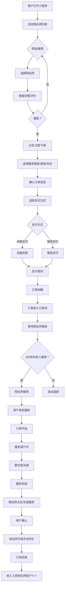
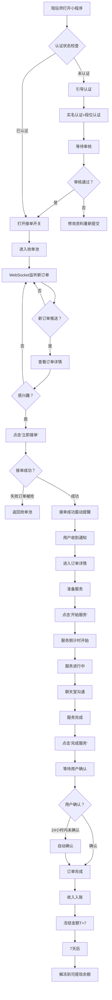

# GameLink 用户端 & 陪玩师端产品规划

> **版本**: v1.0 | **日期**: 2025-01-06 | **规划团队**: Super Dev
>
> 本文档基于Super Dev专家团队系统化分析，涵盖产品定位、技术架构、信息架构、用户流程、UI/UX原则和开发里程碑。

---

## 📑 目录

1. [产品定位](#1-产品定位)
2. [技术架构](#2-技术架构)
3. [信息架构](#3-信息架构)
4. [核心用户流程](#4-核心用户流程)
5. [UI/UX设计原则](#5-uiux设计原则)
6. [关键页面设计](#6-关键页面设计)
7. [API对接方案](#7-api对接方案)
8. [开发里程碑](#8-开发里程碑)
9. [成功指标](#9-成功指标)
10. [风险与缓解](#10-风险与缓解)

---

## 1. 产品定位

### 1.1 目标用户

| 维度 | 用户端（顾客） | 陪玩师端 |
|------|----------------|----------|
| **年龄** | 18-35岁游戏玩家 | 18-28岁游戏高手 |
| **核心需求** | 快速找到靠谱陪玩师，安全上分 | 稳定订单来源，透明收入，公平提现 |
| **使用场景** | "我想打王者，找个厉害的带我上分" | "我在线，想接单赚钱" |
| **痛点** | 怕被骗、怕花冤枉钱、怕遇到态度差的 | 订单不稳定、抽成不透明、提现慢 |

### 1.2 核心价值主张

```
【用户端】
"快速找到靠谱的陪玩师，系统定价透明，资金担保安全"

【陪玩师端】
"稳定订单池，透明抽成体系，T+7清晰提现流程"
```

### 1.3 差异化优势

| 特性 | GameLink | 竞品（比心/点点） |
|------|----------|------------------|
| **定价方式** | ✅ 系统定价（透明） | ❌ 陪玩师自定（混乱） |
| **抽成透明** | ✅ 明确显示抽成比例 | ❌ 不透明 |
| **交易安全** | ✅ 无私聊（防诈骗） | ❌ 支持私聊（易被骗） |
| **争议处理** | ✅ 双客服机制（30分钟SLA） | ❌ 单客服 |

---

## 2. 技术架构

### 2.1 技术方案选择

**推荐方案**: **小程序 + H5**

**理由**:
- 小程序获客成本低，易传播（微信生态）
- H5补充Web端访问场景
- Taro框架实现代码复用（一套代码，多端运行）
- 降低开发和维护成本

### 2.2 架构图

```
┌─────────────────────────────────────────┐
│     GameLink 客户端技术架构              │
├─────────────────────────────────────────┤
│                                          │
│  ┌──────────────┐   ┌──────────────┐    │
│  │ 微信小程序    │   │  H5 (Web)    │    │
│  │  (Taro 3.x)  │   │  (React 19)  │    │
│  └──────┬───────┘   └──────┬───────┘    │
│         │                  │            │
│         └────────┬─────────┘            │
│                  ▼                       │
│     ┌────────────────────────┐          │
│     │ 共享业务逻辑层          │          │
│     │ (React Components)     │          │
│     └──────────┬─────────────┘          │
│                ▼                         │
│     ┌────────────────────────┐          │
│     │ 状态管理 (Zustand)     │          │
│     │ + 工具函数              │          │
│     └──────────┬─────────────┘          │
│                ▼                         │
│     ┌────────────────────────┐          │
│     │ API Client Layer       │          │
│     │ (Axios + Crypto-JS)    │          │
│     └──────────┬─────────────┘          │
│                ▼                         │
│     ┌────────────────────────┐          │
│     │ WebSocket Client       │          │
│     │ (socket.io-client)     │          │
│     └──────────┬─────────────┘          │
│                ▼                         │
│     ┌────────────────────────┐          │
│     │ 后端 API (已存在)       │          │
│     │ Go + PostgreSQL + Redis │          │
│     └────────────────────────┘          │
└─────────────────────────────────────────┘
```

### 2.3 技术栈

| 层次 | 技术 | 版本 | 说明 |
|------|------|------|------|
| **框架** | Taro | 3.x | 多端开发框架 |
| **UI** | 自适应组件库 | - | 兼容小程序+Web |
| **状态管理** | Zustand | 5.x | 轻量级状态管理 |
| **HTTP** | Axios | 1.13+ | API请求 |
| **加密** | crypto-js | 4.2+ | AES-256-CBC |
| **WebSocket** | socket.io-client | 4.8+ | 实时通讯 |
| **构建** | Webpack/Vite | - | 打包工具 |

---

## 3. 信息架构

### 3.1 用户端信息架构

```
用户端
├── 首页 (Home)
│   ├── 游戏分类入口（王者荣耀/LOL/吃鸡/云顶之弈等）
│   ├── 陪玩师推荐（智能排序：评分/接单量）
│   └── 热门陪玩师（轮播）
│
├── 陪玩师列表 (PlayerList)
│   ├── 筛选器
│   │   ├── 游戏（单选）
│   │   ├── 段位（多选：钻石/星耀/王者）
│   │   └── 价格区间（¥20-40 / ¥40-60 / ¥60+）
│   ├── 排序方式
│   │   ├── 综合排序（默认）
│   │   ├── 评分最高
│   │   ├── 接单量最多
│   │   └── 价格最低
│   └── 陪玩师卡片列表
│
├── 陪玩师详情 (PlayerDetail)
│   ├── 基本信息
│   │   ├── 头像/昵称
│   │   ├── 认证标识（✓实名 / ✓段位认证）
│   │   └── 自我介绍
│   ├── 游戏段位
│   │   └── [王者荣耀 - 钻石]
│   ├── 服务项目
│   │   ├── 陪玩 - ¥60/小时
│   │   ├── 陪练 - ¥80/小时
│   │   └── 教学 - ¥100/小时
│   ├── 数据统计
│   │   ├── 评分 ⭐4.9 (123条评价)
│   │   ├── 接单量 456
│   │   └── 好评率 98%
│   ├── 用户评价
│   │   ├── 标签筛选（全部/好评/中评/差评）
│   │   └── 评价列表
│   └── [立即下单] 按钮（固定底部）
│
├── 下单流程 (CreateOrder)
│   ├── 1. 选择服务类型（陪玩/陪练/教学）
│   ├── 2. 选择游戏/段位
│   ├── 3. 选择时长（1小时/2小时/包夜）
│   ├── 4. 特殊需求备注（选填）
│   ├── 5. 订单金额确认
│   │   ├── 服务时长 × 单价
│   │   ├── 优惠抵扣（如有）
│   │   └── 实付金额
│   └── 6. 选择支付方式
│       ├── 余额支付
│       └── 微信支付
│
├── 我的订单 (MyOrders)
│   ├── Tab切换
│   │   ├── 待支付 (5)
│   │   ├── 待接单 (2)
│   │   ├── 进行中 (1)
│   │   ├── 待评价 (3)
│   │   └── 已完成 (12)
│   └── 订单卡片
│       ├── 订单号
│       ├── 陪玩师信息
│       ├── 服务信息（游戏/时长）
│       ├── 订单金额
│       ├── 状态标签
│       └── 操作按钮
│
├── 订单详情 (OrderDetail)
│   ├── 订单状态（进度条）
│   ├── 陪玩师信息
│   ├── 服务信息
│   ├── 倒计时（进行中时）
│   ├── [进入聊天室] 按钮
│   └── [确认完成] 按钮
│
├── 聊天室 (ChatRoom)
│   ├── 订单信息（顶部）
│   ├── 消息列表
│   │   ├── 系统消息（订单状态变更）
│   │   └── 用户消息
│   └── 输入框（仅支持文字）
│
├── 个人中心 (Profile)
│   ├── 头像/昵称/ID
│   ├── 我的钱包
│   │   ├── 余额：¥XXX
│   │   ├── [充值]
│   │   └── [交易记录]
│   ├── 优惠券
│   ├── 订单记录
│   ├── 收藏的陪玩师
│   └── 设置
│       ├── 账号安全
│       ├── 隐私设置
│       └── 关于我们
│
└── 登录/注册 (Auth)
    ├── 手机号输入
    ├── 验证码输入
    └── [登录] 按钮
```

### 3.2 陪玩师端信息架构

```
陪玩师端
├── 工作台 (Workbench)
│   ├── 接单开关（ON/OFF）
│   ├── 在线状态选择
│   │   ├── 在线（可接单）
│   │   ├── 忙碌（服务中）
│   │   └── 离线
│   ├── 今日统计
│   │   ├── 接单量：X单
│   │   ├── 收入：¥XXX
│   │   └── 服务时长：X小时
│   └── 快捷入口
│       ├── [抢单池]
│       ├── [我的订单]
│       └── [收益中心]
│
├── 抢单池 (OrderPool)
│   ├── 筛选器
│   │   ├── 游戏
│   │   ├── 段位
│   │   └── 最低价格
│   ├── 实时订单流（WebSocket推送）
│   │   └── 订单卡片（自动刷新）
│   │       ├── 用户信息（昵称/头像/等级）
│   │       ├── 游戏信息（游戏/段位）
│   │       ├── 服务信息（类型/时长）
│   │       ├── 价格
│   │       │   ├── 订单金额：¥60
│   │       │   └── 您的收入：¥48 (20%抽成)
│   │       ├── 发布时间（2分钟前）
│   │       └── [立即接单] 按钮
│   └── 空状态（暂无订单）
│
├── 我的订单 (MyOrders)
│   ├── Tab切换
│   │   ├── 进行中 (1)
│   │   ├── 待完成 (0)
│   │   ├── 待评价 (2)
│   │   └── 已完成 (45)
│   └── 订单卡片
│       ├── 订单号
│       ├── 用户信息
│       ├── 服务信息
│       ├── 订单金额
│       ├── 收入展示
│       ├── 状态标签
│       └── 操作按钮
│
├── 订单详情 (OrderDetail)
│   ├── 订单状态（进度条）
│   ├── 用户信息
│   ├── 服务信息
│   ├── 服务倒计时
│   │   └── [完成服务] 按钮（倒计时结束可点击）
│   ├── 收入明细
│   │   ├── 订单金额：¥60
│   │   ├── 抽成比例：20%
│   │   └── 实际收入：¥48
│   └── [进入聊天室] 按钮
│
├── 收益中心 (Earnings)
│   ├── 收入总览
│   │   ├── 今日收入：¥XXX
│   │   ├── 本周收入：¥XXX
│   │   ├── 本月收入：¥XXX
│   │   └── 累计收入：¥XXX
│   ├── 收入趋势图（折线图）
│   ├── 资产详情
│   │   ├── 可提现余额：¥XXX
│   │   ├── 冻结金额（T+7）：¥XXX
│   │   └── 提现处理中：¥XXX
│   ├── [申请提现] 按钮
│   └── 提现记录
│
├── 提现申请 (Withdraw)
│   ├── 提现金额输入
│   ├── 提现到账信息
│   │   ├── 微信/支付宝
│   │   └── 账户绑定
│   ├── 手续费说明（0手续费）
│   ├── 到账时间说明（T+1）
│   └── [确认提现] 按钮
│
├── 数据分析 (Analytics)
│   ├── 接单量趋势（周/月）
│   ├── 收入趋势（周/月）
│   ├── 好评率统计
│   │   ├── 总好评率：98%
│   │   └── 近30天评价分布
│   └── 排名变化
│       ├── 当前排名：No.15
│       └── 排名趋势
│
├── 个人中心 (Profile)
│   ├── 基本信息
│   │   ├── 头像/昵称
│   │   ├── 认证状态
│   │   │   ├── 实名认证：✓已认证
│   │   │   └── 段位认证：✓钻石
│   │   └── 手机号
│   ├── 我的服务
│   │   ├── 价格管理（系统定价，不可修改）
│   │   ├── 服务说明
│   │   └── 接单时间设置
│   ├── 用户评价
│   │   ├── 总评分：4.9
│   │   ├── 评价数量：123
│   │   └── 评价列表
│   ├── 收益管理（跳转）
│   └── 设置
│       ├── 账号安全
│       ├── 接单设置
│       └── 关于我们
│
└── 认证流程 (Certification)
    ├── 实名认证
    │   ├── 姓名
    │   ├── 身份证号
    │   └── 身份证照片上传
    └── 段位认证
        ├── 游戏选择
        ├── 段位选择
        └── 游戏截图上传
```

---

## 4. 核心用户流程

### 4.1 用户下单完整流程



### 4.2 陪玩师接单完整流程



---

## 5. UI/UX设计原则

### 5.1 用户端设计原则

| 原则 | 说明 | 示例 |
|------|------|------|
| **信任第一** | 突出认证标识，让用户放心选择 | ✓实名 ✓段位认证 ✓服务中 |
| **价格透明** | 明确显示价格构成，无隐藏费用 | ¥60/小时 = 陪玩师收入¥48 + 平台服务费¥12 |
| **评价可见** | 陪玩师详情页优先显示评价 | ⭐4.9 (123条评价) 98%好评 |
| **快速下单** | 3步完成下单，减少流失 | 选陪玩师 → 选服务 → 支付 |
| **状态反馈** | 每个操作都有明确反馈 | 支付中✓ → 订单创建中✓ → 等待接单 |

### 5.2 陪玩师端设计原则

| 原则 | 说明 | 示例 |
|------|------|------|
| **效率优先** | 抢单池核心信息一目了然 | 王者荣耀 钻石 星耀 ¥60 [立即接单] |
| **实时反馈** | 接单后立即震动+声音提醒 | 📳 您有新订单！ |
| **透明收益** | 明确显示抽成比例 | 订单金额¥60 您的收入¥48 (抽成20%) |
| **快速操作** | 一键接单/一键完成服务 | 大按钮设计，易于点击 |
| **数据可视** | 收入趋势图，激励接单 | 折线图展示本月收入增长 |

### 5.3 设计系统

#### 颜色规范

```scss
// 主色调
$primary-color: #FF6B6B;      // 活力红（激发消费）
$secondary-color: #4ECDC4;    // 清新绿（信任感）
$accent-color: #FFE66D;       // 明亮黄（强调）

// 功能色
$success-color: #95E1D3;      // 成功
$warning-color: #FCE38A;      // 警告
$error-color: #FF6B6B;        // 错误
$info-color: #74B9FF;         // 信息

// 中性色
$text-primary: #2D3436;       // 主文本
$text-secondary: #636E72;     // 次文本
$text-disabled: #B2BEC3;      // 禁用文本
$bg-primary: #FFFFFF;         // 主背景
$bg-secondary: #F5F6FA;       // 次背景
$border-color: #DFE6E9;       // 边框
```

#### 字体规范

```scss
// 字体大小
$font-size-xs: 20rpx;         // 辅助信息
$font-size-sm: 24rpx;         // 小文本
$font-size-base: 28rpx;       // 基础文本
$font-size-md: 32rpx;         // 中等标题
$font-size-lg: 36rpx;         // 大标题
$font-size-xl: 40rpx;         // 超大标题

// 字重
$font-weight-normal: 400;
$font-weight-medium: 500;
$font-weight-bold: 700;
```

#### 间距规范

```scss
// 间距系统（8px基准）
$spacing-xs: 8rpx;
$spacing-sm: 16rpx;
$spacing-md: 24rpx;
$spacing-lg: 32rpx;
$spacing-xl: 48rpx;
```

---

## 6. 关键页面设计

### 6.1 陪玩师列表页（用户端）

#### 数据结构

```typescript
interface PlayerListItem {
  id: number;
  nickname: string;
  avatar: string;
  gameRank: {
    game: string;        // "王者荣耀"
    rank: string;        // "钻石"
    certification: boolean;  // true=已认证
  };
  stats: {
    rating: number;      // 4.9
    orderCount: number;  // 123
    positiveRate: number; // 0.98
  };
  status: 'online' | 'busy' | 'offline';
  services: Array<{
    type: string;        // "陪玩"
    price: number;       // 60 (元/小时)
  }>;
}
```

#### UI布局

```
┌─────────────────────────────────────┐
│ 🔍 [搜索陪玩师或游戏]         [筛选]│
├─────────────────────────────────────┤
│ 🎮 游戏:[全部▼] [段位▼] [价格▼]    │
├─────────────────────────────────────┤
│ ┌──────────┐ ┌──────────┐         │
│ │ [头像]   │ │ [头像]   │         │
│ │ 某某     │ │ 技术陪玩  │         │
│ │ ⭐4.9    │ │ ⭐4.7    │         │
│ │ ✓实名 ✓段位│ │ ✓实名    │         │
│ │ 王者钻石  │ │ LOL大师  │         │
│ │ [￥60/时]│ │ [￥80/时]│         │
│ │ 🟢 在线  │ │ 🟡 忙碌  │         │
│ └──────────┘ └──────────┘         │
│ ┌──────────┐ ┌──────────┐         │
│ │ [头像]   │ │ [头像]   │         │
│ │ ...      │ │ ...      │         │
│ └──────────┘ └──────────┘         │
└─────────────────────────────────────┘
```

### 6.2 抢单池（陪玩师端）

#### 数据结构

```typescript
interface OrderCard {
  id: string;
  user: {
    nickname: string;
    avatar: string;
    level: number;  // VIP等级
  };
  gameInfo: {
    game: string;
    rank: string;
  };
  service: {
    type: string;      // "陪玩" / "陪练"
    duration: number;  // 1 / 2 / 5 (小时)
  };
  price: {
    total: number;        // 60 (元)
    playerIncome: number; // 48 (元)
    commissionRate: number; // 0.2 (20%)
  };
  createdAt: string;  // "2分钟前"
}
```

#### UI布局

```
┌─────────────────────────────────────┐
│ 🔔 新订单提醒 (自动刷新)           │
├─────────────────────────────────────┤
│ ┌─────────────────────────────────┐│
│ │ 👤 用户A (VIP2)               ││
│ │ 🎮 王者荣耀 - 钻石星耀        ││
│ │ ⏱️ 陪玩 1小时                 ││
│ │ ─────────────────────────────  ││
│ │ 💰 订单金额: ￥60             ││
│ │ 💵 您的收入: ￥48 (抽成20%)  ││
│ │ ⏰ 2分钟前                    ││
│ │                               ││
│ │   ┌───────────────┐          ││
│ │   │  立即接单      │  (大按钮) ││
│ │   └───────────────┘          ││
│ └─────────────────────────────────┘│
│                                   │
│ ┌─────────────────────────────────┐│
│ │ 👤 用户B (VIP1)               ││
│ │ 🎮 LOL - 白金黄金             ││
│ │ ... [更多历史订单...]         ││
│ └─────────────────────────────────┘│
└─────────────────────────────────────┘
```

### 6.3 下单页（用户端）

#### UI布局

```
┌─────────────────────────────────────┐
│ [← 返回]         确认订单           │
├─────────────────────────────────────┤
│ ┌─────────────────────────────────┐│
│ │ 📦 服务信息                     ││
│ │ ─────────────────────────────  ││
│ │ 陪玩师: 某某                   ││
│ │ ⭐4.9 (123条评价)              ││
│ │                               ││
│ │ 游戏: 王者荣耀          [▼]  ││
│ │ 段位: 钻石星耀          [▼]  ││
│ │ 服务: 陪玩              [▼]  ││
│ │ 时长: 1小时             [▼]  ││
│ └─────────────────────────────────┘│
│                                   │
│ ┌─────────────────────────────────┐│
│ │ 💬 特殊需求（选填）            ││
│ │ ┌────────────────────────────┐ ││
│ │ │ 请输入您的特殊要求...      │ ││
│ │ └────────────────────────────┘ ││
│ └─────────────────────────────────┘│
│                                   │
│ ┌─────────────────────────────────┐│
│ │ 💰 价格明细                     ││
│ │ ─────────────────────────────  ││
│ │ 服务费用: ￥60 × 1小时 = ￥60││
│ │ 优惠券: -￥10                 ││
│ │ ─────────────────────────────  ││
│ │ 实付金额: ￥50                ││
│ └─────────────────────────────────┘│
│                                   │
│ ┌─────────────────────────────────┐│
│ │ 💳 支付方式                     ││
│ │ ○ 余额支付 (余额: ￥100)      ││
│ │ ○ 微信支付                    ││
│ └─────────────────────────────────┘│
│                                   │
│   ┌───────────────────────────┐   │
│   │    立即支付 ￥50         │   │
│   └───────────────────────────┘   │
└─────────────────────────────────────┘
```

---

## 7. API对接方案

### 7.1 已有后端API

根据项目文档，后端API已100%完成，主要包括：

#### 用户端API

```typescript
// 陪玩师相关
GET    /api/v1/players              // 获取陪玩师列表
GET    /api/v1/players/:id          // 获取陪玩师详情
GET    /api/v1/players/:id/reviews  // 获取陪玩师评价

// 订单相关
POST   /api/v1/orders               // 创建订单
GET    /api/v1/user/orders          // 获取用户订单列表
GET    /api/v1/orders/:id           // 获取订单详情
POST   /api/v1/orders/:id/cancel    // 取消订单

// 支付相关
POST   /api/v1/payments             // 创建支付
GET    /api/v1/wallet               // 获取钱包余额
POST   /api/v1/wallet/recharge      // 充值

// 评价相关
POST   /api/v1/reviews              // 提交评价

// 用户相关
POST   /api/v1/auth/login           // 登录
POST   /api/v1/auth/register        // 注册
GET    /api/v1/user/profile         // 获取用户信息
```

#### 陪玩师端API

```typescript
// 订单管理
GET    /api/v1/orders/available     // 获取抢单池
POST   /api/v1/orders/:id/accept    // 接单
GET    /api/v1/player/orders        // 获取我的订单
POST   /api/v1/orders/:id/complete  // 完成服务

// 收益管理
GET    /api/v1/player/earnings      // 获取收益统计
GET    /api/v1/player/wallet        // 获取钱包详情
POST   /api/v1/withdraws            // 申请提现
GET    /api/v1/withdraws            // 提现记录

// 认证相关
POST   /api/v1/player/certify       // 提交认证
GET    /api/v1/player/certification // 获取认证状态

// 陪玩师信息
GET    /api/v1/player/profile       // 获取个人信息
PUT    /api/v1/player/profile       // 更新服务说明
```

### 7.2 API Client封装

```typescript
// api/client.ts
import axios from 'axios';
import CryptoJS from 'crypto-js';

const API_BASE_URL = 'https://api.gamelink.com/api/v1';

// 加密拦截器（与管理后台一致）
const encryptRequest = (config: any) => {
  const key = CryptoJS.enc.Utf8.parse(CRYPTO_SECRET_KEY);
  const iv = CryptoJS.enc.Utf8.parse(CRYPTO_IV);

  if (config.data) {
    const encrypted = CryptoJS.AES.encrypt(
      JSON.stringify(config.data),
      key,
      { iv: iv, mode: CryptoJS.mode.CBC, padding: CryptoJS.pad.Pkcs7 }
    );
    config.data = encrypted.toString();
  }

  return config;
};

const apiClient = axios.create({
  baseURL: API_BASE_URL,
  timeout: 10000,
});

apiClient.interceptors.request.use(encryptRequest);

export default apiClient;
```

### 7.3 API模块化

```typescript
// api/user.ts
import apiClient from './client';

export const userAPI = {
  // 陪玩师
  getPlayers: (params: PlayerListParams) =>
    apiClient.get('/players', { params }),

  getPlayerDetail: (id: number) =>
    apiClient.get(`/players/${id}`),

  // 订单
  createOrder: (data: CreateOrderDTO) =>
    apiClient.post('/orders', data),

  getMyOrders: (params: OrderQueryParams) =>
    apiClient.get('/user/orders', { params }),

  // 支付
  createPayment: (data: CreatePaymentDTO) =>
    apiClient.post('/payments', data),
};

// api/player.ts
export const playerAPI = {
  // 抢单
  getOrderPool: () =>
    apiClient.get('/orders/available'),

  acceptOrder: (orderId: string) =>
    apiClient.post(`/orders/${orderId}/accept`),

  // 收益
  getEarnings: () =>
    apiClient.get('/player/earnings'),

  withdraw: (data: WithdrawDTO) =>
    apiClient.post('/withdraws', data),
};
```

---

## 8. 开发里程碑

### Phase 1: MVP（8周）

#### Week 1-2: 基础框架搭建
- [ ] Taro项目初始化
- [ ] 路由配置
- [ ] 状态管理（Zustand）集成
- [ ] API Client封装
- [ ] 加密拦截器实现
- [ ] 登录/注册页面
  - [ ] 手机号+验证码登录
  - [ ] JWT Token管理
  - [ ] 自动登录

#### Week 3-4: 用户端核心功能
- [ ] 首页
  - [ ] 游戏分类
  - [ ] 陪玩师推荐列表
- [ ] 陪玩师列表页
  - [ ] 筛选器（游戏/段位/价格）
  - [ ] 排序（评分/价格/接单量）
  - [ ] 无限滚动加载
- [ ] 陪玩师详情页
  - [ ] 基本信息展示
  - [ ] 服务项目列表
  - [ ] 用户评价列表
- [ ] 下单流程
  - [ ] 服务类型选择
  - [ ] 游戏/段位选择
  - [ ] 时长选择
  - [ ] 订单确认
  - [ ] 支付（余额+微信）
- [ ] 订单列表
  - [ ] Tab切换
  - [ ] 订单状态筛选

#### Week 5-6: 陪玩师端核心功能
- [ ] 工作台
  - [ ] 接单开关
  - [ ] 在线状态切换
  - [ ] 今日统计展示
- [ ] 抢单池
  - [ ] 实时订单列表（WebSocket）
  - [ ] 筛选器
  - [ ] 接单操作
  - [ ] 震动提醒
- [ ] 订单管理
  - [ ] 我的订单列表
  - [ ] 订单详情
  - [ ] 完成服务
- [ ] 收益中心
  - [ ] 收入统计
  - [ ] 资产详情（可提现/冻结）
  - [ ] 提现申请

#### Week 7-8: 联调测试
- [ ] 端到端流程测试
  - [ ] 用户下单 → 陪玩师接单 → 服务完成
  - [ ] 支付流程
  - [ ] 提现流程
- [ ] WebSocket实时通讯
  - [ ] 订单推送
  - [ ] 消息推送
- [ ] 异常处理
  - [ ] 网络异常
  - [ ] 超时处理
  - [ ] 错误提示
- [ ] Bug修复

### Phase 2: 增强功能（4周）

- [ ] 评价系统
  - [ ] 提交评价
  - [ ] 修改评价
  - [ ] 评价列表
- [ ] 聊天室（订单群聊）
  - [ ] WebSocket聊天
  - [ ] 消息历史
  - [ ] 图片发送
- [ ] 排行榜
  - [ ] 评分排行
  - [ ] 接单量排行
  - [ ] 收入排行
- [ ] 钱包充值
  - [ ] 充值接口
  - [ ] 充值记录

### Phase 3: 优化打磨（4周）

- [ ] 性能优化
  - [ ] 图片懒加载
  - [ ] 列表虚拟滚动
  - [ ] 缓存策略
- [ ] UI/UX打磨
  - [ ] 动画效果
  - [ ] 骨架屏
  - [ ] 加载状态
- [ ] 数据埋点
  - [ ] 用户行为追踪
  - [ ] 转化漏斗分析
- [ ] A/B测试
  - [ ] 颜色测试
  - [ ] 布局测试

---

## 9. 成功指标

### 9.1 北极星指标

**GMV（成交总额）**
- 目标：上线3个月内达到 ¥100万/月
- 测量：`sum(订单金额) where 订单状态='已完成'`

### 9.2 关键指标

| 指标 | 目标值 | 测量方式 |
|------|--------|----------|
| **订单转化率** | 15%+ | (下单用户数 / 浏览用户数) × 100% |
| **接单响应时间** | <3分钟 | (下单时间 - 接单时间) 平均值 |
| **7日留存率** | 30%+ | (注册后7天仍活跃用户数 / 注册用户数) × 100% |
| **30日留存率** | 15%+ | (注册后30天仍活跃用户数 / 注册用户数) × 100% |
| **复购率** | 25%+ | (下单2次以上用户数 / 总下单用户数) × 100% |
| **陪玩师月均收入** | ¥3000+ | 陪玩师月收入平均值 |
| **提现成功率** | 95%+ | (成功提现笔数 / 提现申请笔数) × 100% |
| **好评率** | 90%+ | (好评数 / 总评价数) × 100% |

### 9.3 监控指标

| 指标 | 目标值 | 说明 |
|------|--------|------|
| **API响应时间** | <500ms | 95分位 |
| **页面加载时间** | <2s | 首屏加载 |
| **WebSocket连接成功率** | >99% | 实时通讯稳定性 |
| **崩溃率** | <0.1% | 小程序崩溃率 |

---

## 10. 风险与缓解

### 10.1 风险识别

| 风险 | 严重性 | 可能性 | 影响 |
|------|--------|--------|------|
| **冷启动问题** | 🔴 高 | 🟡 中 | 初期供需不平衡 |
| **获客成本高** | 🟡 中 | 🟡 中 | 小程序流量贵 |
| **陪玩师流失** | 🔴 高 | 🟡 中 | 收入不稳定 |
| **用户不信任** | 🟡 中 | 🟢 低 | 新平台品牌弱 |
| **技术债务** | 🟡 中 | 🟢 低 | 快速开发导致 |

### 10.2 缓解策略

#### 冷启动问题
```
风险：上线时陪玩师少，用户选择少 → 订单转化率低

缓解策略：
1. 种子陪玩师计划
   - 提前入驻50+种子陪玩师
   - 给予激励政策（前30天抽成减半）
   - 确保各游戏各段位都有覆盖

2. 人工订单调度
   - 初期客服人工指派订单
   - 保证每个订单都能被接单
   - 避免用户等待流失

3. 接单奖励
   - 接单满10单奖励¥50
   - 激励陪玩师保持在线
```

#### 获客成本高
```
风险：小程序流量贵，CAC > LTV

缓解策略：
1. 社群裂变
   - 老用户邀请新用户奖励¥10优惠券
   - 新用户首单立减¥20

2. 内容营销
   - 游戏攻略分享
   - 陪玩师故事视频

3. 校园推广
   - 电竞社团合作
   - 大学生陪玩师招募
```

#### 陪玩师流失
```
风险：收入不稳定导致陪玩师退出

缓解策略：
1. 保底收入计划
   - 月接单满30单，保底¥3000
   - 稳定陪玩师收入预期

2. T+7缩短测试
   - A/B测试T+3 vs T+7
   - 数据支持后再调整

3. 等级激励
   - 陪玩师等级体系（青铜/白银/黄金）
   - 高等级陪玩师更多曝光
```

#### 用户不信任
```
风险：新平台，用户担心被骗

缓解策略：
1. 实名认证担保
   - 所有陪玩师必须实名认证
   - 平台先行赔付承诺

2. 交易保障
   - 资金担保交易
   - 服务不满意可退款

3. 评价透明
   - 真实评价系统
   - 差评申诉机制
```

---

## 📌 附录

### A. 技术选型对比

| 方案 | 优势 | 劣势 | 评分 |
|------|------|------|------|
| **小程序+H5** | 开发成本低、获客快、易传播 | 功能受限、依赖微信 | ⭐⭐⭐⭐⭐ |
| 纯原生App | 功能完整、体验好 | 开发成本高、获客难 | ⭐⭐⭐ |
| 纯H5 | 跨平台、不审核 | 性能差、体验差 | ⭐⭐ |
| Flutter | 跨平台、性能好 | 学习成本高 | ⭐⭐⭐⭐ |

### B. 竞品分析

| 竞品 | 用户规模 | 定价方式 | 抽成 | 特色功能 |
|------|----------|----------|------|----------|
| **比心** | 1000万+ | 陪玩师自定 | 20% | 社区强 |
| **点点** | 500万+ | 陪玩师自定 | 25% | 游戏全 |
| **比比** | 100万+ | 系统定价 | 15% | 价格透明 |
| **GameLink** | 0 | 系统定价 | 15-25% | 无私聊+双客服 |

### C. 参考资料

- [Taro官方文档](https://taro-docs.jd.com/)
- [微信小程序设计指南](https://developers.weixin.qq.com/miniprogram/design/)
- [产品需求文档模板](https://www.notion.so/)

---

## ✍️ 文档变更记录

| 版本 | 日期 | 作者 | 变更说明 |
|------|------|------|----------|
| v1.0 | 2025-01-06 | Super Dev | 初始版本 |

---

**文档状态**: ✅ 已完成
**下一步**: 开始技术预研和原型设计
