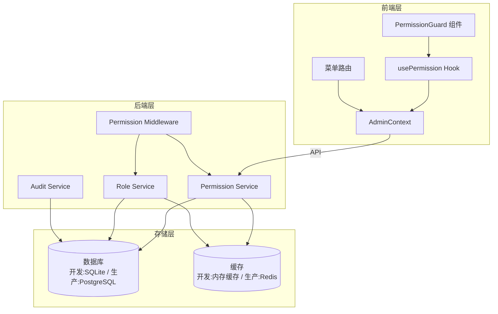
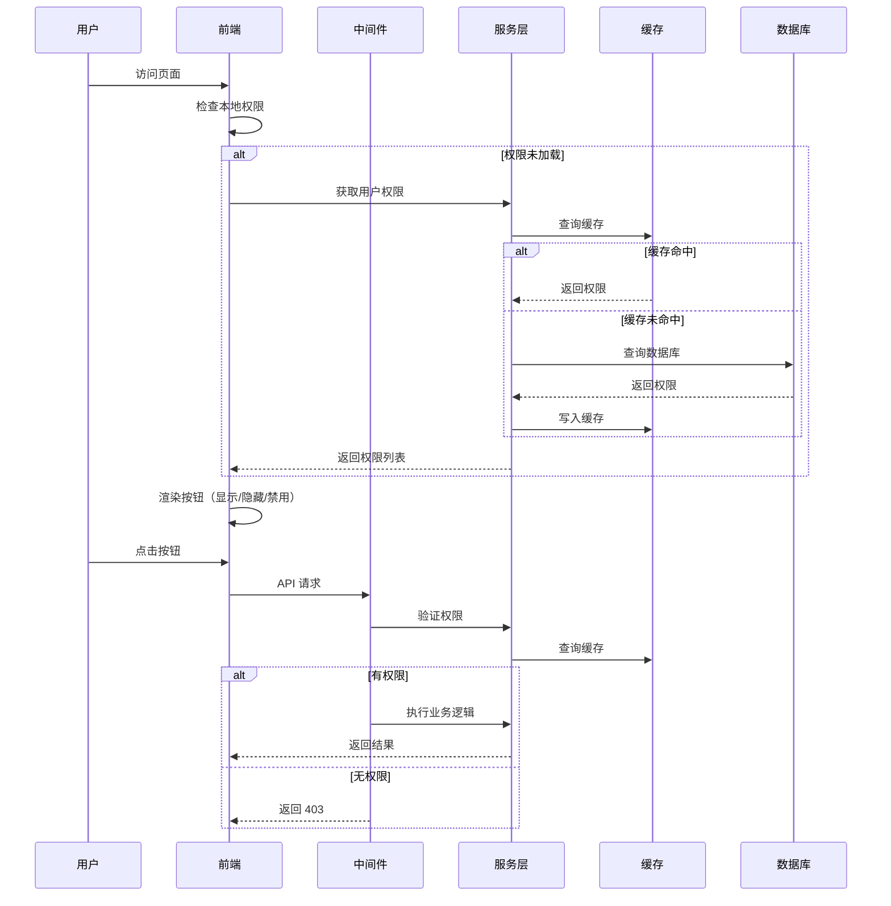
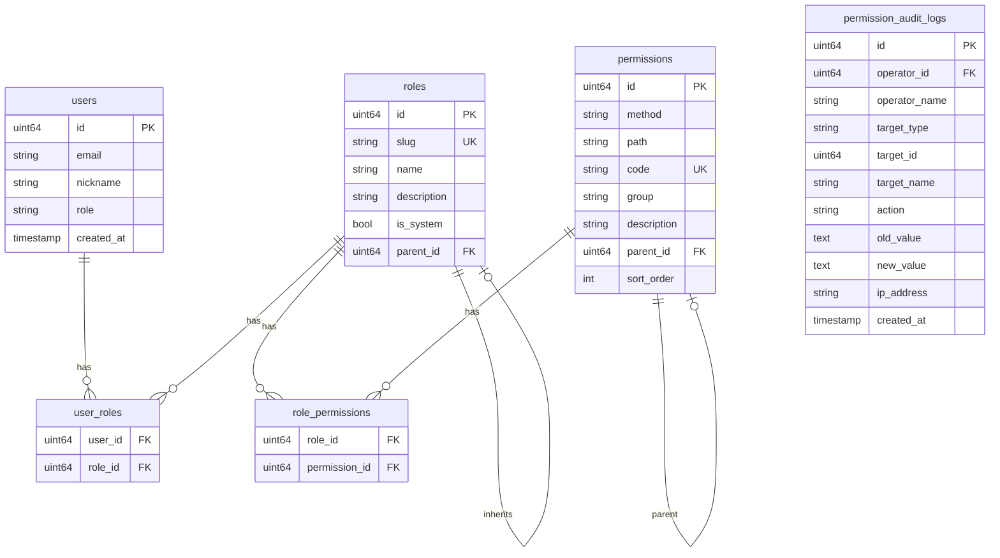

# 设计文档 - RBAC 按钮级权限管理模块

## 概述

本设计文档描述了 GameLink 平台 RBAC 按钮级权限管理模块的技术实现方案。该模块在现有权限系统基础上，实现精确到按钮级别的权限控制，涵盖后端权限验证、前端权限渲染、权限数据同步、审计日志等完整功能链路。

### 设计目标

1. **精确控制**：实现按钮级别的权限控制，支持显示/隐藏和启用/禁用两种模式
2. **高性能**：通过缓存机制减少权限查询开销，支持权限数据的实时同步
3. **可扩展**：支持权限模板、角色继承等高级功能
4. **可审计**：完整记录权限变更历史，支持审计追溯

## 架构

### 整体架构图



### 权限数据流



## 组件和接口

### 后端组件

#### 1. Permission Model（权限模型）

```go
// Permission 权限模型
type Permission struct {
    Base
    Method      HTTPMethod `json:"method" gorm:"size:16;not null;uniqueIndex:idx_method_path"`
    Path        string     `json:"path" gorm:"size:255;not null;uniqueIndex:idx_method_path"`
    Code        string     `json:"code" gorm:"size:128;uniqueIndex;comment:语义化标识"`
    Group       string     `json:"group" gorm:"size:64;index;comment:API 分组"`
    Description string     `json:"description" gorm:"size:255"`
    ParentID    *uint64    `json:"parentId" gorm:"index;comment:父权限ID，用于树形结构"`
    SortOrder   int        `json:"sortOrder" gorm:"default:0;comment:排序顺序"`
    IsSystem    bool       `json:"isSystem" gorm:"default:false;comment:是否系统权限（不可删除）"`
    DeletedAt   *time.Time `json:"deletedAt" gorm:"index;comment:软删除时间"`
}

// PermissionCode 权限码格式：module.resource.action
// 示例：admin.users.create, admin.orders.delete
```

#### 2. Role Model（角色模型）

```go
// RoleModel 角色模型
type RoleModel struct {
    Base
    Slug        string  `json:"slug" gorm:"size:64;uniqueIndex;not null"`
    Name        string  `json:"name" gorm:"size:128;not null"`
    Description string  `json:"description" gorm:"size:255"`
    IsSystem    bool    `json:"isSystem" gorm:"default:false;comment:是否系统角色（不可删除）"`
    ParentID    *uint64 `json:"parentId" gorm:"index;comment:父角色ID，用于继承"`
    Priority    int     `json:"priority" gorm:"default:0;comment:优先级，数值越大优先级越高，用于权限冲突解决"`
    Level       int     `json:"level" gorm:"default:0;comment:继承层级，根角色为0，最大5层"`
    DeletedAt   *time.Time `json:"deletedAt" gorm:"index;comment:软删除时间"`
    
    Permissions []Permission `json:"permissions" gorm:"many2many:role_permissions"`
    Users       []User       `json:"users" gorm:"many2many:user_roles"`
}

// 角色继承约束
const MaxRoleInheritanceDepth = 5  // 最大继承深度限制
```

#### 3. PermissionAuditLog Model（权限审计日志模型）

```go
// PermissionAuditLog 权限审计日志
type PermissionAuditLog struct {
    Base
    OperatorID   uint64 `json:"operatorId" gorm:"index;not null;comment:操作者ID"`
    OperatorName string `json:"operatorName" gorm:"size:128;comment:操作者名称"`
    TargetType   string `json:"targetType" gorm:"size:32;index;comment:目标类型(role/user/permission)"`
    TargetID     uint64 `json:"targetId" gorm:"index;comment:目标ID"`
    TargetName   string `json:"targetName" gorm:"size:128;comment:目标名称"`
    Action       string `json:"action" gorm:"size:32;index;comment:操作类型"`
    BeforeData   string `json:"beforeData" gorm:"type:text;comment:操作前数据快照(JSON)"`
    AfterData    string `json:"afterData" gorm:"type:text;comment:操作后数据快照(JSON)"`
    IPAddress    string `json:"ipAddress" gorm:"size:64;comment:操作IP"`
    UserAgent    string `json:"userAgent" gorm:"size:512;comment:用户代理"`
    RequestID    string `json:"requestId" gorm:"size:64;index;comment:请求追踪ID"`
}

// 审计日志异步写入（避免阻塞主流程）
// 使用 channel 缓冲队列，后台 goroutine 批量写入
type AuditLogWriter struct {
    logChan chan *PermissionAuditLog
    db      *gorm.DB
}

// 审计日志归档策略
const (
    AuditLogRetentionDays = 90   // 在线保留天数
    AuditLogArchiveDays   = 365  // 归档保留天数
)
```

#### 4. Permission Service 接口

```go
// PermissionService 权限服务接口
type PermissionService interface {
    // 权限 CRUD
    ListPermissions(ctx context.Context) ([]Permission, error)
    ListPermissionsPaged(ctx context.Context, page, pageSize int, filters PermissionFilters) ([]Permission, int64, error)
    GetPermission(ctx context.Context, id uint64) (*Permission, error)
    CreatePermission(ctx context.Context, permission *Permission) error
    UpdatePermission(ctx context.Context, permission *Permission) error
    DeletePermission(ctx context.Context, id uint64) error
    
    // 权限树
    GetPermissionTree(ctx context.Context) ([]PermissionTreeNode, error)
    
    // 用户权限
    ListPermissionsByUserID(ctx context.Context, userID uint64) ([]Permission, error)
    GetUserPermissionCodes(ctx context.Context, userID uint64) ([]string, error)
    CheckUserHasPermission(ctx context.Context, userID uint64, method HTTPMethod, path string) (bool, error)
    CheckUserHasPermissionCode(ctx context.Context, userID uint64, code string) (bool, error)
    CheckUserHasAnyPermission(ctx context.Context, userID uint64, codes []string) (bool, error)
    CheckUserHasAllPermissions(ctx context.Context, userID uint64, codes []string) (bool, error)
    
    // 缓存管理
    InvalidateUserPermissionCache(ctx context.Context, userID uint64) error
    InvalidateRolePermissionCache(ctx context.Context, roleID uint64) error
}
```

#### 5. Role Service 接口

```go
// RoleService 角色服务接口
type RoleService interface {
    // 角色 CRUD
    ListRoles(ctx context.Context) ([]RoleModel, error)
    ListRolesPaged(ctx context.Context, page, pageSize int, filters RoleFilters) ([]RoleModel, int64, error)
    GetRole(ctx context.Context, id uint64) (*RoleModel, error)
    GetRoleWithPermissions(ctx context.Context, id uint64) (*RoleModel, error)
    CreateRole(ctx context.Context, role *RoleModel) error
    UpdateRole(ctx context.Context, role *RoleModel) error
    DeleteRole(ctx context.Context, id uint64) error
    
    // 权限分配
    AssignPermissions(ctx context.Context, roleID uint64, permissionIDs []uint64) error
    GetRolePermissionIDs(ctx context.Context, roleID uint64) ([]uint64, error)
    
    // 用户角色
    AssignRolesToUser(ctx context.Context, userID uint64, roleIDs []uint64) error
    GetUserRoles(ctx context.Context, userID uint64) ([]RoleModel, error)
    CheckUserIsSuperAdmin(ctx context.Context, userID uint64) (bool, error)
    
    // 角色继承
    GetRoleInheritanceChain(ctx context.Context, roleID uint64) ([]RoleModel, error)
    SetRoleParent(ctx context.Context, roleID uint64, parentID *uint64) error
    ValidateNoCircularInheritance(ctx context.Context, roleID uint64, parentID uint64) error
}
```

#### 6. Audit Service 接口

```go
// AuditService 审计服务接口
type AuditService interface {
    LogPermissionChange(ctx context.Context, log *PermissionAuditLog) error
    ListAuditLogs(ctx context.Context, filters AuditLogFilters) ([]PermissionAuditLog, int64, error)
    ExportAuditLogs(ctx context.Context, filters AuditLogFilters) ([]byte, error)
}
```

### 前端组件

#### 1. PermissionGuard 组件

```typescript
interface PermissionGuardProps {
    permission: string | string[];
    mode?: 'any' | 'all';
    children: ReactNode;
    fallback?: ReactNode;
    loading?: ReactNode;
    disabled?: boolean;
}

// 使用示例
<PermissionGuard permission="admin.users.create">
    <Button type="primary">创建用户</Button>
</PermissionGuard>

<PermissionGuard 
    permission={['admin.users.update', 'admin.users.delete']} 
    mode="any"
    disabled
>
    <Button>操作</Button>
</PermissionGuard>
```

#### 2. usePermission Hook

```typescript
interface PermissionCheckResult {
    hasPermission: boolean;
    loading: boolean;
}

function usePermission(
    permission: string | string[],
    mode?: 'any' | 'all'
): PermissionCheckResult;

function usePermissions<T extends Record<string, string>>(
    permissionMap: T
): Record<keyof T, boolean> & { loading: boolean };

function usePermissionChecker(): (
    permission: string | string[],
    mode?: 'any' | 'all'
) => boolean;
```

#### 3. AdminContext

```typescript
interface AdminContextType {
    menus: Menu[];
    permissions: string[];
    loading: boolean;
    refreshMenus: () => Promise<void>;
    hasPermission: (permission: string | string[], mode?: 'any' | 'all') => boolean;
    isSuperAdmin: boolean;
}
```

### API 接口

#### 权限管理 API

| 方法 | 路径 | 权限码 | 描述 |
|------|------|--------|------|
| GET | /api/admin/permissions | admin.permissions.read | 获取权限列表（分页） |
| GET | /api/admin/permissions/:id | admin.permissions.read | 获取权限详情 |
| GET | /api/admin/permissions/tree | admin.permissions.read | 获取权限树 |
| GET | /api/admin/permissions/groups | admin.permissions.read | 获取权限分组 |
| POST | /api/admin/permissions | admin.permissions.create | 创建权限 |
| PUT | /api/admin/permissions/:id | admin.permissions.update | 全量更新权限 |
| PATCH | /api/admin/permissions/:id | admin.permissions.update | 部分更新权限 |
| DELETE | /api/admin/permissions/:id | admin.permissions.delete | 删除权限（软删除） |

#### 角色管理 API

| 方法 | 路径 | 权限码 | 描述 |
|------|------|--------|------|
| GET | /api/admin/roles | admin.roles.read | 获取角色列表（分页） |
| GET | /api/admin/roles/:id | admin.roles.read | 获取角色详情 |
| GET | /api/admin/roles/:id/permissions | admin.roles.read | 获取角色权限ID列表 |
| POST | /api/admin/roles | admin.roles.create | 创建角色 |
| PUT | /api/admin/roles/:id | admin.roles.update | 全量更新角色 |
| PATCH | /api/admin/roles/:id | admin.roles.update | 部分更新角色 |
| DELETE | /api/admin/roles/:id | admin.roles.delete | 删除角色（软删除） |
| PUT | /api/admin/roles/:id/permissions/batch | admin.roles.assign | 批量分配角色权限（事务） |
| POST | /api/admin/roles/:id/permissions/:pid | admin.roles.assign | 单个添加权限 |
| DELETE | /api/admin/roles/:id/permissions/:pid | admin.roles.assign | 单个移除权限 |

#### 用户权限 API

| 方法 | 路径 | 权限码 | 描述 |
|------|------|--------|------|
| GET | /api/admin/users/:id/roles | admin.users.read | 获取用户角色 |
| PUT | /api/admin/users/:id/roles | admin.users.assign | 分配用户角色 |
| GET | /api/admin/users/:id/permissions | admin.users.read | 获取用户有效权限 |
| GET | /api/admin/me/permissions | - | 获取当前用户权限 |
| GET | /api/admin/me/menus | - | 获取当前用户菜单 |

#### 审计日志 API

| 方法 | 路径 | 权限码 | 描述 |
|------|------|--------|------|
| GET | /api/admin/audit/permissions | admin.audit.read | 获取权限审计日志 |
| GET | /api/admin/audit/permissions/export | admin.audit.export | 导出审计日志 |

## 数据模型

### 数据库表结构



### 权限码命名规范

权限码采用三段式命名：`{module}.{resource}.{action}`

- **module**: 模块名（admin, player, user）
- **resource**: 资源名（users, orders, games, permissions, roles）
- **action**: 操作名（create, read, update, delete, assign, export）

示例：
- `admin.users.create` - 创建用户
- `admin.orders.read` - 查看订单
- `admin.roles.assign` - 分配角色权限
- `admin.audit.export` - 导出审计日志

## 正确性属性

*A property is a characteristic or behavior that should hold true across all valid executions of a system-essentially, a formal statement about what the system should do. Properties serve as the bridge between human-readable specifications and machine-verifiable correctness guarantees.*

### Property 1: 权限码格式验证
*For any* permission code string, if it does not match the pattern `{module}.{resource}.{action}` (three dot-separated segments), the system should reject it with a validation error.
**Validates: Requirements 1.3**

### Property 2: 权限不可变性
*For any* permission that has been created, updating it should preserve the original code value; attempts to change the code should be rejected or ignored.
**Validates: Requirements 1.4**

### Property 3: 权限删除引用检查
*For any* permission that is referenced by at least one role, deleting it should either fail or require explicit confirmation; the system should not silently delete referenced permissions.
**Validates: Requirements 1.5**

### Property 4: 角色权限树形选择一致性
*For any* permission tree node, selecting a parent node should result in all its child nodes being selected; deselecting a parent should deselect all children.
**Validates: Requirements 2.2**

### Property 5: 权限分配持久化
*For any* role and set of permission IDs, after calling AssignPermissions, querying the role's permissions should return exactly the assigned permission IDs.
**Validates: Requirements 2.3**

### Property 6: 前端权限检查一致性
*For any* user with a set of permissions and any permission requirement (single or multiple with any/all mode), the PermissionGuard component should render children if and only if the user satisfies the permission requirement.
**Validates: Requirements 3.1, 3.4**

### Property 7: 超级管理员权限绕过
*For any* super admin user (with '*' permission), all permission checks should return true regardless of the specific permission being checked.
**Validates: Requirements 3.5, 4.4**

### Property 8: API 权限验证一致性
*For any* protected API endpoint and any user, the middleware should allow access if and only if the user has the required permission for that endpoint.
**Validates: Requirements 4.1, 4.2**

### Property 9: 权限缓存失效传播
*For any* role whose permissions are modified, all users with that role should receive updated permissions on their next permission check (cache should be invalidated).
**Validates: Requirements 5.1, 5.2**

### Property 10: 登录权限完整性
*For any* user who successfully logs in, the response should contain the complete list of permission codes derived from all their assigned roles.
**Validates: Requirements 5.3**

### Property 11: 审计日志完整性
*For any* permission or role modification operation, an audit log entry should be created containing the operator ID, timestamp, target information, and the before/after values.
**Validates: Requirements 6.1, 6.2**

### Property 12: 审计日志过滤正确性
*For any* audit log query with filters (time range, action type, operator), the returned logs should all satisfy the filter criteria.
**Validates: Requirements 6.3**

### Property 13: 模板权限复制
*For any* permission template and new role created from it, the new role should have exactly the same permissions as defined in the template.
**Validates: Requirements 7.2**

### Property 14: 菜单权限过滤
*For any* user, the visible menu items should only include those for which the user has at least one associated permission.
**Validates: Requirements 8.1, 8.2**

### Property 15: 路由权限保护
*For any* protected route and any user without the required permission, accessing the route should result in a redirect to the 403 page.
**Validates: Requirements 8.3**

### Property 16: 批量操作结果报告
*For any* batch role assignment operation, the result should accurately report the count of successful and failed operations, and list the failed items with reasons.
**Validates: Requirements 9.2, 9.3, 9.4**

### Property 17: 多角色权限合并
*For any* user with multiple roles, the effective permissions should be the union of all permissions from all assigned roles.
**Validates: Requirements 10.1**

### Property 18: 角色继承权限传递
*For any* role with a parent role, the effective permissions should include all permissions from the parent role (and its ancestors).
**Validates: Requirements 10.2**

### Property 19: 循环继承检测
*For any* attempt to set a role's parent, if it would create a circular inheritance chain, the operation should be rejected with an error.
**Validates: Requirements 10.5**

## 统一响应格式

所有 API 接口使用统一的响应格式，通过 `backend/internal/handler/admin/helpers.go` 中的辅助函数实现。

### 响应结构

```go
// APIResponse 统一响应结构
type APIResponse[T any] struct {
    Success    bool        `json:"success"`
    Code       int         `json:"code"`
    Message    string      `json:"message"`
    Data       T           `json:"data,omitempty"`
    Pagination *Pagination `json:"pagination,omitempty"`
    TraceID    string      `json:"traceId,omitempty"`
}

// Pagination 分页信息
type Pagination struct {
    Page       int   `json:"page"`
    PageSize   int   `json:"pageSize"`
    Total      int64 `json:"total"`
    TotalPages int   `json:"totalPages"`
}
```

### 响应辅助函数

```go
// 成功响应
respondSuccess(c, data)                    // 标准成功响应
respondSuccessWithMsg(c, "message", data)  // 带自定义消息
respondCreated(c, data)                    // 创建成功 (201)
respondList(c, items, pagination)          // 列表响应（带分页）
respondUpdated(c, data)                    // 更新成功
respondDeleted(c)                          // 删除成功

// 错误响应
respondError(c, err)                       // 自动处理各类错误
respondBadRequest(c, "message")            // 400 错误
respondNotFound(c, "message")              // 404 错误
respondUnauthorized(c, "message")          // 401 错误
respondForbidden(c, "message")             // 403 错误
respondInternalError(c, "message")         // 500 错误
```

### 参数解析辅助函数

```go
// ID 参数解析
id, ok := ParseIDAndRespond(c, "id")
if !ok {
    return  // 错误已响应
}

// JSON 请求体验证
var req CreatePermissionRequest
if !ValidateAndRespond(c, &req) {
    return  // 错误已响应
}

// 可选查询参数
userID, ok := QueryUint64PtrAndRespond(c, "user_id", "invalid user_id")
dateFrom, ok := QueryTimePtrAndRespond(c, "date_from", "invalid date_from")
```

### 使用示例

```go
// Handler 示例
func (h *PermissionHandler) GetPermission(c *gin.Context) {
    id, ok := ParseIDAndRespond(c, "id")
    if !ok {
        return
    }
    
    permission, err := h.permissionSvc.GetPermission(c.Request.Context(), id)
    if err != nil {
        respondError(c, err)
        return
    }
    
    respondSuccess(c, permission)
}

func (h *PermissionHandler) ListPermissions(c *gin.Context) {
    page, pageSize, ok := parsePagination(c)
    if !ok {
        return
    }
    
    permissions, total, err := h.permissionSvc.ListPermissionsPaged(c.Request.Context(), page, pageSize)
    if err != nil {
        respondError(c, err)
        return
    }
    
    respondList(c, permissions, &model.Pagination{
        Page:       page,
        PageSize:   pageSize,
        Total:      total,
        TotalPages: int((total + int64(pageSize) - 1) / int64(pageSize)),
    })
}
```

## 错误处理

使用项目现有的 `pkg/apierr` 包进行标准化错误处理。

### 权限模块错误定义

```go
// backend/pkg/apierr/permission.go

package apierr

import "net/http"

// 权限相关错误
var (
    ErrPermissionNotFound     = New(http.StatusNotFound, "权限不存在")
    ErrPermissionCodeExists   = New(http.StatusConflict, "权限码已存在")
    ErrPermissionCodeInvalid  = New(http.StatusBadRequest, "权限码格式无效，应为 module.resource.action")
    ErrPermissionInUse        = New(http.StatusBadRequest, "权限被角色引用，无法删除")
    ErrPermissionIsSystem     = New(http.StatusBadRequest, "系统权限不可删除")
)

// 角色相关错误
var (
    ErrRoleNotFound           = New(http.StatusNotFound, "角色不存在")
    ErrRoleSlugExists         = New(http.StatusConflict, "角色标识已存在")
    ErrRoleIsSystem           = New(http.StatusBadRequest, "系统角色不可删除")
    ErrRoleCircularInheritance = New(http.StatusBadRequest, "检测到循环继承")
    ErrRoleMaxDepthExceeded   = New(http.StatusBadRequest, "角色继承深度超过最大限制(5层)")
)

// 权限检查错误
var (
    ErrAccessDenied           = New(http.StatusForbidden, "权限不足")
    ErrCacheError             = New(http.StatusInternalServerError, "缓存操作失败")
)
```

### 错误响应格式

使用 `apierr.APIError` 标准格式：

```json
{
    "code": 403,
    "message": "权限不足",
    "details": "需要 admin.users.create 权限",
    "requestId": "req-123456",
    "timestamp": 1733500800
}
```

### 错误处理示例

```go
// 在 Handler 中使用
func (h *PermissionHandler) DeletePermission(c *gin.Context) {
    id := c.Param("id")
    
    err := h.permissionSvc.DeletePermission(c.Request.Context(), id)
    if err != nil {
        if apierr.IsNotFound(err) {
            response.Error(c, apierr.ErrPermissionNotFound)
            return
        }
        if errors.Is(err, service.ErrPermissionInUse) {
            response.Error(c, apierr.ErrPermissionInUse.WithDetails("该权限被 3 个角色引用"))
            return
        }
        response.Error(c, apierr.ErrInternal.WithDetails(err.Error()))
        return
    }
    
    response.Success(c, nil)
}
```

## 测试策略

### 单元测试

1. **权限服务测试**
   - 权限 CRUD 操作
   - 权限码格式验证
   - 用户权限查询
   - 缓存操作

2. **角色服务测试**
   - 角色 CRUD 操作
   - 权限分配
   - 角色继承
   - 循环继承检测

3. **前端组件测试**
   - PermissionGuard 渲染逻辑
   - usePermission Hook 状态管理
   - 权限检查模式（any/all）

### 属性测试

使用 Go 的 `testing/quick` 或 `gopter` 库进行属性测试：

1. **权限码验证属性测试**
   - 生成随机字符串，验证格式检查正确性

2. **权限合并属性测试**
   - 生成随机角色和权限组合，验证合并结果

3. **缓存一致性属性测试**
   - 模拟权限变更，验证缓存失效

### 集成测试

1. **权限中间件集成测试**
   - 测试 API 权限验证流程
   - 测试超级管理员绕过

2. **权限同步集成测试**
   - 测试权限变更后的实时生效

3. **审计日志集成测试**
   - 测试日志记录完整性

### 测试框架

- **后端**: Go testing + testify + gopter (属性测试)
- **前端**: Vitest + Testing Library
- **集成测试**: 使用 SQLite 内存数据库 + 内存缓存

## 环境配置

### 开发环境

- **数据库**: SQLite（文件存储或内存模式）
- **缓存**: 内存缓存（Go map + sync.RWMutex）
- **配置文件**: `configs/config.development.yaml`

### 生产环境

- **数据库**: PostgreSQL
- **缓存**: Redis 6.0+
- **配置文件**: `configs/config.production.yaml`

### 缓存接口抽象

```go
// Cache 缓存接口（支持多种实现）
type Cache interface {
    Get(ctx context.Context, key string) (string, bool, error)
    Set(ctx context.Context, key string, value string, ttl time.Duration) error
    Delete(ctx context.Context, key string) error
    DeleteByPrefix(ctx context.Context, prefix string) error
    HGet(ctx context.Context, key, field string) (string, bool, error)
    HSet(ctx context.Context, key, field, value string, ttl time.Duration) error
    HGetAll(ctx context.Context, key string) (map[string]string, error)
}

// 缓存 Key 设计（包含版本号，便于缓存击穿时快速刷新）
const (
    UserPermissionKeyPattern = "perm:user:%d:v1"      // 用户权限缓存
    RolePermissionKeyPattern = "perm:role:%d:v1"      // 角色权限缓存
    PermissionTreeKey        = "perm:tree:v1"         // 权限树缓存
)

// 缓存 TTL 配置（带随机抖动，防止缓存雪崩）
func GetCacheTTL(baseTTL time.Duration) time.Duration {
    jitter := time.Duration(rand.Int63n(int64(baseTTL / 10)))  // 10% 随机抖动
    return baseTTL + jitter
}

const (
    DefaultPermissionCacheTTL = 30 * time.Minute
    DefaultRoleCacheTTL       = 30 * time.Minute
)

// MemoryCache 内存缓存实现（开发环境）
type MemoryCache struct {
    data map[string]cacheEntry
    mu   sync.RWMutex
}

// RedisCache Redis 缓存实现（生产环境）
// 使用 Hash 结构存储用户权限，便于部分更新
type RedisCache struct {
    client *redis.Client
}
```

### 缓存预热机制

```go
// 系统启动时预热常用权限数据
func (s *PermissionService) WarmupCache(ctx context.Context) error {
    // 1. 预热权限树
    _, err := s.GetPermissionTree(ctx)
    if err != nil {
        return err
    }
    
    // 2. 预热系统角色权限
    systemRoles := []string{"superAdmin", "admin"}
    for _, slug := range systemRoles {
        role, err := s.roleRepo.GetBySlug(ctx, slug)
        if err == nil {
            _, _ = s.ListPermissionsByRoleID(ctx, role.ID)
        }
    }
    
    return nil
}
```
