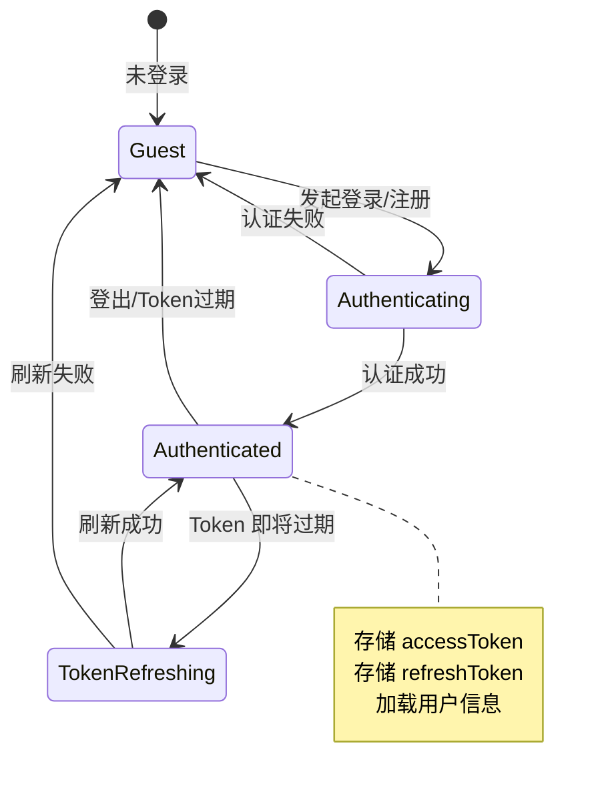
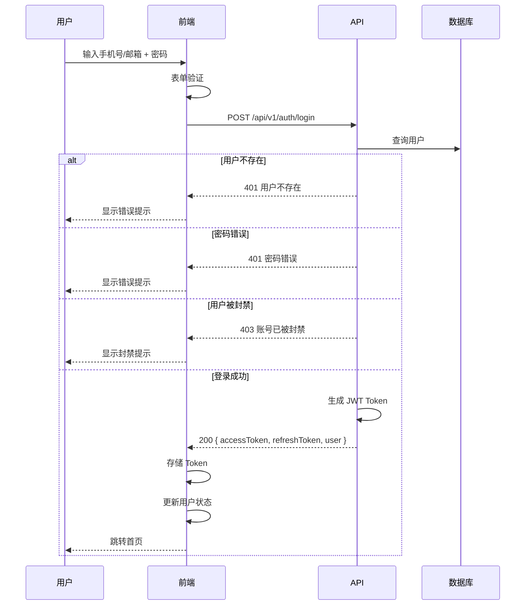
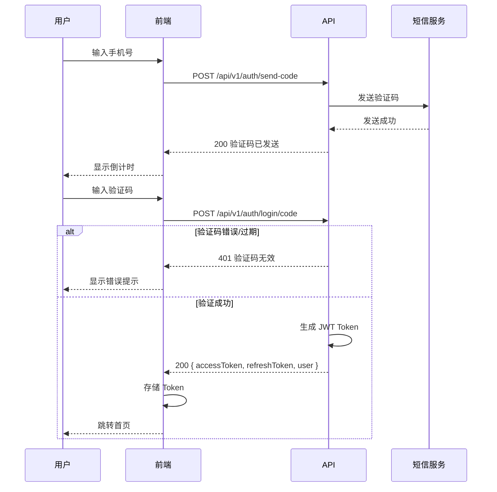
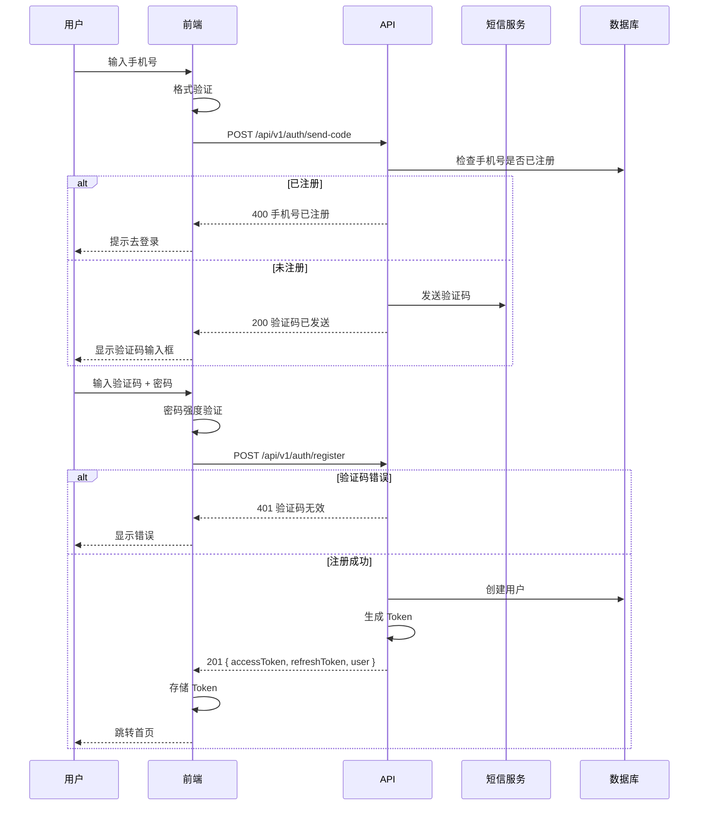
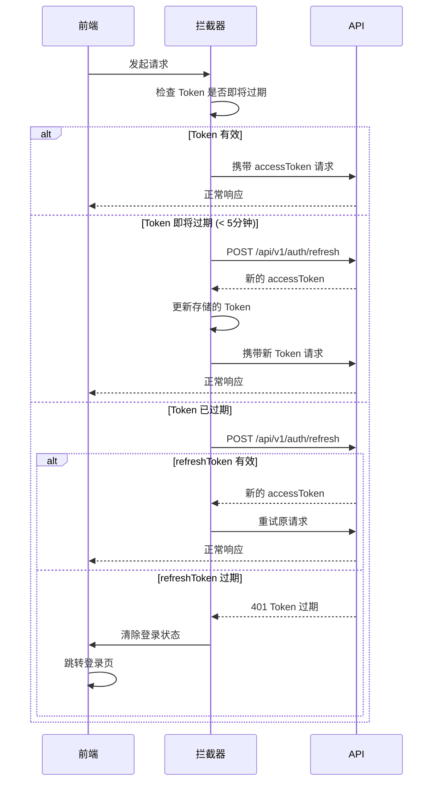
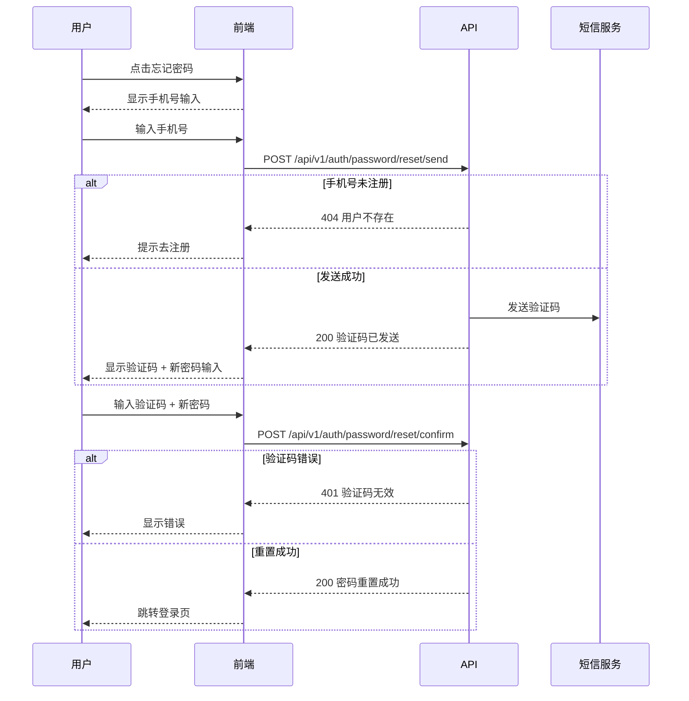
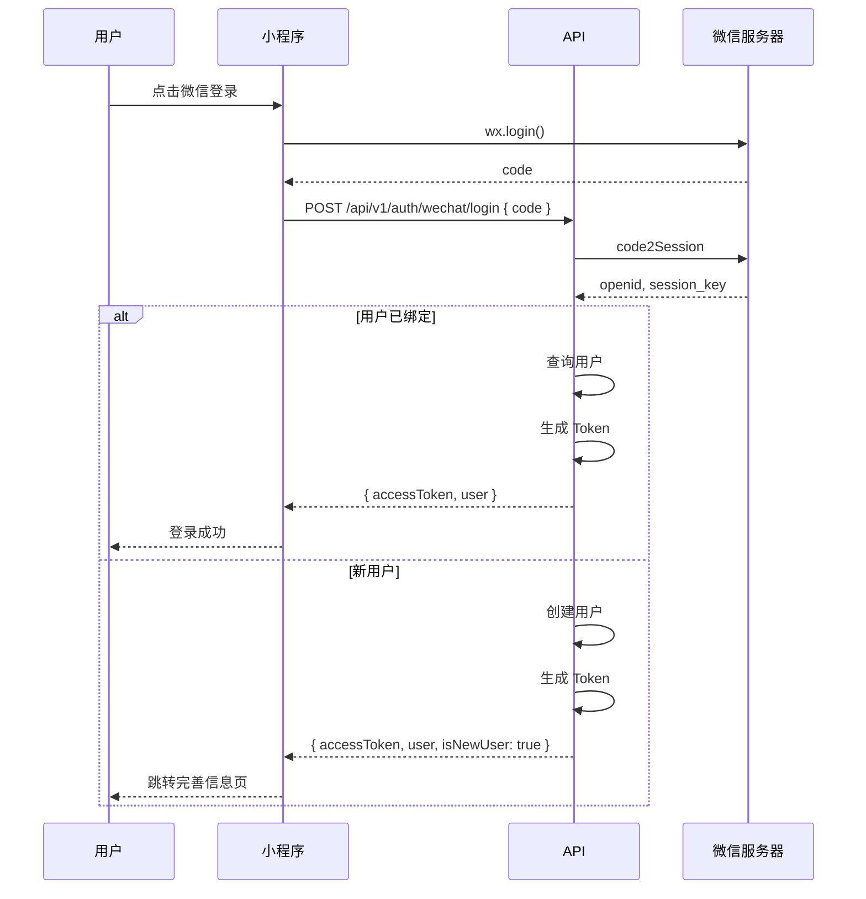
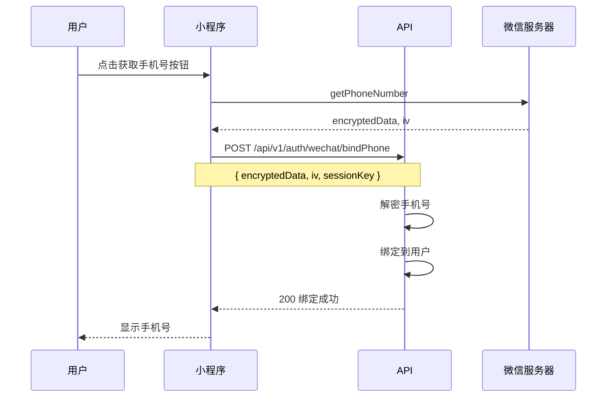

# 用户认证业务流程指南

> **前端开发参考文档** - 用户认证、注册、登录、Token 管理

---

## 目录

1. [认证状态概览](#1-认证状态概览)
2. [登录流程](#2-登录流程)
3. [注册流程](#3-注册流程)
4. [Token 管理](#4-token-管理)
5. [密码重置](#5-密码重置)
6. [微信登录](#6-微信登录)
7. [前端状态管理](#7-前端状态管理)
8. [API 接口映射](#8-api-接口映射)

---

## 1. 认证状态概览

### 1.1 用户状态枚举

```typescript
// 用户状态
enum UserStatus {
  Active = 'active',      // 正常
  Inactive = 'inactive',  // 未激活
  Banned = 'banned',      // 封禁
  Deleted = 'deleted'     // 已删除
}

// 用户角色
enum UserRole {
  User = 'user',       // 普通用户
  Player = 'player',   // 陪玩师
  Admin = 'admin'      // 管理员
}

// 认证方式
enum AuthMethod {
  Password = 'password',     // 密码登录
  Code = 'code',             // 验证码登录
  WeChat = 'wechat'          // 微信登录
}
```

### 1.2 认证状态机



---

## 2. 登录流程

### 2.1 密码登录流程



### 2.2 验证码登录流程



### 2.3 登录请求/响应

```typescript
// 登录请求
interface LoginRequest {
  phone?: string;        // 手机号
  email?: string;        // 邮箱
  password?: string;     // 密码 (密码登录)
  code?: string;         // 验证码 (验证码登录)
  method: AuthMethod;    // 登录方式
}

// 登录响应
interface LoginResponse {
  accessToken: string;   // 访问令牌 (有效期 2 小时)
  refreshToken: string;  // 刷新令牌 (有效期 7 天)
  expiresIn: number;     // 过期时间 (秒)
  user: UserInfo;        // 用户信息
}

interface UserInfo {
  id: number;
  phone: string;
  email?: string;
  nickname: string;
  avatar?: string;
  role: UserRole;
  status: UserStatus;
  isPlayer: boolean;     // 是否为陪玩师
  vipLevel?: number;     // VIP 等级
  createdAt: string;
}
```

---

## 3. 注册流程

### 3.1 手机号注册流程



### 3.2 注册请求/响应

```typescript
// 发送验证码请求
interface SendCodeRequest {
  phone: string;
  type: 'register' | 'login' | 'reset';
}

// 注册请求
interface RegisterRequest {
  phone: string;
  code: string;          // 验证码
  password: string;      // 密码 (6-20位)
  nickname?: string;     // 昵称 (可选)
  referralCode?: string; // 推荐码 (可选)
}

// 注册响应 (同登录响应)
interface RegisterResponse extends LoginResponse {}
```

### 3.3 密码强度规则

```typescript
// 密码验证规则
const passwordRules = {
  minLength: 6,
  maxLength: 20,
  requireNumber: true,      // 必须包含数字
  requireLetter: true,      // 必须包含字母
  requireSpecial: false,    // 特殊字符可选
};

// 密码强度计算
function calculatePasswordStrength(password: string): 'weak' | 'medium' | 'strong' {
  let score = 0;

  if (password.length >= 8) score++;
  if (password.length >= 12) score++;
  if (/[a-z]/.test(password) && /[A-Z]/.test(password)) score++;
  if (/\d/.test(password)) score++;
  if (/[!@#$%^&*]/.test(password)) score++;

  if (score <= 2) return 'weak';
  if (score <= 4) return 'medium';
  return 'strong';
}
```

---

## 4. Token 管理

### 4.1 Token 刷新流程



### 4.2 Token 存储策略

```typescript
// Token 存储 (推荐使用 localStorage + 内存缓存)
class TokenManager {
  private static ACCESS_TOKEN_KEY = 'gl_access_token';
  private static REFRESH_TOKEN_KEY = 'gl_refresh_token';
  private static TOKEN_EXPIRES_KEY = 'gl_token_expires';

  // 内存缓存 (避免频繁读取 localStorage)
  private static cachedAccessToken: string | null = null;

  static setTokens(accessToken: string, refreshToken: string, expiresIn: number) {
    const expiresAt = Date.now() + expiresIn * 1000;

    localStorage.setItem(this.ACCESS_TOKEN_KEY, accessToken);
    localStorage.setItem(this.REFRESH_TOKEN_KEY, refreshToken);
    localStorage.setItem(this.TOKEN_EXPIRES_KEY, expiresAt.toString());

    this.cachedAccessToken = accessToken;
  }

  static getAccessToken(): string | null {
    if (this.cachedAccessToken) {
      return this.cachedAccessToken;
    }
    this.cachedAccessToken = localStorage.getItem(this.ACCESS_TOKEN_KEY);
    return this.cachedAccessToken;
  }

  static getRefreshToken(): string | null {
    return localStorage.getItem(this.REFRESH_TOKEN_KEY);
  }

  static isTokenExpiringSoon(): boolean {
    const expiresAt = localStorage.getItem(this.TOKEN_EXPIRES_KEY);
    if (!expiresAt) return true;

    // 提前 5 分钟刷新
    return Date.now() > parseInt(expiresAt) - 5 * 60 * 1000;
  }

  static clearTokens() {
    localStorage.removeItem(this.ACCESS_TOKEN_KEY);
    localStorage.removeItem(this.REFRESH_TOKEN_KEY);
    localStorage.removeItem(this.TOKEN_EXPIRES_KEY);
    this.cachedAccessToken = null;
  }
}
```

### 4.3 Axios 拦截器配置

```typescript
import axios from 'axios';

const api = axios.create({
  baseURL: '/api/v1',
  timeout: 10000,
});

// 请求拦截器
api.interceptors.request.use(async (config) => {
  const token = TokenManager.getAccessToken();

  if (token) {
    // 检查是否需要刷新
    if (TokenManager.isTokenExpiringSoon()) {
      try {
        await refreshToken();
      } catch (error) {
        // 刷新失败，继续使用旧 token
      }
    }

    config.headers.Authorization = `Bearer ${TokenManager.getAccessToken()}`;
  }

  return config;
});

// 响应拦截器
api.interceptors.response.use(
  (response) => response.data,
  async (error) => {
    const originalRequest = error.config;

    // 401 且未重试过
    if (error.response?.status === 401 && !originalRequest._retry) {
      originalRequest._retry = true;

      try {
        await refreshToken();
        originalRequest.headers.Authorization = `Bearer ${TokenManager.getAccessToken()}`;
        return api(originalRequest);
      } catch (refreshError) {
        // 刷新失败，跳转登录
        TokenManager.clearTokens();
        window.location.href = '/login';
        return Promise.reject(refreshError);
      }
    }

    return Promise.reject(error);
  }
);

// Token 刷新函数
let refreshPromise: Promise<void> | null = null;

async function refreshToken(): Promise<void> {
  // 防止并发刷新
  if (refreshPromise) {
    return refreshPromise;
  }

  refreshPromise = (async () => {
    const refreshToken = TokenManager.getRefreshToken();
    if (!refreshToken) {
      throw new Error('No refresh token');
    }

    const response = await axios.post('/api/v1/auth/refresh', {
      refreshToken,
    });

    TokenManager.setTokens(
      response.data.data.accessToken,
      response.data.data.refreshToken,
      response.data.data.expiresIn
    );
  })();

  try {
    await refreshPromise;
  } finally {
    refreshPromise = null;
  }
}
```

---

## 5. 密码重置

### 5.1 重置流程



### 5.2 重置请求/响应

```typescript
// 发送重置验证码
interface ResetPasswordSendRequest {
  phone: string;
}

// 确认重置密码
interface ResetPasswordConfirmRequest {
  phone: string;
  code: string;
  newPassword: string;
}
```

---

## 6. 微信登录

### 6.1 微信小程序登录流程



### 6.2 获取手机号流程



### 6.3 微信登录请求/响应

```typescript
// 微信登录请求
interface WeChatLoginRequest {
  code: string;           // wx.login 获取的 code
  encryptedData?: string; // 加密数据 (获取用户信息时)
  iv?: string;            // 加密向量
  referralCode?: string;  // 推荐码
}

// 微信登录响应
interface WeChatLoginResponse {
  accessToken: string;
  refreshToken: string;
  expiresIn: number;
  user: UserInfo;
  isNewUser: boolean;     // 是否新用户
  needBindPhone: boolean; // 是否需要绑定手机
}

// 绑定手机号请求
interface BindPhoneRequest {
  encryptedData: string;
  iv: string;
}
```

---

## 7. 前端状态管理

### 7.1 Auth Store (Zustand)

```typescript
import { create } from 'zustand';
import { persist } from 'zustand/middleware';

interface AuthState {
  // 状态
  user: UserInfo | null;
  isAuthenticated: boolean;
  isLoading: boolean;

  // Actions
  login: (request: LoginRequest) => Promise<void>;
  loginWithCode: (phone: string, code: string) => Promise<void>;
  register: (request: RegisterRequest) => Promise<void>;
  logout: () => void;
  refreshUser: () => Promise<void>;

  // 内部方法
  setUser: (user: UserInfo | null) => void;
  setLoading: (loading: boolean) => void;
}

export const useAuthStore = create<AuthState>()(
  persist(
    (set, get) => ({
      user: null,
      isAuthenticated: false,
      isLoading: false,

      login: async (request) => {
        set({ isLoading: true });
        try {
          const response = await authApi.login(request);
          TokenManager.setTokens(
            response.accessToken,
            response.refreshToken,
            response.expiresIn
          );
          set({
            user: response.user,
            isAuthenticated: true,
            isLoading: false
          });
        } catch (error) {
          set({ isLoading: false });
          throw error;
        }
      },

      loginWithCode: async (phone, code) => {
        return get().login({ phone, code, method: AuthMethod.Code });
      },

      register: async (request) => {
        set({ isLoading: true });
        try {
          const response = await authApi.register(request);
          TokenManager.setTokens(
            response.accessToken,
            response.refreshToken,
            response.expiresIn
          );
          set({
            user: response.user,
            isAuthenticated: true,
            isLoading: false
          });
        } catch (error) {
          set({ isLoading: false });
          throw error;
        }
      },

      logout: () => {
        TokenManager.clearTokens();
        set({ user: null, isAuthenticated: false });
      },

      refreshUser: async () => {
        try {
          const user = await userApi.getMe();
          set({ user });
        } catch (error) {
          // Token 无效，登出
          get().logout();
        }
      },

      setUser: (user) => set({ user, isAuthenticated: !!user }),
      setLoading: (isLoading) => set({ isLoading }),
    }),
    {
      name: 'auth-storage',
      partialize: (state) => ({
        user: state.user,
        isAuthenticated: state.isAuthenticated
      }),
    }
  )
);
```

### 7.2 路由守卫

```typescript
import { Navigate, useLocation } from 'react-router-dom';
import { useAuthStore } from '@/stores/auth-store';

// 需要登录的路由
export function ProtectedRoute({ children }: { children: React.ReactNode }) {
  const { isAuthenticated } = useAuthStore();
  const location = useLocation();

  if (!isAuthenticated) {
    return <Navigate to="/login" state={{ from: location }} replace />;
  }

  return <>{children}</>;
}

// 仅游客可访问的路由 (登录/注册页)
export function GuestRoute({ children }: { children: React.ReactNode }) {
  const { isAuthenticated } = useAuthStore();
  const location = useLocation();

  if (isAuthenticated) {
    const from = location.state?.from?.pathname || '/';
    return <Navigate to={from} replace />;
  }

  return <>{children}</>;
}

// 陪玩师专用路由
export function PlayerRoute({ children }: { children: React.ReactNode }) {
  const { user, isAuthenticated } = useAuthStore();

  if (!isAuthenticated) {
    return <Navigate to="/login" replace />;
  }

  if (!user?.isPlayer) {
    return <Navigate to="/player/apply" replace />;
  }

  return <>{children}</>;
}
```

### 7.3 初始化检查

```typescript
// App.tsx 中的初始化逻辑
function App() {
  const { refreshUser, isAuthenticated } = useAuthStore();
  const [isInitialized, setIsInitialized] = useState(false);

  useEffect(() => {
    const init = async () => {
      const token = TokenManager.getAccessToken();

      if (token) {
        try {
          await refreshUser();
        } catch (error) {
          // Token 无效，已在 refreshUser 中处理
        }
      }

      setIsInitialized(true);
    };

    init();
  }, []);

  if (!isInitialized) {
    return <LoadingScreen />;
  }

  return <RouterProvider router={router} />;
}
```

---

## 8. API 接口映射

### 8.1 认证接口

| 接口 | 方法 | 路径 | 说明 |
|-----|------|------|------|
| 密码登录 | POST | `/api/v1/auth/login` | 手机号/邮箱 + 密码 |
| 验证码登录 | POST | `/api/v1/auth/login/code` | 手机号 + 验证码 |
| 发送验证码 | POST | `/api/v1/auth/send-code` | 注册/登录/重置 |
| 注册 | POST | `/api/v1/auth/register` | 手机号注册 |
| 刷新 Token | POST | `/api/v1/auth/refresh` | 刷新访问令牌 |
| 登出 | POST | `/api/v1/auth/logout` | 清除服务端 Token |

### 8.2 密码管理接口

| 接口 | 方法 | 路径 | 说明 |
|-----|------|------|------|
| 发送重置验证码 | POST | `/api/v1/auth/password/reset/send` | 忘记密码 |
| 确认重置密码 | POST | `/api/v1/auth/password/reset/confirm` | 设置新密码 |
| 修改密码 | PUT | `/api/v1/user/password` | 已登录修改 |

### 8.3 微信登录接口

| 接口 | 方法 | 路径 | 说明 |
|-----|------|------|------|
| 微信登录 | POST | `/api/v1/auth/wechat/login` | 小程序登录 |
| 绑定手机号 | POST | `/api/v1/auth/wechat/bind-phone` | 绑定手机 |
| 刷新 Token | POST | `/api/v1/auth/wechat/refresh` | 微信 Token 刷新 |

### 8.4 用户信息接口

| 接口 | 方法 | 路径 | 说明 |
|-----|------|------|------|
| 获取当前用户 | GET | `/api/v1/user/me` | 获取登录用户信息 |
| 更新资料 | PUT | `/api/v1/user/profile` | 更新昵称/头像等 |

---

## 错误码参考

| 错误码 | HTTP 状态 | 说明 | 前端处理 |
|-------|----------|------|---------|
| `AUTH_INVALID_CREDENTIALS` | 401 | 用户名或密码错误 | 显示错误提示 |
| `AUTH_CODE_INVALID` | 401 | 验证码无效或过期 | 提示重新获取 |
| `AUTH_CODE_EXPIRED` | 401 | 验证码已过期 | 提示重新获取 |
| `AUTH_USER_NOT_FOUND` | 404 | 用户不存在 | 提示去注册 |
| `AUTH_USER_BANNED` | 403 | 用户已被封禁 | 显示封禁原因 |
| `AUTH_PHONE_EXISTS` | 400 | 手机号已注册 | 提示去登录 |
| `AUTH_TOKEN_EXPIRED` | 401 | Token 已过期 | 尝试刷新或跳转登录 |
| `AUTH_REFRESH_FAILED` | 401 | 刷新 Token 失败 | 跳转登录页 |

---

**文档版本**: 1.0.0
**创建日期**: 2026-01-15
**适用范围**: Web PWA / 小程序
