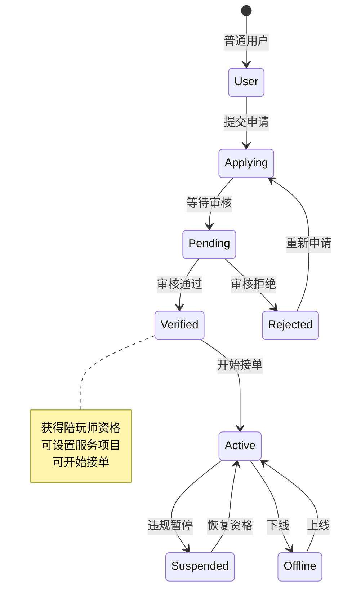
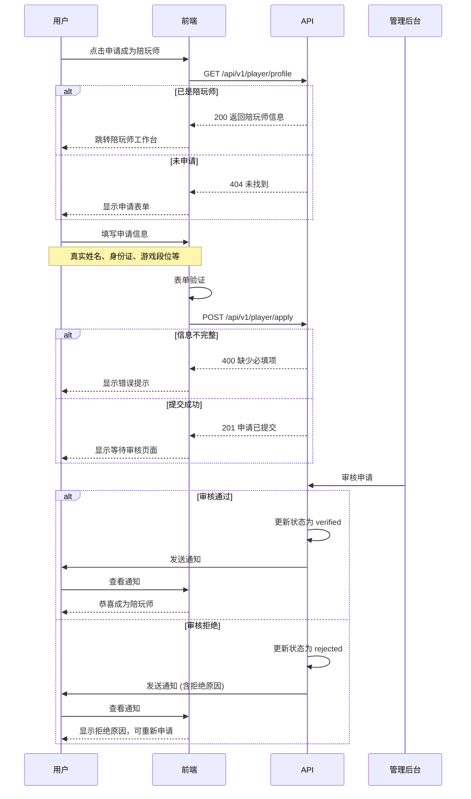
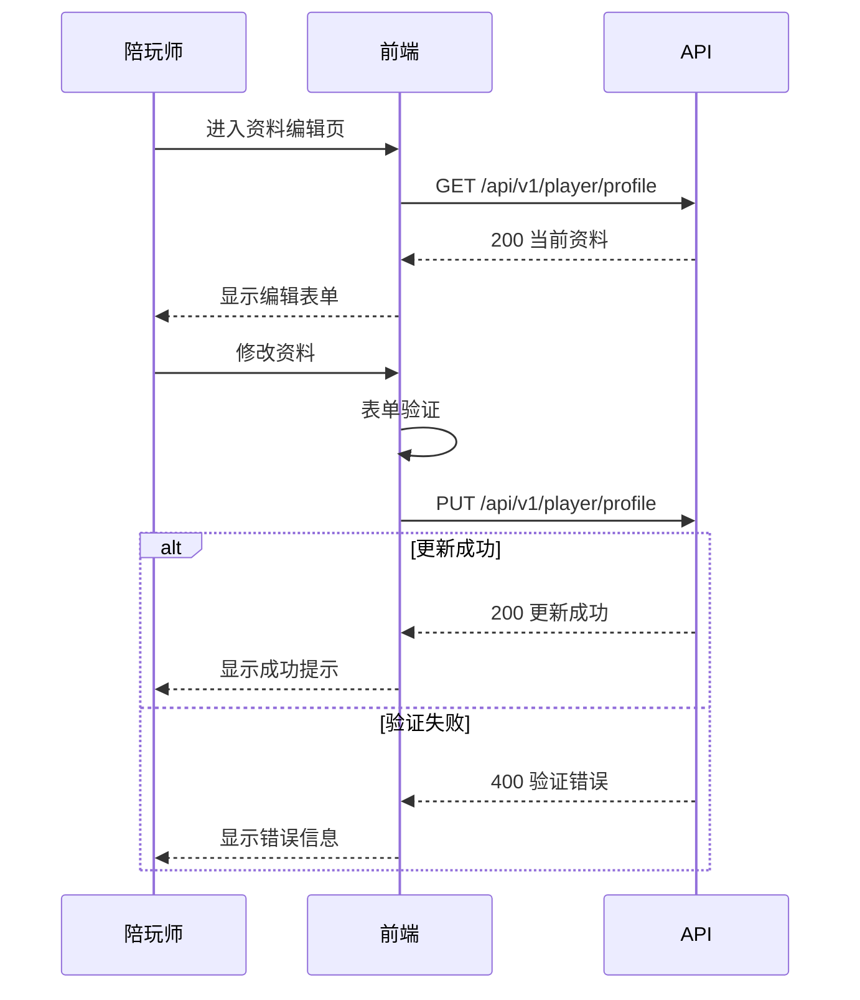
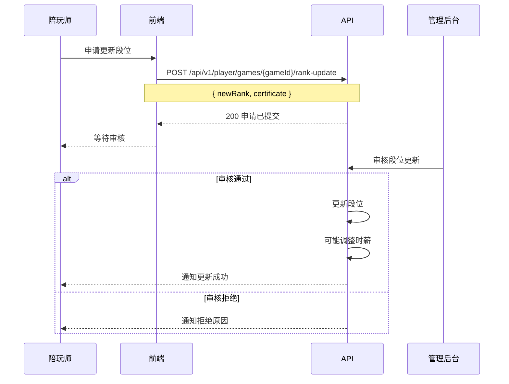
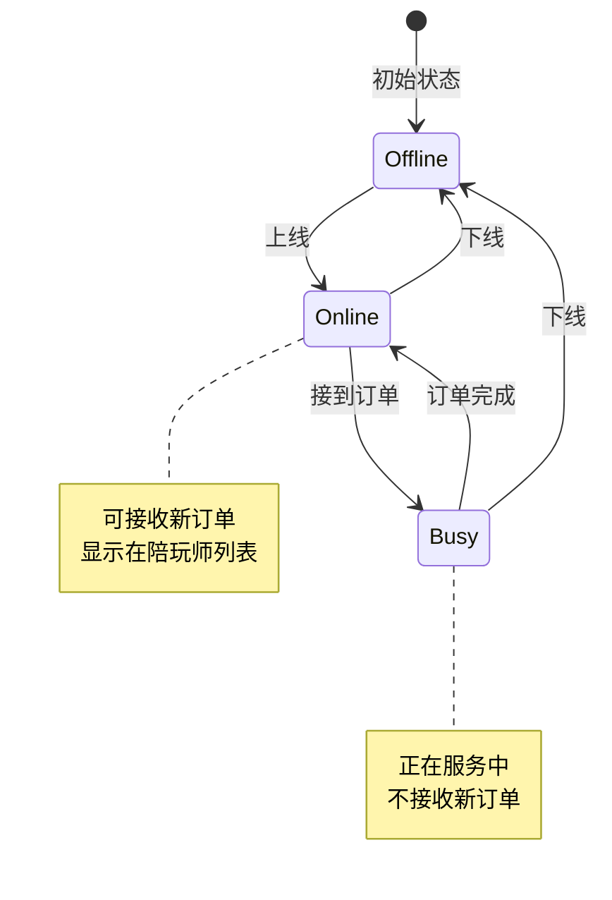
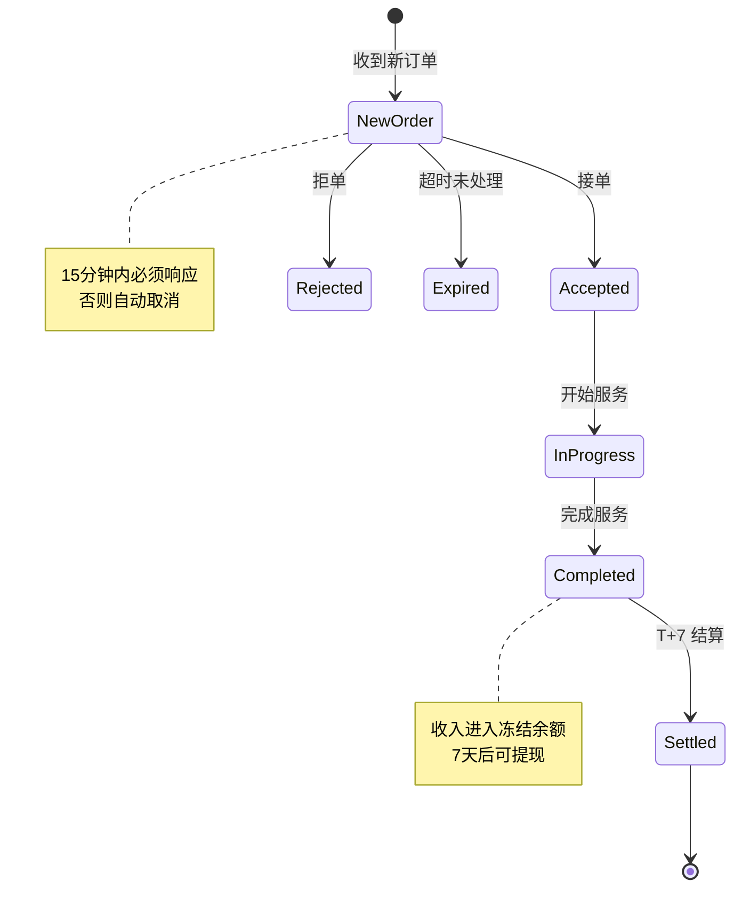
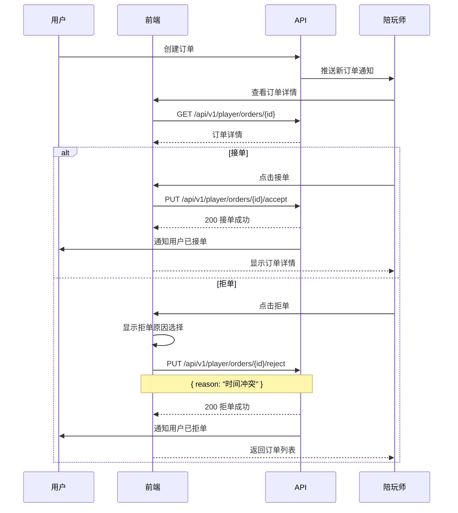
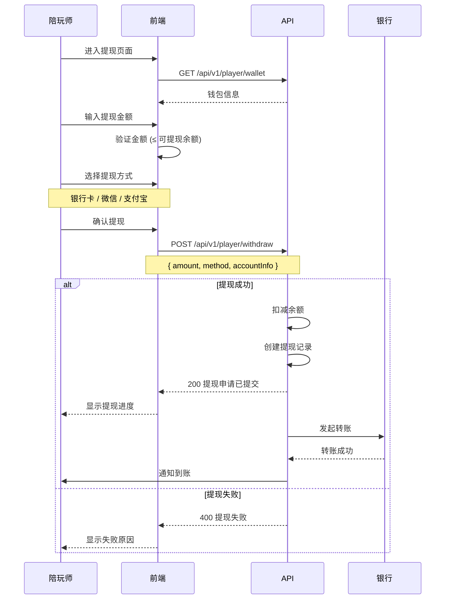

# 陪玩师业务流程指南

> **前端开发参考文档** - 陪玩师申请、认证、接单、收益管理

---

## 目录

1. [陪玩师状态概览](#1-陪玩师状态概览)
2. [申请成为陪玩师](#2-申请成为陪玩师)
3. [陪玩师资料管理](#3-陪玩师资料管理)
4. [在线状态管理](#4-在线状态管理)
5. [订单处理流程](#5-订单处理流程)
6. [收益与提现](#6-收益与提现)
7. [佣金计算规则](#7-佣金计算规则)
8. [前端状态管理](#8-前端状态管理)
9. [API 接口映射](#9-api-接口映射)

---

## 1. 陪玩师状态概览

### 1.1 认证状态枚举

```typescript
// 陪玩师认证状态
enum VerificationStatus {
  Pending = 'pending',       // 待审核
  Verified = 'verified',     // 已认证
  Rejected = 'rejected',     // 已拒绝
  Suspended = 'suspended'    // 已暂停
}

// 在线状态
enum OnlineStatus {
  Online = 'online',         // 在线接单
  Busy = 'busy',             // 忙碌中
  Offline = 'offline'        // 离线
}

// 接单状态
enum AcceptingStatus {
  Accepting = 'accepting',   // 接受订单
  NotAccepting = 'not_accepting'  // 暂停接单
}
```

### 1.2 陪玩师生命周期



### 1.3 陪玩师数据模型

```typescript
interface Player {
  id: number;
  userId: number;
  user: UserInfo;

  // 认证信息
  realName: string;
  idCard: string;           // 身份证号 (脱敏显示)
  verificationStatus: VerificationStatus;
  verifiedAt?: string;
  rejectionReason?: string;

  // 展示信息
  displayName: string;
  bio: string;              // 个人简介
  avatar: string;
  voiceIntro?: string;      // 语音介绍 URL
  gallery: string[];        // 相册

  // 服务信息
  games: PlayerGame[];      // 擅长游戏
  hourlyRateCents: number;  // 时薪 (分)
  serviceTimeSlots: TimeSlot[];  // 服务时段

  // 状态
  onlineStatus: OnlineStatus;
  acceptingOrders: boolean;
  lastOnlineAt?: string;

  // 统计
  totalOrders: number;
  completedOrders: number;
  rating: number;           // 评分 (1-5)
  reviewCount: number;

  // 收益
  totalEarningsCents: number;
  monthlyEarningsCents: number;

  createdAt: string;
  updatedAt: string;
}

interface PlayerGame {
  gameId: number;
  gameName: string;
  gameIcon: string;
  rank: string;             // 段位
  rankIcon?: string;
  certificate?: string;     // 段位证明图片
}

interface TimeSlot {
  dayOfWeek: number;        // 0-6 (周日-周六)
  startTime: string;        // "09:00"
  endTime: string;          // "22:00"
}
```

---

## 2. 申请成为陪玩师

### 2.1 申请流程



### 2.2 申请表单字段

```typescript
// 申请请求
interface PlayerApplyRequest {
  // 必填
  realName: string;         // 真实姓名
  idCard: string;           // 身份证号
  games: GameApplication[]; // 至少选择一个游戏

  // 选填
  displayName?: string;     // 展示名称
  bio?: string;             // 个人简介
  voiceIntro?: string;      // 语音介绍 URL
  gallery?: string[];       // 相册图片
}

interface GameApplication {
  gameId: number;
  rank: string;             // 段位
  certificate?: string;     // 段位证明图片 URL
}

// 申请响应
interface PlayerApplyResponse {
  id: number;
  status: VerificationStatus;
  message: string;
}
```

### 2.3 申请状态查询

```typescript
// 查询申请状态
interface ApplicationStatus {
  status: VerificationStatus;
  appliedAt: string;
  reviewedAt?: string;
  rejectionReason?: string;
  canReapply: boolean;      // 是否可重新申请
  reapplyAfter?: string;    // 可重新申请时间
}
```

---

## 3. 陪玩师资料管理

### 3.1 资料编辑流程



### 3.2 可编辑字段

```typescript
// 资料更新请求
interface PlayerProfileUpdateRequest {
  // 展示信息
  displayName?: string;
  bio?: string;
  avatar?: string;
  voiceIntro?: string;
  gallery?: string[];

  // 服务时段
  serviceTimeSlots?: TimeSlot[];

  // 注意: 以下字段不可自行修改
  // - hourlyRateCents (系统定价)
  // - games/rank (需重新认证)
  // - realName/idCard (需联系客服)
}
```

### 3.3 游戏段位更新



---

## 4. 在线状态管理

### 4.1 状态切换流程



### 4.2 状态更新 API

```typescript
// 更新在线状态
interface UpdateStatusRequest {
  onlineStatus: OnlineStatus;
  acceptingOrders?: boolean;
}

// 状态更新响应
interface UpdateStatusResponse {
  onlineStatus: OnlineStatus;
  acceptingOrders: boolean;
  lastOnlineAt: string;
}
```

### 4.3 心跳机制

```typescript
// 前端需要定期发送心跳保持在线状态
class OnlineHeartbeat {
  private intervalId: number | null = null;
  private readonly HEARTBEAT_INTERVAL = 30000; // 30秒

  start() {
    if (this.intervalId) return;

    this.intervalId = window.setInterval(async () => {
      try {
        await playerApi.heartbeat();
      } catch (error) {
        console.error('Heartbeat failed:', error);
        // 可能需要重新登录
      }
    }, this.HEARTBEAT_INTERVAL);
  }

  stop() {
    if (this.intervalId) {
      clearInterval(this.intervalId);
      this.intervalId = null;
    }
  }
}

// 页面可见性变化时处理
document.addEventListener('visibilitychange', () => {
  if (document.hidden) {
    heartbeat.stop();
  } else {
    heartbeat.start();
  }
});
```

---

## 5. 订单处理流程

### 5.1 陪玩师订单状态机



### 5.2 接单/拒单流程



### 5.3 订单操作接口

```typescript
// 接单请求
interface AcceptOrderRequest {
  orderId: number;
}

// 拒单请求
interface RejectOrderRequest {
  orderId: number;
  reason: string;           // 拒单原因
}

// 开始服务
interface StartServiceRequest {
  orderId: number;
}

// 完成服务
interface CompleteServiceRequest {
  orderId: number;
}

// 陪玩师订单列表请求
interface PlayerOrderListRequest {
  status?: OrderStatus[];
  page: number;
  pageSize: number;
}
```

---

## 6. 收益与提现

### 6.1 收益结构

```typescript
interface PlayerEarnings {
  // 总览
  totalEarningsCents: number;      // 累计收益
  monthlyEarningsCents: number;    // 本月收益
  weeklyEarningsCents: number;     // 本周收益
  todayEarningsCents: number;      // 今日收益

  // 钱包
  wallet: {
    balanceCents: number;          // 可提现余额
    frozenCents: number;           // 冻结金额 (T+7)
    pendingWithdrawCents: number;  // 提现中金额
  };

  // 统计
  completedOrders: number;         // 完成订单数
  averageOrderCents: number;       // 平均订单金额
}
```

### 6.2 收益明细

```typescript
interface EarningsRecord {
  id: number;
  orderId: number;
  orderNo: string;

  // 金额
  orderAmountCents: number;        // 订单金额
  commissionCents: number;         // 平台佣金
  earningsCents: number;           // 实际收益

  // 状态
  status: EarningsStatus;
  settledAt?: string;              // 结算时间

  createdAt: string;
}

enum EarningsStatus {
  Frozen = 'frozen',               // 冻结中 (T+7)
  Settled = 'settled',             // 已结算
  Disputed = 'disputed',           // 争议中
  Refunded = 'refunded'            // 已退款
}
```

### 6.3 提现流程



### 6.4 提现请求/响应

```typescript
// 提现请求
interface WithdrawRequest {
  amountCents: number;             // 提现金额 (分)
  method: WithdrawMethod;          // 提现方式
  accountInfo: AccountInfo;        // 账户信息
}

enum WithdrawMethod {
  BankCard = 'bank_card',
  WeChat = 'wechat',
  Alipay = 'alipay'
}

interface AccountInfo {
  // 银行卡
  bankName?: string;
  cardNumber?: string;
  holderName?: string;

  // 微信/支付宝
  accountId?: string;
}

// 提现记录
interface WithdrawRecord {
  id: number;
  amountCents: number;
  method: WithdrawMethod;
  status: WithdrawStatus;

  // 时间
  createdAt: string;
  processedAt?: string;
  completedAt?: string;

  // 失败信息
  failureReason?: string;
}

enum WithdrawStatus {
  Pending = 'pending',             // 待处理
  Processing = 'processing',       // 处理中
  Completed = 'completed',         // 已完成
  Failed = 'failed',               // 失败
  Rejected = 'rejected'            // 已拒绝
}
```

---

## 7. 佣金计算规则

### 7.1 三级佣金体系

```
┌─────────────────────────────────────────────────────────────┐
│                    佣金计算优先级                            │
├─────────────────────────────────────────────────────────────┤
│  优先级 1: 陪玩师个人佣金率 (CommissionRule.PlayerID)        │
│  优先级 2: 服务项目佣金率 (ServiceItem.CommissionRate)       │
│  优先级 3: 月度排名佣金减免 (RankingCommissionConfig)        │
└─────────────────────────────────────────────────────────────┘
```

### 7.2 佣金计算公式

```typescript
// 佣金计算
function calculateCommission(
  orderAmount: number,
  baseRate: number,           // 基础佣金率 (默认 20%)
  rankingDiscount: number     // 排名减免
): CommissionResult {
  const effectiveRate = baseRate - rankingDiscount;
  const commissionAmount = Math.floor(orderAmount * effectiveRate / 100);
  const playerEarnings = orderAmount - commissionAmount;

  return {
    orderAmount,
    baseRate,
    rankingDiscount,
    effectiveRate,
    commissionAmount,
    playerEarnings
  };
}

interface CommissionResult {
  orderAmount: number;        // 订单金额
  baseRate: number;           // 基础佣金率
  rankingDiscount: number;    // 排名减免
  effectiveRate: number;      // 实际佣金率
  commissionAmount: number;   // 平台佣金
  playerEarnings: number;     // 陪玩师收益
}
```

### 7.3 排名佣金减免

| 上月排名 | 佣金减免 | 实际佣金率 |
|---------|---------|-----------|
| Top 1-3 | 5% | 15% |
| Top 4-10 | 3% | 17% |
| Top 11-50 | 2% | 18% |
| Top 51-100 | 1% | 19% |
| 其他 | 0% | 20% |

### 7.4 佣金展示

```typescript
// 订单佣金详情 (前端展示用)
interface OrderCommissionDetail {
  orderAmountCents: number;

  // 佣金明细
  baseCommissionRate: number;      // 基础佣金率
  rankingDiscount: number;         // 排名减免
  finalCommissionRate: number;     // 最终佣金率

  commissionCents: number;         // 平台佣金
  playerEarningsCents: number;     // 陪玩师收益

  // 排名信息
  lastMonthRank?: number;          // 上月排名
}
```

---

## 8. 前端状态管理

### 8.1 Player Store (Zustand)

```typescript
import { create } from 'zustand';

interface PlayerState {
  // 状态
  profile: Player | null;
  isLoading: boolean;
  earnings: PlayerEarnings | null;
  orders: PlayerOrder[];

  // Actions
  fetchProfile: () => Promise<void>;
  updateProfile: (data: PlayerProfileUpdateRequest) => Promise<void>;
  updateStatus: (status: OnlineStatus) => Promise<void>;
  fetchEarnings: () => Promise<void>;
  fetchOrders: (params: PlayerOrderListRequest) => Promise<void>;
  acceptOrder: (orderId: number) => Promise<void>;
  rejectOrder: (orderId: number, reason: string) => Promise<void>;
}

export const usePlayerStore = create<PlayerState>((set, get) => ({
  profile: null,
  isLoading: false,
  earnings: null,
  orders: [],

  fetchProfile: async () => {
    set({ isLoading: true });
    try {
      const profile = await playerApi.getProfile();
      set({ profile, isLoading: false });
    } catch (error) {
      set({ isLoading: false });
      throw error;
    }
  },

  updateProfile: async (data) => {
    const profile = await playerApi.updateProfile(data);
    set({ profile });
  },

  updateStatus: async (status) => {
    const result = await playerApi.updateStatus({ onlineStatus: status });
    set((state) => ({
      profile: state.profile
        ? { ...state.profile, onlineStatus: result.onlineStatus }
        : null
    }));
  },

  fetchEarnings: async () => {
    const earnings = await playerApi.getEarnings();
    set({ earnings });
  },

  fetchOrders: async (params) => {
    const orders = await playerApi.getOrders(params);
    set({ orders });
  },

  acceptOrder: async (orderId) => {
    await playerApi.acceptOrder(orderId);
    // 刷新订单列表
    get().fetchOrders({ page: 1, pageSize: 20 });
  },

  rejectOrder: async (orderId, reason) => {
    await playerApi.rejectOrder(orderId, reason);
    get().fetchOrders({ page: 1, pageSize: 20 });
  },
}));
```

### 8.2 陪玩师工作台组件

```typescript
// 工作台数据展示
function PlayerDashboard() {
  const { profile, earnings, updateStatus } = usePlayerStore();

  // 在线状态切换
  const handleStatusToggle = async () => {
    const newStatus = profile?.onlineStatus === 'online'
      ? OnlineStatus.Offline
      : OnlineStatus.Online;
    await updateStatus(newStatus);
  };

  return (
    <div className="dashboard">
      {/* 在线状态开关 */}
      <StatusToggle
        status={profile?.onlineStatus}
        onChange={handleStatusToggle}
      />

      {/* 今日收益 */}
      <EarningsCard
        today={earnings?.todayEarningsCents}
        month={earnings?.monthlyEarningsCents}
      />

      {/* 待处理订单 */}
      <PendingOrders />
    </div>
  );
}
```

---

## 9. API 接口映射

### 9.1 陪玩师申请接口

| 接口 | 方法 | 路径 | 说明 |
|-----|------|------|------|
| 提交申请 | POST | `/api/v1/player/apply` | 申请成为陪玩师 |
| 查询状态 | GET | `/api/v1/player/application` | 查询申请状态 |
| 重新申请 | POST | `/api/v1/player/reapply` | 被拒后重新申请 |

### 9.2 陪玩师资料接口

| 接口 | 方法 | 路径 | 说明 |
|-----|------|------|------|
| 获取资料 | GET | `/api/v1/player/profile` | 获取陪玩师资料 |
| 更新资料 | PUT | `/api/v1/player/profile` | 更新资料 |
| 更新状态 | PUT | `/api/v1/player/status` | 更新在线状态 |
| 心跳 | POST | `/api/v1/player/heartbeat` | 保持在线 |

### 9.3 陪玩师订单接口

| 接口 | 方法 | 路径 | 说明 |
|-----|------|------|------|
| 订单列表 | GET | `/api/v1/player/orders` | 获取订单列表 |
| 订单详情 | GET | `/api/v1/player/orders/{id}` | 获取订单详情 |
| 接单 | PUT | `/api/v1/player/orders/{id}/accept` | 接受订单 |
| 拒单 | PUT | `/api/v1/player/orders/{id}/reject` | 拒绝订单 |
| 开始服务 | PUT | `/api/v1/player/orders/{id}/start` | 开始服务 |
| 完成服务 | PUT | `/api/v1/player/orders/{id}/complete` | 完成服务 |

### 9.4 收益与提现接口

| 接口 | 方法 | 路径 | 说明 |
|-----|------|------|------|
| 收益总览 | GET | `/api/v1/player/earnings` | 收益统计 |
| 收益明细 | GET | `/api/v1/player/earnings/records` | 收益记录 |
| 钱包信息 | GET | `/api/v1/player/wallet` | 钱包余额 |
| 申请提现 | POST | `/api/v1/player/withdraw` | 提现申请 |
| 提现记录 | GET | `/api/v1/player/withdraw/records` | 提现历史 |
| 佣金规则 | GET | `/api/v1/player/commission` | 佣金规则 |

---

## 错误码参考

| 错误码 | HTTP 状态 | 说明 | 前端处理 |
|-------|----------|------|---------|
| `PLAYER_NOT_FOUND` | 404 | 陪玩师不存在 | 跳转申请页 |
| `PLAYER_NOT_VERIFIED` | 403 | 未通过认证 | 显示审核状态 |
| `PLAYER_SUSPENDED` | 403 | 已被暂停 | 显示暂停原因 |
| `ORDER_NOT_FOUND` | 404 | 订单不存在 | 返回列表 |
| `ORDER_EXPIRED` | 400 | 订单已过期 | 刷新列表 |
| `ORDER_ALREADY_ACCEPTED` | 400 | 订单已被接 | 刷新列表 |
| `INSUFFICIENT_BALANCE` | 400 | 余额不足 | 显示余额 |
| `WITHDRAW_LIMIT_EXCEEDED` | 400 | 超出提现限额 | 显示限额 |
| `WITHDRAW_PENDING` | 400 | 有待处理提现 | 显示提现状态 |

---

**文档版本**: 1.0.0
**创建日期**: 2026-01-15
**适用范围**: Web PWA / 小程序
