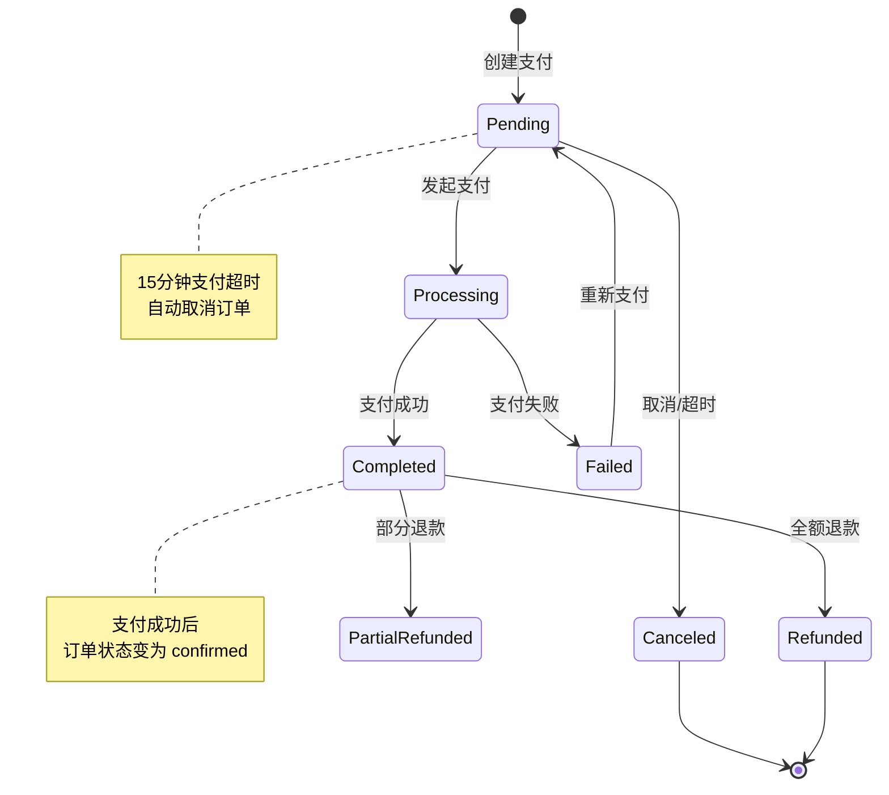
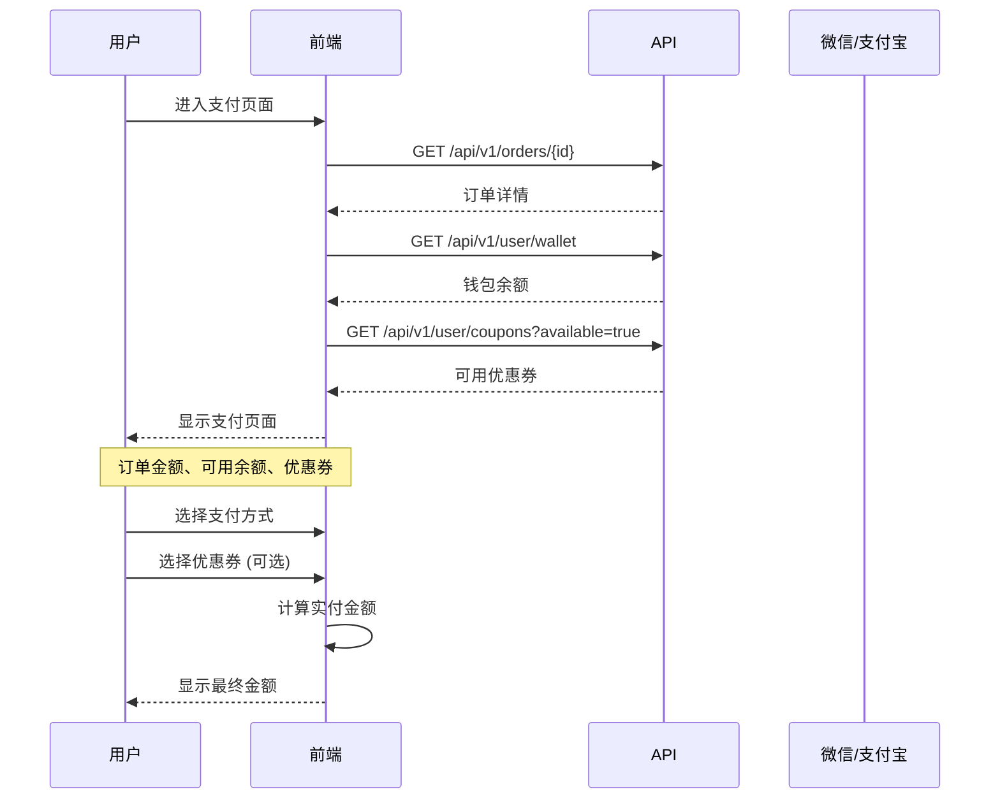
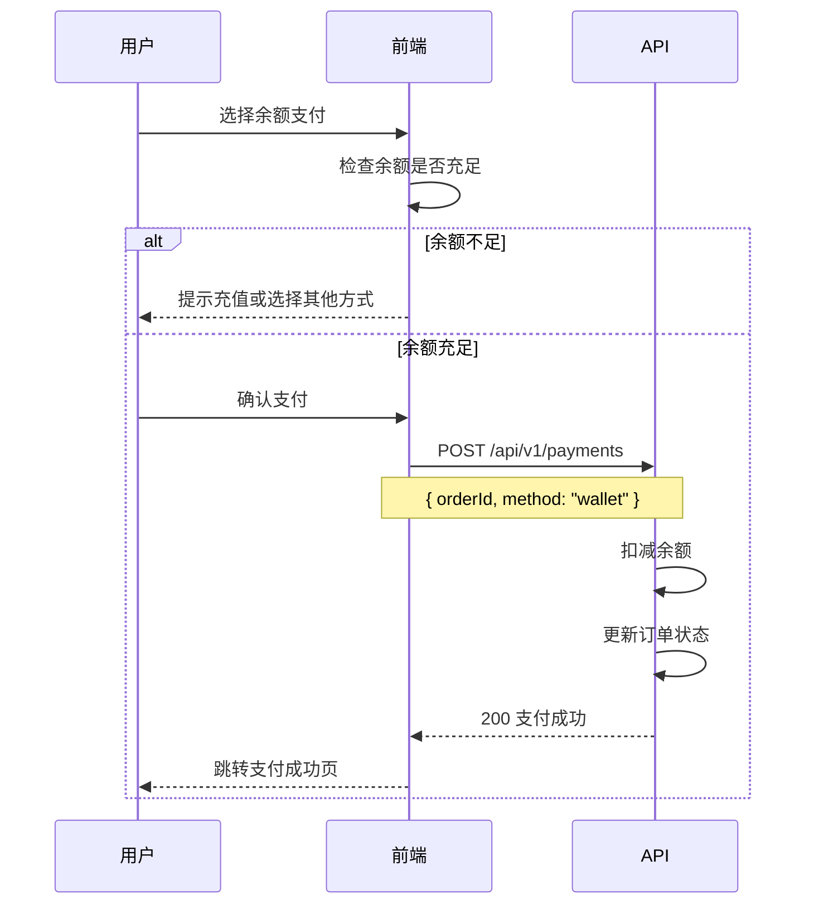
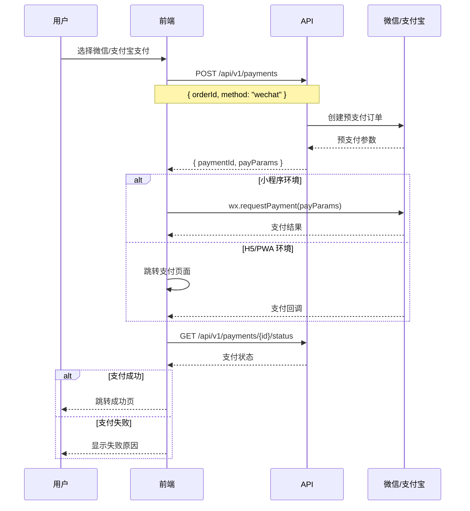
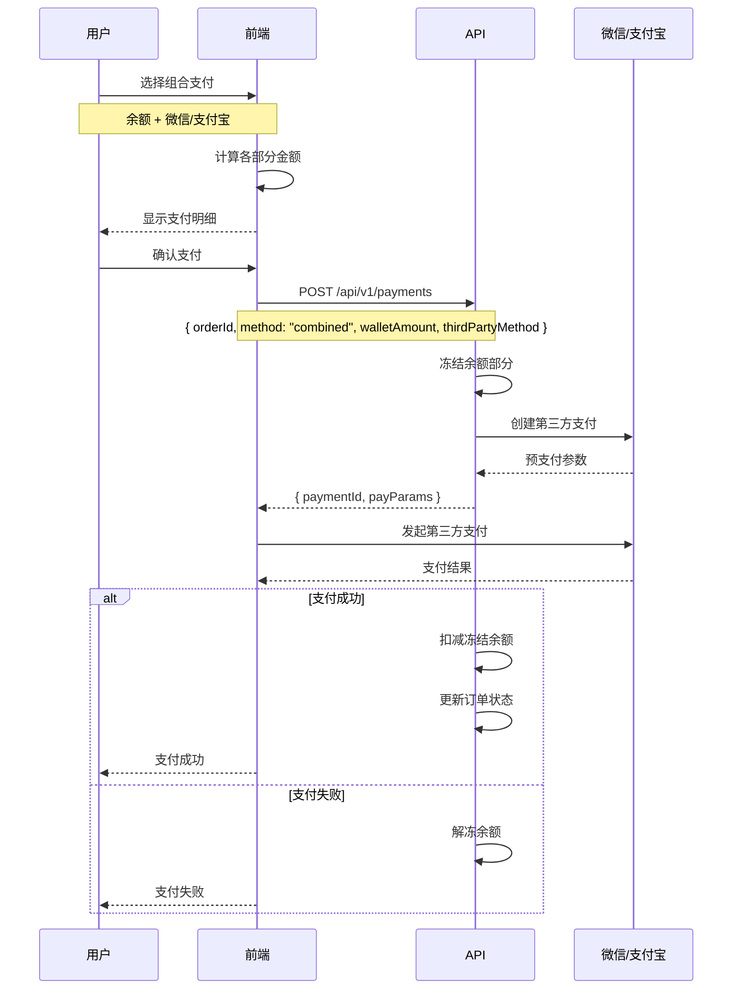
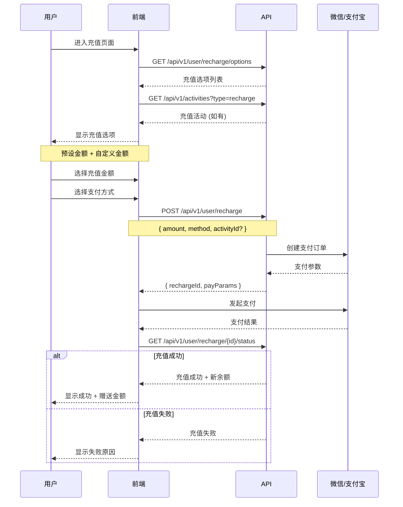
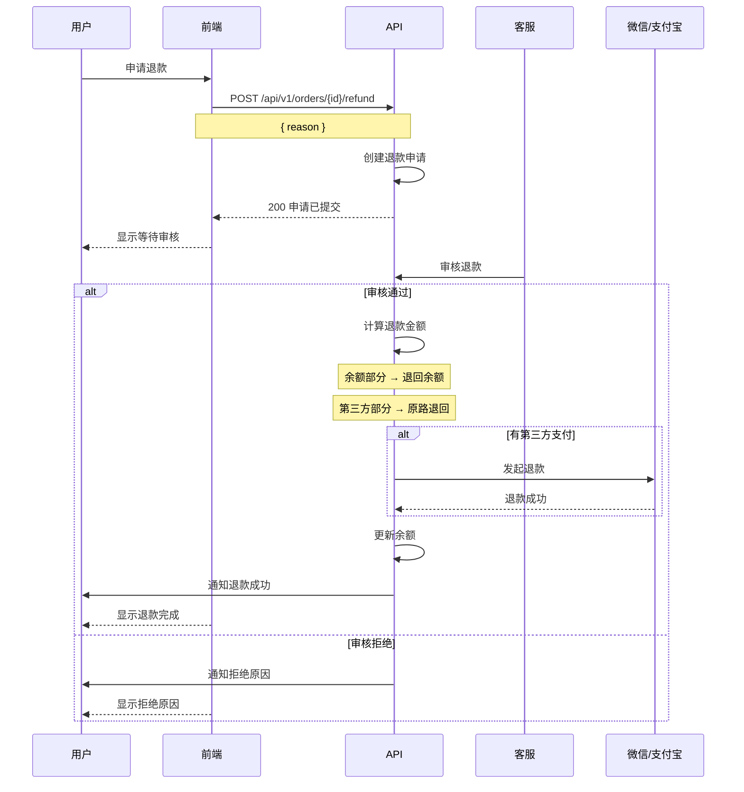

# 支付与钱包业务流程指南

> **前端开发参考文档** - 支付流程、钱包管理、充值、交易记录

---

## 目录

1. [支付状态概览](#1-支付状态概览)
2. [订单支付流程](#2-订单支付流程)
3. [钱包管理](#3-钱包管理)
4. [充值流程](#4-充值流程)
5. [交易记录](#5-交易记录)
6. [退款流程](#6-退款流程)
7. [前端状态管理](#7-前端状态管理)
8. [API 接口映射](#8-api-接口映射)

---

## 1. 支付状态概览

### 1.1 支付状态枚举

```typescript
// 支付状态
enum PaymentStatus {
  Pending = 'pending',           // 待支付
  Processing = 'processing',     // 处理中
  Completed = 'completed',       // 已完成
  Failed = 'failed',             // 失败
  Refunded = 'refunded',         // 已退款
  PartialRefunded = 'partial_refunded',  // 部分退款
  Canceled = 'canceled'          // 已取消
}

// 支付方式
enum PaymentMethod {
  WeChat = 'wechat',             // 微信支付
  Alipay = 'alipay',             // 支付宝
  Wallet = 'wallet',             // 余额支付
  Combined = 'combined'          // 组合支付
}

// 交易类型
enum TransactionType {
  Recharge = 'recharge',         // 充值
  Consume = 'consume',           // 消费
  Refund = 'refund',             // 退款
  Income = 'income',             // 收入 (陪玩师)
  Withdraw = 'withdraw',         // 提现
  Bonus = 'bonus'                // 奖励
}
```

### 1.2 支付状态机



### 1.3 支付数据模型

```typescript
interface Payment {
  id: number;
  paymentNo: string;            // 支付单号
  orderId: number;
  orderNo: string;

  // 金额
  amountCents: number;          // 支付金额 (分)
  walletAmountCents: number;    // 余额支付部分
  thirdPartyAmountCents: number; // 第三方支付部分

  // 支付信息
  method: PaymentMethod;
  status: PaymentStatus;
  thirdPartyTradeNo?: string;   // 第三方交易号

  // 优惠
  couponId?: number;
  couponDiscountCents: number;  // 优惠券抵扣
  vipDiscountCents: number;     // VIP 折扣

  // 时间
  createdAt: string;
  paidAt?: string;
  expiredAt: string;            // 支付过期时间
}
```

---

## 2. 订单支付流程

### 2.1 支付方式选择流程



### 2.2 余额支付流程



### 2.3 微信/支付宝支付流程



### 2.4 组合支付流程



### 2.5 支付请求/响应

```typescript
// 创建支付请求
interface CreatePaymentRequest {
  orderId: number;
  method: PaymentMethod;

  // 组合支付时
  walletAmountCents?: number;    // 余额支付金额
  thirdPartyMethod?: 'wechat' | 'alipay';

  // 优惠
  couponId?: number;
}

// 创建支付响应
interface CreatePaymentResponse {
  paymentId: number;
  paymentNo: string;
  status: PaymentStatus;

  // 第三方支付参数 (微信/支付宝)
  payParams?: WeChatPayParams | AlipayParams;

  // 金额明细
  breakdown: PaymentBreakdown;
}

interface PaymentBreakdown {
  originalAmountCents: number;   // 原价
  couponDiscountCents: number;   // 优惠券抵扣
  vipDiscountCents: number;      // VIP 折扣
  finalAmountCents: number;      // 实付金额
  walletAmountCents: number;     // 余额支付
  thirdPartyAmountCents: number; // 第三方支付
}

// 微信支付参数
interface WeChatPayParams {
  appId: string;
  timeStamp: string;
  nonceStr: string;
  package: string;
  signType: string;
  paySign: string;
}
```

---

## 3. 钱包管理

### 3.1 钱包数据模型

```typescript
interface Wallet {
  userId: number;

  // 余额
  balanceCents: number;          // 可用余额
  frozenCents: number;           // 冻结金额

  // 陪玩师专用
  incomeCents?: number;          // 累计收入
  withdrawableCents?: number;    // 可提现金额

  // 统计
  totalRechargeCents: number;    // 累计充值
  totalConsumeCents: number;     // 累计消费

  updatedAt: string;
}
```

### 3.2 钱包页面数据

```typescript
// 钱包页面展示数据
interface WalletPageData {
  wallet: Wallet;

  // 快捷操作
  quickActions: {
    canRecharge: boolean;
    canWithdraw: boolean;        // 陪玩师
    pendingWithdraw?: number;    // 待处理提现
  };

  // 最近交易
  recentTransactions: Transaction[];
}
```

---

## 4. 充值流程

### 4.1 充值流程图



### 4.2 充值选项

```typescript
// 充值选项
interface RechargeOption {
  id: number;
  amountCents: number;           // 充值金额
  bonusCents: number;            // 赠送金额
  label?: string;                // 标签 (如 "推荐")
  isPopular: boolean;            // 是否热门
}

// 充值活动
interface RechargeActivity {
  id: number;
  name: string;
  description: string;

  // 活动规则
  minAmountCents: number;        // 最低充值金额
  bonusRate: number;             // 赠送比例 (如 0.1 = 10%)
  maxBonusCents: number;         // 最高赠送

  // 时间
  startAt: string;
  endAt: string;
}

// 充值请求
interface RechargeRequest {
  amountCents: number;
  method: 'wechat' | 'alipay';
  activityId?: number;
}

// 充值响应
interface RechargeResponse {
  rechargeId: number;
  amountCents: number;
  bonusCents: number;
  payParams: WeChatPayParams | AlipayParams;
}
```

---

## 5. 交易记录

### 5.1 交易记录模型

```typescript
interface Transaction {
  id: number;
  transactionNo: string;

  // 类型
  type: TransactionType;
  direction: 'in' | 'out';       // 收入/支出

  // 金额
  amountCents: number;
  balanceAfterCents: number;     // 交易后余额

  // 关联
  orderId?: number;
  orderNo?: string;
  rechargeId?: number;
  withdrawId?: number;

  // 描述
  title: string;
  description?: string;

  createdAt: string;
}
```

### 5.2 交易记录查询

```typescript
// 查询请求
interface TransactionListRequest {
  type?: TransactionType[];      // 筛选类型
  direction?: 'in' | 'out';      // 筛选方向
  startDate?: string;
  endDate?: string;
  page: number;
  pageSize: number;
}

// 查询响应
interface TransactionListResponse {
  items: Transaction[];
  total: number;
  page: number;
  pageSize: number;

  // 统计
  summary: {
    totalInCents: number;        // 总收入
    totalOutCents: number;       // 总支出
  };
}
```

---

## 6. 退款流程

### 6.1 退款状态

```typescript
enum RefundStatus {
  Pending = 'pending',           // 待处理
  Processing = 'processing',     // 处理中
  Completed = 'completed',       // 已完成
  Failed = 'failed',             // 失败
  Rejected = 'rejected'          // 已拒绝
}

interface Refund {
  id: number;
  refundNo: string;
  orderId: number;
  paymentId: number;

  // 金额
  amountCents: number;
  actualAmountCents: number;     // 实际退款金额

  // 状态
  status: RefundStatus;
  reason: string;
  rejectReason?: string;

  // 退款去向
  refundToWallet: number;        // 退回余额
  refundToThirdParty: number;    // 退回第三方

  createdAt: string;
  completedAt?: string;
}
```

### 6.2 退款流程图



---

## 7. 前端状态管理

### 7.1 Wallet Store (Zustand)

```typescript
import { create } from 'zustand';

interface WalletState {
  // 状态
  wallet: Wallet | null;
  transactions: Transaction[];
  rechargeOptions: RechargeOption[];
  isLoading: boolean;

  // Actions
  fetchWallet: () => Promise<void>;
  fetchTransactions: (params: TransactionListRequest) => Promise<void>;
  fetchRechargeOptions: () => Promise<void>;
  recharge: (request: RechargeRequest) => Promise<RechargeResponse>;
}

export const useWalletStore = create<WalletState>((set, get) => ({
  wallet: null,
  transactions: [],
  rechargeOptions: [],
  isLoading: false,

  fetchWallet: async () => {
    set({ isLoading: true });
    try {
      const wallet = await walletApi.getWallet();
      set({ wallet, isLoading: false });
    } catch (error) {
      set({ isLoading: false });
      throw error;
    }
  },

  fetchTransactions: async (params) => {
    const result = await walletApi.getTransactions(params);
    set({ transactions: result.items });
  },

  fetchRechargeOptions: async () => {
    const options = await walletApi.getRechargeOptions();
    set({ rechargeOptions: options });
  },

  recharge: async (request) => {
    const response = await walletApi.recharge(request);
    return response;
  },
}));
```

### 7.2 Payment Store

```typescript
interface PaymentState {
  // 当前支付
  currentPayment: Payment | null;
  paymentStatus: PaymentStatus | null;

  // Actions
  createPayment: (request: CreatePaymentRequest) => Promise<CreatePaymentResponse>;
  checkPaymentStatus: (paymentId: number) => Promise<PaymentStatus>;
  cancelPayment: (paymentId: number) => Promise<void>;
}

export const usePaymentStore = create<PaymentState>((set) => ({
  currentPayment: null,
  paymentStatus: null,

  createPayment: async (request) => {
    const response = await paymentApi.create(request);
    set({ currentPayment: response, paymentStatus: PaymentStatus.Pending });
    return response;
  },

  checkPaymentStatus: async (paymentId) => {
    const status = await paymentApi.getStatus(paymentId);
    set({ paymentStatus: status });
    return status;
  },

  cancelPayment: async (paymentId) => {
    await paymentApi.cancel(paymentId);
    set({ paymentStatus: PaymentStatus.Canceled });
  },
}));
```

### 7.3 支付结果轮询

```typescript
// 支付结果轮询 Hook
function usePaymentPolling(paymentId: number | null) {
  const [status, setStatus] = useState<PaymentStatus | null>(null);
  const [isPolling, setIsPolling] = useState(false);

  useEffect(() => {
    if (!paymentId) return;

    let intervalId: number;
    let attempts = 0;
    const maxAttempts = 60;  // 最多轮询 60 次
    const interval = 2000;   // 每 2 秒

    const poll = async () => {
      try {
        const result = await paymentApi.getStatus(paymentId);
        setStatus(result);

        // 终态停止轮询
        if (['completed', 'failed', 'canceled'].includes(result)) {
          clearInterval(intervalId);
          setIsPolling(false);
        }
      } catch (error) {
        console.error('Payment polling error:', error);
      }

      attempts++;
      if (attempts >= maxAttempts) {
        clearInterval(intervalId);
        setIsPolling(false);
      }
    };

    setIsPolling(true);
    poll();  // 立即执行一次
    intervalId = window.setInterval(poll, interval);

    return () => {
      clearInterval(intervalId);
      setIsPolling(false);
    };
  }, [paymentId]);

  return { status, isPolling };
}
```

---

## 8. API 接口映射

### 8.1 支付接口

| 接口 | 方法 | 路径 | 说明 |
|-----|------|------|------|
| 创建支付 | POST | `/api/v1/payments` | 创建支付订单 |
| 查询状态 | GET | `/api/v1/payments/{id}/status` | 查询支付状态 |
| 取消支付 | PUT | `/api/v1/payments/{id}/cancel` | 取消支付 |
| 支付详情 | GET | `/api/v1/payments/{id}` | 获取支付详情 |

### 8.2 钱包接口

| 接口 | 方法 | 路径 | 说明 |
|-----|------|------|------|
| 钱包信息 | GET | `/api/v1/user/wallet` | 获取钱包余额 |
| 交易记录 | GET | `/api/v1/user/wallet/transactions` | 交易记录列表 |

### 8.3 充值接口

| 接口 | 方法 | 路径 | 说明 |
|-----|------|------|------|
| 充值选项 | GET | `/api/v1/user/recharge/options` | 获取充值选项 |
| 充值活动 | GET | `/api/v1/user/recharge/activities` | 充值活动 |
| 发起充值 | POST | `/api/v1/user/recharge` | 创建充值订单 |
| 充值状态 | GET | `/api/v1/user/recharge/{id}/status` | 查询充值状态 |

### 8.4 退款接口

| 接口 | 方法 | 路径 | 说明 |
|-----|------|------|------|
| 申请退款 | POST | `/api/v1/orders/{id}/refund` | 申请退款 |
| 退款详情 | GET | `/api/v1/refunds/{id}` | 退款详情 |
| 退款列表 | GET | `/api/v1/user/refunds` | 我的退款 |

---

## 错误码参考

| 错误码 | HTTP 状态 | 说明 | 前端处理 |
|-------|----------|------|---------|
| `PAYMENT_ORDER_NOT_FOUND` | 404 | 订单不存在 | 返回订单列表 |
| `PAYMENT_ALREADY_PAID` | 400 | 订单已支付 | 跳转订单详情 |
| `PAYMENT_EXPIRED` | 400 | 支付已过期 | 提示重新下单 |
| `INSUFFICIENT_BALANCE` | 400 | 余额不足 | 提示充值 |
| `COUPON_NOT_AVAILABLE` | 400 | 优惠券不可用 | 重新选择 |
| `PAYMENT_FAILED` | 400 | 支付失败 | 显示失败原因 |
| `REFUND_NOT_ALLOWED` | 400 | 不允许退款 | 显示原因 |
| `REFUND_AMOUNT_EXCEEDED` | 400 | 退款金额超限 | 显示可退金额 |

---

**文档版本**: 1.0.0
**创建日期**: 2026-01-15
**适用范围**: Web PWA / 小程序
