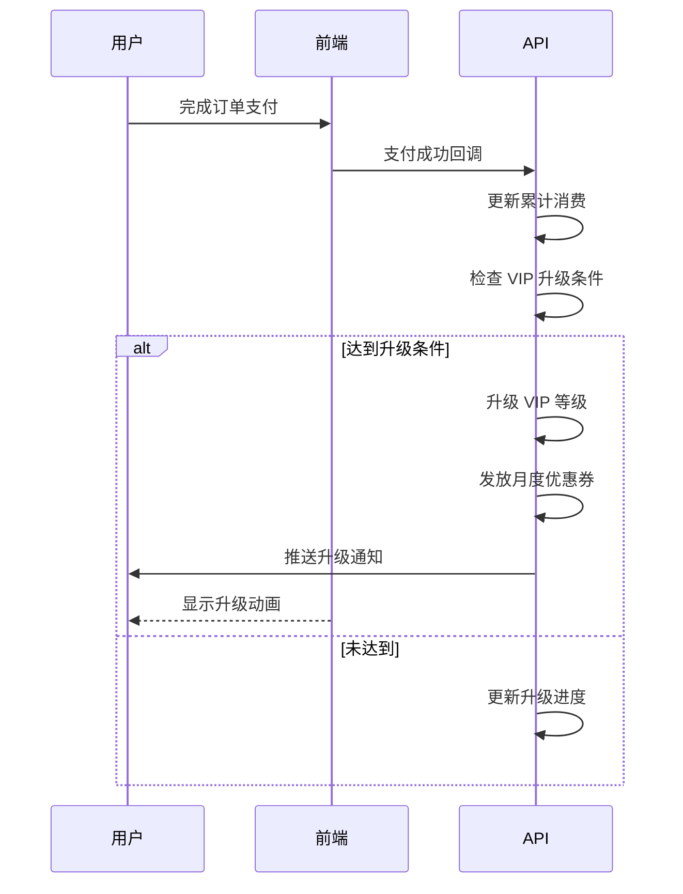
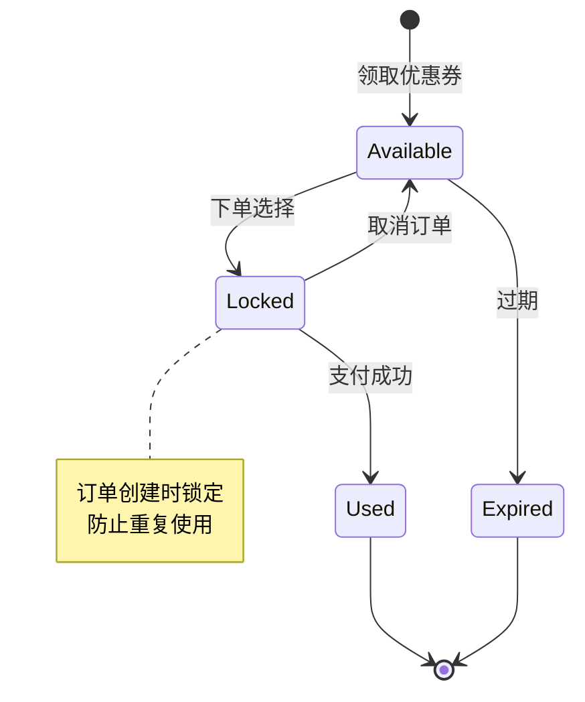
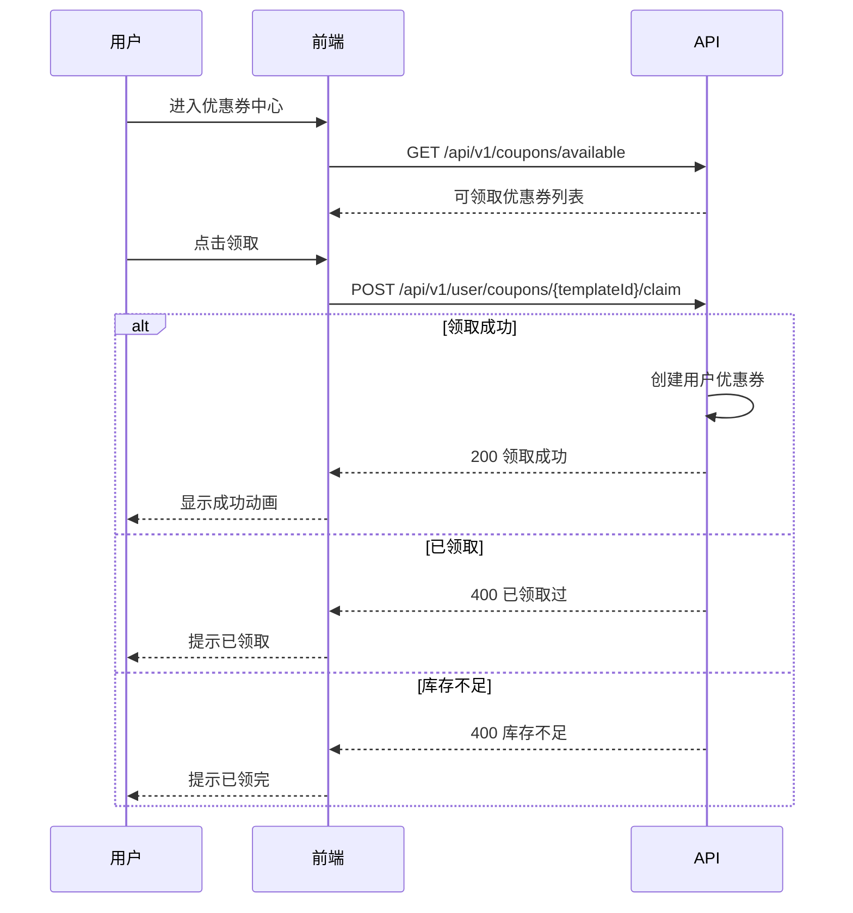
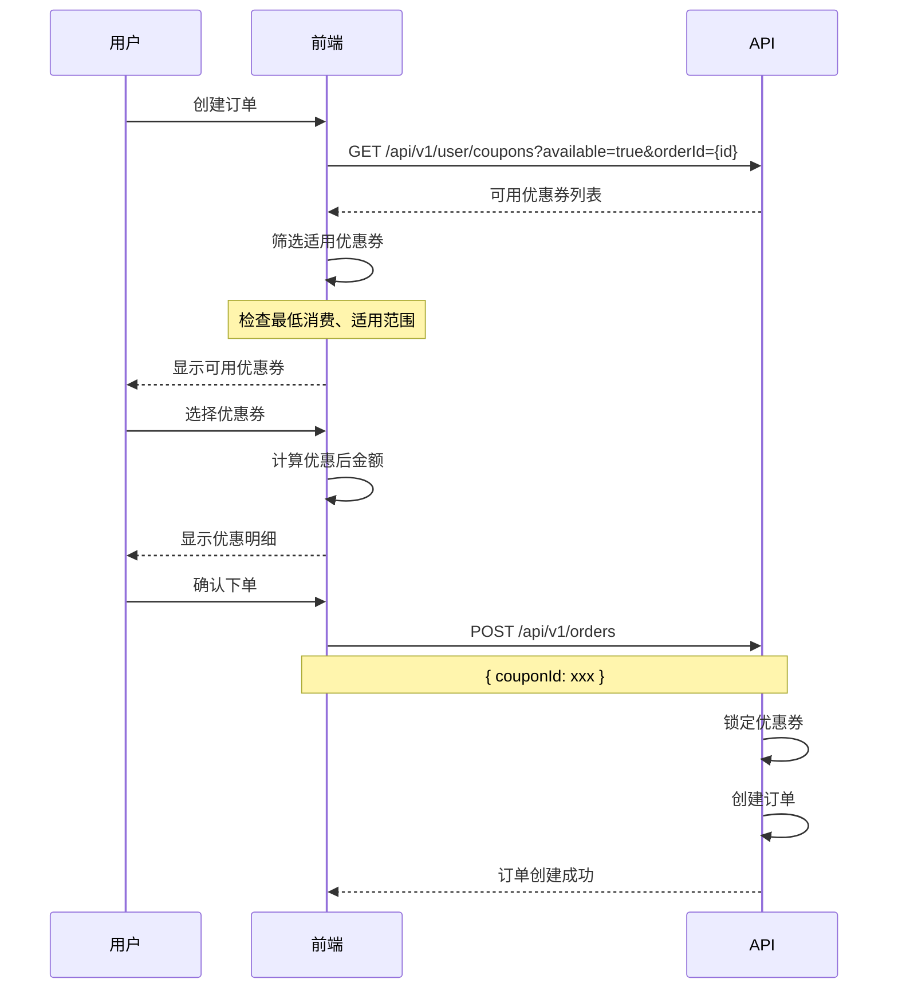
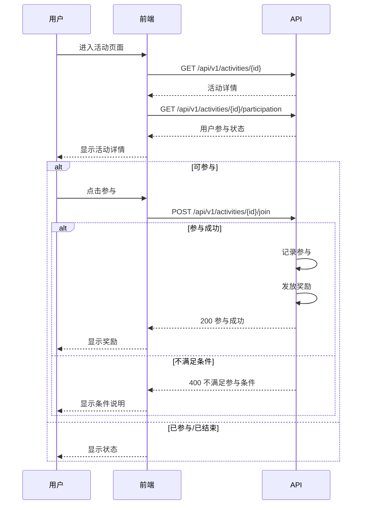
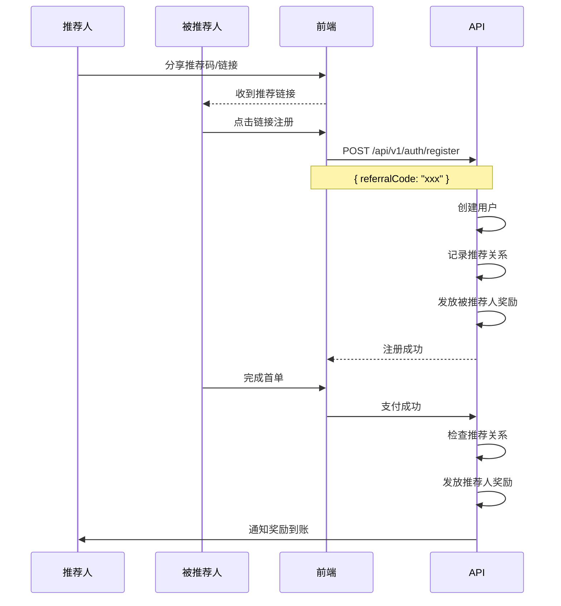

# VIP 与营销业务流程指南

> **前端开发参考文档** - VIP 系统、优惠券、活动、推荐有礼

---

## 目录

1. [VIP 系统概览](#1-vip-系统概览)
2. [VIP 等级与权益](#2-vip-等级与权益)
3. [优惠券系统](#3-优惠券系统)
4. [活动系统](#4-活动系统)
5. [推荐有礼](#5-推荐有礼)
6. [前端状态管理](#6-前端状态管理)
7. [API 接口映射](#7-api-接口映射)

---

## 1. VIP 系统概览

### 1.1 VIP 状态枚举

```typescript
// VIP 等级
enum VipLevel {
  None = 0,           // 非 VIP
  Bronze = 1,         // 青铜 VIP
  Silver = 2,         // 白银 VIP
  Gold = 3,           // 黄金 VIP
  Platinum = 4,       // 铂金 VIP
  Diamond = 5         // 钻石 VIP
}

// VIP 状态
enum VipStatus {
  Active = 'active',       // 有效
  Expired = 'expired',     // 已过期
  Suspended = 'suspended'  // 已暂停
}
```

### 1.2 VIP 数据模型

```typescript
interface UserVip {
  userId: number;
  level: VipLevel;
  status: VipStatus;

  // 累计消费
  totalSpentCents: number;
  currentYearSpentCents: number;

  // 有效期
  activatedAt?: string;
  expiresAt?: string;

  // 权益使用
  monthlyFreeCoupons: number;      // 本月免费优惠券数
  usedFreeCoupons: number;         // 已使用数
  discountRate: number;            // 折扣率 (如 0.95 = 95折)

  // 升级进度
  nextLevel?: VipLevel;
  nextLevelThreshold?: number;     // 下一等级门槛
  progressPercent: number;         // 升级进度百分比
}

interface VipLevelConfig {
  level: VipLevel;
  name: string;
  icon: string;
  color: string;

  // 解锁条件
  thresholdCents: number;          // 累计消费门槛

  // 权益
  discountRate: number;            // 订单折扣
  monthlyFreeCoupons: number;      // 每月免费优惠券
  prioritySupport: boolean;        // 优先客服
  exclusiveActivities: boolean;    // 专属活动
}
```

### 1.3 VIP 等级配置

| 等级 | 名称 | 累计消费门槛 | 订单折扣 | 月度优惠券 |
|-----|------|------------|---------|-----------|
| 0 | 普通用户 | - | 无 | 0 |
| 1 | 青铜 VIP | ¥500 | 98折 | 1张 |
| 2 | 白银 VIP | ¥2,000 | 95折 | 2张 |
| 3 | 黄金 VIP | ¥5,000 | 92折 | 3张 |
| 4 | 铂金 VIP | ¥10,000 | 90折 | 5张 |
| 5 | 钻石 VIP | ¥30,000 | 88折 | 8张 |

---

## 2. VIP 等级与权益

### 2.1 VIP 升级流程



### 2.2 VIP 中心页面数据

```typescript
// VIP 中心页面
interface VipCenterData {
  // 当前状态
  currentVip: UserVip;

  // 等级配置
  levels: VipLevelConfig[];

  // 权益列表
  benefits: VipBenefit[];

  // 可领取优惠券
  availableCoupons: CouponTemplate[];
}

interface VipBenefit {
  id: string;
  name: string;
  description: string;
  icon: string;
  unlockLevel: VipLevel;
  isUnlocked: boolean;
}
```

### 2.3 VIP 折扣计算

```typescript
// 计算 VIP 折扣
function calculateVipDiscount(
  originalPrice: number,
  vipLevel: VipLevel,
  levelConfigs: VipLevelConfig[]
): DiscountResult {
  const config = levelConfigs.find(c => c.level === vipLevel);

  if (!config || config.discountRate >= 1) {
    return {
      originalPrice,
      discountRate: 1,
      discountAmount: 0,
      finalPrice: originalPrice
    };
  }

  const discountAmount = Math.floor(originalPrice * (1 - config.discountRate));
  const finalPrice = originalPrice - discountAmount;

  return {
    originalPrice,
    discountRate: config.discountRate,
    discountAmount,
    finalPrice
  };
}

interface DiscountResult {
  originalPrice: number;
  discountRate: number;
  discountAmount: number;
  finalPrice: number;
}
```

---

## 3. 优惠券系统

### 3.1 优惠券状态枚举

```typescript
// 优惠券类型
enum CouponType {
  Discount = 'discount',       // 折扣券
  Amount = 'amount',           // 满减券
  Free = 'free'                // 免单券
}

// 优惠券状态
enum CouponStatus {
  Available = 'available',     // 可用
  Locked = 'locked',           // 已锁定 (下单中)
  Used = 'used',               // 已使用
  Expired = 'expired'          // 已过期
}
```

### 3.2 优惠券数据模型

```typescript
// 优惠券模板
interface CouponTemplate {
  id: number;
  name: string;
  type: CouponType;

  // 优惠规则
  discountRate?: number;       // 折扣率 (折扣券)
  amountCents?: number;        // 优惠金额 (满减券)
  minOrderCents: number;       // 最低订单金额

  // 使用限制
  applicableGames?: number[];  // 适用游戏
  applicablePlayers?: number[]; // 适用陪玩师

  // 有效期
  validDays: number;           // 领取后有效天数
  startAt?: string;
  endAt?: string;

  // 库存
  totalCount: number;
  remainingCount: number;
}

// 用户优惠券
interface Coupon {
  id: number;
  templateId: number;
  userId: number;

  // 优惠信息 (从模板复制)
  name: string;
  type: CouponType;
  discountRate?: number;
  amountCents?: number;
  minOrderCents: number;

  // 状态
  status: CouponStatus;
  lockedOrderId?: number;
  usedOrderId?: number;

  // 有效期
  validFrom: string;
  validUntil: string;

  createdAt: string;
}
```

### 3.3 优惠券生命周期



### 3.4 优惠券领取流程



### 3.5 优惠券使用流程



### 3.6 优惠券计算

```typescript
// 计算优惠券抵扣
function calculateCouponDiscount(
  orderAmount: number,
  coupon: Coupon
): CouponDiscountResult {
  // 检查最低消费
  if (orderAmount < coupon.minOrderCents) {
    return {
      applicable: false,
      reason: `订单金额需满 ¥${coupon.minOrderCents / 100}`,
      discountAmount: 0,
      finalAmount: orderAmount
    };
  }

  let discountAmount = 0;

  switch (coupon.type) {
    case CouponType.Discount:
      discountAmount = Math.floor(orderAmount * (1 - coupon.discountRate!));
      break;
    case CouponType.Amount:
      discountAmount = Math.min(coupon.amountCents!, orderAmount);
      break;
    case CouponType.Free:
      discountAmount = orderAmount;
      break;
  }

  return {
    applicable: true,
    discountAmount,
    finalAmount: orderAmount - discountAmount
  };
}

interface CouponDiscountResult {
  applicable: boolean;
  reason?: string;
  discountAmount: number;
  finalAmount: number;
}
```

---

## 4. 活动系统

### 4.1 活动状态枚举

```typescript
// 活动类型
enum ActivityType {
  Discount = 'discount',       // 折扣活动
  Recharge = 'recharge',       // 充值活动
  NewUser = 'new_user',        // 新用户活动
  Festival = 'festival',       // 节日活动
  Flash = 'flash'              // 限时秒杀
}

// 活动状态
enum ActivityStatus {
  Draft = 'draft',             // 草稿
  Scheduled = 'scheduled',     // 已排期
  Active = 'active',           // 进行中
  Ended = 'ended',             // 已结束
  Canceled = 'canceled'        // 已取消
}
```

### 4.2 活动数据模型

```typescript
interface Activity {
  id: number;
  name: string;
  description: string;
  type: ActivityType;
  status: ActivityStatus;

  // 展示
  bannerUrl: string;
  detailUrl?: string;

  // 时间
  startAt: string;
  endAt: string;

  // 规则
  rules: ActivityRule[];

  // 参与限制
  maxParticipants?: number;
  currentParticipants: number;
  userLimit: number;           // 每人参与次数限制

  // 奖励
  rewards: ActivityReward[];
}

interface ActivityRule {
  type: 'min_order' | 'first_order' | 'specific_game' | 'specific_player';
  value: any;
  description: string;
}

interface ActivityReward {
  type: 'coupon' | 'points' | 'discount' | 'gift';
  value: any;
  description: string;
}
```

### 4.3 活动参与流程



---

## 5. 推荐有礼

### 5.1 推荐数据模型

```typescript
interface ReferralInfo {
  userId: number;
  referralCode: string;        // 推荐码

  // 统计
  totalReferrals: number;      // 总推荐人数
  successfulReferrals: number; // 成功推荐 (完成首单)
  totalRewardsCents: number;   // 累计奖励

  // 奖励规则
  rewardPerReferral: number;   // 每成功推荐奖励
  refereeReward: number;       // 被推荐人奖励
}

interface ReferralRecord {
  id: number;
  referrerId: number;
  refereeId: number;
  refereeNickname: string;
  refereeAvatar?: string;

  // 状态
  status: ReferralStatus;
  rewardCents: number;
  rewardedAt?: string;

  createdAt: string;
}

enum ReferralStatus {
  Pending = 'pending',         // 待完成首单
  Completed = 'completed',     // 已完成
  Rewarded = 'rewarded',       // 已发放奖励
  Expired = 'expired'          // 已过期
}
```

### 5.2 推荐流程



### 5.3 推荐页面数据

```typescript
// 推荐有礼页面
interface ReferralPageData {
  // 推荐信息
  referralInfo: ReferralInfo;

  // 推荐记录
  records: ReferralRecord[];

  // 分享内容
  shareContent: {
    title: string;
    description: string;
    imageUrl: string;
    link: string;
  };

  // 规则说明
  rules: string[];
}
```

---

## 6. 前端状态管理

### 6.1 VIP Store

```typescript
import { create } from 'zustand';

interface VipState {
  // 状态
  userVip: UserVip | null;
  levelConfigs: VipLevelConfig[];
  isLoading: boolean;

  // Actions
  fetchVipStatus: () => Promise<void>;
  fetchLevelConfigs: () => Promise<void>;
  claimMonthlyCoupon: () => Promise<void>;
}

export const useVipStore = create<VipState>((set, get) => ({
  userVip: null,
  levelConfigs: [],
  isLoading: false,

  fetchVipStatus: async () => {
    set({ isLoading: true });
    try {
      const vip = await vipApi.getStatus();
      set({ userVip: vip, isLoading: false });
    } catch (error) {
      set({ isLoading: false });
      throw error;
    }
  },

  fetchLevelConfigs: async () => {
    const configs = await vipApi.getLevelConfigs();
    set({ levelConfigs: configs });
  },

  claimMonthlyCoupon: async () => {
    await vipApi.claimMonthlyCoupon();
    // 刷新状态
    get().fetchVipStatus();
  },
}));
```

### 6.2 Coupon Store

```typescript
interface CouponState {
  // 状态
  myCoupons: Coupon[];
  availableCoupons: CouponTemplate[];
  isLoading: boolean;

  // Actions
  fetchMyCoupons: (status?: CouponStatus) => Promise<void>;
  fetchAvailableCoupons: () => Promise<void>;
  claimCoupon: (templateId: number) => Promise<void>;
  getApplicableCoupons: (orderAmount: number, gameId?: number) => Coupon[];
}

export const useCouponStore = create<CouponState>((set, get) => ({
  myCoupons: [],
  availableCoupons: [],
  isLoading: false,

  fetchMyCoupons: async (status) => {
    set({ isLoading: true });
    try {
      const coupons = await couponApi.getMyCoupons({ status });
      set({ myCoupons: coupons, isLoading: false });
    } catch (error) {
      set({ isLoading: false });
      throw error;
    }
  },

  fetchAvailableCoupons: async () => {
    const coupons = await couponApi.getAvailable();
    set({ availableCoupons: coupons });
  },

  claimCoupon: async (templateId) => {
    await couponApi.claim(templateId);
    // 刷新列表
    get().fetchMyCoupons();
    get().fetchAvailableCoupons();
  },

  getApplicableCoupons: (orderAmount, gameId) => {
    const { myCoupons } = get();
    return myCoupons.filter(coupon => {
      if (coupon.status !== CouponStatus.Available) return false;
      if (orderAmount < coupon.minOrderCents) return false;
      if (coupon.applicableGames?.length && gameId) {
        if (!coupon.applicableGames.includes(gameId)) return false;
      }
      return true;
    });
  },
}));
```

### 6.3 Activity Store

```typescript
interface ActivityState {
  activities: Activity[];
  currentActivity: Activity | null;
  isLoading: boolean;

  fetchActivities: (type?: ActivityType) => Promise<void>;
  fetchActivityDetail: (id: number) => Promise<void>;
  joinActivity: (id: number) => Promise<void>;
}

export const useActivityStore = create<ActivityState>((set) => ({
  activities: [],
  currentActivity: null,
  isLoading: false,

  fetchActivities: async (type) => {
    set({ isLoading: true });
    try {
      const activities = await activityApi.list({ type, status: 'active' });
      set({ activities, isLoading: false });
    } catch (error) {
      set({ isLoading: false });
      throw error;
    }
  },

  fetchActivityDetail: async (id) => {
    const activity = await activityApi.getDetail(id);
    set({ currentActivity: activity });
  },

  joinActivity: async (id) => {
    await activityApi.join(id);
  },
}));
```

---

## 7. API 接口映射

### 7.1 VIP 接口

| 接口 | 方法 | 路径 | 说明 |
|-----|------|------|------|
| VIP 状态 | GET | `/api/v1/user/vip/status` | 获取 VIP 状态 |
| 等级配置 | GET | `/api/v1/vip/levels` | 获取等级配置 |
| 升级门槛 | GET | `/api/v1/user/vip/threshold` | 升级进度 |
| 领取月度券 | POST | `/api/v1/user/vip/monthly-coupon` | 领取月度优惠券 |

### 7.2 优惠券接口

| 接口 | 方法 | 路径 | 说明 |
|-----|------|------|------|
| 我的优惠券 | GET | `/api/v1/user/coupons` | 用户优惠券列表 |
| 可领取券 | GET | `/api/v1/coupons/available` | 可领取优惠券 |
| 领取优惠券 | POST | `/api/v1/user/coupons/{id}/claim` | 领取优惠券 |
| 优惠券详情 | GET | `/api/v1/user/coupons/{id}` | 优惠券详情 |
| 优惠券数量 | GET | `/api/v1/user/coupons/count` | 各状态数量 |

### 7.3 活动接口

| 接口 | 方法 | 路径 | 说明 |
|-----|------|------|------|
| 活动列表 | GET | `/api/v1/activities` | 活动列表 |
| 活动详情 | GET | `/api/v1/activities/{id}` | 活动详情 |
| 参与活动 | POST | `/api/v1/activities/{id}/join` | 参与活动 |
| 参与状态 | GET | `/api/v1/activities/{id}/participation` | 用户参与状态 |

### 7.4 推荐接口

| 接口 | 方法 | 路径 | 说明 |
|-----|------|------|------|
| 推荐信息 | GET | `/api/v1/user/referral` | 获取推荐码 |
| 推荐记录 | GET | `/api/v1/user/referral/records` | 推荐记录 |
| 奖励记录 | GET | `/api/v1/user/referral/rewards` | 奖励记录 |

---

## 错误码参考

| 错误码 | HTTP 状态 | 说明 | 前端处理 |
|-------|----------|------|---------|
| `VIP_NOT_ELIGIBLE` | 400 | 不满足 VIP 条件 | 显示升级条件 |
| `COUPON_ALREADY_CLAIMED` | 400 | 已领取过 | 提示已领取 |
| `COUPON_OUT_OF_STOCK` | 400 | 库存不足 | 提示已领完 |
| `COUPON_EXPIRED` | 400 | 优惠券已过期 | 移除选择 |
| `COUPON_NOT_APPLICABLE` | 400 | 不满足使用条件 | 显示条件 |
| `ACTIVITY_NOT_FOUND` | 404 | 活动不存在 | 返回列表 |
| `ACTIVITY_ENDED` | 400 | 活动已结束 | 显示已结束 |
| `ACTIVITY_LIMIT_REACHED` | 400 | 参与次数已满 | 显示限制 |
| `REFERRAL_CODE_INVALID` | 400 | 推荐码无效 | 提示检查 |
| `REFERRAL_SELF_NOT_ALLOWED` | 400 | 不能推荐自己 | 提示错误 |

---

**文档版本**: 1.0.0
**创建日期**: 2026-01-15
**适用范围**: Web PWA / 小程序
