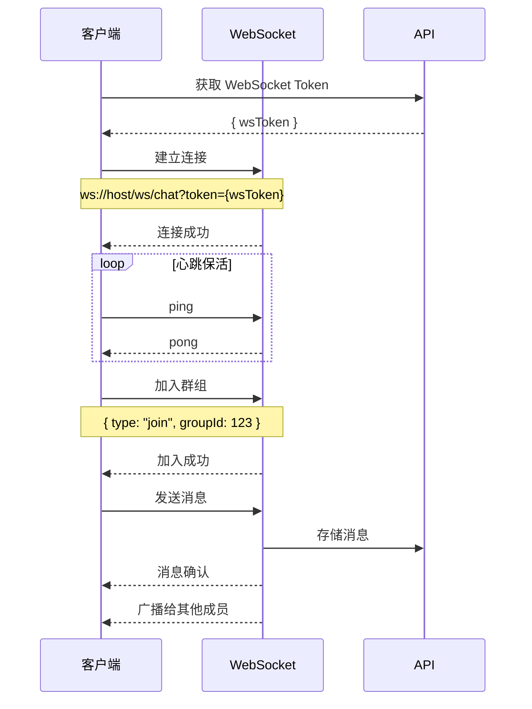
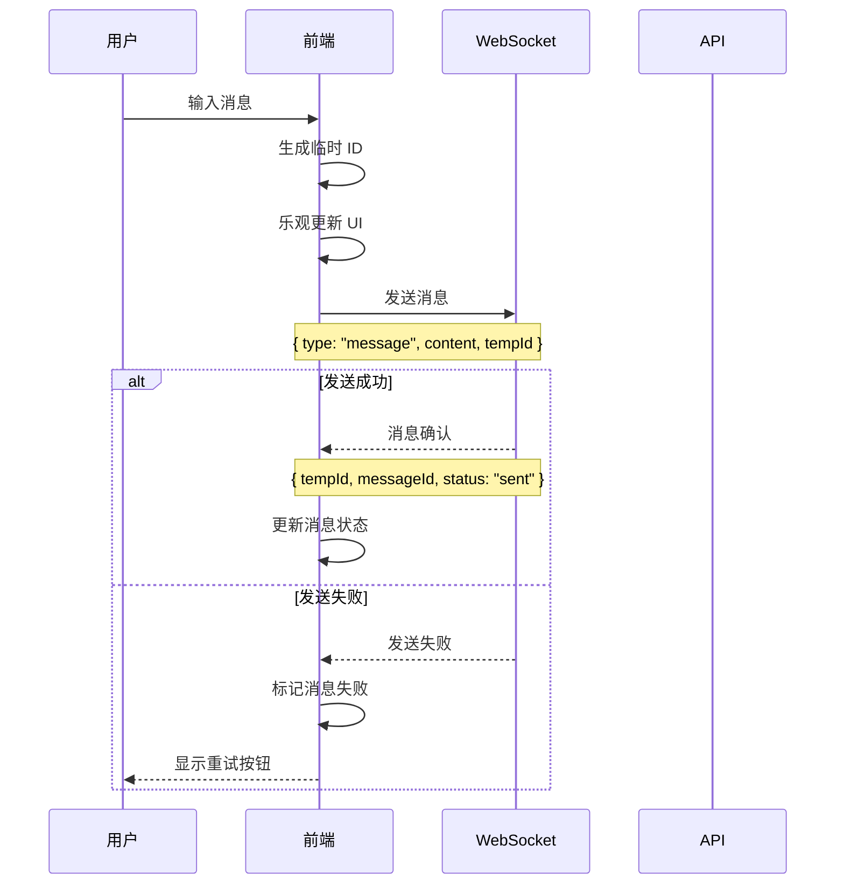
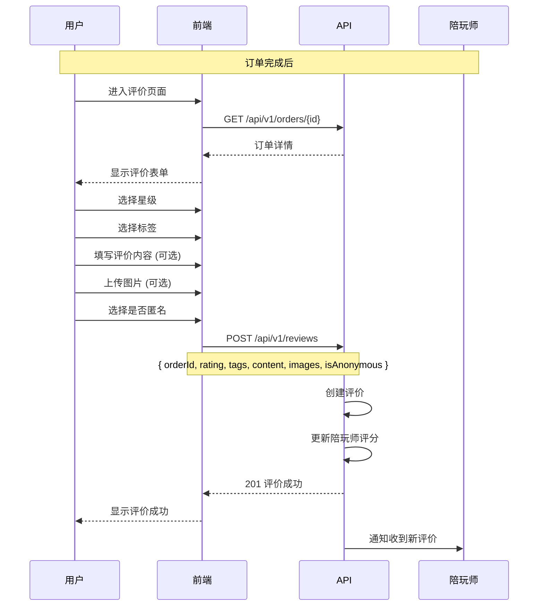
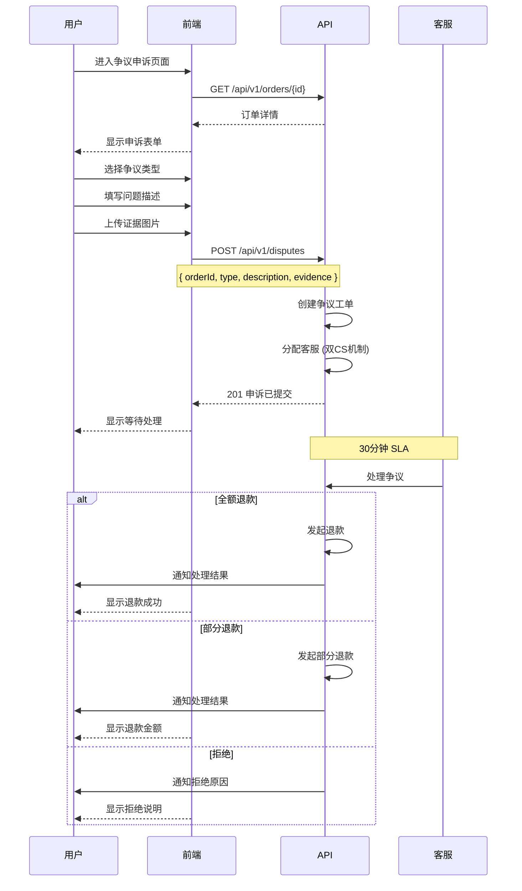
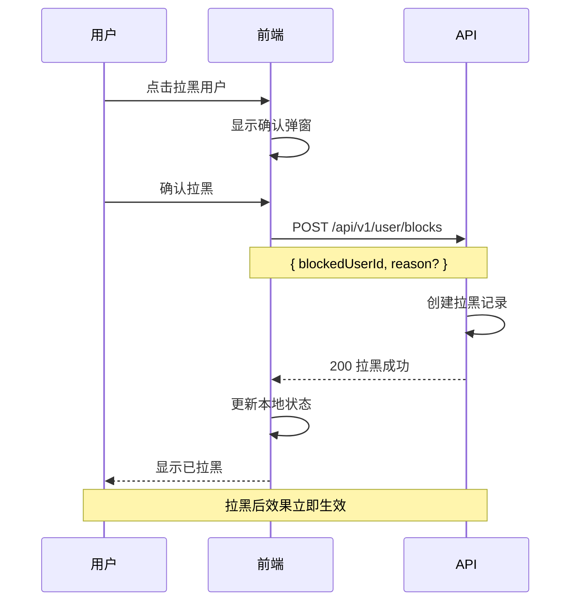

# 聊天、评价与争议业务流程指南

> **前端开发参考文档** - 实时聊天、订单评价、争议处理、通知系统

---

## 目录

1. [聊天系统概览](#1-聊天系统概览)
2. [实时聊天流程](#2-实时聊天流程)
3. [评价系统](#3-评价系统)
4. [争议处理](#4-争议处理)
5. [通知系统](#5-通知系统)
6. [用户拉黑](#6-用户拉黑)
7. [前端状态管理](#7-前端状态管理)
8. [API 接口映射](#8-api-接口映射)

---

## 1. 聊天系统概览

### 1.1 聊天状态枚举

```typescript
// 消息类型
enum MessageType {
  Text = 'text',               // 文本消息
  Image = 'image',             // 图片消息
  Voice = 'voice',             // 语音消息
  System = 'system',           // 系统消息
  Order = 'order'              // 订单卡片
}

// 消息状态
enum MessageStatus {
  Sending = 'sending',         // 发送中
  Sent = 'sent',               // 已发送
  Delivered = 'delivered',     // 已送达
  Read = 'read',               // 已读
  Failed = 'failed'            // 发送失败
}

// 群组类型
enum ChatGroupType {
  Order = 'order',             // 订单聊天
  Private = 'private',         // 私聊
  Support = 'support'          // 客服
}
```

### 1.2 聊天数据模型

```typescript
// 聊天群组
interface ChatGroup {
  id: number;
  type: ChatGroupType;
  orderId?: number;

  // 成员
  members: ChatMember[];

  // 最后消息
  lastMessage?: Message;
  lastMessageAt?: string;

  // 未读
  unreadCount: number;

  // 状态
  isActive: boolean;
  createdAt: string;
}

interface ChatMember {
  userId: number;
  nickname: string;
  avatar?: string;
  role: 'user' | 'player' | 'support';
  isOnline: boolean;
  lastReadAt?: string;
}

// 消息
interface Message {
  id: number;
  groupId: number;
  senderId: number;
  senderName: string;
  senderAvatar?: string;

  // 内容
  type: MessageType;
  content: string;
  mediaUrl?: string;

  // 回复
  replyToId?: number;
  replyToContent?: string;

  // 状态
  status: MessageStatus;
  readBy: number[];

  createdAt: string;
}
```

---

## 2. 实时聊天流程

### 2.1 WebSocket 连接流程



### 2.2 消息发送流程



### 2.3 WebSocket 消息协议

```typescript
// 客户端发送的消息
interface WsClientMessage {
  type: 'join' | 'leave' | 'message' | 'typing' | 'read' | 'ping';
  groupId?: number;
  content?: string;
  mediaUrl?: string;
  messageType?: MessageType;
  replyToId?: number;
  tempId?: string;
  messageIds?: number[];
}

// 服务端推送的消息
interface WsServerMessage {
  type: 'message' | 'typing' | 'read' | 'online' | 'offline' | 'error' | 'pong';
  groupId?: number;
  message?: Message;
  userId?: number;
  messageIds?: number[];
  error?: string;
  tempId?: string;
}
```

### 2.4 WebSocket 管理类

```typescript
class ChatWebSocket {
  private ws: WebSocket | null = null;
  private reconnectAttempts = 0;
  private maxReconnectAttempts = 5;
  private heartbeatInterval: number | null = null;

  // 事件回调
  onMessage?: (message: WsServerMessage) => void;
  onConnect?: () => void;
  onDisconnect?: () => void;

  async connect(token: string) {
    const wsUrl = `${WS_BASE_URL}/ws/chat?token=${token}`;
    this.ws = new WebSocket(wsUrl);

    this.ws.onopen = () => {
      this.reconnectAttempts = 0;
      this.startHeartbeat();
      this.onConnect?.();
    };

    this.ws.onmessage = (event) => {
      const data = JSON.parse(event.data) as WsServerMessage;
      this.onMessage?.(data);
    };

    this.ws.onclose = () => {
      this.stopHeartbeat();
      this.onDisconnect?.();
      this.attemptReconnect(token);
    };

    this.ws.onerror = (error) => {
      console.error('WebSocket error:', error);
    };
  }

  private startHeartbeat() {
    this.heartbeatInterval = window.setInterval(() => {
      this.send({ type: 'ping' });
    }, 30000);
  }

  private stopHeartbeat() {
    if (this.heartbeatInterval) {
      clearInterval(this.heartbeatInterval);
      this.heartbeatInterval = null;
    }
  }

  private attemptReconnect(token: string) {
    if (this.reconnectAttempts < this.maxReconnectAttempts) {
      this.reconnectAttempts++;
      const delay = Math.min(1000 * Math.pow(2, this.reconnectAttempts), 30000);
      setTimeout(() => this.connect(token), delay);
    }
  }

  send(message: WsClientMessage) {
    if (this.ws?.readyState === WebSocket.OPEN) {
      this.ws.send(JSON.stringify(message));
    }
  }

  joinGroup(groupId: number) {
    this.send({ type: 'join', groupId });
  }

  leaveGroup(groupId: number) {
    this.send({ type: 'leave', groupId });
  }

  sendMessage(groupId: number, content: string, options?: {
    type?: MessageType;
    mediaUrl?: string;
    replyToId?: number;
    tempId?: string;
  }) {
    this.send({
      type: 'message',
      groupId,
      content,
      messageType: options?.type || MessageType.Text,
      mediaUrl: options?.mediaUrl,
      replyToId: options?.replyToId,
      tempId: options?.tempId
    });
  }

  markRead(groupId: number, messageIds: number[]) {
    this.send({ type: 'read', groupId, messageIds });
  }

  sendTyping(groupId: number) {
    this.send({ type: 'typing', groupId });
  }

  disconnect() {
    this.stopHeartbeat();
    this.ws?.close();
    this.ws = null;
  }
}
```

---

## 3. 评价系统

### 3.1 评价状态枚举

```typescript
// 评价状态
enum ReviewStatus {
  Pending = 'pending',         // 待评价
  Completed = 'completed',     // 已评价
  Expired = 'expired'          // 已过期
}
```

### 3.2 评价数据模型

```typescript
interface Review {
  id: number;
  orderId: number;
  userId: number;
  playerId: number;

  // 评分
  rating: number;              // 1-5 星
  tags: string[];              // 评价标签

  // 内容
  content?: string;
  images?: string[];

  // 选项
  isAnonymous: boolean;

  // 回复
  reply?: string;
  repliedAt?: string;

  createdAt: string;
}

// 评价标签
const REVIEW_TAGS = {
  positive: [
    '技术精湛',
    '态度友好',
    '声音好听',
    '准时守约',
    '耐心指导',
    '配合默契'
  ],
  negative: [
    '技术一般',
    '态度冷淡',
    '迟到早退',
    '沟通困难'
  ]
};
```

### 3.3 评价流程



### 3.4 评价请求/响应

```typescript
// 创建评价请求
interface CreateReviewRequest {
  orderId: number;
  rating: number;              // 1-5
  tags: string[];
  content?: string;
  images?: string[];
  isAnonymous: boolean;
}

// 评价列表请求
interface ReviewListRequest {
  playerId?: number;
  minRating?: number;
  page: number;
  pageSize: number;
}

// 评价统计
interface ReviewStats {
  totalCount: number;
  averageRating: number;
  ratingDistribution: {
    [key: number]: number;     // 1-5 星各多少
  };
  topTags: Array<{
    tag: string;
    count: number;
  }>;
}
```

---

## 4. 争议处理

### 4.1 争议状态枚举

```typescript
// 争议状态
enum DisputeStatus {
  Pending = 'pending',         // 待处理
  Processing = 'processing',   // 处理中
  Resolved = 'resolved',       // 已解决
  Rejected = 'rejected',       // 已拒绝
  Closed = 'closed'            // 已关闭
}

// 争议类型
enum DisputeType {
  ServiceQuality = 'service_quality',   // 服务质量
  Attitude = 'attitude',                // 态度问题
  NoShow = 'no_show',                   // 未提供服务
  Overcharge = 'overcharge',            // 多收费
  Other = 'other'                       // 其他
}

// 争议结果
enum DisputeResult {
  FullRefund = 'full_refund',           // 全额退款
  PartialRefund = 'partial_refund',     // 部分退款
  NoRefund = 'no_refund',               // 不退款
  Compensation = 'compensation'          // 补偿
}
```

### 4.2 争议数据模型

```typescript
interface Dispute {
  id: number;
  disputeNo: string;
  orderId: number;
  orderNo: string;

  // 发起方
  initiatorId: number;
  initiatorRole: 'user' | 'player';

  // 争议信息
  type: DisputeType;
  description: string;
  evidence: string[];          // 证据图片

  // 处理
  status: DisputeStatus;
  assignedCsId?: number;       // 分配的客服
  result?: DisputeResult;
  resolution?: string;         // 处理说明
  refundAmountCents?: number;

  // 时间
  createdAt: string;
  processedAt?: string;
  resolvedAt?: string;

  // SLA
  slaDeadline: string;         // 30分钟响应
  isOverdue: boolean;
}
```

### 4.3 争议处理流程



### 4.4 争议请求/响应

```typescript
// 创建争议请求
interface CreateDisputeRequest {
  orderId: number;
  type: DisputeType;
  description: string;
  evidence: string[];          // 证据图片 URL
}

// 争议详情响应
interface DisputeDetailResponse {
  dispute: Dispute;
  order: OrderSummary;
  timeline: DisputeEvent[];
}

interface DisputeEvent {
  type: 'created' | 'assigned' | 'processing' | 'resolved' | 'rejected';
  description: string;
  operatorName?: string;
  createdAt: string;
}
```

---

## 5. 通知系统

### 5.1 通知类型枚举

```typescript
// 通知类型
enum NotificationType {
  Order = 'order',             // 订单通知
  Chat = 'chat',               // 聊天通知
  System = 'system',           // 系统通知
  Marketing = 'marketing',     // 营销通知
  Dispute = 'dispute'          // 争议通知
}

// 通知优先级
enum NotificationPriority {
  Low = 'low',
  Normal = 'normal',
  High = 'high',
  Urgent = 'urgent'
}

// 通知渠道
enum NotificationChannel {
  InApp = 'in_app',            // 站内通知
  Push = 'push',               // 推送通知
  SMS = 'sms',                 // 短信
  WeChat = 'wechat',           // 微信模板消息
  Email = 'email'              // 邮件
}
```

### 5.2 通知数据模型

```typescript
interface Notification {
  id: number;
  userId: number;

  // 内容
  type: NotificationType;
  title: string;
  content: string;
  priority: NotificationPriority;

  // 关联
  referenceType?: string;      // order, dispute, etc.
  referenceId?: number;

  // 状态
  isRead: boolean;
  readAt?: string;

  createdAt: string;
}

// 通知设置
interface NotificationSettings {
  // 各类型通知开关
  orderNotification: boolean;
  chatNotification: boolean;
  systemNotification: boolean;
  marketingNotification: boolean;

  // 渠道设置
  pushEnabled: boolean;
  smsEnabled: boolean;
  emailEnabled: boolean;

  // 免打扰
  doNotDisturb: boolean;
  doNotDisturbStart?: string;  // "22:00"
  doNotDisturbEnd?: string;    // "08:00"
}
```

### 5.3 通知列表与操作

```typescript
// 通知列表请求
interface NotificationListRequest {
  type?: NotificationType;
  unreadOnly?: boolean;
  page: number;
  pageSize: number;
}

// 通知列表响应
interface NotificationListResponse {
  items: Notification[];
  total: number;
  unreadCount: number;
}

// 标记已读
interface MarkReadRequest {
  ids: number[];               // 空数组表示全部已读
}
```

---

## 6. 用户拉黑

### 6.1 拉黑数据模型

```typescript
interface BlockedUser {
  id: number;
  userId: number;              // 拉黑者
  blockedUserId: number;       // 被拉黑者

  blockedUser: {
    id: number;
    nickname: string;
    avatar?: string;
  };

  reason?: string;
  createdAt: string;
}
```

### 6.2 拉黑效果

```typescript
// 拉黑后的影响
const BLOCK_EFFECTS = {
  // 聊天
  cannotSendMessage: true,     // 无法发送消息
  cannotReceiveMessage: true,  // 无法接收消息

  // 列表
  hiddenFromList: true,        // 从列表中隐藏
  hiddenFromSearch: true,      // 从搜索中隐藏

  // 订单
  cannotPlaceOrder: true,      // 无法下单给被拉黑的陪玩师
  existingOrdersContinue: true // 进行中的订单继续
};
```

### 6.3 拉黑流程



---

## 7. 前端状态管理

### 7.1 Chat Store

```typescript
import { create } from 'zustand';

interface ChatState {
  // 状态
  groups: ChatGroup[];
  currentGroup: ChatGroup | null;
  messages: Map<number, Message[]>;
  isConnected: boolean;

  // WebSocket
  ws: ChatWebSocket | null;

  // Actions
  connect: () => Promise<void>;
  disconnect: () => void;
  fetchGroups: () => Promise<void>;
  selectGroup: (groupId: number) => Promise<void>;
  sendMessage: (content: string, options?: SendMessageOptions) => void;
  markAsRead: (messageIds: number[]) => void;

  // 内部方法
  handleWsMessage: (message: WsServerMessage) => void;
}

export const useChatStore = create<ChatState>((set, get) => ({
  groups: [],
  currentGroup: null,
  messages: new Map(),
  isConnected: false,
  ws: null,

  connect: async () => {
    const token = await chatApi.getWsToken();
    const ws = new ChatWebSocket();

    ws.onConnect = () => set({ isConnected: true });
    ws.onDisconnect = () => set({ isConnected: false });
    ws.onMessage = (msg) => get().handleWsMessage(msg);

    await ws.connect(token);
    set({ ws });
  },

  disconnect: () => {
    get().ws?.disconnect();
    set({ ws: null, isConnected: false });
  },

  fetchGroups: async () => {
    const groups = await chatApi.getGroups();
    set({ groups });
  },

  selectGroup: async (groupId) => {
    const { ws, messages } = get();

    // 加入群组
    ws?.joinGroup(groupId);

    // 获取消息历史
    if (!messages.has(groupId)) {
      const history = await chatApi.getMessages(groupId);
      set((state) => ({
        messages: new Map(state.messages).set(groupId, history)
      }));
    }

    const group = get().groups.find(g => g.id === groupId);
    set({ currentGroup: group || null });
  },

  sendMessage: (content, options) => {
    const { ws, currentGroup } = get();
    if (!ws || !currentGroup) return;

    const tempId = `temp_${Date.now()}`;
    ws.sendMessage(currentGroup.id, content, { ...options, tempId });

    // 乐观更新
    const tempMessage: Message = {
      id: 0,
      groupId: currentGroup.id,
      senderId: 0, // 当前用户
      senderName: '',
      type: options?.type || MessageType.Text,
      content,
      status: MessageStatus.Sending,
      readBy: [],
      createdAt: new Date().toISOString()
    };

    set((state) => {
      const groupMessages = state.messages.get(currentGroup.id) || [];
      return {
        messages: new Map(state.messages).set(
          currentGroup.id,
          [...groupMessages, tempMessage]
        )
      };
    });
  },

  markAsRead: (messageIds) => {
    const { ws, currentGroup } = get();
    if (!ws || !currentGroup) return;
    ws.markRead(currentGroup.id, messageIds);
  },

  handleWsMessage: (msg) => {
    switch (msg.type) {
      case 'message':
        if (msg.message) {
          set((state) => {
            const groupId = msg.message!.groupId;
            const groupMessages = state.messages.get(groupId) || [];
            return {
              messages: new Map(state.messages).set(
                groupId,
                [...groupMessages, msg.message!]
              )
            };
          });
        }
        break;
      case 'read':
        // 更新已读状态
        break;
      case 'typing':
        // 显示输入中状态
        break;
    }
  },
}));
```

### 7.2 Notification Store

```typescript
interface NotificationState {
  notifications: Notification[];
  unreadCount: number;
  settings: NotificationSettings | null;

  fetchNotifications: (params?: NotificationListRequest) => Promise<void>;
  fetchUnreadCount: () => Promise<void>;
  markAsRead: (ids: number[]) => Promise<void>;
  markAllAsRead: () => Promise<void>;
  updateSettings: (settings: Partial<NotificationSettings>) => Promise<void>;
}

export const useNotificationStore = create<NotificationState>((set, get) => ({
  notifications: [],
  unreadCount: 0,
  settings: null,

  fetchNotifications: async (params) => {
    const result = await notificationApi.list(params);
    set({
      notifications: result.items,
      unreadCount: result.unreadCount
    });
  },

  fetchUnreadCount: async () => {
    const count = await notificationApi.getUnreadCount();
    set({ unreadCount: count });
  },

  markAsRead: async (ids) => {
    await notificationApi.markRead({ ids });
    set((state) => ({
      notifications: state.notifications.map(n =>
        ids.includes(n.id) ? { ...n, isRead: true } : n
      ),
      unreadCount: Math.max(0, state.unreadCount - ids.length)
    }));
  },

  markAllAsRead: async () => {
    await notificationApi.markRead({ ids: [] });
    set((state) => ({
      notifications: state.notifications.map(n => ({ ...n, isRead: true })),
      unreadCount: 0
    }));
  },

  updateSettings: async (settings) => {
    const updated = await notificationApi.updateSettings(settings);
    set({ settings: updated });
  },
}));
```

---

## 8. API 接口映射

### 8.1 聊天接口

| 接口 | 方法 | 路径 | 说明 |
|-----|------|------|------|
| 获取 WS Token | GET | `/api/v1/chat/ws-token` | WebSocket 连接令牌 |
| 群组列表 | GET | `/api/v1/chat/groups` | 聊天群组列表 |
| 群组详情 | GET | `/api/v1/chat/groups/{id}` | 群组详情 |
| 消息历史 | GET | `/api/v1/chat/groups/{id}/messages` | 历史消息 |
| 发送消息 | POST | `/api/v1/chat/groups/{id}/messages` | HTTP 发送消息 |
| 举报消息 | POST | `/api/v1/chat/messages/{id}/report` | 举报消息 |

### 8.2 评价接口

| 接口 | 方法 | 路径 | 说明 |
|-----|------|------|------|
| 创建评价 | POST | `/api/v1/reviews` | 提交评价 |
| 评价列表 | GET | `/api/v1/players/{id}/reviews` | 陪玩师评价 |
| 评价统计 | GET | `/api/v1/players/{id}/reviews/stats` | 评价统计 |
| 回复评价 | POST | `/api/v1/reviews/{id}/reply` | 陪玩师回复 |

### 8.3 争议接口

| 接口 | 方法 | 路径 | 说明 |
|-----|------|------|------|
| 创建争议 | POST | `/api/v1/disputes` | 提交争议 |
| 争议详情 | GET | `/api/v1/disputes/{id}` | 争议详情 |
| 争议列表 | GET | `/api/v1/user/disputes` | 我的争议 |
| 补充证据 | POST | `/api/v1/disputes/{id}/evidence` | 补充证据 |

### 8.4 通知接口

| 接口 | 方法 | 路径 | 说明 |
|-----|------|------|------|
| 通知列表 | GET | `/api/v1/notifications` | 通知列表 |
| 未读数量 | GET | `/api/v1/notifications/unread-count` | 未读数量 |
| 标记已读 | PUT | `/api/v1/notifications/read` | 标记已读 |
| 通知设置 | GET | `/api/v1/user/notification-settings` | 获取设置 |
| 更新设置 | PUT | `/api/v1/user/notification-settings` | 更新设置 |

### 8.5 拉黑接口

| 接口 | 方法 | 路径 | 说明 |
|-----|------|------|------|
| 拉黑列表 | GET | `/api/v1/user/blocks` | 拉黑列表 |
| 拉黑用户 | POST | `/api/v1/user/blocks` | 拉黑用户 |
| 取消拉黑 | DELETE | `/api/v1/user/blocks/{id}` | 取消拉黑 |
| 检查拉黑 | GET | `/api/v1/user/blocks/{userId}/check` | 检查是否拉黑 |

---

## 错误码参考

| 错误码 | HTTP 状态 | 说明 | 前端处理 |
|-------|----------|------|---------|
| `CHAT_GROUP_NOT_FOUND` | 404 | 群组不存在 | 返回列表 |
| `CHAT_NOT_MEMBER` | 403 | 非群组成员 | 显示无权限 |
| `CHAT_USER_BLOCKED` | 403 | 用户已被拉黑 | 显示已拉黑 |
| `MESSAGE_TOO_LONG` | 400 | 消息过长 | 提示字数限制 |
| `REVIEW_ALREADY_EXISTS` | 400 | 已评价过 | 显示已评价 |
| `REVIEW_ORDER_NOT_COMPLETED` | 400 | 订单未完成 | 提示完成后评价 |
| `DISPUTE_ALREADY_EXISTS` | 400 | 已有争议 | 跳转争议详情 |
| `DISPUTE_ORDER_TOO_OLD` | 400 | 订单已超期 | 显示超期说明 |
| `BLOCK_SELF_NOT_ALLOWED` | 400 | 不能拉黑自己 | 提示错误 |
| `ALREADY_BLOCKED` | 400 | 已拉黑 | 显示已拉黑 |

---

**文档版本**: 1.0.0
**创建日期**: 2026-01-15
**适用范围**: Web PWA / 小程序
```
