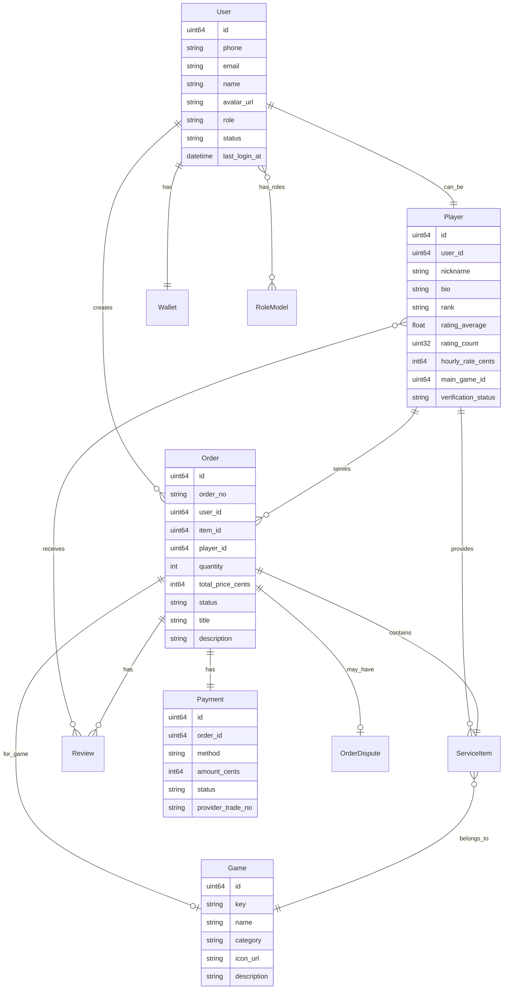
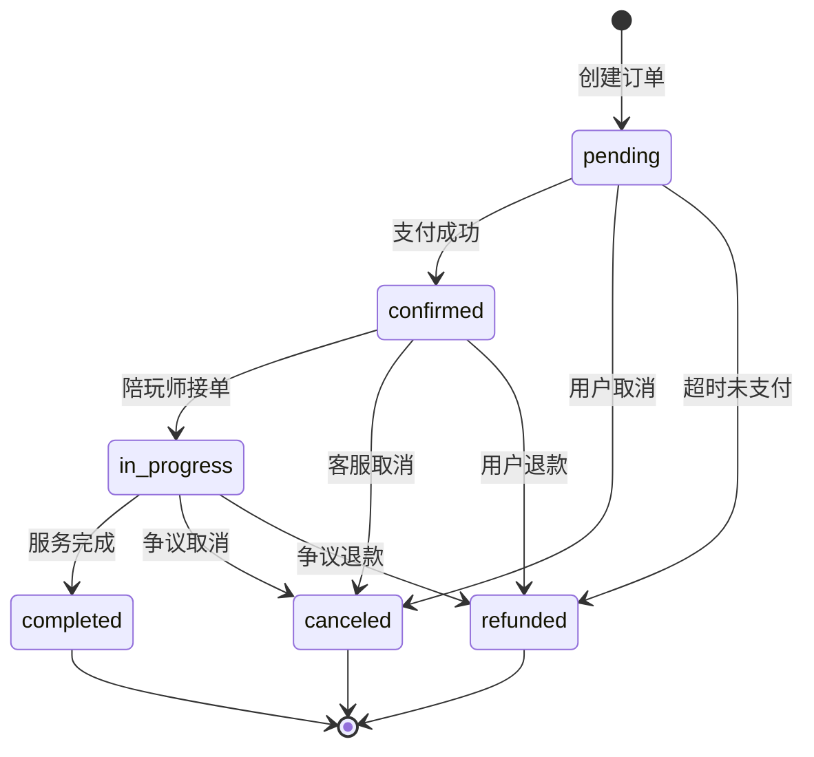
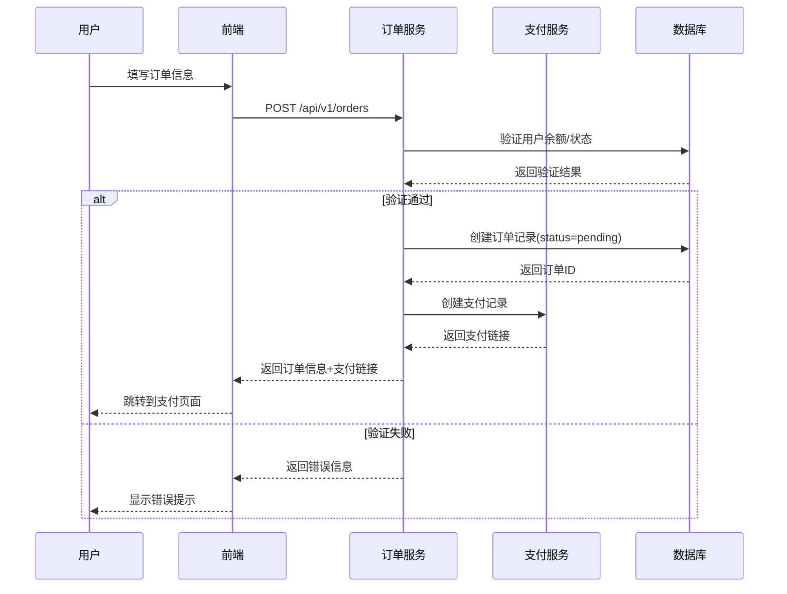
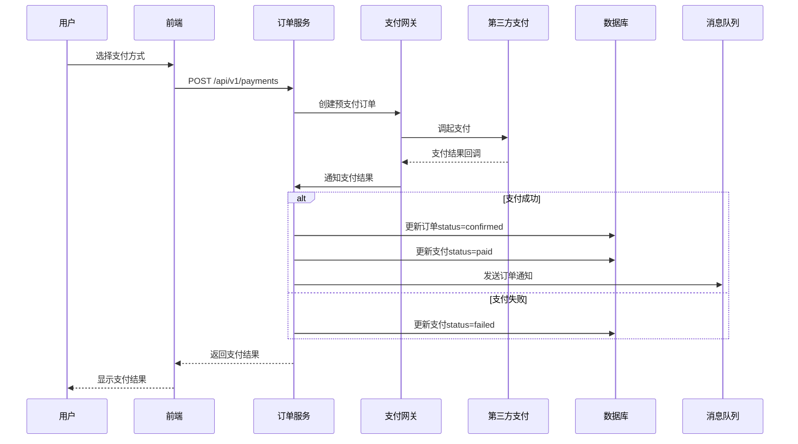
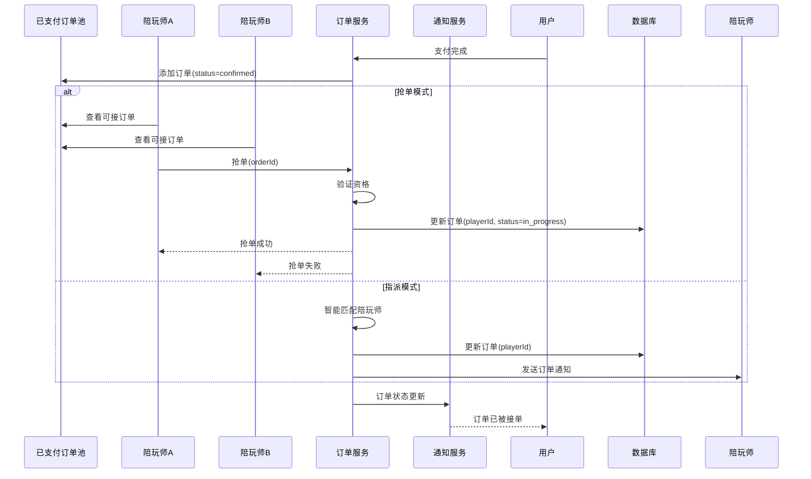
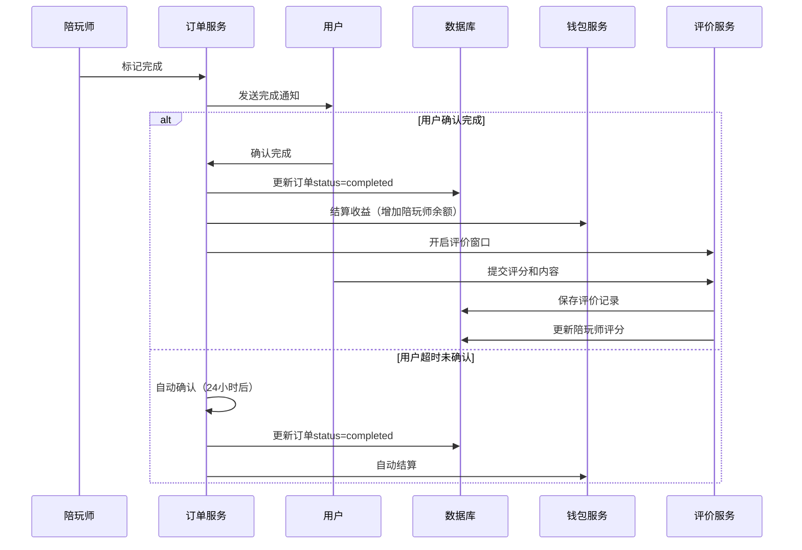
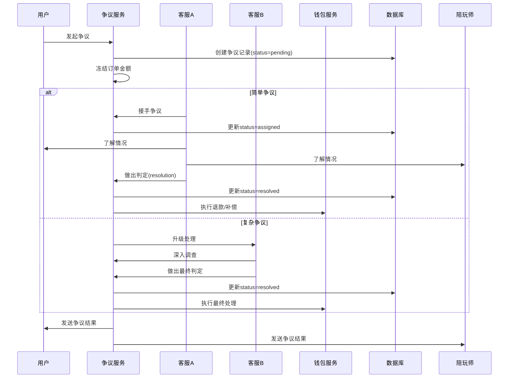
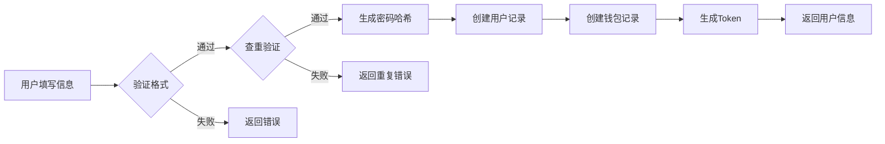
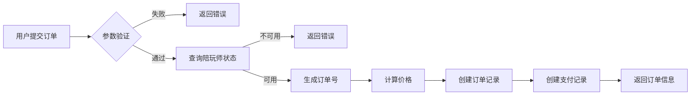
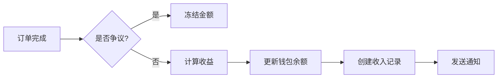

# 📊 GameLink 数据模型与业务流程文档

## 📅 文档信息

| 项目 | 内容 |
|------|------|
| **文档名称** | 数据模型与业务流程文档 |
| **版本** | v1.0 |
| **创建日期** | 2025-12-05 |
| **作者** | Claude - 项目测试负责人 |
| **最后更新** | 2025-12-05 |

---

## 1. 数据模型概述

### 1.1 实体关系图



### 1.2 核心实体清单

| 实体名 | 中文名 | 核心作用 |
|--------|--------|----------|
| User | 用户 | 平台基础账户，支持多角色 |
| Player | 陪玩师 | 认证的专业游戏陪玩师信息 |
| Order | 订单 | 交易核心，记录服务详情 |
| Payment | 支付 | 支付记录和状态管理 |
| Game | 游戏 | 平台支持的游戏配置 |
| ServiceItem | 服务项目 | 标准化服务定义 |
| Review | 评价 | 双向评价体系 |
| Wallet | 钱包 | 资金管理 |
| OrderDispute | 争议 | 纠纷处理记录 |

---

## 2. 核心数据模型详解

### 2.1 用户模型 (User)

**模型文件**：`backend/internal/model/user.go`

```go
type User struct {
    Base                           // 基础字段（ID, CreatedAt, UpdatedAt, DeletedAt）
    Phone         string    `json:"phone,omitempty" gorm:"size:32;uniqueIndex"`
    Email         string    `json:"email,omitempty" gorm:"size:128;uniqueIndex"`
    PasswordHash  string    `json:"-" gorm:"column:password_hash;size:255"`
    Name          string    `json:"name" gorm:"size:64;index"` // 带索引用于搜索
    AvatarURL     string    `json:"avatarUrl,omitempty" gorm:"column:avatar_url;size:255"`
    Role          Role      `json:"role" gorm:"size:32;comment:主要角色"`
    Status        UserStatus `json:"status" gorm:"size:32;index;index:idx_status_last_login,priority:1"`
    LastLoginAt   *time.Time `json:"lastLoginAt,omitempty" gorm:"column:last_login_at;index:idx_status_last_login,priority:2"`
    Roles         []RoleModel `json:"roles,omitempty" gorm:"many2many:user_roles;"` // 多角色支持
    Wallet        *Wallet    `json:"wallet,omitempty" gorm:"foreignKey:UserID"`
}
```

**字段说明**：

| 字段名 | 类型 | 约束 | 说明 |
|--------|------|------|------|
| id | uint64 | PK | 用户ID |
| phone | string | unique | 手机号 |
| email | string | unique | 邮箱 |
| password_hash | string | - | 密码哈希 |
| name | string | index | 用户昵称 |
| avatar_url | string | - | 头像URL |
| role | Role | - | 主要角色 |
| status | UserStatus | index | 账户状态 |
| last_login_at | *time.Time | index | 最后登录时间 |
| roles | []RoleModel | many2many | 多角色支持 |
| wallet | *Wallet | has_one | 用户钱包 |

**枚举定义**：

```go
// Role defines platform roles for access control.
type Role string

const (
    RoleUser   Role = "user"      // 普通用户 - 下单客户
    RolePlayer Role = "player"    // 陪玩师 - 服务提供者
    RoleAdmin  Role = "admin"     // 管理员 - 平台管理
)

// UserStatus indicates account state.
type UserStatus string

const (
    UserStatusActive    UserStatus = "active"      // 正常
    UserStatusSuspended UserStatus = "suspended"   // 暂停
    UserStatusBanned    UserStatus = "banned"      // 封禁
)
```

**业务规则**：
- 手机号和邮箱唯一
- role作为兼容字段，未来由Roles多角色替代
- 复合索引(idx_status_last_login)优化按状态筛选和排序

---

### 2.2 陪玩师模型 (Player)

**模型文件**：`backend/internal/model/player.go`

```go
type Player struct {
    Base                         // 基础字段
    UserID             uint64    `json:"userId" gorm:"uniqueIndex"`
    Nickname           string    `json:"nickname" gorm:"size:64;index"`
    Bio                string    `json:"bio" gorm:"size:500"`
    Rank               string    `json:"rank" gorm:"size:32"`
    RatingAverage      float32   `json:"ratingAverage" gorm:"default:0"`
    RatingCount        uint32    `json:"ratingCount" gorm:"default:0"`
    HourlyRateCents    int64     `json:"hourlyRateCents"`
    MainGameID         uint64    `json:"mainGameId"`
    VerificationStatus VerificationStatus `json:"verificationStatus"`
}
```

**字段说明**：

| 字段名 | 类型 | 约束 | 说明 |
|--------|------|------|------|
| user_id | uint64 | uniqueIndex | 关联用户ID |
| nickname | string | index | 陪玩师昵称 |
| bio | string | - | 个人简介 |
| rank | string | - | 游戏段位/等级 |
| rating_average | float32 | - | 平均评分（0-5） |
| rating_count | uint32 | - | 评价数量 |
| hourly_rate_cents | int64 | - | 时薪（分） |
| main_game_id | uint64 | - | 主玩游戏ID |
| verification_status | VerificationStatus | - | 认证状态 |

**认证状态枚举**：

```go
type VerificationStatus string

const (
    VerificationStatusPending  VerificationStatus = "pending"   // 待审核
    VerificationStatusVerified VerificationStatus = "verified"  // 已通过
    VerificationStatusRejected VerificationStatus = "rejected"  // 已拒绝
)
```

**数学公式**：
- 评分计算：`rating_average = total_rating / rating_count`
- 收入计算：`player_income = total_price × (1 - commission_rate)`

---

### 2.3 订单模型 (Order)

**模型文件**：`backend/internal/model/order.go`

```go
type Order struct {
    Base                         // 基础字段

    // 基础信息
    OrderNo           string      `json:"orderNo" gorm:"size:64;uniqueIndex"`
    UserID            uint64      `json:"userId"`
    ItemID            uint64      `json:"itemId"`
    PlayerID          *uint64     `json:"playerId"`              // 服务陪玩师
    RecipientPlayerID *uint64     `json:"recipientPlayerId"`     // 礼物接收者

    // 价格信息
    Quantity          int         `json:"quantity"`                      // 数量（小时）
    UnitPriceCents    int64       `json:"unitPriceCents"`                // 单价（分）
    TotalPriceCents   int64       `json:"totalPriceCents"`               // 总价（分）
    CommissionCents   int64       `json:"commissionCents"`               // 平台抽成（分）
    PlayerIncomeCents int64       `json:"playerIncomeCents"`             // 陪玩师收入（分）
    Currency          Currency    `json:"currency" gorm:"default:'CNY'"`

    // 订单信息
    Status      OrderStatus `json:"status" gorm:"size:32;index"`
    Title       string      `json:"title" gorm:"size:200"`
    Description string      `json:"description" gorm:"size:1000"`

    // 护航服务字段
    GameID         *uint64    `json:"gameId"`
    ScheduledStart *time.Time `json:"scheduledStart"`
    ScheduledEnd   *time.Time `json:"scheduledEnd"`
    StartedAt      *time.Time `json:"startedAt"`
    CompletedAt    *time.Time `json:"completedAt"`

    // 礼物订单字段
    GiftMessage string     `json:"giftMessage" gorm:"size:500"`
    IsAnonymous bool       `json:"isAnonymous"`
    DeliveredAt *time.Time `json:"deliveredAt"`

    // 争议相关
    HasDispute bool    `json:"hasDispute"`
    DisputeID  *uint64 `json:"disputeId"`
}
```

**订单状态枚举**：

```go
type OrderStatus string

const (
    OrderStatusPending    OrderStatus = "pending"      // 待支付
    OrderStatusConfirmed  OrderStatus = "confirmed"    // 已确认
    OrderStatusInProgress OrderStatus = "in_progress"  // 进行中
    OrderStatusCompleted  OrderStatus = "completed"    // 已完成
    OrderStatusCanceled   OrderStatus = "canceled"     // 已取消
    OrderStatusRefunded   OrderStatus = "refunded"     // 已退款
)
```

**货币枚举**：

```go
type Currency string

const (
    CurrencyCNY Currency = "CNY" // 人民币
    CurrencyUSD Currency = "USD" // 美元
)
```

**状态流转图**：



**计算公式**：
- 平台抽成：`commission_cents = total_price_cents × commission_rate`
- 陪玩师收入：`player_income_cents = total_price_cents - commission_cents`

---

### 2.4 支付模型 (Payment)

**模型文件**：`backend/internal/model/payment.go`

```go
type Payment struct {
    Base
    OrderID         uint64        `json:"orderId"`
    UserID          uint64        `json:"userId"`
    Method          PaymentMethod `json:"method"`
    AmountCents     int64         `json:"amountCents"`
    Currency        Currency      `json:"currency"`
    Status          PaymentStatus `json:"status"`
    ProviderTradeNo string        `json:"providerTradeNo" gorm:"size:64"`
    ProviderRaw     json.RawMessage `json:"providerRaw" gorm:"type:json"`
    PaidAt          *time.Time    `json:"paidAt"`
    RefundedAt      *time.Time    `json:"refundedAt"`
}
```

**支付状态枚举**：

```go
type PaymentStatus string

const (
    PaymentStatusPending   PaymentStatus = "pending"    // 待支付
    PaymentStatusPaid      PaymentStatus = "paid"       // 已支付
    PaymentStatusFailed    PaymentStatus = "failed"     // 支付失败
    PaymentStatusRefunded  PaymentStatus = "refunded"   // 已退款
    PaymentStatusExpired   PaymentStatus = "expired"    // 已过期
)
```

**支付方式枚举**：

```go
type PaymentMethod string

const (
    PaymentMethodWechat  PaymentMethod = "wechat"   // 微信支付
    PaymentMethodAlipay  PaymentMethod = "alipay"   // 支付宝
)
```

**字段说明**：

| 字段名 | 类型 | 说明 |
|--------|------|------|
| provider_trade_no | string | 第三方交易号（微信支付/支付宝） |
| provider_raw | json.RawMessage | 第三方支付回调原始数据 |
| paid_at | *time.Time | 支付成功时间 |
| refunded_at | *time.Time | 退款时间 |

---

### 2.5 钱包模型 (Wallet)

**模型文件**：`backend/internal/model/wallet.go`

```go
type Wallet struct {
    Base
    UserID       uint64 `json:"userId" gorm:"uniqueIndex"`
    BalanceCents int64  `json:"balanceCents"`   // 可用余额（分）
    FrozenCents  int64  `json:"frozenCents"`    // 冻结金额（分）
}
```

**字段说明**：

| 字段名 | 类型 | 说明 |
|--------|------|------|
| balance_cents | int64 | 可提现余额 |
| frozen_cents | int64 | 争议订单冻结金额 |

**业务规则**：
- 订单完成后，收入自动增加到balance_cents
- 争议订单金额进入frozen_cents
- 提现时只能提现可用余额
- 最低提现金额：¥100（10,000分）

---

### 2.6 游戏模型 (Game)

**模型文件**：`backend/internal/model/game.go`

```go
type Game struct {
    Base
    Key         string `json:"key" gorm:"size:32;uniqueIndex"` // 唯一标识
    Name        string `json:"name" gorm:"size:64;index"`
    Category    string `json:"category" gorm:"size:32"`        // MOBA/FPS/RPG
    IconURL     string `json:"iconUrl" gorm:"column:icon_url;size:255"`
    Description string `json:"description" gorm:"size:500"`
    IsActive    bool   `json:"isActive" gorm:"default:true"`
}
```

**游戏分类示例**：

| Key | Name | Category | Description |
|-----|------|----------|-------------|
| lol | 英雄联盟 | MOBA | 5v5多人在线战术竞技游戏 |
| dota2 | DOTA2 | MOBA | 经典MOBA游戏 |
| honourofkings | 王者荣耀 | MOBA | 移动端MOBA |
| csgo | CS:GO | FPS | 经典第一人称射击游戏 |
| genshin | 原神 | RPG | 开放世界角色扮演游戏 |

---

### 2.7 服务项目模型 (ServiceItem)

**模型文件**：`backend/internal/model/serviceItem.go`

```go
type ServiceItem struct {
    ID             uint64                 `json:"id"`
    ItemCode       string                 `json:"itemCode" gorm:"size:32;uniqueIndex"`
    Name           string                 `json:"name" gorm:"size:100"`
    Description    string                 `json:"description" gorm:"size:500"`
    Category       string                 `json:"category" gorm:"size:32"`
    SubCategory    ServiceItemSubCategory `json:"subCategory"` // solo/team/gift
    GameID         *uint64                `json:"gameId"`
    PlayerID       *uint64                `json:"playerId"` // Nil表示可由任意打手接单
    BasePriceCents int64                  `json:"basePriceCents"`
    ServiceHours   int                    `json:"serviceHours"`   // 服务时长（小时）
    CommissionRate float64                `json:"commissionRate"` // 平台抽成比例
}
```

**子分类枚举**：

```go
type ServiceItemSubCategory string

const (
    ServiceItemSubCategorySolo ServiceItemSubCategory = "solo"   // 单人护航
    ServiceItemSubCategoryTeam ServiceItemSubCategory = "team"   // 团队护航
    ServiceItemSubCategoryGift ServiceItemSubCategory = "gift"   // 礼物
)
```

**服务项目示例**：

| ItemCode | Name | SubCategory | Game | BasePrice | Description |
|----------|------|-------------|------|-----------|-------------|
| lol-solo-1h | LOL单人护航1小时 | solo | 1 | 5000 | 陪玩师单排带你上分 |
| lol-team-2h | LOL车队护航2小时 | team | 1 | 18000 | 4个打手+1客户五排 |
| lol-gift-1 | LOL定制礼物 | gift | 1 | 5000 | 虚拟游戏道具礼物 |

---

### 2.8 评价模型 (Review)

**模型文件**：`backend/internal/model/review.go`

```go
type Review struct {
    Base
    OrderID   uint64  `json:"orderId" gorm:"uniqueIndex:idx_order_reviewer"`
    ReviewerID uint64 `json:"reviewerId" gorm:"uniqueIndex:idx_order_reviewer"` // 评价人
    RevieweeID uint64 `json:"revieweeId"`                                       // 被评价人
    Rating    float32 `json:"rating"`        // 1.0 - 5.0
    Content   string  `json:"content" gorm:"size:500"`
    Tags      []string `json:"tags" gorm:"type:json"` // 标签：技术好、态度好等
}
```

**评价标签示例**：
- 技术好
- 态度好
- 守时
- 沟通顺畅
- 教学清晰
- 不推荐

---

### 2.9 争议模型 (OrderDispute)

**模型文件**：`backend/internal/model/dispute.go`

```go
type OrderDispute struct {
    Base
    OrderID          uint64        `json:"orderId"`
    UserID           uint64        `json:"userId"` // 发起用户
    PlayerID         uint64        `json:"playerId"`
    Status           DisputeStatus `json:"status"`
    Reason           string        `json:"reason" gorm:"size:500"`
    EvidenceURLs     []string      `json:"evidenceUrls" gorm:"type:json"` // 证据截图
    Resolution       DisputeResolution `json:"resolution"`
    ResolutionAmount int64         `json:"resolutionAmount"` // 赔付金额
    HandledBy        uint64        `json:"handledBy"` // 处理人
    HandledAt        *time.Time   `json:"handledAt"`
    Notes            string        `json:"notes" gorm:"size:1000"`
}
```

**争议状态枚举**：

```go
type DisputeStatus string

const (
    DisputeStatusPending   DisputeStatus = "pending"      // 待处理
    DisputeStatusAssigned  DisputeStatus = "assigned"     // 已指派
    DisputeStatusMediating DisputeStatus = "mediating"    // 调解中
    DisputeStatusResolved  DisputeStatus = "resolved"     // 已解决
    DisputeStatusRejected  DisputeStatus = "rejected"     // 已驳回
    DisputeStatusCanceled  DisputeStatus = "canceled"     // 已取消
)
```

**处理结果枚举**：

```go
type DisputeResolution string

const (
    DisputeResolutionRefundFull    DisputeResolution = "refund_full"      // 全额退款
    DisputeResolutionRefundPartial DisputeResolution = "refund_partial"   // 部分退款
    DisputeResolutionReject        DisputeResolution = "reject"           // 驳回请求
    DisputeResolutionCompensate    DisputeResolution = "compensate"       // 平台补偿
)
```

---

### 2.10 角色权限模型 (Role & Permission)

**角色模型**：`backend/internal/model/role.go`

```go
type RoleModel struct {
    Base
    Code        string       `json:"code" gorm:"size:32;uniqueIndex"`
    Name        string       `json:"name" gorm:"size:64"`
    Description string       `json:"description" gorm:"size:200"`
    IsActive    bool         `json:"isActive" gorm:"default:true"`
    Permissions []Permission `json:"permissions" gorm:"many2many:role_permissions;"`
}

// 预设角色
type Role string

const (
    RoleSuperAdmin Role = "super_admin" // 超级管理员
    RoleAdmin      Role = "admin"       // 管理员
    RolePlayer     Role = "player"      // 陪玩师
    RoleUser       Role = "user"        // 普通用户
)
```

**权限模型**：

```go
type Permission struct {
    Base
    Method      HTTPMethod `json:"method" gorm:"size:10"`  // GET/POST/PUT/DELETE
    Path        string     `json:"path" gorm:"size:200"`
    Code        string     `json:"code" gorm:"size:64;uniqueIndex"`
    Group       string     `json:"group" gorm:"size:50;index"`     // API分组
    Description string     `json:"description" gorm:"size:200"`
}

type HTTPMethod string

const (
    HTTPMethodGet    HTTPMethod = "GET"
    HTTPMethodPost   HTTPMethod = "POST"
    HTTPMethodPut    HTTPMethod = "PUT"
    HTTPMethodDelete HTTPMethod = "DELETE"
)
```

---

## 3. 核心业务流程

### 3.1 订单创建流程



**订单创建接口** [backend/internal/handler/user/order.go:28]

```go
// CreateOrder creates a new order for the user.
// @Summary Create order
// @Tags orders
// @Accept json
// @Produce json
// @Param order body CreateOrderRequest true "Order details"
// @Success 201 {object} ApiResponse{data=Order}
// @Router /api/v1/orders [post]
func (h *OrderHandler) CreateOrder(c *gin.Context) {
    // 1. 参数验证
    // 2. 用户状态检查
    // 3. 生成订单号
    // 4. 计算价格
    // 5. 创建订单记录
    // 6. 创建支付记录
    // 7. 返回订单信息
}
```

---

### 3.2 订单支付流程



**支付回调处理** [backend/internal/service/payment.go:45]

```go
func (s *PaymentService) HandlePaymentCallback(orderNo string, providerData map[string]interface{}) error {
    // 1. 验证签名
    // 2. 查询订单
    // 3. 验证金额
    // 4. 更新支付状态
    // 5. 更新订单状态
    // 6. 发送通知
    return nil
}
```

---

### 3.3 订单分发与接单流程



---

### 3.4 订单完成与评价流程



**评价计算逻辑** [backend/internal/service/review.go:32]

```go
func (s *ReviewService) CreateReview(review *Review) error {
    // 1. 保存评价记录
    // 2. 查询陪玩师所有评价
    // 3. 重新计算平均分
    // 4. 更新陪玩师评分
    // 公式：new_avg = (old_avg * old_count + new_rating) / (old_count + 1)
}
```

---

### 3.5 争议处理流程



**争议处理规则** [backend/internal/model/dispute.go:45]

```go
// 退款比例计算
func CalculateRefundAmount(order *Order, resolution DisputeResolution) int64 {
    switch resolution {
    case DisputeResolutionRefundFull:
        return order.TotalPriceCents
    case DisputeResolutionRefundPartial:
        return order.TotalPriceCents * 50 / 100  // 50%退款
    case DisputeResolutionReject:
        return 0
    case DisputeResolutionCompensate:
        return order.TotalPriceCents * 30 / 100  // 30%补偿
    default:
        return 0
    }
}
```

---

## 4. 数据流分析

### 4.1 用户注册数据流



### 4.2 订单创建数据流



### 4.3 收益结算数据流



---

## 5. 数据一致性保证

### 5.1 订单状态一致性

**问题**：高并发下，多个陪玩师同时抢单可能导致数据竞争。

**解决方案**：
```sql
-- 使用乐观锁（version字段）
UPDATE orders
SET status = 'in_progress',
    player_id = ?,
    version = version + 1
WHERE id = ?
  AND status = 'confirmed'
  AND version = ?
```

**或悲观锁**：
```sql
-- 使用FOR UPDATE
SELECT * FROM orders
WHERE id = ? AND status = 'confirmed'
FOR UPDATE;

-- 更新状态
UPDATE orders SET status = 'in_progress', player_id = ? WHERE id = ?;
```

### 5.2 钱包余额一致性

**问题**：并发操作可能导致余额计算错误。

**解决方案**：使用数据库事务 + 行锁

```go
func (s *WalletService) IncreaseBalance(userId uint64, amount int64) error {
    tx := db.Begin()
    defer func() {
        if r := recover(); r != nil {
            tx.Rollback()
        }
    }()

    // 行锁保证一致性
    var wallet Wallet
    if err := tx.Set("gorm:query_option", "FOR UPDATE").
               Where("user_id = ?", userId).
               First(&wallet).Error; err != nil {
        tx.Rollback()
        return err
    }

    // 更新余额
    wallet.BalanceCents += amount
    if err := tx.Save(&wallet).Error; err != nil {
        tx.Rollback()
        return err
    }

    return tx.Commit().Error
}
```

---

## 6. 数据优化策略

### 6.1 索引优化

**索引建议**：

```sql
-- 订单表索引
CREATE INDEX idx_orders_user_id ON orders(user_id);
CREATE INDEX idx_orders_status ON orders(status);
CREATE INDEX idx_orders_created_at ON orders(created_at);
CREATE INDEX idx_orders_player_id ON orders(player_id);

-- 用户表索引
CREATE INDEX idx_users_phone ON users(phone);
CREATE INDEX idx_users_email ON users(email);
CREATE INDEX idx_users_status ON users(status);

-- 陪玩师表索引
CREATE INDEX idx_players_user_id ON players(user_id);
CREATE INDEX idx_players_rating ON players(rating_average);
CREATE INDEX idx_players_verification ON players(verification_status);

-- 支付表索引
CREATE INDEX idx_payments_order_id ON payments(order_id);
CREATE INDEX idx_payments_status ON payments(status);
```

### 6.2 分区表设计

**订单表分区策略**：

```sql
-- 按时间分区（每月一个分区）
CREATE TABLE orders_2025_01 PARTITION OF orders
    FOR VALUES FROM ('2025-01-01') TO ('2025-02-01');

CREATE TABLE orders_2025_02 PARTITION OF orders
    FOR VALUES FROM ('2025-02-01') TO ('2025-03-01');

-- 自动分区脚本每月执行
```

### 6.3 归档策略

**历史数据归档**：

```sql
-- 将6个月前的订单转移到历史表
INSERT INTO orders_history
SELECT * FROM orders
WHERE created_at < NOW() - INTERVAL '6 months'
  AND status IN ('completed', 'canceled', 'refunded');

-- 删除已归档数据
DELETE FROM orders
WHERE created_at < NOW() - INTERVAL '6 months'
  AND status IN ('completed', 'canceled', 'refunded');
```

---

## 7. 数据安全

### 7.1 敏感数据保护

**密码安全**：
```go
// 使用bcrypt加密
import "golang.org/x/crypto/bcrypt"

func HashPassword(password string) (string, error) {
    bytes, err := bcrypt.GenerateFromPassword([]byte(password), bcrypt.DefaultCost)
    return string(bytes), err
}

func CheckPassword(password, hash string) bool {
    err := bcrypt.CompareHashAndPassword([]byte(hash), []byte(password))
    return err == nil
}
```

**手机号脱敏**：
```go
func MaskPhone(phone string) string {
    if len(phone) < 11 {
        return phone
    }
    return phone[:3] + "****" + phone[7:]
}
// 结果：138****8000
```

**API返回脱敏**：
```go
type UserDTO struct {
    ID        uint64 `json:"id"`
    Name      string `json:"name"`
    Phone     string `json:"phone"`     // 已脱敏
    Email     string `json:"email"`     // 已脱敏
    AvatarURL string `json:"avatarUrl"`
    Role      string `json:"role"`
}

func (u *User) ToDTO() *UserDTO {
    return &UserDTO{
        ID:        u.ID,
        Name:      u.Name,
        Phone:     MaskPhone(u.Phone),  // 脱敏
        Email:     MaskEmail(u.Email),  // 脱敏
        AvatarURL: u.AvatarURL,
        Role:      string(u.Role),
    }
}
```

### 7.2 数据备份策略

**备份计划**：

```bash
#!/bin/bash
# 每日全量备份
mysqldump -u gamelink -p'mypassword' gamelink > /backup/full_$(date +%Y%m%d).sql

# 每小时增量备份（binlog）
mysqlbinlog /var/log/mysql/mysql-bin.000001 > /backup/inc_$(date +%Y%m%d%H).sql

# 自动删除7天前的备份
find /backup -mtime +7 -name "*.sql" -delete

# 上传到云存储
aws s3 cp /backup/ s3://gamelink-backup/ --recursive
```

---

## 8. 数据监控

### 8.1 监控指标

**业务指标**：
- 每日新增订单数
- 订单完成率
- 平均订单金额
- 用户留存率
- 陪玩师活跃度

**技术指标**：
- 数据库QPS
- 慢查询数量
- 连接池使用情况
- 磁盘空间使用率

### 8.2 告警规则

```yaml
# Prometheus告警规则
groups:
- name: database
  rules:
  - alert: MySQLDown
    expr: mysql_up == 0
    for: 1m
    labels:
      severity: critical
    annotations:
      summary: "MySQL数据库停机"

  - alert: HighErrorRate
    expr: rate(mysql_global_status_commands_total[5m]) > 100
    for: 5m
    labels:
      severity: warning
    annotations:
      summary: "数据库错误率过高"
```

---

## 9. 附录

### 9.1 数据字典

**用户状态（UserStatus）**：
- active - 正常
- suspended - 暂停
- banned - 封禁

**订单状态（OrderStatus）**：
- pending - 待支付
- confirmed - 已确认
- in_progress - 进行中
- completed - 已完成
- canceled - 已取消
- refunded - 已退款

**支付状态（PaymentStatus）**：
- pending - 待支付
- paid - 已支付
- failed - 支付失败
- refunded - 已退款
- expired - 已过期

### 9.2 相关文档

- [功能需求规格](./FUNCTIONAL_REQUIREMENTS.md)
- [技术架构设计](./TECHNICAL_ARCHITECTURE.md)
- [数据库设计详细文档](./docs/DATABASE_DESIGN.md)

---

**文档版本历史**

| 版本 | 日期 | 作者 | 变更说明 |
|------|------|------|----------|
| v1.0 | 2025-12-05 | Claude | 初始版本创建，包含完整数据模型和业务流程 |

---

<div align="center">

**📊 数据驱动决策，流程保障质量**

</div>
