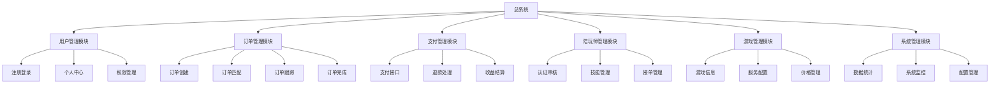
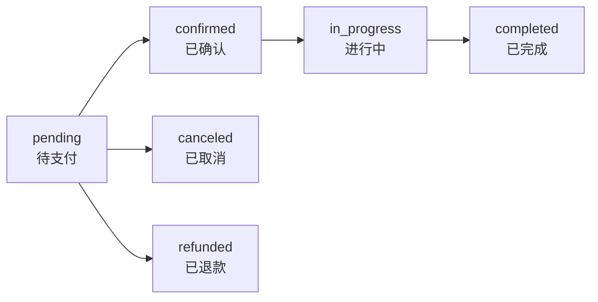
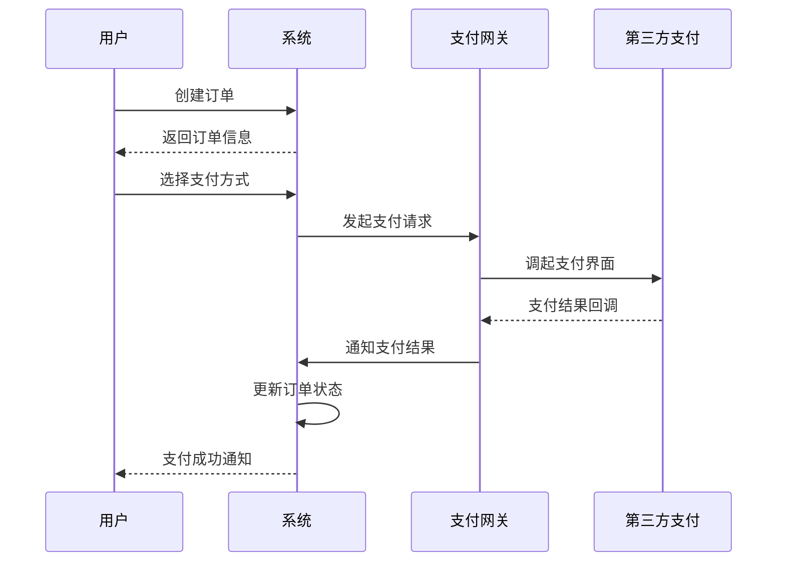

# 📋 GameLink 功能需求规格说明书

## 📊 文档信息

| 项目 | 内容 |
|------|------|
| **文档名称** | 功能需求规格说明书 |
| **版本** | v1.0 |
| **创建日期** | 2025-12-05 |
| **作者** | Claude - 项目测试负责人 |
| **最后更新** | 2025-12-05 |

---

## 1. 功能概览

### 1.1 系统功能架构图



### 1.2 功能优先级矩阵

| 功能模块 | 子功能 | 优先级 | 开发周期 | 当前状态 |
|----------|--------|--------|----------|----------|
| 🔐 **用户认证** | 注册/登录/登出 | P0 | 1周 | ✅ 已完成 |
| | 角色判断与跳转 | P0 | 1天 | ✅ 已完成 |
| | 记住登录状态 | P0 | 1天 | ✅ 已完成 |
| 📊 **管理后台** | 数据仪表盘 | P0 | 1周 | ✅ 80% |
| | 用户管理 | P0 | 1周 | ✅ 80% |
| | 订单管理 | P0 | 1周 | ✅ 已完成 |
| | 陪玩师管理 | P1 | 2周 | ⚠️ 50% |
| | 系统监控 | P0 | 2周 | ⚠️ 60% |
| ⚙️ **基础配置** | 游戏管理 | P0 | 1周 | ⚠️ 70% |
| | 服务项目管理 | P0 | 1周 | ⚠️ 60% |
| | 权限管理 | P0 | 1周 | ⚠️ 70% |
| | 系统设置 | P0 | 3天 | ✅ 已完成 |
| 👤 **用户端** | 首页展示 | P1 | 3天 | ✅ 80% |
| | 个人中心 | P1 | 2周 | ❌ 未开始 |
| | 游戏浏览 | P1 | 1周 | ❌ 未开始 |
| | 陪玩师选择 | P1 | 1周 | ❌ 未开始 |
| | 订单创建 | P1 | 2周 | ❌ 未开始 |
| | 支付集成 | P1 | 2周 | ❌ 未开始 |
| 💼 **陪玩师端** | Dashboard | P1 | 3周 | ⚠️ 20% |
| | 订单大厅 | P1 | 2周 | ❌ 未开始 |
| | 接单功能 | P1 | 1周 | ❌ 未开始 |
| | 收益管理 | P1 | 1周 | ❌ 未开始 |

**图例说明**：
- ✅ 已完成 - 功能已实现且测试通过
- ⚠️ 部分完成 - 功能已实现但需完善
- ❌ 未开始 - 功能尚未开发

---

## 2. 用户认证模块

### 2.1 用户注册

#### 功能描述
提供用户注册入口，支持多类型账号注册。

#### 用例图
```
用户 --> 注册页面
用户 --> 填写注册信息
系统 --> 验证信息
系统 --> 创建账号
系统 --> 发送验证邮件
用户 --> 邮箱验证
系统 --> 注册成功
```

#### 功能详情

**注册方式支持**：
1. **手机号注册**
   - 输入手机号（11位数字验证）
   - 获取短信验证码（6位数字）
   - 验证验证码正确性（5分钟有效期）
   - 设置登录密码（8-20位，包含字母数字）
   - 确认密码
   - 同意用户协议和隐私政策

2. **邮箱注册**
   - 输入邮箱地址（格式验证）
   - 获取邮箱验证码
   - 验证邮箱有效性
   - 设置密码
   - 确认密码

3. **第三方注册**（二期）
   - 微信授权注册
   - QQ授权注册

**注册信息字段**：
| 字段名 | 必填 | 验证规则 | 说明 |
|--------|------|----------|------|
| 用户名 | 是 | 3-20位，字母数字下划线 | 唯一 |
| 手机号 | 是（二选一） | 11位手机号格式 | 唯一 |
| 邮箱 | 是（二选一） | 邮箱格式 | 唯一 |
| 密码 | 是 | 8-20位，包含字母和数字 | 加密存储 |
| 确认密码 | 是 | 与密码一致 | 前端验证 |
| 验证码 | 是 | 6位数字 | 5分钟有效 |

**注册流程**：
```typescript
// API接口
POST /api/v1/auth/register

Request:
{
  "username": "user123",
  "phone": "13800138000", // 或 "email": "user@example.com"
  "password": "pass123456",
  "confirmPassword": "pass123456",
  "verificationCode": "123456",
  "agreeTerms": true
}

Response:
{
  "code": 200,
  "message": "注册成功",
  "data": {
    "userId": 10001,
    "username": "user123",
    "token": "eyJhbGciOiJIUzI1NiJ9..."
  }
}
```

**业务规则**：
- 同一手机号/邮箱只能注册一个账号
- 注册后自动登录，返回Token
- 需要完成邮箱/手机验证才能下单
- 用户名不可重复，不区分大小写

---

### 2.2 用户登录

#### 功能描述
提供用户登录功能，支持多种登录方式。

#### 登录方式

1. **账号密码登录**
   - 输入用户名/手机号/邮箱
   - 输入密码
   - 图形验证码（连续5次失败时）
   - 登录按钮

2. **手机验证码登录**
   - 输入手机号
   - 获取短信验证码
   - 输入验证码
   - 登录

3. **第三方登录**（二期）
   - 微信扫码登录
   - QQ授权登录

#### 登录流程
```typescript
// API接口
POST /api/v1/auth/login

Request:
{
  "username": "user123", // 或手机号/邮箱
  "password": "pass123456",
  "rememberMe": true
}

Response:
{
  "code": 200,
  "message": "登录成功",
  "data": {
    "userId": 10001,
    "username": "user123",
    "email": "user@example.com",
    "phone": "13800138000",
    "role": "user",
    "token": "eyJhbGciOiJIUzI1NiJ9...",
    "expiresIn": 7200
  }
}
```

#### 安全机制
- **密码加密**：bcrypt哈希存储
- **登录限制**：5分钟内5次失败，锁定15分钟
- **Token机制**：
  - Access Token：2小时有效期
  - Refresh Token：7天有效期
- **记住登录状态**：localStorage存储，30天自动登录

---

### 2.3 Token刷新

#### 功能描述
自动刷新过期的Access Token，保持用户登录状态。

#### 刷新机制
```typescript
// API接口
POST /api/v1/auth/refresh

Request:
{
  "refreshToken": "refresh_token_here"
}

Response:
{
  "code": 200,
  "data": {
    "token": "new_access_token",
    "expiresIn": 7200
  }
}
```

#### 实现逻辑
- HTTP拦截器自动刷新
- 在Token过期前5分钟尝试刷新
- Refresh Token失效后需要重新登录

---

## 3. 用户端模块

### 3.1 首页展示

#### 功能描述
展示平台核心信息和热门内容，引导用户使用。

#### 页面结构
**Hero区域**：
- 主标题：专业游戏陪玩平台
- 副标题：连接每一位游戏玩家
- CTA按钮：
  - "立即寻找陪玩"（引导下单）
  - "成为陪玩师"（引导申请）

**统计数据展示**：
- 活跃玩家数：50,000+
- 认证陪玩师：5,000+
- 支持游戏数：50+

**热门游戏列表**：
- 游戏图标
- 游戏名称
- 陪玩师数量
- 平均价格

**特色功能介绍**：
- 认证陪玩师
- 即时匹配
- 顶级游戏体验
- 安全保障

#### 技术实现
```typescript
// API接口
GET /api/v1/client/home

Response:
{
  "code": 200,
  "data": {
    "stats": {
      "totalUsers": 50000,
      "totalPlayers": 5000,
      "totalGames": 50
    },
    "hotGames": [
      {
        "id": 1,
        "name": "英雄联盟",
        "iconUrl": "http://...",
        "playerCount": 1500,
        "minPrice": 50
      }
    ],
    "featuredServices": [...]
  }
}
```

---

### 3.2 个人中心（待开发）

#### 功能概述
提供用户个人信息管理、订单历史、钱包等功能。

#### 主要功能点

**基本信息管理**：
- 头像上传（支持裁剪）
- 昵称修改（唯一性验证）
- 邮箱绑定/修改
- 手机号绑定/修改
- 密码修改

**订单管理**：
- 全部订单列表
- 待支付订单
- 进行中订单
- 已完成订单
- 已取消订单
- 订单搜索和筛选

**钱包功能**：
- 余额展示
- 充值记录
- 消费记录
- 充值接口（支付宝/微信）

**消息通知**：
- 订单状态更新
- 系统通知
- 客服消息

**我的收藏**：
- 收藏的陪玩师
- 收藏的游戏

---

### 3.3 游戏浏览（待开发）

#### 功能描述
展示平台支持的游戏列表，支持搜索和筛选。

#### 功能详情

**游戏列表展示**：
- 游戏图标
- 游戏名称
- 游戏类型（MOBA/FPS/RPG等）
- 陪玩师数量
- 平均价格
- 热门标签

**搜索功能**：
- 按游戏名称搜索
- 按游戏类型筛选
- 按价格区间筛选

**排序功能**：
- 按热度（订单量）
- 按陪玩师数量
- 按平均价格（低到高/高到低）

---

### 3.4 陪玩师浏览（待开发）

#### 功能描述
展示陪玩师列表，支持多维度的筛选和搜索。

#### 筛选条件

**基础筛选**：
- 按游戏筛选
- 按段位筛选
- 按价格区间筛选
- 按性别筛选

**高级筛选**：
- 在线状态
- 评分范围（4.0-5.0）
- 接单数量
- 服务类型（solo/team/gift）

**排序方式**：
- 综合排序（推荐算法）
- 按价格（低到高/高到低）
- 按评分（高到低）
- 按接单量
- 按在线状态

#### 展示信息
- 头像
- 昵称
- 认证标识
- 实时状态（在线/离线）
- 评分（星级显示）
- 接单数量
- 平均价格
- 擅长游戏/英雄
- 简介（前50字）

---

### 3.5 陪玩师详情（待开发）

#### 展示内容

**基本信息区**：
- 头像（大图）
- 昵称
- 认证标识（已认证）
- 在线状态
- 评分（大字号显示）

**统计数据**：
- 接单总数
- 完成率（百分比）
- 平均评分
- 收到礼物数

**服务信息**：
- 服务项目列表
- 价格明细
- 服务时长选项
- 可预约时间（日历展示）

**技能展示**：
- 擅长游戏
- 最高段位
- 游戏时长
- 教学风格

**评价列表**：
- 最新10条评价
- 评价星级筛选（1-5星）
- 评价内容展示
- 评价标签（技术好、态度好、守时等）

**互动功能**：
- 关注/取消关注
- 私信（需下单后）
- 送礼物

---

### 3.6 订单创建（待开发）

#### 创建流程

**步骤1：选择服务**
- 护航类型：solo/team/gift
- 游戏选择
- 服务时长（1/2/3/4/5小时）
- 预约时间（即时/预约）

**步骤2：填写需求**
- 订单标题
- 服务要求（具体描述）
- 特殊需求（可选）
- 联系方式

**步骤3：确认订单**
- 陪玩师信息
- 服务详情
- 费用明细
  - 基础费用（时薪 × 时长）
  - 平台服务费（按比例）
  - 应付总额

**步骤4：选择支付方式**
- 微信支付
- 支付宝
- 钱包余额

**步骤5：创建成功**
- 订单号生成
- 跳转支付页面或等待接单

#### 订单字段

| 字段名 | 类型 | 必填 | 说明 |
|--------|------|------|------|
| orderNo | string | 是 | 订单号（系统自动生成） |
| userId | uint64 | 是 | 用户ID |
| itemId | uint64 | 是 | 服务项目ID |
| playerId | uint64 | 否 | 指定陪玩师ID |
| quantity | int | 是 | 服务时长（小时） |
| totalPriceCents | int64 | 是 | 总价（分） |
| scheduledStart | datetime | 否 | 预约开始时间 |
| title | string | 是 | 订单标题 |
| description | string | 否 | 服务要求描述 |
| status | enum | 是 | 订单状态（pending） |

---

### 3.7 订单管理（待开发）

#### 订单状态流转



#### 各状态说明

**待支付（pending）**：
- 订单创建成功，等待支付
- 可取消订单
- 30分钟内未支付自动取消

**已确认（confirmed）**：
- 支付成功，等待陪玩师接单
- 可在订单大厅被陪玩师看到
- 用户可申请退款

**进行中（in_progress）**：
- 陪玩师已接单
- 服务已经开始
- 实时通讯功能开启
- 可上传进度截图

**已完成（completed）**：
- 服务完成
- 用户已确认
- 进入结算流程
- 可评价对方

**已取消（canceled）**：
- 用户/系统取消
- 未支付状态下可取消
- 不收取费用

**已退款（refunded）**：
- 完成退款流程
- 原路返回支付金额

#### 订单操作

**用户操作**：
- 取消订单（pending状态）
- 申请退款（confirmed/in_progress）
- 确认完成（in_progress）
- 评价陪玩师（completed）
- 联系客服（所有状态）

**陪玩师操作**：
- 接单（confirmed）
- 开始服务（in_progress）
- 上传进度（in_progress）
- 完成服务（in_progress）
- 联系客户（in_progress）

**管理员操作**：
- 修改订单状态
- 处理退款申请
- 处理争议订单
- 查看订单详情

---

## 4. 陪玩师端模块

### 4.1 Dashboard（部分完成）

#### 已完成内容

**基础框架** [frontend/src/pages/companion/Dashboard.tsx]
- 页面布局结构
- 导航菜单
- 基础样式

#### 待开发内容

**收益概览**：
- 今日收入卡片
- 本周收入卡片
- 本月收入卡片
- 总收入卡片
- 收入趋势线图

**订单统计**：
- 待接单数量（实时更新）
- 进行中订单数量
- 已完成订单数量
- 取消订单统计
- 完成率百分比

**快捷操作**：
- 发布动态
- 设置在线状态
- 查看评价
- 提现申请

**数据可视化**：
- 收入趋势图（7天/30天）
- 接单量统计
- 客户评分分布
- 热门游戏占比

---

### 4.2 订单大厅（待开发）

#### 功能描述
展示当前可接的订单列表，支持抢单功能。

#### 订单列表信息

**订单卡片展示**：
- 订单编号
- 游戏类型
- 服务类型（solo/team）
- 预计时长
- 预算价格
- 用户等级
- 特殊要求（前50字）
- 预约时间
- 距离（基于在线状态）

#### 抢单功能

**抢单流程**：
1. 查看订单详情
2. 确认接单
3. 系统验证资格
   - 是否认证通过
   - 段位是否匹配
   - 是否有未完成订单
4. 抢单成功/失败
5. 订单状态更新

**抢单限制**：
- 每人同时最多3个进行中订单
- 订单开始前有5分钟准备时间
- 超时未开始自动释放订单

#### 智能推荐（二期）

**推荐算法**：
- 基于游戏技能匹配
- 基于价格区间匹配
- 基于历史接单偏好
- 基于用户评价记录
- 基于地理位置（可选）

---

### 4.3 我的订单（待开发）

#### 订单分类

**待服务**：
- 已接单但未开始
- 显示开始倒计时
- 联系客户按钮
- 申请延迟（需客户同意）

**进行中**：
- 服务已开始
- 计时器显示
- 上传进度截图
- 联系客户
- 标记完成

**已完成**：
- 服务已完成
- 客户评价
- 收入已结算
- 申诉入口（24小时内）

**已取消**：
- 客户/系统取消
- 取消原因
- 补偿金额（如适用）

---

### 4.4 收益管理（待开发）

#### 收入统计

**收入明细**：
- 订单收入（订单ID、金额、时间）
- 礼物收入（客户、礼物、金额）
- 奖励收入（活动奖励、补贴）

**收入筛选**：
- 按时间范围（今日/本周/本月/自定义）
- 按收入类型
- 按订单状态

**收入趋势图**：
- 柱状图（日收入）
- 折线图（收入增长）
- 饼图（收入来源占比）

#### 钱包功能

**余额构成**：
- 可提现余额
- 冻结金额（争议订单）
- 累计收入

**提现功能**：
- 选择提现方式（微信/支付宝/银行卡）
- 输入提现金额
- 确认提现
- 查看提现记录（包含状态）

**提现规则**：
- 最低提现金额：¥100
- 提现手续费：1%
- 提现到账时间：T+1
- 每月提现次数限制：5次

---

### 4.5 我的服务（待开发）

#### 服务项目管理

**添加服务**：
- 选择游戏
- 选择服务类型（solo/team/gift）
- 设置价格（时薪）
- 设置服务时长选项
- 填写服务描述
- 上传游戏截图（段位证明）

**服务列表**：
- 服务项目卡片
- 上下架状态
- 价格
- 最近订单数
- 编辑/删除

#### 技能认证

**认证流程**：
1. 选择认证游戏
2. 填写游戏信息（ID/段位）
3. 上传证明材料（截图/视频）
4. 提交审核
5. 等待审核结果（1-3个工作日）

**认证等级**：
- 初级认证（游戏时长、基础段位）
- 中级认证（高段位、教学经验）
- 高级认证（顶级段位、专业证明）

---

### 4.6 个人中心（待开发）

#### 基本信息
- 头像上传
- 昵称（可修改，唯一性验证）
- 个人简介
- 游戏经历
- 教学风格

#### 认证信息
- 认证状态
- 认证等级
- 认证到期时间
- 重新认证

#### 数据统计
- 接单总数
- 完成率
- 平均评分
- 客户评价（最新10条）

---

## 5. 管理后台模块

### 5.1 数据仪表盘（80%完成）

#### 已实现功能

**核心数据统计** [backend/internal/handler/admin/dashboard.go:28]
```go
type DashboardStats struct {
    TotalUsers        int64   // 总用户数
    TotalPlayers      int64   // 总陪玩师数
    TotalOrders       int64   // 总订单数
    TotalRevenue      float64 // 总收入（元）
    TodayUsers        int64   // 今日新增用户
    TodayOrders       int64   // 今日订单
    TodayRevenue      float64 // 今日收入
    PendingOrders     int64   // 待处理订单
    CompletedOrders   int64   // 已完成订单
}
```

#### 待完善功能

**趋势图表**：
- 收入趋势图（近7天/30天/90天）
- 用户增长曲线
- 订单量变化
- 游戏热度排行

**实时数据**：
- 在线用户数（实时）
- 当前订单数（实时）
- 新增注册（实时）
- 异常告警（实时）

---

### 5.2 用户管理（80%完成）

#### 已实现功能

**用户列表** [backend/internal/handler/admin/user.go:31]
- 分页查询
- 基础搜索（用户名/邮箱/手机号）
- 筛选（角色/状态）

#### 待完善功能

**批量操作**：
- 批量修改角色
- 批量修改状态（激活/封禁）
- 批量发送通知
- 批量调整积分

**高级搜索**：
- 注册时间范围
- 最后登录时间
- 累计消费金额
- 订单数量

**用户详情页**：
- 基本信息（头像、昵称、联系方式）
- 账户状态（正常/封禁/异常）
- 订单记录（最近10单）
- 登录历史（IP、时间、设备）
- 钱包余额
- 操作日志

---

### 5.3 订单管理（已完成）

#### 已实现功能

**订单列表** [backend/internal/handler/admin/order.go:31]
- 完整列表展示
- 分页查询
- 状态筛选
- 时间范围筛选

**订单详情**
- 基础信息
- 支付信息
- 服务进度

**订单操作**
- 修改状态
- 处理退款
- 争议处理

---

### 5.4 陪玩师管理（50%完成）

#### 已实现功能

**基础列表**
- 陪玩师信息展示
- 状态筛选

#### 待完善功能

**认证审核**：
- 认证资料查看
- 游戏截图/视频审核
- 审核通过/拒绝
- 认证状态管理（pending/verified/rejected）

**技能管理**：
- 游戏技能标签编辑
- 段位/等级管理
- 服务价格审核
- 上下架状态

**数据统计**：
- 接单数量统计
- 完成率计算
- 客户评分趋势
- 收入统计

**打手详情**：
- 基本信息
- 认证信息
- 订单记录
- 客户评价
- 收入明细

---

### 5.5 游戏管理（70%完成）

#### 已实现功能

**基础CRUD**
- 游戏信息增删改查
- 基础数据展示

#### 待完善功能

**游戏配置**：
- 支持状态（新增/维护/下线）
- 热门排序
- 标签管理（MOBA/FPS/RPG等）

**服务项目管理**：
- 为每个游戏配置服务类型
- 价格范围设置
- 学员等级要求

**数据关联**：
- 该游戏下的陪玩师数量
- 历史订单数据
- 收入统计

---

### 5.6 系统监控（60%完成）

#### 已实现功能

**基础监控** [backend/internal/handler/admin/monitor.go:27]
- 在线用户统计
- 系统性能基础指标

#### 待完善功能

**实时监控**：
- 在线用户实时更新（WebSocket）
- 订单池状态
- API请求频率
- 错误日志监控

**性能监控**：
- CPU使用率
- 内存占用
- 磁盘空间
- 网络流量

**日志分析**：
- 访问日志统计
- 错误日志告警
- 慢查询分析
- 异常行为检测

**KPI指标**：
- GMV（成交总额）
- 订单完成率
- 用户留存率
- 转化率漏斗

---

### 5.7 权限管理（70%完成）

#### 已实现功能

**角色管理**
- 角色列表
- 基础CRUD

#### 待完善功能

**权限配置**：
- 菜单权限（可见/隐藏）
- 按钮权限（启用/禁用）
- 接口权限（访问控制）
- 数据权限（范围控制）

**角色分配**：
- 给用户分配角色
- 角色继承关系
- 多角色支持

**权限审计**：
- 用户权限变更记录
- 权限使用统计
- 越权访问检测

---

### 5.8 系统设置（已完成）

#### 已实现功能

- 平台基础配置
- 支付配置
- 通知配置
- 安全设置

---

## 6. 支付管理模块

### 6.1 支付流程

#### 支付方式

**微信支付**：
- JSAPI支付（公众号/H5）
- Native支付（二维码）
- App支付（原生App）

**支付宝支付**：
- 手机网站支付
- App支付
- 当面付

**余额支付**：
- 钱包余额支付
- 余额不足提示充值

#### 支付流程



---

### 6.2 退款流程

#### 退款场景

1. **用户主动退款**
   - pending状态：全额退款
   - confirmed状态：协商退款
   - in_progress状态：按比例退款

2. **系统超时退款**
   - 超过24小时未接单
   - 自动全额退款

3. **争议退款**
   - 客服介入判定
   - 可能的部分退款

#### 退款规则

| 订单状态 | 退款比例 | 处理时间 | 说明 |
|---------|---------|----------|------|
| pending | 100% | 即时 | 未支付状态下取消 |
| confirmed | 95-100% | 1-3个工作日 | 扣除5%手续费 |
| in_progress | 0-80% | 1-3个工作日 | 根据服务进度 |
| completed | 0% | - | 服务完成不退款 |

---

### 6.3 收益结算

#### 结算流程

**自动结算**：
1. 订单状态更新为completed
2. 系统计算平台抽成（15-20%）
3. 陪玩师收入 = 订单金额 × (1 - 抽成比例)
4. 更新陪玩师钱包余额
5. 生成收入记录

**结算周期**：
- 实时到账（订单完成后立即）
- 手续费：平台抽成15-20%
- 最低余额：¥100可提现

#### 收入明细

**收入类型**：
- 订单收入
- 礼物收入
- 活动奖励
- 补贴收入

**费用明细**：
- 平台抽成
- 提现手续费（1%）
- 冻结金额（争议中）

---

## 7. 非功能性需求补充

### 7.1 性能要求

- 页面加载时间 < 3秒
- API响应时间 < 200ms
- 并发用户支持 > 1000
- 订单处理能力 > 1000单/分钟

### 7.2 安全要求

- 密码加密存储（bcrypt）
- HTTPS传输加密
- XSS防护
- CSRF防护
- SQL注入防护

### 7.3 兼容性

- Chrome 80+
- Firefox 75+
- Safari 13+
- Edge 80+
- iOS Safari 13+
- Android Chrome 80+

---

## 8. 数据库设计

### 核心表结构

**用户表（users）**：
```sql
CREATE TABLE users (
  id BIGINT PRIMARY KEY,
  phone VARCHAR(32) UNIQUE,
  email VARCHAR(128) UNIQUE,
  password_hash VARCHAR(255),
  name VARCHAR(64),
  avatar_url VARCHAR(255),
  role VARCHAR(32),
  status VARCHAR(32),
  last_login_at DATETIME,
  created_at DATETIME,
  updated_at DATETIME,
  INDEX idx_status_last_login (status, last_login_at)
);
```

**订单表（orders）**：
```sql
CREATE TABLE orders (
  id BIGINT PRIMARY KEY,
  order_no VARCHAR(64) UNIQUE,
  user_id BIGINT,
  item_id BIGINT,
  player_id BIGINT,
  quantity INT,
  total_price_cents BIGINT,
  status VARCHAR(32),
  title VARCHAR(200),
  description TEXT,
  scheduled_start DATETIME,
  created_at DATETIME,
  updated_at DATETIME,
  INDEX idx_user_id (user_id),
  INDEX idx_status (status),
  INDEX idx_created_at (created_at)
);
```

---

## 9. API接口汇总

### 认证相关
```
POST   /api/v1/auth/register      # 注册
POST   /api/v1/auth/login         # 登录
POST   /api/v1/auth/refresh       # Token刷新
GET    /api/v1/auth/me            # 获取当前用户信息
POST   /api/v1/auth/logout        # 登出
```

### 用户相关
```
GET    /api/v1/users/:id          # 获取用户信息
PUT    /api/v1/users/:id          # 更新用户信息
GET    /api/v1/users/:id/orders   # 获取用户订单列表
```

### 订单相关
```
GET    /api/v1/orders             # 订单列表
POST   /api/v1/orders             # 创建订单
GET    /api/v1/orders/:id         # 订单详情
PUT    /api/v1/orders/:id         # 更新订单
DELETE /api/v1/orders/:id         # 删除订单
```

### 支付相关
```
POST   /api/v1/payments           # 创建支付
GET    /api/v1/payments/:id       # 支付详情
POST   /api/v1/payments/callback  # 支付回调
PUT    /api/v1/payments/refund    # 申请退款
```

### 管理后台
```
GET    /api/v1/admin/dashboard    # 仪表盘数据
GET    /api/v1/admin/users        # 用户列表
GET    /api/v1/admin/orders       # 订单列表
GET    /api/v1/admin/players      # 陪玩师列表
GET    /api/v1/admin/games        # 游戏列表
```

---

## 10. 验收清单

### 10.1 功能验收

**用户认证**：
- [ ] 注册功能正常（手机号/邮箱）
- [ ] 登录功能正常（多方式）
- [ ] Token刷新机制正常
- [ ] 权限控制有效

**用户端**：
- [ ] 首页展示正常
- [ ] 个人中心功能完整
- [ ] 订单创建流程顺畅
- [ ] 支付流程集成成功
- [ ] 订单管理功能正常

**陪玩师端**：
- [ ] Dashboard数据准确
- [ ] 订单大厅展示正常
- [ ] 抢单功能有效
- [ ] 收益统计准确
- [ ] 提现功能正常

**管理后台**：
- [ ] 数据仪表盘准确
- [ ] 用户管理功能完整
- [ ] 订单管理功能完整
- [ ] 陪玩师管理功能完整
- [ ] 系统监控有效

### 10.2 性能验收

- [ ] 页面加载 < 3秒
- [ ] API响应 < 200ms
- [ ] 并发支持 > 1000用户
- [ ] 订单处理 > 1000单/分钟

---

## 11. 附录

### 11.1 术语表

| 术语 | 说明 |
|------|------|
| 陪玩/打手 | 提供游戏陪玩服务的专业人员 |
| 护航 | 陪玩师带领客户游戏的模式 |
| 车队 | 多人陪玩团队服务 |
| GMV | 成交总额 |
| DAU | 日活跃用户 |
| MAU | 月活跃用户 |
| NPS | 净推荐值 |

### 11.2 相关文档

- [产品概述](./PRODUCT_OVERVIEW.md)
- [用户画像](./USER_PERSONAS.md)
- [技术架构](./TECHNICAL_ARCHITECTURE.md)
- [数据模型](./DATA_MODEL.md)

---

**文档版本历史**

| 版本 | 日期 | 作者 | 变更说明 |
|------|------|------|----------|
| v1.0 | 2025-12-05 | Claude | 初始版本创建，包含完整功能规格 |

---

<div align="center">

**📋 功能驱动，用户至上**

</div>
