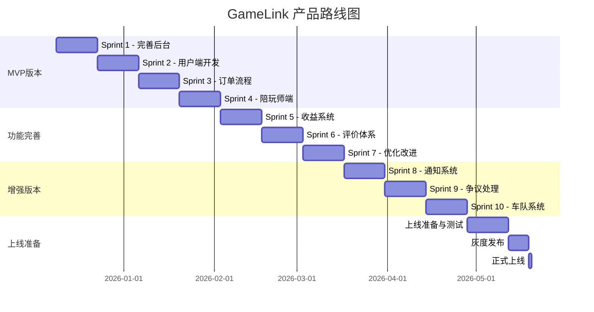

# 📅 GameLink 迭代计划与项目管理

## 📊 文档信息

| 项目 | 内容 |
|------|------|
| **文档名称** | 迭代计划与项目管理文档 |
| **版本** | v1.0 |
| **创建日期** | 2025-12-05 |
| **作者** | Claude - 项目测试负责人 |
| **最后更新** | 2025-12-05 |

---

## 1. 项目概述

### 1.1 项目目标

**核心目标**: 在6个月内完成GameLink游戏陪玩平台MVP版本开发并上线运营，实现业务闭环。

**具体目标**:

1. **技术指标**: 构建稳定、高性能、可扩展的技术架构
2. **功能指标**: 完成核心功能，支持用户注册、下单、支付、服务、评价全流程
3. **业务指标**: 上线后3个月内注册用户10000+，认证打手500+
4. **质量指标**: 测试覆盖率80%+，系统可用性99.9%

### 1.2 当前状态

**项目完成度**:

- 后端功能: 85% (基础框架完整，核心功能实现)
- 前端功能: 70% (管理后台基本完成，用户端和打手端待完善)
- 测试系统: 需要修复 (大量测试用例无法运行)
- 文档完整性: 80%

**主要风险**:

1. 🔴 **测试系统崩溃** - 测试用例完全无法运行，影响质量保证
2. 🔴 **数据模型不一致** - 前后端数据定义存在差异
3. 🟡 **功能完整性不足** - 用户端和陪玩师端核心功能缺失

---

## 2. 产品路线图

### 2.1 产品里程碑



### 2.2 详细迭代计划

#### 🔴 Sprint 1 (2周) - 完善管理后台
**时间**: 2025-12-09 ~ 2025-12-22
**目标**: 完善后台基础功能，确保数据准确性

**任务清单**:
- [ ] 修复测试系统崩溃问题
- [ ] 完善仪表盘数据展示
- [ ] 优化用户管理批量操作功能
- [ ] 完善陪玩师管理认证审核流程
- [ ] 优化系统监控实时数据展示
- [ ] 统一数据模型前后端一致

**验收标准**:
- 测试用例可正常运行
- 后台基础功能完整
- 数据准确性验证通过

**负责人**: 后端团队

---

#### 🔴 Sprint 2 (2周) - 开发用户端
**时间**: 2025-12-23 ~ 2026-01-05
**目标**: 完成用户端核心功能开发

**任务清单**:
- [ ] 个人中心页面开发
- [ ] 游戏浏览与筛选功能
- [ ] 陪玩师搜索与详情页
- [ ] 订单创建流程
- [ ] 支付页面集成

**验收标准**:
- 用户端核心功能可用
- 订单创建流程畅通
- 支付接口集成成功

**负责人**: 前端主程 + 后端配合

---

#### 🔴 Sprint 3 (2周) - 订单流程完善
**时间**: 2026-01-06 ~ 2026-01-19
**目标**: 完善订单全生命周期管理

**任务清单**:
- [ ] 订单状态实时推送
- [ ] 订单详情页完善
- [ ] 订单取消与退款流程
- [ ] 订单评价功能
- [ ] 订单搜索与筛选优化

**验收标准**:
- 订单流程完整闭环
- 状态推送实时准确
- 评价系统正常运行

**负责人**: 全栈团队

---

#### 🔴 Sprint 4 (2周) - 陪玩师端
**时间**: 2026-01-20 ~ 2026-02-02
**目标**: 完成陪玩师端核心功能

**任务清单**:
- [ ] Dashboard数据展示
- [ ] 订单大厅开发
- [ ] 抢单功能实现
- [ ] 我的订单管理
- [ ] 收益统计展示

**验收标准**:
- 陪玩师端基础功能完整
- 抢单功能运行正常
- 收益统计准确

**负责人**: 前端团队 + 后端配合

---

#### 🟡 Sprint 5-7 (6周) - 功能完善
**时间**: 2026-02-03 ~ 2026-03-16
**目标**: 完善用户体验，优化业务流程

**任务清单**:
- [ ] 收益提现功能
- [ ] 钱包管理完善
- [ ] 通知系统开发
- [ ] 搜索优化
- [ ] 性能优化
- [ ] BUG修复

**验收标准**:
- 用户体验流畅
- 核心流程优化
- BUG修复率≥95%

**负责人**: 全栈团队

---

#### 🟢 Sprint 8-10 (6周) - 增强版本
**时间**: 2026-03-17 ~ 2026-04-27
**目标**: 开发特色功能，提升竞争力

**任务清单**:
- [ ] 礼物系统
- [ ] 车队功能
- [ ] 社区功能
- [ ] 数据分析功能
- [ ] 推荐算法优化

**验收标准**:
- 特色功能稳定运行
- 推荐算法效果提升
- 用户活跃度提升

**负责人**: 产品+技术团队

---

#### 🔵 上线准备 (3周)
**时间**: 2026-04-28 ~ 2026-05-18
**目标**: 确保系统稳定上线

**任务清单**:
- [ ] 生产环境部署
- [ ] 安全加固
- [ ] 性能压测
- [ ] 数据准备
- [ ] 运营培训

**验收标准**:
- 生产环境稳定运行
- 通过压力测试
- 运营流程完善

**负责人**: DevOps + 运营团队

### 2.3 发布计划

**灰度发布策略**:

| 阶段 | 时间 | 用户比例 | 核心任务 |
|------|------|----------|----------|
| 内测阶段 | 1周 | 5% | 内部测试、BUG修复 |
| 小范围测试 | 1周 | 20% | 种子用户反馈收集 |
| 扩大测试 | 1周 | 50% | 性能优化、功能调优 |
| 全量上线 | 1天 | 100% | 全面推广 |

**发布检查清单**:

- [ ] 代码审核通过
- [ ] 测试报告通过
- [ ] 性能测试通过
- [ ] 安全扫描通过
- [ ] 备份方案确认
- [ ] 回滚方案准备
- [ ] 监控配置确认
- [ ] 运营人员到位

---

## 3. 资源规划

### 3.1 人力资源

**团队组成**:

| 角色 | 人数 | 主要职责 | 工作周期 |
|------|------|----------|----------|
| 产品经理 | 1 | 需求管理、产品设计 | 全程 |
| UI/UX设计师 | 1 | 界面设计、交互设计 | 第1-8周 |
| 后端开发 | 3 | API开发、数据库设计 | 全程 |
| 前端开发 | 2 | 页面开发、交互实现 | 第2-10周 |
| 测试工程师 | 2 | 测试用例、质量保证 | 第4-12周 |
| DevOps工程师 | 1 | 部署、运维 | 第10-12周 |
| 运营经理 | 1 | 运营策略、推广 | 第8-12周 |

**人员能力要求**:

- **后端**: Go语言1年以上经验，熟悉Gin、GORM框架
- **前端**: React 2年以上经验，熟悉TypeScript、Ant Design
- **测试**: 熟悉自动化测试，有API测试经验
- **DevOps**: 熟悉Docker、K8s、CI/CD流程

### 3.2 硬件资源

**开发环境**:

| 用途 | 配置 | 数量 | 说明 |
|------|------|------|------|
| 开发服务器 | 4核/8GB/100GB | 5台 | 开发测试 |
| 测试数据库 | 8核/16GB/500GB | 1套 | MySQL/PGSQL |
| Redis集群 | 3实例 | 1套 | 缓存、Session |

**生产环境**:

| 用途 | 配置 | 数量 | 说明 |
|------|------|------|------|
| 应用服务器 | 8核/16GB/500GB | 5台 | 负载均衡 |
| 数据库主库 | 16核/64GB/2TB SSD | 1台 | PostgreSQL主库 |
| 数据库从库 | 8核/32GB/1TB SSD | 2台 | 读写分离 |
| Redis集群 | 3主3从 | 6节点 | 高可用 |
| 文件存储 | OSS | 1套 | 静态资源 |
| CDN | - | 1套 | 全球加速 |

### 3.3 成本预算

**人力成本** (6个月):

| 角色 | 人数 | 月均成本 | 总成本 |
|------|------|----------|--------|
| 产品经理 | 1 | ¥25,000 | ¥150,000 |
| UI设计师 | 1 | ¥20,000 | ¥120,000 |
| 后端开发 | 3 | ¥22,000 | ¥396,000 |
| 前端开发 | 2 | ¥20,000 | ¥240,000 |
| 测试工程师 | 2 | ¥18,000 | ¥216,000 |
| DevOps工程师 | 1 | ¥25,000 | ¥150,000 |
| 运营经理 | 1 | ¥20,000 | ¥120,000 |
| **合计** | **11** | - | **¥1,392,000** |

**硬件与云服务成本** (年度):

| 项目 | 配置 | 月费用 | 年费用 |
|------|------|--------|--------|
| 云服务器 | 中型实例 | ¥5,000 | ¥60,000 |
| 数据库 | RDS PostgreSQL | ¥3,000 | ¥36,000 |
| Redis | 集群版 | ¥1,000 | ¥12,000 |
| OSS存储 | 100GB | ¥200 | ¥2,400 |
| CDN | 流量计费 | ¥1,000 | ¥12,000 |
| 域名与SSL | - | ¥100 | ¥1,200 |
| **合计** | - | **¥10,300** | **¥123,600** |

**其他费用**:

- 第三方支付接口: 按交易额的0.6%
- 短信服务: 按使用量
- 营销推广: 初期¥50,000

**总预算**: ¥1,515,600 (首年)

---

## 4. 风险管理

### 4.1 风险矩阵

按照发生概率和影响程度，风险分类如下：

```
         高影响
            ↑
     高概率 |            🔴 测试系统崩溃
            |    🟡 功能缺失      🟡 需求变更
            |            🟡 人员流动
 中概率 |            🔴 数据不一致
            |    🟢 技术债务
            |            🟡 进度延误
     低概率 |            🟡 市场变化
            |    🟢 第三方服务故障
            |            🟢 政策风险
            └────────────────→ 高概率
         低影响
```

**风险等级**:
- 🔴 红色: 高风险，需立即应对
- 🟡 黄色: 中风险，需密切关注
- 🟢 绿色: 低风险，需预防

### 4.2 风险详情与应对

#### 🔴 高风险

**1. 测试系统崩溃**

- **描述**: 测试用例完全无法运行，影响质量保证
- **影响**: 极高 - 无法保证代码质量
- **概率**: 高 - 已发生
- **应对措施**:
  - 立即暂停新功能开发
  - 分配专人修复测试框架
  - 预计修复时间: 3-5天
  - 修复后回归测试所有核心功能

**2. 数据模型不一致**

- **描述**: 前后端数据定义存在差异
- **影响**: 高 - 导致运行时错误
- **概率**: 中 - 部分已发现
- **应对措施**:
  - 组织前后端技术对齐会议
  - 统一接口文档和数据结构
  - 使用TypeScript类型检查
  - 增加接口契约测试

**3. 功能完整性不足**

- **描述**: 用户端和陪玩师端核心功能缺失
- **影响**: 高 - 无法形成业务闭环
- **概率**: 中高 - 按计划执行风险可控
- **应对措施**:
  - 优先开发MVP核心功能
  - 砍掉非核心功能
  - 增加前端开发人员
  - 严格按优先级执行

#### 🟡 中风险

**4. 需求变更**

- **描述**: 市场需求变化导致需求调整
- **影响**: 中
- **概率**: 中
- **应对措施**:
  - 保持需求灵活度
  - 每周需求评审会
  - 变更走正式流程
  - 影响分析后再决策

**5. 人员流动**

- **描述**: 核心人员离职或请假
- **影响**: 中
- **概率**: 中
- **应对措施**:
  - 建立知识库
  - 代码review机制
  - AB角制度
  - 预留10%缓冲时间

**6. 进度延误**

- **描述**: 开发进度落后于计划
- **影响**: 中
- **概率**: 中高
- **应对措施**:
  - 每日站会跟踪
  - 每周进度评审
  - 关键路径优化
  - 必要时加班赶工

#### 🟢 低风险

**7. 技术债务**

- **描述**: 代码质量下降，技术债务累积
- **影响**: 低
- **概率**: 中
- **应对措施**:
  - 每个Sprint预留20%时间还债
  - 代码质量门禁
  - 定期重构计划

**8. 第三方服务故障**

- **描述**: 支付、短信等第三方服务不可用
- **影响**: 中
- **概率**: 低
- **应对措施**:
  - 多服务商备份
  - 降级方案准备
  - SLA协议保障

### 4.3 风险监控

**风险监控机制**:

1. **每日站会**: 同步进度和风险
2. **每周风险评估会**: 评估新风险，更新风险等级
3. **每月风险报告**: 向管理层汇报风险状况
4. **风险预警**: 高风险立即上报

**风险应对流程**:

```
风险识别 → 风险分析 → 制定应对方案 → 方案评审 →
方案实施 → 效果验证 → 风险关闭/降级 → 总结经验
```

---

## 5. 沟通管理

### 5.1 沟通机制

**日常沟通**:

| 会议 | 频率 | 参与人员 | 主要内容 |
|------|------|----------|----------|
| 每日站会 | 每天15分钟 | 全体开发 | 进度、问题、计划 |
| 需求评审会 | 每周2小时 | 产品+开发 | 需求讨论、评审 |
| 技术评审会 | 按需 | 技术团队 | 技术方案讨论 |
| 测试评审会 | 每个Sprint | 测试+开发 | 测试用例评审 |

**定期汇报**:

- **周报**: 每周五发送，包括本周进展、下周计划、风险问题
- **月报**: 每月底发送，包括月度总结、下月计划、资源需求
- **里程碑报告**: 每个里程碑完成时发送

**沟通渠道**:

- **钉钉/企业微信**: 日常沟通
- **邮件**: 正式沟通、文档发送
- **GitLab/GitHub**: 代码管理、Code Review
- **腾讯文档**: 文档协作
- **Zoom/腾讯会议**: 远程会议

### 5.2 干系人管理

**干系人矩阵**:

| 干系人 | 影响力 | 关注度 | 沟通频次 | 沟通方式 |
|--------|--------|--------|----------|----------|
| 项目发起人 | 高 | 高 | 每周 | 邮件+会议 |
| 产品经理 | 高 | 高 | 每日 | 即时通讯 |
| 技术负责人 | 中 | 高 | 每日 | 即时通讯 |
| 开发团队 | 中 | 中 | 每日 | 站会 |
| 测试团队 | 中 | 中 | 每周 | 评审会 |
| 运营团队 | 低 | 中 | 每两周 | 会议 |

---

## 6. 质量管理

### 6.1 质量标准

**代码质量**:

- 使用golangci-lint进行代码检查
- 代码注释率 ≥ 30%
- 函数圈复杂度 ≤ 15
- 代码重复率 ≤ 5%

**测试质量**:

- 单元测试覆盖率 ≥ 80%
- 所有测试用例必须通过
- 回归测试通过率 100%
- 无严重BUG遗留

**文档质量**:

- API文档覆盖率 100%
- 核心功能有详细说明
- 文档更新及时

### 6.2 质量保证活动

**代码评审**:

- 所有代码必须经过Code Review
- 至少1人审查通过才能合并
- 重要功能需2人审查

**测试活动**:

- 单元测试: 开发人员自测
- 集成测试: 测试团队执行
- 系统测试: 测试团队执行
- 验收测试: 产品经理+用户代表

**质量门禁**:

- 代码质量检查通过
- 单元测试覆盖率达标
- 所有测试通过
- Code Review通过
- 部署文档更新

### 6.3 缺陷管理

**缺陷等级**:

| 等级 | 描述 | 响应时间 | 修复时间 |
|------|------|----------|----------|
| 致命 | 系统崩溃、数据丢失 | 立即 | 4小时 |
| 严重 | 功能不可用 | 1小时 | 24小时 |
| 一般 | 功能错误 | 4小时 | 72小时 |
| 轻微 | 界面问题 | 24小时 | 1周 |
| 建议 | 改进意见 | 48小时 | 下个版本 |

---

## 7. 变更管理

### 7.1 变更流程

```
变更申请 → 影响分析 → 方案评审 →
审批决策 → 实施变更 → 验证测试 →
文档更新 → 通知相关方
```

### 7.2 变更类型

**需求变更**:

- 所有需求变更必须经过评审
- 影响项目进度的变更需报请管理层批准
- 变更后更新项目计划

**技术变更**:

- 重大技术方案变更需技术委员会评审
- 升级框架版本需充分测试
- 数据库变更需制定迁移方案

---

## 8. 成功指标

### 8.1 项目成功指标

**交付指标**:

- 按时交付率: ≥ 90%
- 预算偏差率: ≤ 10%
- 范围偏差率: ≤ 5%
- 质量达标率: 100%

**质量指标**:

- 测试通过率: ≥ 95%
- 缺陷密度: ≤ 1个/千行代码
- 线上故障数: ≤ 5个/月
- 系统可用性: ≥ 99.9%

### 8.2 业务成功指标

**短期指标** (上线3个月):

- 注册用户: 10,000+
- 认证打手: 500+
- 月订单量: 5,000+
- 用户满意度: ≥ 4.0/5.0

**中期指标** (上线6个月):

- 注册用户: 50,000+
- 认证打手: 2,000+
- 月订单量: 20,000+
- 月GMV: ¥100万+
- 复购率: ≥ 40%

**长期指标** (上线12个月):

- 注册用户: 200,000+
- 认证打手: 10,000+
- 月订单量: 100,000+
- 月GMV: ¥500万+
- 市场份额: 目标市场Top 3

---

## 9. 工具与模板

### 9.1 项目管理工具

- **Git**: 代码版本管理
- **GitLab/GitHub**: 代码托管 + CI/CD
- **Jira/Trello**: 任务管理
- **Confluence/语雀**: 文档管理
- **Jenkins/GitHub Actions**: 持续集成
- **SonarQube**: 代码质量检查
- **Prometheus + Grafana**: 监控告警

### 9.2 文档模板

**模板清单**:

- [需求文档模板](./templates/PRD_TEMPLATE.md)
- [技术方案模板](./templates/TECH_DESIGN_TEMPLATE.md)
- [测试用例模板](./templates/TEST_CASE_TEMPLATE.md)
- [会议纪要模板](./templates/MEETING_TEMPLATE.md)
- [周报模板](./templates/WEEKLY_REPORT_TEMPLATE.md)

---

## 10. 附录

### 10.1 关键术语

| 术语 | 说明 |
|------|------|
| MVP | 最小可行产品 |
| Sprint | 敏捷开发迭代周期 |
| DoD | 完成的定义 |
| Code Review | 代码审查 |
| CI/CD | 持续集成/持续部署 |
| TPS | 每秒事务数 |
| RPO | 恢复点目标 |
| RTO | 恢复时间目标 |
| SLA | 服务等级协议 |
| NPS | 净推荐值 |

### 10.2 参考资料

- [敏捷开发指南](./docs/AGILE_GUIDE.md)
- [项目管理最佳实践](./docs/PM_BEST_PRACTICES.md)
- [风险管理手册](./docs/RISK_MANAGEMENT.md)
- [产品质量标准](./docs/QUALITY_STANDARDS.md)

---

**文档版本历史**

| 版本 | 日期 | 作者 | 变更说明 |
|------|------|------|----------|
| v1.0 | 2025-12-05 | Claude | 初始版本创建，包含完整迭代计划 |

---

<div align="center">

**🎯 计划不如变化，但没有计划就无从变化**

</div>
