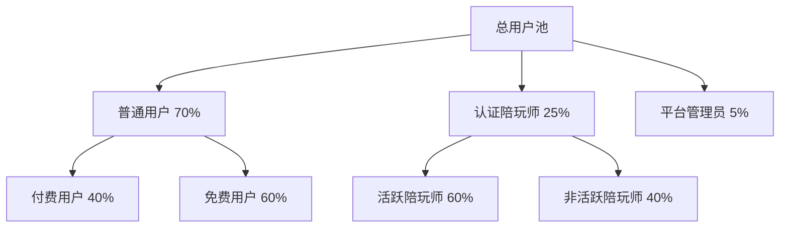
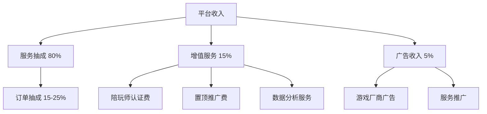

# 🎮 GameLink 产品概述

## 📊 文档信息

| 项目 | 内容 |
|------|------|
| **文档名称** | 产品概述文档 |
| **版本** | v1.0 |
| **创建日期** | 2025-12-05 |
| **作者** | Claude - 项目测试负责人 |
| **最后更新** | 2025-12-05 |

---

## 1. 产品愿景

### 🎯 核心目标

**GameLink** 致力于打造一个**专业、安全、高效**的游戏陪玩服务平台，连接热爱游戏的玩家与专业陪玩师，为游戏爱好者提供优质的游戏体验和技能提升机会。

### 🌟 产品口号

> **"连接每一场精彩对局，成就每一位游戏玩家"**

### 🏆 核心价值

1. **对游戏玩家**：
   - 快速找到匹配的高水平陪玩师
   - 提升游戏技能和体验
   - 安全便捷的支付保障

2. **对陪玩师**：
   - 稳定可靠的接单平台
   - 透明合理的收益分配
   - 个人品牌展示机会

3. **对平台**：
   - 构建健康的游戏生态社区
   - 建立行业标准和服务规范
   - 实现可持续的商业价值

---

## 2. 市场分析

### 2.1 市场规模

**全球游戏市场**：
- 2025年全球游戏市场规模预计达到 **$2500亿**
- 电竞用户规模突破 **30亿** 人次
- 游戏陪玩服务年增长率 **35%**

**目标市场**：
- 核心用户：18-35岁年轻游戏玩家
- 付费意愿：平均单次服务消费 **¥50-200**
- 复购率：满意用户复购率达到 **60%**

### 2.2 竞品分析

| 平台名称 | 优势 | 劣势 | 市场份额 |
|---------|------|------|----------|
| **比心陪练** | 用户基数大、品牌知名度高 | 服务标准化低、争议多 | 35% |
| **TT语音** | 社交属性强、用户粘性强 | 陪玩师质量参差不齐 | 25% |
| **游戏陪玩** | 专注游戏领域、匹配精准 | 功能单一、扩展性差 | 15% |
| **Other** | - | - | 25% |

### 2.3 市场机会

**痛点分析**：
- 🔴 现有平台服务质量参差不齐
- 🔴 纠纷处理机制不完善
- 🔴 用户体验不统一
- 🔴 数据监控和分析能力弱

**我们的机会**：
- ✅ **技术创新**：智能化订单匹配、实时数据监控
- ✅ **服务标准**：严格的陪玩师认证体系
- ✅ **用户体验**：三端统一设计，流畅交互体验
- ✅ **运营效率**：完善的后台管理和数据分析

---

## 3. 目标用户

### 3.1 用户分层

### 3.2 核心用户画像

**用户画像 1：竞技型玩家小刘**
- **基本信息**：25岁，男性，IT工程师
- **游戏偏好**：LOL、王者荣耀、CS:GO
- **使用场景**：想要提升段位，学习高端技巧
- **付费意愿**：¥100-300/次
- **使用频率**：每周2-3次

**用户画像 2：休闲玩家小芳**
- **基本信息**：22岁，女性，大学生
- **游戏偏好**：原神、动物森友会、休闲游戏
- **使用场景**：寻找游戏伙伴，提升游戏体验
- **付费意愿**：¥50-150/次
- **使用频率**：每周1-2次

**用户画像 3：职业选手阿强**
- **基本信息**：28岁，男性，前职业选手
- **专业技能**：多个游戏高段位
- **使用场景**：利用游戏技能赚取收入
- **接单意愿**：稳定接单，月收入目标¥8000+
- **服务质量**：专业、认真、高评分

---

## 4. 产品定位

### 4.1 产品定义

**GameLink** 是一个专注于**游戏陪玩领域**的B2C2C服务平台，通过技术手段连接游戏玩家与陪玩师，提供安全、高效、透明的游戏陪玩交易服务。

### 4.2 差异化竞争优势

| 维度 | GameLink | 竞品平均水平 |
|------|----------|-------------|
| **匹配精度** | AI智能匹配 + 人工干预 | 纯人工匹配 |
| **服务标准** | 严格认证 + 质量监控 | 认证标准不一 |
| **争议处理** | 系统化流程 + 24小时客服 | 处理效率低 |
| **数据透明** | 实时数据看板 | 数据不透明 |
| **技术架构** | 微服务 + 实时通讯 | 单体架构为主 |

### 4.3 价值主张

**对玩家**：
"告别孤单单排，找到合适的游戏伙伴，快速提升技能，享受游戏乐趣"

**对打手**：
"将游戏技能转化为稳定收入，灵活接单，收益透明，职业化发展"

**对平台**：
"构建游戏生态闭环，建立服务标准，实现多方共赢的商业模式"

---

## 5. 商业模式

### 5.1 收入来源

### 5.2 定价策略

**平台抽成**：
- 一般订单：15-20%
- 高额订单（>¥500）：10-15%
- 争议订单：额外5%服务费

**陪玩师定价**：
- 初级陪玩：¥30-50/小时
- 中级陪玩：¥50-100/小时
- 高级陪玩：¥100-300/小时
- 职业选手：¥300+/小时

### 5.3 盈利预测

**第一阶段（6个月）**：
- 注册用户：10,000
- 月活跃用户：2,000
- 月订单量：5,000
- 月收入：¥50,000
- 目标：实现收支平衡

**第二阶段（12个月）**：
- 注册用户：100,000
- 月活跃用户：20,000
- 月订单量：50,000
- 月收入：¥500,000
- 目标：实现盈利

**第三阶段（24个月）**：
- 注册用户：500,000
- 月活跃用户：100,000
- 月订单量：200,000
- 月收入：¥2,000,000
- 目标：规模化盈利

---

## 6. 成功指标

### 6.1 技术指标

| 指标 | 目标值 | 衡量方式 |
|------|--------|---------|
| 系统可用性 | 99.9% | 月度停机时间 |
| 平均响应时间 | <200ms | API监控 |
| 同时在线用户 | 10,000+ | 实时监控 |
| 订单处理能力 | 1000单/分钟 | 压测结果 |

### 6.2 业务指标

| 指标 | 6月目标 | 12月目标 | 24月目标 |
|------|---------|----------|----------|
| 注册用户数 | 10,000 | 100,000 | 500,000 |
| 月活跃用户 | 2,000 | 20,000 | 100,000 |
| 月订单量 | 5,000 | 50,000 | 200,000 |
| 订单完成率 | 85% | 90% | 95% |
| 用户满意度 | 4.0/5.0 | 4.3/5.0 | 4.5/5.0 |
| 复购率 | 40% | 50% | 60% |
| GMV | ¥50万/月 | ¥500万/月 | ¥2000万/月 |

### 6.3 用户指标

- **NPS（净推荐值）**：目标 > 30
- **用户留存率**：
  - 次日留存：> 40%
  - 7日留存：> 25%
  - 30日留存：> 15%
- **陪玩师活跃度**：
  - 月活跃打手：> 60%
  - 平均接单量：> 20单/月
  - 平均评分：> 4.5/5.0

---

## 7. 风险分析

### 7.1 技术风险

| 风险 | 影响 | 可能性 | 应对策略 |
|------|------|--------|----------|
| 系统性能瓶颈 | 高 | 中 | 提前压测，预留扩展空间 |
| 安全漏洞 | 高 | 低 | 定期安全审计，快速响应 |
| 第三方服务故障 | 中 | 中 | 多服务商备份，降级方案 |

### 7.2 业务风险

| 风险 | 影响 | 可能性 | 应对策略 |
|------|------|--------|----------|
| 用户增长不及预期 | 高 | 中 | 多渠道推广，产品优化 |
| 陪玩师供给不足 | 中 | 中 | 激励机制，培训体系 |
| 竞争加剧 | 中 | 高 | 差异化竞争，技术创新 |

### 7.3 法律风险

| 风险 | 影响 | 可能性 | 应对策略 |
|------|------|--------|----------|
| 游戏公司政策变化 | 中 | 中 | 合规运营，多元化发展 |
| 用户数据保护 | 高 | 低 | 严格遵守GDPR等法规 |
| 税务风险 | 中 | 低 | 规范财务，专业咨询 |

---

## 8. 发展规划

### 8.1 短期目标（3个月）

**核心任务** 🔴
1. 完成 MVP 版本开发
2. 修复测试系统故障
3. 实现核心业务流程闭环

**关键指标**：
- 注册用户：1,000+
- 认证打手：100+
- 日订单量：50+
- 系统可用性：99%

### 8.2 中期目标（6个月）

**核心任务** 🟡
1. 完善用户体验
2. 扩展游戏支持类型
3. 建立运营体系

**关键指标**：
- 注册用户：10,000+
- 认证打手：1,000+
- 日订单量：500+
- 用户满意度：4.0+

### 8.3 长期目标（12个月）

**核心任务** 🟢
1. 拓展增值服务
2. 探索海外市场
3. 构建游戏社区生态

**关键指标**：
- 注册用户：100,000+
- 认证打手：5,000+
- 日订单量：2,000+
- 月收入：¥500,000+

---

## 9. 相关文档

- [用户画像详细说明](./USER_PERSONAS.md)
- [功能需求规格](./FUNCTIONAL_REQUIREMENTS.md)
- [技术架构设计](./TECHNICAL_ARCHITECTURE.md)
- [迭代计划详情](./ITERATION_PLAN.md)

---

## 10. 附录

### 10.1 术语表

| 术语 | 解释 |
|------|------|
| 陪玩 | 游戏玩家雇佣技术较高的玩家一起游戏 |
| 打手 | 专业游戏陪玩师，提供游戏辅导服务 |
| 护航 | 陪玩师带领客户游戏，提升游戏体验 |
| 车队 | 多个陪玩师组成的团队，提供多人游戏服务 |
| GMV | Gross Merchandise Volume，成交总额 |
| NPS | Net Promoter Score，净推荐值 |

### 10.2 缩略语

| 缩写 | 全称 |
|------|------|
| PRD | Product Requirements Document |
| MVP | Minimum Viable Product |
| API | Application Programming Interface |
| JWT | JSON Web Token |
| RBAC | Role-Based Access Control |
| UI | User Interface |
| UX | User Experience |

### 10.3 参考链接

- [游戏陪玩市场研究报告](https://www.example.com/gaming-companion-market)
- [竞品分析文档](./docs/competitive-analysis.md)
- [用户调研报告](./docs/user-research-report.md)

---

**文档版本历史**

| 版本 | 日期 | 作者 | 变更说明 |
|------|------|------|----------|
| v1.0 | 2025-12-05 | Claude | 初始版本创建 |

---

**🎮 GameLink - 连接每一场精彩对局**

