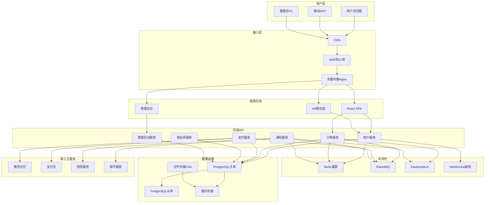
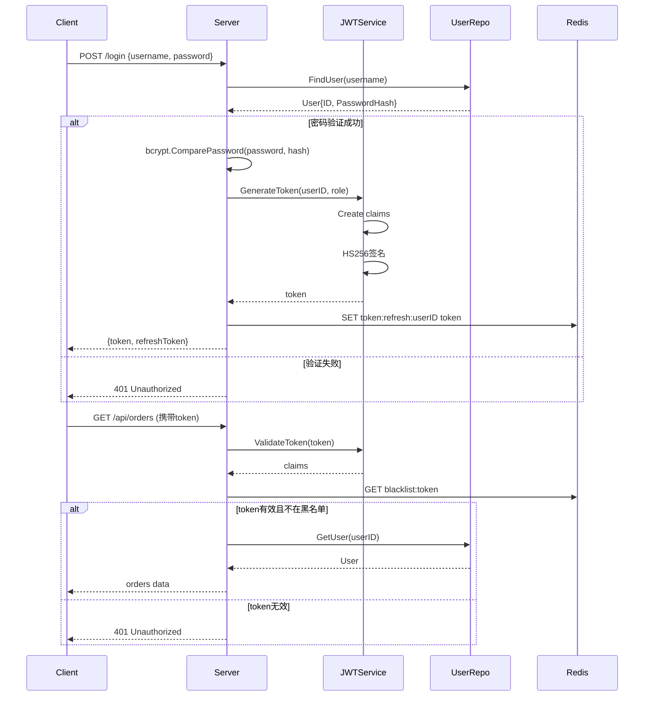

# 🏗️ GameLink 技术架构文档

## 📊 文档信息

| 项目 | 内容 |
|------|------|
| **文档名称** | 技术架构设计文档 |
| **版本** | v1.0 |
| **创建日期** | 2025-12-05 |
| **作者** | Claude - 项目测试负责人 |
| **最后更新** | 2025-12-05 |

---

## 1. 系统架构总览

### 1.1 整体架构图



### 1.2 分层架构

```
┌─────────────────────────────────────────┐
│           用户访问层                     │
│  (浏览器/移动端/桌面端)                  │
├─────────────────────────────────────────┤
│      前端应用层 (React + TypeScript)    │
├─────────────────────────────────────────┤
│     API网关层 (Nginx + 路由转发)        │
├─────────────────────────────────────────┤
│       业务服务层 (Go 微服务)           │
├─────────────────────────────────────────┤
│     中间件层 (Redis/RabbitMQ/ES)      │
├─────────────────────────────────────────┤
│      数据存储层 (PostgreSQL/OSS)       │
├─────────────────────────────────────────┤
│      基础设施层 (Docker/K8s)          │
└─────────────────────────────────────────┘
```

---

## 2. 技术栈选型

### 2.1 后端技术栈

| 技术 | 版本 | 用途 | 选择理由 |
|------|------|------|----------|
| **Go** | 1.25.3 | 编程语言 | 高并发、高性能、内存安全、部署简单 |
| **Gin** | 1.9.1 | Web框架 | 轻量级、性能优异、API友好、中间件支持 |
| **GORM** | 1.25.0 | ORM框架 | 支持复杂查询、自动迁移、事务管理 |
| **PostgreSQL** | 14.8 | 主数据库 | ACID强一致性、支持JSONB、地理空间数据 |
| **Redis** | 7.0 | 缓存与消息 | 高性能、数据结构丰富、主从复制 |
| **JWT** | v5 | 认证机制 | 无状态、跨语言、签名验证 |
| **Swagger** | 2.0 | API文档 | 自动生成、交互式测试 |

### 2.2 前端技术栈

| 技术 | 版本 | 用途 | 选择理由 |
|------|------|------|----------|
| **React** | 18.2 | UI框架 | 组件化、生态丰富、性能优秀 |
| **TypeScript** | 5.2 | 类型系统 | 类型安全、IDE友好、减少bug |
| **Vite** | 4.4 | 构建工具 | 极速冷启动、HMR、优化的打包 |
| **Ant Design** | 5.9 | UI组件库 | 企业级组件、设计规范、国际化 |
| **React Router** | 6.15 | 路由管理 | 声明式路由、嵌套路由支持 |
| **Axios** | 1.5 | HTTP客户端 | Promise支持、拦截器、请求取消 |
| **Less** | 4.2 | CSS预处理器 | 变量、嵌套、混合、函数支持 |

### 2.3 中间件与工具

| 技术 | 版本 | 用途 | 部署方式 |
|------|------|------|----------|
| **Redis** | 7.0 | 缓存、会话、排行榜 | 集群部署 |
| **RabbitMQ** | 3.12 | 异步消息队列 | 高可用集群 |
| **Elasticsearch** | 8.9 | 全文搜索、日志分析 | 主从部署 |
| **Nginx** | 1.24 | 反向代理、负载均衡 | 主备部署 |
| **Docker** | 24.0 | 容器化部署 | Swarm集群 |
| **Prometheus** | 2.45 | 监控告警 | 高可用 |

---

## 3. 后端架构详解

### 3.1 项目结构

```
backend/
├── cmd/                    # 应用入口
│   ├── user-service/       # 主服务
│   │   └── main.go
│   ├── admin-service/      # 管理后台服务
│   │   └── main.go
│   └── job-service/        # 定时任务服务
│       └── main.go
├── internal/               # 内部模块
│   ├── admin/              # 管理端handler
│   │   ├── dashboard.go
│   │   ├── user.go
│   │   ├── order.go
│   │   └── player.go
│   ├── handler/            # HTTP处理器
│   │   ├── user/           # 用户端API
│   │   │   ├── auth.go
│   │   │   ├── order.go
│   │   │   └── payment.go
│   │   └── player/         # 打手端API
│   │       └── dashboard.go
│   ├── service/            # 业务逻辑层
│   │   ├── auth.go
│   │   ├── order.go
│   │   ├── payment.go
│   │   └── player.go
│   ├── repository/         # 数据访问层
│   │   ├── user.go
│   │   ├── order.go
│   │   └── player.go
│   ├── model/              # 数据模型
│   │   ├── user.go
│   │   ├── order.go
│   │   ├── player.go
│   │   └── payment.go
│   ├── middleware/         # 中间件
│   │   ├── auth.go         # JWT认证
│   │   ├── cors.go         # CORS处理
│   │   ├── logger.go       # 日志记录
│   │   └── rate_limit.go   # 限流
│   ├── cache/              # 缓存层
│   │   ├── redis.go
│   │   └── cache_keys.go
│   ├── auth/               # 认证授权
│   │   ├── jwt.go
│   │   └── rbac.go
│   ├── config/             # 配置管理
│   │   ├── config.go
│   │   └── viper.go
│   └── utils/              # 工具函数
│       ├── response.go
│       ├── validator.go
│       └── random.go
├── configs/                # 配置文件
│   ├── config.yaml
│   └── config.prod.yaml
├── docs/swagger/           # API文档
├── scripts/                # 脚本
│   ├── migrate.sh
│   └── deploy.sh
├── Dockerfile
├── docker-compose.yml
└── go.mod
```

### 3.2 分层架构

```
┌─────────────────────────────────────────┐
│        HTTP Handler 层                  │
│  (接收请求、参数验证、返回响应)         │
├─────────────────────────────────────────┤
│        Service 业务层                   │
│  (业务逻辑、事务管理、规则验证)         │
├─────────────────────────────────────────┤
│      Repository 数据层                  │
│  (数据库操作、缓存操作、查询封装)       │
├─────────────────────────────────────────┤
│        Model 模型层                     │
│  (数据结构、数据库映射、验证规则)       │
└─────────────────────────────────────────┘
```

**分层职责**：

- **Handler层**：
  - 路由注册
  - 参数绑定和验证
  - 调用Service层
  - 返回统一响应格式
  - 不处理业务逻辑

- **Service层**：
  - 业务逻辑实现
  - 事务管理
  - 调用Repository层
  - 跨模块协调
  - 业务规则验证

- **Repository层**：
  - 数据库CRUD
  - 缓存操作
  - 复杂查询封装
  - 错误处理

- **Model层**：
  - 数据结构定义
  - 数据库表映射
  - 基础验证规则
  - 枚举定义

### 3.3 服务通信

#### 同步通信（HTTP）

```go
// 用户服务调用订单服务
func (s *UserService) GetUserWithOrders(userId uint64) (*UserWithOrders, error) {
    // 1. 查询用户基本信息
    user, err := s.userRepo.GetByID(userId)
    if err != nil {
        return nil, err
    }

    // 2. 调用订单服务获取订单列表
    orders, err := s.orderClient.GetOrdersByUserID(userId)
    if err != nil {
        return nil, err
    }

    return &UserWithOrders{
        User:   user,
        Orders: orders,
    }, nil
}
```

#### 异步通信（消息队列）

```go
// 订单创建成功后发送通知
func (s *OrderService) CreateOrder(req *CreateOrderRequest) (*Order, error) {
    // 1. 创建订单
    order, err := s.orderRepo.Create(req)
    if err != nil {
        return nil, err
    }

    // 2. 发送订单创建事件（异步）
    event := &OrderCreatedEvent{
        OrderID: order.ID,
        UserID:  order.UserID,
        Amount:  order.TotalPriceCents,
    }

    err = s.messageQueue.Publish("order.created", event)
    if err != nil {
        // 记录日志但不影响主流程
        log.Errorf("Failed to publish order event: %v", err)
    }

    return order, nil
}
```

---

### 3.4 认证与授权

#### JWT认证流程



#### RBAC权限控制

```go
// 权限中间件
func PermissionMiddleware(requiredPermission string) gin.HandlerFunc {
    return func(c *gin.Context) {
        userID := c.GetUint64("userID")

        // 查询用户角色
        roles, err := userRepo.GetUserRoles(userID)
        if err != nil {
            c.AbortWithStatusJSON(500, gin.H{"error": "Internal server error"})
            return
        }

        // 查询角色权限
        hasPermission := false
        for _, role := range roles {
            permissions, _ := roleRepo.GetRolePermissions(role.Code)
            for _, perm := range permissions {
                if perm.Code == requiredPermission {
                    hasPermission = true
                    break
                }
            }
            if hasPermission {
                break
            }
        }

        if !hasPermission {
            c.AbortWithStatusJSON(403, gin.H{"error": "Permission denied"})
            return
        }

        c.Next()
    }
}
```

**路由示例**：

```go
// 需要admin权限才能访问
adminGroup := r.Group("/api/admin")
adminGroup.Use(authMiddleware, PermissionMiddleware("admin.access"))
{
    adminGroup.GET("/users", adminHandler.GetUsers)
    adminGroup.DELETE("/users/:id", adminHandler.DeleteUser)
}
```

---

## 4. 数据库设计

### 4.1 主数据库（PostgreSQL）

**数据库架构**：

```
┌─────────────────────────────────────┐
│         PostgreSQL主库               │
│   (读写操作)                        │
├─────────────────────────────────────┤
│     CPU: 8核                        │
│     内存: 32GB                      │
│     磁盘: SSD 500GB                 │
│     连接池: 100                     │
└─────────────────────────────────────┘
            ↓ 主从复制
┌─────────────────────────────────────┐
│       PostgreSQL从库 x 2             │
│    (只读操作/负载均衡)               │
├─────────────────────────────────────┤
│     CPU: 8核                        │
│     内存: 32GB                      │
│     磁盘: SSD 500GB                 │
└─────────────────────────────────────┘
```

**分库策略**：

1. **垂直分库**：
   - `user_db`：用户、权限数据
   - `order_db`：订单、支付数据
   - `player_db`：陪玩师、游戏数据

2. **水平分库**（订单表）：
   - `orders_2025_q1`：2025年第一季度订单
   - `orders_2025_q2`：2025年第二季度订单
   - 按时间范围分片

**连接池配置**：

```go
db, err := gorm.Open(postgres.New(postgres.Config{
    DSN: "host=localhost user=gorm password=gorm dbname=gorm port=9920 sslmode=disable",
}), &gorm.Config{
    // 连接池配置
    PrepareStmt: true,  // 预编译SQL
}))

sqlDB, _ := db.DB()
sqlDB.SetMaxIdleConns(10)           // 最大空闲连接
sqlDB.SetMaxOpenConns(100)          // 最大打开连接
sqlDB.SetConnMaxLifetime(time.Hour) // 连接最大生命周期
```

---

### 4.2 Redis缓存架构

**Redis集群**：

```
┌─────────────────────────────────────┐
│          Redis Master               │
│      (slot 0-5460: 用户/权限)        │
├─────────────────────────────────────┤
│      slot 0-5460                    │
└─────────────────────────────────────┘
        ↓ 主从复制
┌─────────────────────────────────────┐
│      Redis Slave 1                  │
└─────────────────────────────────────┘
        ↓ 主从复制
┌─────────────────────────────────────┐
│      Redis Slave 2                  │
└─────────────────────────────────────┘

┌─────────────────────────────────────┐
│          Redis Master               │
│     (slot 5461-10922: 订单/支付)     │
├─────────────────────────────────────┤
│    slot 5461-10922                  │
└─────────────────────────────────────┘
        ↓ 主从复制
┌─────────────────────────────────────┐
│      Redis Slave 1                  │
└─────────────────────────────────────┘

┌─────────────────────────────────────┐
│          Redis Master               │
│    (slot 10923-16383: 排行榜/消息)   │
├─────────────────────────────────────┤
│   slot 10923-16383                  │
└─────────────────────────────────────┘
        ↓ 主从复制
┌─────────────────────────────────────┐
│      Redis Slave 1                  │
└─────────────────────────────────────┘
```

**缓存策略**：

| 数据类型 | 缓存Key | TTL | 说明 |
|----------|---------|-----|------|
| 用户信息 | `user:{userId}` | 1小时 | 基础信息 |
| 陪玩师信息 | `player:{playerId}` | 30分钟 | 包含评分、接单数 |
| 订单详情 | `order:{orderId}` | 5分钟 | 实时性要求高 |
| 订单列表 | `user:{userId}:orders:{page}` | 2分钟 | 分页缓存 |
| 陪玩师大类 | `players:{gameId}:{page}` | 5分钟 | 列表页 |
| 热门游戏 | `hot_games` | 1小时 | 首页数据 |
| 排行榜 | `rank:{type}` | 10分钟 | 实时更新 |

**Redis应用示例**：

```go
// 陪玩师排行榜
func (s *PlayerService) GetTopPlayers(gameID uint64, limit int) ([]*Player, error) {
    key := fmt.Sprintf("players:top:%d", gameID)

    // 先查缓存
    cachedData, err := redis.Get(ctx, key).Bytes()
    if err == nil {
        var players []*Player
        json.Unmarshal(cachedData, &players)
        return players, nil
    }

    // 缓存未命中，查询数据库
    players, err := s.playerRepo.GetTopByGame(gameID, limit)
    if err != nil {
        return nil, err
    }

    // 缓存结果
    data, _ := json.Marshal(players)
    redis.Set(ctx, key, data, 10*time.Minute)

    return players, nil
}
```

---

### 4.3 文件存储方案

**OSS存储**：

| 文件类型 | bucket | 访问权限 | 生命周期 |
|----------|--------|----------|----------|
| 用户头像 | `gamelink-avatar` | public-read | 永久 |
| 游戏图标 | `gamelink-game` | public-read | 永久 |
| 认证截图 | `gamelink-verify` | private | 7年 |
| 争议证据 | `gamelink-dispute` | private | 3年 |

**上传流程**：

```go
func (s *FileService) UploadAvatar(file multipart.File, userID uint64) (string, error) {
    // 1. 验证文件类型
    // 2. 验证文件大小
    // 3. 生成文件名
    filename := fmt.Sprintf("avatar/%d/%s.jpg", userID, uuid.New())

    // 4. 上传OSS
    err := ossClient.PutObject(
        "gamelink-avatar",
        filename,
        file,
        fileSize,
        minio.PutObjectOptions{
            ContentType: "image/jpeg",
        },
    )

    if err != nil {
        return "", err
    }

    // 5. 返回访问URL
    return fmt.Sprintf("https://cdn.gamelink.com/%s", filename), nil
}
```

---

### 4.4 Elasticsearch应用

**搜索索引配置**：

```json
{
  "mappings": {
    "properties": {
      "id": {"type": "long"},
      "nickname": {
        "type": "text",
        "analyzer": "ik_max_word",
        "search_analyzer": "ik_smart"
      },
      "game": {"type": "keyword"},
      "rank": {"type": "keyword"},
      "rating": {"type": "float"},
      "price": {"type": "long"},
      "status": {"type": "keyword"},
      "location": {"type": "geo_point"},
      "created_at": {"type": "date"}
    }
  }
}
```

**搜索示例**：

```go
// 搜索陪玩师
func (s *PlayerService) SearchPlayers(keyword string, filters map[string]interface{}) ([]*Player, error) {
    query := map[string]interface{}{
        "query": map[string]interface{}{
            "bool": map[string]interface{}{
                "must": []map[string]interface{}{
                    {
                        "multi_match": map[string]interface{}{
                            "query":     keyword,
                            "fields":    []string{"nickname", "game_name"},
                            "fuzziness": "AUTO",
                        },
                    },
                },
                "filter": []map[string]interface{}{
                    {
                        "term": map[string]interface{}{
                            "status": "verified",
                        },
                    },
                    {
                        "geo_distance": map[string]interface{}{
                            "distance": "50km",
                            "location": map[string]interface{}{
                                "lat": filters["lat"],
                                "lon": filters["lon"],
                            },
                        },
                    },
                },
            },
        },
        "sort": []map[string]interface{}{
            {"rating": map[string]string{"order": "desc"}},
            {"price": map[string]string{"order": "asc"}},
        },
    }

    // 执行搜索
    result, err := esClient.Search(
        esClient.Search.WithIndex("players"),
        esClient.Search.WithBody(bytes.NewReader(query)),
    )

    // 解析结果
    var players []*Player
    json.NewDecoder(result.Body).Decode(&players)

    return players, nil
}
```

---

## 5. 消息队列架构

### 5.1 RabbitMQ架构

```
┌─────────────────────────────────────┐
│          Exchange (topic)           │
├─────────────────────────────────────┤
│   order.created                     │
│   order.paid                        │
│   order.completed                   │
│   user.registered                   │
└─────────────────────────────────────┘
            ↓
┌─────────────────────────────────────┐
│         Queue Bindings              │
├─────────────────────────────────────┤
│   Q1: order.notifications           │
│   Q2: order.analytics               │
│   Q3: order.wallet                  │
│   Q4: user.welcome                  │
└─────────────────────────────────────┘
```

**队列配置**：

```go
// 订单创建事件
channel.ExchangeDeclare(
    "order.events",  // name
    "topic",         // type
    true,            // durable
    false,           // auto-deleted
    false,           // internal
    false,           // no-wait
    nil,             // arguments
)

// 通知队列
channel.QueueDeclare(
    "order.notifications",
    true,  // durable
    false, // delete when unused
    false, // exclusive
    false, // no-wait
    nil,   // arguments
)

channel.QueueBind(
    "order.notifications", // queue name
    "order.*",             // routing key
    "order.events",        // exchange
    false,
    nil,
)
```

**消息消费者**：

```go
// 订单通知消费者
func StartOrderNotificationConsumer() {
    msgs, err := channel.Consume(
        "order.notifications", // queue
        "",                    // consumer
        false,                 // auto-ack
        false,                 // exclusive
        false,                 // no-local
        false,                 // no-wait
        nil,                   // args
    )

    go func() {
        for msg := range msgs {
            var event OrderEvent
            json.Unmarshal(msg.Body, &event)

            // 处理通知
            switch event.Type {
            case "order.created":
                sendOrderCreatedNotification(event)
            case "order.paid":
                sendOrderPaidNotification(event)
            case "order.completed":
                sendOrderCompletedNotification(event)
            }

            msg.Ack(false)
        }
    }()
}
```

---

## 6. 微服务拆分

### 6.1 服务划分

| 服务名称 | 职责 | 数据库 | 端点 |
|----------|------|--------|------|
| user-service | 用户管理、认证 | user_db | 8081 |
| order-service | 订单生命周期 | order_db | 8082 |
| payment-service | 支付处理 | order_db | 8083 |
| player-service | 陪玩师管理 | player_db | 8084 |
| admin-service | 后台管理 | all_db | 8085 |
| notification-service | 通知推送 | - | 8086 |
| analytics-service | 数据分析 | order_db | 8087 |

### 6.2 服务通信

**同步通信（HTTP/gRPC）**：

```go
// order-service调用user-service
func (s *OrderService) createOrder(req *CreateOrderRequest) (*Order, error) {
    // 验证用户信息
    userResp, err := httpClient.Get(
        fmt.Sprintf("http://user-service:8081/api/users/%d", req.UserID),
    )

    if userResp.StatusCode != 200 {
        return nil, errors.New("user not found")
    }

    // 创建订单逻辑
    // ...
}
```

**异步通信（消息队列）**：

```go
// user-service收到用户注册事件
func handleUserRegistered(event *UserRegisteredEvent) {
    // 发送欢迎邮件
    go notificationService.SendWelcomeEmail(event.UserID)

    // 异步创建钱包
    go walletService.CreateWallet(event.UserID)

    // 记录用户行为
    go analyticsService.TrackUserEvent("registered", event)
}
```

---

## 7. DevOps与部署

### 7.1 Docker化

**Dockerfile示例**：

```dockerfile
# 构建阶段
FROM golang:1.25-alpine AS builder

WORKDIR /app

# 安装依赖
COPY go.mod go.sum ./
RUN go mod download

# 编译
COPY . .
RUN CGO_ENABLED=0 GOOS=linux go build -a -installsuffix cgo -o user-service ./cmd/user-service

# 运行阶段
FROM alpine:latest

RUN apk --no-cache add ca-certificates

WORKDIR /root/

# 复制二进制文件
COPY --from=builder /app/user-service .

# 复制配置文件
COPY --from=builder /app/configs ./configs

# 暴露端口
EXPOSE 8080

# 启动服务
CMD ["./user-service"]
```

**docker-compose.yml**：

```yaml
version: '3.8'

services:
  user-service:
    build:
      context: ./backend
      dockerfile: Dockerfile.user
    ports:
      - "8081:8080"
    environment:
      - DB_HOST=postgres
      - REDIS_HOST=redis
    depends_on:
      - postgres
      - redis
    networks:
      - gamelink-net

  order-service:
    build:
      context: ./backend
      dockerfile: Dockerfile.order
    ports:
      - "8082:8080"
    environment:
      - DB_HOST=postgres
      - REDIS_HOST=redis
      - RABBITMQ_HOST=rabbitmq
    depends_on:
      - postgres
      - redis
      - rabbitmq
    networks:
      - gamelink-net

  postgres:
    image: postgres:14
    environment:
      POSTGRES_USER: gamelink
      POSTGRES_PASSWORD: mypassword
      POSTGRES_DB: gamelink
    ports:
      - "5432:5432"
    volumes:
      - postgres_data:/var/lib/postgresql/data
    networks:
      - gamelink-net

  redis:
    image: redis:7-alpine
    ports:
      - "6379:6379"
    command: redis-server --appendonly yes
    volumes:
      - redis_data:/data
    networks:
      - gamelink-net

  rabbitmq:
    image: rabbitmq:3-management
    ports:
      - "5672:5672"
      - "15672:15672"
    environment:
      RABBITMQ_DEFAULT_USER: admin
      RABBITMQ_DEFAULT_PASS: admin
    networks:
      - gamelink-net

  frontend:
    build:
      context: ./frontend
      dockerfile: Dockerfile
    ports:
      - "5173:80"
    depends_on:
      - user-service
      - order-service
    networks:
      - gamelink-net

networks:
  gamelink-net:
    driver: bridge

volumes:
  postgres_data:
  redis_data:
```

### 7.2 CI/CD流程

**GitHub Actions工作流**：

```yaml
name: CI/CD Pipeline

on:
  push:
    branches: [ main, dev ]
  pull_request:
    branches: [ main ]

jobs:
  test:
    runs-on: ubuntu-latest

    services:
      postgres:
        image: postgres:14
        env:
          POSTGRES_USER: test
          POSTGRES_PASSWORD: test
          POSTGRES_DB: test
        ports:
          - 5432:5432

      redis:
        image: redis:7-alpine
        ports:
          - 6379:6379

    steps:
    - uses: actions/checkout@v3

    - name: Set up Go
      uses: actions/setup-go@v4
      with:
        go-version: '1.25'

    - name: Run tests
      run: |
        cd backend
        go mod download
        go test -v ./... -coverprofile=coverage.out

    - name: Upload coverage
      uses: codecov/codecov-action@v3
      with:
        file: ./backend/coverage.out

  build:
    needs: test
    runs-on: ubuntu-latest

    steps:
    - uses: actions/checkout@v3

    - name: Set up Docker Buildx
      uses: docker/setup-buildx-action@v2

    - name: Build and push
      uses: docker/build-push-action@v4
      with:
        context: ./backend
        push: true
        tags: |
          gamelink/user-service:${{ github.sha }}
          gamelink/user-service:latest

  deploy:
    needs: build
    runs-on: ubuntu-latest

    steps:
    - name: Deploy to production
      uses: appleboy/ssh-action@master
      with:
        host: ${{ secrets.PROD_HOST }}
        username: ${{ secrets.PROD_USER }}
        key: ${{ secrets.PROD_KEY }}
        script: |
          cd /opt/gamelink
          docker-compose pull
          docker-compose up -d
```

---

## 8. 监控与告警

### 8.1 Prometheus监控

**监控指标**：

```go
// 自定义指标
var (
    orderCounter = prometheus.NewCounterVec(
        prometheus.CounterOpts{
            Name: "gamelink_orders_total",
            Help: "Total number of orders",
        },
        []string{"status", "game"},
    )

    orderDuration = prometheus.NewHistogram(
        prometheus.HistogramOpts{
            Name:    "gamelink_order_duration_seconds",
            Help:    "Order processing duration",
            Buckets: prometheus.DefBuckets,
        },
    )

    activeUsers = prometheus.NewGauge(
        prometheus.GaugeOpts{
            Name: "gamelink_active_users",
            Help: "Number of active users",
        },
    )
)

func init() {
    prometheus.MustRegister(orderCounter)
    prometheus.MustRegister(orderDuration)
    prometheus.MustRegister(activeUsers)
}

// 在业务代码中使用
func (s *OrderService) CreateOrder(req *CreateOrderRequest) (*Order, error) {
    start := time.Now()
    defer func() {
        orderDuration.Observe(time.Since(start).Seconds())
    }()

    order, err := s.createOrderLogic(req)
    if err != nil {
        orderCounter.WithLabelValues("failed", req.GameID).Inc()
        return nil, err
    }

    orderCounter.WithLabelValues("success", req.GameID).Inc()
    return order, nil
}
```

**Grafana Dashboard**：

- 订单统计面板
- 用户活跃度面板
- 系统性能面板
- 错误率监控面板

### 8.2 日志收集

**ELK Stack**：

```go
// 日志配置
import (
    "go.uber.org/zap"
    "go.uber.org/zap/zapcore"
)

func InitLogger() *zap.Logger {
    config := zap.NewProductionConfig()
    config.EncoderConfig.TimeKey = "timestamp"
    config.EncoderConfig.EncodeTime = zapcore.ISO8601TimeEncoder

    logger, _ := config.Build()
    return logger
}

// 使用示例
logger.Info("订单创建成功",
    zap.Uint64("orderId", order.ID),
    zap.Uint64("userId", order.UserID),
    zap.Int64("amount", order.TotalPriceCents),
    zap.String("game", order.GameID),
)

logger.Error("订单创建失败",
    zap.Error(err),
    zap.Any("request", req),
)
```

**日志格式**：

```json
{
  "timestamp": "2025-12-05T10:30:00.123Z",
  "level": "info",
  "message": "订单创建成功",
  "orderId": 10001,
  "userId": 123,
  "amount": 5000,
  "game": "lol",
  "service": "order-service",
  "traceId": "a1b2c3d4-e5f6-7890",
  "spanId": "b2c3d4e5-f6g7-8901"
}
```

---

## 9. 性能优化

### 9.1 数据库优化

**慢查询优化**：

```sql
-- 优化前
SELECT * FROM orders WHERE user_id = 123 ORDER BY created_at DESC;

-- 优化后
SELECT id, order_no, status, total_price_cents, created_at
FROM orders
WHERE user_id = 123
  AND status IN ('pending', 'confirmed', 'in_progress')
ORDER BY created_at DESC
LIMIT 20;

-- 添加复合索引
CREATE INDEX idx_orders_user_status_created
ON orders(user_id, status, created_at DESC);
```

### 9.2 缓存优化

**缓存雪崩预防**：

```go
// 随机过期时间
func SetWithRandomTTL(key string, value interface{}, baseTTL time.Duration) {
    // 添加随机偏移 (±10%)
    randomOffset := time.Duration(rand.Int63n(int64(baseTTL / 10)))
    ttl := baseTTL + randomOffset - baseTTL/20

    redis.Set(ctx, key, value, ttl)
}

// 缓存穿透保护
func GetWithCacheAside(key string, loader func() (interface{}, error)) (interface{}, error) {
    // 查询缓存
    data, err := redis.Get(ctx, key).Result()
    if err == nil {
        return data, nil
    }

    // 查询数据库
    data, err = loader()
    if err != nil {
        // 防止缓存穿透，缓存空值
        if err == gorm.ErrRecordNotFound {
            redis.Set(ctx, key, "", 5*time.Minute)
            return nil, nil
        }
        return nil, err
    }

    // 缓存结果
    redis.Set(ctx, key, data, 30*time.Minute)
    return data, nil
}
```

### 9.3 并发优化

**连接池优化**：

```go
// HTTP客户端连接池
transport := &http.Transport{
    MaxIdleConns:        100,              // 最大空闲连接
    MaxIdleConnsPerHost: 10,               // 每个host最大空闲连接
    IdleConnTimeout:     90 * time.Second, // 空闲超时
}

client := &http.Client{
    Transport: transport,
    Timeout:   30 * time.Second,
}

// gRPC连接池
conn, err := grpc.Dial(
    "user-service:8081",
    grpc.WithInsecure(),
    grpc.WithKeepaliveParams(keepalive.ClientParameters{
        Time:    10 * time.Second,
        Timeout: 20 * time.Second,
    }),
    grpc.WithDefaultServiceConfig(`{"loadBalancingConfig": [{"round_robin":{}}]}`),
)
```

---

## 10. 安全架构

### 10.1 网络安全

**WAF规则示例**：

```nginx
# 防护SQL注入
if ($request_uri ~* (union.*select|insert.*into|update.*set|delete.*from)) {
    return 403;
}

# 限制请求频率
limit_req_zone $binary_remote_addr zone=api:10m rate=10r/s;
limit_req zone=api burst=20 nodelay;

# IP白名单
allow 192.168.1.0/24;
deny all;
```

### 10.2 应用安全

**输入验证**：

```go
// 使用validator库
type CreateOrderRequest struct {
    UserID        uint64  `json:"userId" binding:"required,min=1"`
    ItemID        uint64  `json:"itemId" binding:"required,min=1"`
    Quantity      int     `json:"quantity" binding:"required,min=1,max=24"`
    TotalPriceCents int64 `json:"totalPriceCents" binding:"required,min=100"`
}

func (h *OrderHandler) CreateOrder(c *gin.Context) {
    var req CreateOrderRequest
    if err := c.ShouldBindJSON(&req); err != nil {
        c.JSON(400, gin.H{"error": err.Error()})
        return
    }

    // 自定义验证
    if req.TotalPriceCents != calculatePrice(req.ItemID, req.Quantity) {
        c.JSON(400, gin.H{"error": "Price mismatch"})
        return
    }
}
```

**SQL注入防护**：

```go
// 使用参数化查询
deleteSQL := `DELETE FROM orders WHERE id = $1 AND user_id = $2`
result, err := db.Exec(deleteSQL, orderID, userID)

// 使用GORM安全查询
db.Where("id = ? AND user_id = ?", orderID, userID).Delete(&Order{})

// 禁止使用字符串拼接
// ❌ 错误示例
deleteSQL := fmt.Sprintf("DELETE FROM orders WHERE id = %d", orderID)
```

### 10.3 数据安全

**敏感数据加密**：

```go
// 使用AES加密敏感数据
func encrypt(data []byte, key []byte) ([]byte, error) {
    block, err := aes.NewCipher(key)
    if err != nil {
        return nil, err
    }

    gcm, err := cipher.NewGCM(block)
    if err != nil {
        return nil, err
    }

    nonce := make([]byte, gcm.NonceSize())
    if _, err := io.ReadFull(rand.Reader, nonce); err != nil {
        return nil, err
    }

    ciphertext := gcm.Seal(nonce, nonce, data, nil)
    return ciphertext, nil
}

// 存储手机号加密
encryptedPhone, _ := encrypt([]byte(user.Phone), encryptionKey)
db.Model(&user).Update("phone_encrypted", encryptedPhone)
```

---

## 11. 容灾与备份

### 11.1 数据库备份

**备份策略**：

| 备份类型 | 频率 | 保留时间 | 存储位置 |
|----------|------|----------|----------|
| 全量备份 | 每日 | 30天 | S3 + 本地 |
| 增量备份 | 每小时 | 7天 | S3 |
| Binlog | 实时 | 30天 | S3 |

**恢复演练**：

```bash
#!/bin/bash
# 自动化恢复脚本

# 1. 停止应用服务
docker-compose stop app

# 2. 恢复全量备份
mysql -u root -p < /backup/full_$(date -d '1 day ago' +%Y%m%d).sql

# 3. 恢复增量备份
for backup in /backup/inc_*.sql; do
    mysql -u root -p < $backup
done

# 4. 应用Binlog（恢复到最新）
mysqlbinlog /backup/binlog.000001 | mysql -u root -p

# 5. 启动应用服务
docker-compose start app

echo "恢复完成，请验证数据完整性"
```

---

## 12. 附录

### 12.1 架构决策记录 (ADR)

**ADR-001: 选择Go作为后端语言**

- **日期**: 2025-01-15
- **决策**: 使用Go 1.25作为后端开发语言
- **理由**:
  - 高并发性能优异
  - 内存安全、GC高效
  - 部署简单（单二进制）
  - 团队熟悉度高
- **后果**: 需要学习Go生态的测试框架、ORM等工具

**ADR-002: 选择PostgreSQL作为主数据库**

- **日期**: 2025-01-20
- **决策**: 使用PostgreSQL 14作为主数据库
- **理由**:
  - ACID强一致性
  - 支持复杂查询
  - JSONB字段支持
  - 性能稳定
- **后果**: 需要额外的Redis做缓存

### 12.2 相关文档

- [功能需求文档](./FUNCTIONAL_REQUIREMENTS.md)
- [数据模型文档](./DATA_MODEL.md)
- [UI/UX设计文档](./UI_UX_DESIGN.md)
- [部署文档](./DEPLOYMENT.md)

---

**文档版本历史**

| 版本 | 日期 | 作者 | 变更说明 |
|------|------|------|----------|
| v1.0 | 2025-12-05 | Claude | 初始版本，包含完整技术架构设计 |

---

<div align="center">

**🏗️ 架构设计决定系统上限**

</div>
