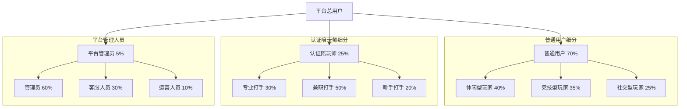
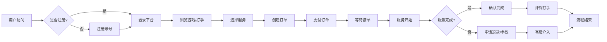
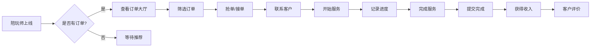
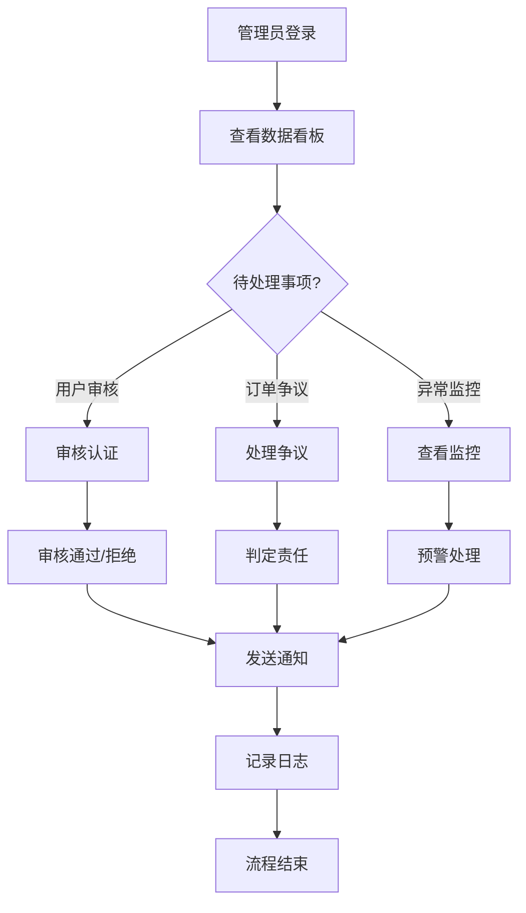

# 👥 GameLink 用户画像与使用场景

## 📊 文档信息

| 项目 | 内容 |
|------|------|
| **文档名称** | 用户画像与使用场景文档 |
| **版本** | v1.0 |
| **创建日期** | 2025-12-05 |
| **作者** | Claude - 项目测试负责人 |
| **最后更新** | 2025-12-05 |

---

## 用户分层结构

---

## 1. 普通用户画像

### 1.1 用户画像：小刘 - 竞技型玩家

#### 📸 基本信息

**姓名**：小刘
**年龄**：25岁
**性别**：男性
**职业**：软件开发工程师
**月收入**：¥15,000-20,000
**所在城市**：一线城市

#### 🎯 用户特征

**游戏偏好**：
- 🎮 主要游戏：英雄联盟钻石段位、王者荣耀星耀
- ⏰ 游戏时长：工作日2-3小时，周末4-6小时
- 🏆 竞技心态：追求段位提升，重视游戏成绩
- 🤝 组队偏好：喜欢与高手组队学习

**技术能力**：
- 💻 对APP操作熟练，接受新功能快
- 📱 主要使用iPhone 14 Pro，网络环境良好
- 🔧 对游戏数据分析感兴趣

**消费观念**：
- 💰 愿意为提升技能付费，平均每次消费¥100-300
- ⭐ 重视服务质量，价格敏感度中等
- 🎁 对会员、特权等增值服务有购买意愿

#### 📝 典型使用场景

**场景1：周末上分**
> 周六下午，小刘打开GameLink，想找个高段位陪玩师一起双排上分。他筛选了钻石以上段位、评分4.8+的陪玩师，查看其擅长英雄和服务评价。选中一个后，创建了2小时的护航订单，通过微信支付完成付款。陪玩师接单后，两人通过平台的实时语音沟通，顺利上了两个小段位。服务结束后，小刘给了五星好评，并关注了该陪玩师。

**场景2：学习新英雄**
> 游戏版本更新后，小刘想练习新英雄。他在平台找到一个专门教授该英雄的陪玩师，预约了1v1教学服务。通过屏幕分享和实时指导，快速掌握了英雄技巧。

**场景3：车队体验**
> 小刘想体验五排车队的感觉，在平台发起了一个团队护航订单，一次匹配到4个陪玩师。虽然是付费服务，但游戏体验极佳，认识了几位技术不错的打手。

#### 💡 需求痛点

| 痛点 | 期望的解决方案 |
|------|--------------|
| 匹配到不合适的陪玩师 | 精准的筛选和推荐机制 |
| 担心付费后服务质量不佳 | 严格的陪玩师认证和评价系统 |
| 支付安全顾虑 | 平台担保交易，支持退款 |
| 时间协调困难 | 灵活的预约系统，支持即时和预约 |

---

### 1.2 用户画像：小芳 - 休闲型玩家

#### 📸 基本信息

**姓名**：小芳
**年龄**：22岁
**性别**：女性
**职业**：大学生
**月收入**：¥2,000-3,000（生活费）
**所在城市**：二线城市

#### 🎯 用户特征

**游戏偏好**：
- 🎮 主要游戏：原神、动物森友会、光遇
- ⏰ 游戏时长：每天1-2小时，周末3-4小时
- 🌟 游戏目的：放松娱乐，社交互动
- 🎨 重视游戏画面和剧情体验

**技术能力**：
- 📱 手机使用为主（Android）
- 💡 对复杂功能接受度一般
- 🎮 游戏技能中等，愿意学习

**消费观念**：
- 💰 消费能力有限，每次消费¥50-150
- 🎯 重视性价比，喜欢优惠活动
- 💝 对礼物赠送、互动功能感兴趣

#### 📝 典型使用场景

**场景1：寻找游戏伙伴**
> 小芳一个人玩原神感到孤单，想在GameLink找温柔的小姐姐一起玩。她筛选了女性陪玩师、声音好听、性格温柔的标签。找到一个打手后，创建了一个1小时的休闲游戏订单。过程中主要聊游戏剧情和角色，体验很好。

**场景2：送游戏礼物**
> 小芳喜欢的主播过生日，在平台购买了游戏礼物（定制游戏道具+祝福视频），通过平台匿名送给对方。主播收到礼物后很感动，小芳也获得了满足感。

**场景3：学习游戏技巧**
> 原神新深渊难度较高，小芳找了一个攻略大神指导。通过语音指导，顺利通关了之前卡关的关卡。

#### 💡 需求痛点

| 痛点 | 期望的解决方案 |
|------|--------------|
| 价格太贵 | 提供不同价位选择，学生优惠 |
| 陪玩师态度不好 | 建立评价机制，优先推荐高质量打手 |
| 沟通不顺畅 | 简化操作流程，提供实时语音 |
| 担心隐私泄露 | 匿名购买礼物等功能 |

---

### 1.3 用户画像：阿杰 - 社交型玩家

#### 📸 基本信息

**姓名**：阿杰
**年龄**：28岁
**性别**：男性
**职业**：销售经理
**月收入**：¥12,000-15,000
**所在城市**：一线城市

#### 🎯 用户特征

**游戏偏好**：
- 🎮 主要游戏：王者荣耀、和平精英
- ⏰ 游戏时长：工作日1小时，周末3-4小时
- 🤝 重视社交互动，喜欢组队开黑
- 💬 喜欢与陪玩师聊天交流

**技术能力**：
- 📱 设备配置高（游戏手机）
- 💼 工作较忙，时间碎片化
- 📊 重视游戏数据和成就展示

**消费观念**：
- 💰 消费能力强，每次消费¥200-500
- 🎁 喜欢送朋友礼物，也乐于收到礼物
- ⭐ 重视服务质量和游戏体验感

#### 📝 典型使用场景

**场景1：商务应酬**
> 阿杰约了客户商务聚餐，餐后想找个轻松的娱乐方式。他们在GameLink上预约了一个团队游戏服务，4个客户加上2个陪玩师，玩了几局王者荣耀。这种新颖的社交方式让客户印象深刻，也顺利推进了业务合作。

**场景2：朋友聚会**
> 周末朋友来阿杰家里聚会，5个人想一起玩和平精英，但技术差距太大体验不好。阿杰在平台找了一位大神陪玩师，指导朋友们游戏技巧，同时对录制了精彩时刻。大家都玩得很开心。

**场景3：解压放松**
> 工作压力大的晚上，阿杰不想一个人打游戏，想找个人聊天。他选择了一位声音好听、会聊天的陪玩师，边游戏边聊天，很好地缓解了工作压力。

#### 💡 需求痛点

| 痛点 | 期望的解决方案 |
|------|--------------|
| 时间不固定 | 支持即时匹配，快速开局 |
| 想认识新朋友 | 高质量陪玩师推荐 |
| 多元化的游戏需求 | 支持多种游戏类型和服务类型 |
| 社交功能 | 添加好友、关注系统等 |

---

## 2. 陪玩师画像

### 2.1 打手画像：阿强 - 专业打手

#### 📸 基本信息

**姓名**：阿强
**年龄**：24岁
**性别**：男性
**职业**：全职陪玩师
**月收入**：¥8,000-15,000
**所在城市**：三线城市

#### 🏆 专业能力

**游戏技能**：
- 🏅 英雄联盟一区王者段位（前0.1%）
- 🎯 擅长多个位置，英雄池深厚
- ⭐ 国服排名多次进入前100
- 🎮 游戏理解深刻，战术意识强

**服务能力**：
- 💬 沟通能力优秀，有解说经验
- 🎓 教学能力强，善于总结技巧
- ⏰ 时间稳定，每天游戏6-8小时
- 💼 服务意识强，重视客户评价

#### 💰 收入结构

**收入来源**：
- 🎯 日常接单：时薪¥80-150，每天4-6单
- 🏆 高段位订单：额外收费30%
- 👥 固定客户：5-8个长期客户
- 💰 月收入稳定在¥12,000左右

**成本支出**：
- 💻 设备投入：高端电脑+外设（一次性）
- 🌐 网络费用：高速网络¥200/月
- 🏠 租房成本：¥1,500/月（专门的工作室）

#### 📝 典型工作场景

**场景1：夜班高峰**
> 晚上8点开始是订单高峰期，阿强准时上线接单。第一单是一个钻石段位想上王者的客户，预定了3小时。阿强选择了擅长的打野位置，通过优秀的节奏带动，连胜8局，顺利帮客户晋升王者。客户非常满意，给了五星好评，一个多小时后又复购了一次。

**场景2：教学订单**
> 一个有游戏基础的客户想系统学习打野技巧，预约了阿强的5小时教学服务。阿强制定了详细的教学计划：从刷野路线、Gank时机、视野控制等多个维度进行教学，还分享了自定义的练习模式设置。客户学习效果显著，后来成为了阿强的固定客户。

**场景3：职业转型**
> 阿强之前在工厂打工，通过朋友接触到游戏陪玩。经过1年的努力，他成功转型为全职陪玩师，收入比工厂工作高出一倍，而且时间安排更自由。现在在平台积累了200+好评，成为了优质打手的代表。

#### 💡 职业痛点

| 痛点 | 期望的解决方案 |
|------|--------------|
| 订单不稳定 | 稳定的订单来源，保证最低收入 |
| 恶性竞争 | 平台规则保护，合理的价格体系 |
| 客户纠纷 | 清晰的规则，公正的仲裁机制 |
| 职业发展 | 打手等级体系，优质订单倾斜 |

---

### 2.2 打手画像：小美 - 兼职打手

#### 📸 基本信息

**姓名**：小美
**年龄**：21岁
**性别**：女性
**职业**：大学生
**月收入**：¥2,000-4,000
**所在城市**：二线城市

#### 🏆 专业能力

**游戏技能**：
- 🎯 王者荣耀星耀段位
- 💫 擅长辅助和法师位置
- 🎨 游戏画风好看，女性玩家优势
- 🎭 善于活跃气氛，沟通能力强

**服务能力**：
- 💬 声音甜美，性格温柔
- 🎪 会聊天，能活跃团队气氛
- ⏰ 利用课余时间接单
- 💰 主要收入来源之一

#### 💰 收入结构

**接单时间**：
- 📅 主要接单时间：晚上7-11点、周末全天
- 🎯 每周接10-15单，每单1-3小时
- 💰 时薪¥50-80，月收入¥2,000-4,000
- 💡 覆盖生活费+购物开支

#### 📝 典型工作场景

**场景1：课后兼职**
> 下午课程结束后，小美回到宿舍，吃过晚饭开始接单。主要接王者荣耀的女性玩家订单，因为共同话题多，体验比较好。一般2-3小时，可以边玩边和客户聊天，相对比较轻松。

**场景2：陪聊订单**
> 相比于技术提升，很多客户更想要好的游戏体验，所以小美的陪聊订单比较多。通过活跃气氛、鼓励队友、分享趣事，让客户在轻松愉快的氛围中享受游戏。

**场景3：收入补充**
> 小美的父母给的生活费足够基本开支，但通过陪玩赚到的钱可以自由支配，购买喜欢的化妆品、衣服等。她把这个当成一份爱好+收入的兼职，既能享受游戏，又能赚钱。

#### 💡 职业痛点

| 痛点 | 期望的解决方案 |
|------|--------------|
| 时间不固定 | 灵活的接单时间，支持随时下线 |
| 学业与接单平衡 | 不强制在线时长，自由安排 |
| 技能提升 | 提供培训，帮助提升水平 |
| 安全问题 | 女性打手保护机制 |

---

## 3. 管理员画像

### 3.1 管理画像：张经理

#### 📸 基本信息

**姓名**：张经理
**年龄**：32岁
**性别**：男性
**职位**：平台运营经理
**工作经验**：5年互联网运营
**管理规模**：10人团队

#### 🎯 工作职责

**用户管理**：
- 👥 用户认证审核（陪玩师认证）
- 🚫 处理违规用户封禁/解封
- 💬 处理用户投诉和纠纷
- 📈 用户数据分析和运营

**订单管理**：
- 📋 监控异常订单
- 💰 处理退款申请
- ⚠️ 介入订单争议
- 📊 订单数据统计

**平台运营**：
- 🎮 游戏和服务项目管理
- 💰 定价策略调整
- 📢 活动策划和推广
- 📊 数据监控和报表

#### 📊 日常工作场景

**场景1：陪玩师认证审核**
> 早上一上班，张经理打开后台系统，看到10个新的陪玩师认证申请。他逐一审核资料：游戏段位证明、身份信息、技能描述等。审批通过6个，驳回4个（资料不齐全）。通过系统消息通知申请者结果。

**场景2：争议订单处理**
> 一个客户投诉陪玩师服务态度不好，要求退款。张经理查看订单详情：聊天记录、服务时长、付款信息。发现陪玩师确实有不当言行，决定部分退款（50%），并对打手进行警告教育。

**场景3：数据分析**
> 每周张经理会导出平台数据进行分析：用户增长趋势、订单转化率、打手活跃度等。根据数据调整运营策略，下周计划推出新用户首单优惠活动。

**场景4：系统配置**
> 新游戏发布后，张经理在后台添加游戏信息，配置相应的服务类型和价格范围。同时设置热门的活动标签，提升该游戏的订单转化率。

#### 💡 管理痛点

| 痛点 | 期望的解决方案 |
|------|--------------|
| 重复性工作多 | 自动化审核规则，智能预警 |
| 数据分散 | 统一的数据看板，一键导出 |
| 用户投诉处理效率 | 标准化的处理流程，模板化回复 |
| 运营效果评估 | 详细的数据分析，A/B测试功能 |

---

## 4. 用户需求总结

### 4.1 三类核心需求

#### 🎯 普通用户需求

**基础需求**：
- ✅ 简单易用的注册登录
- ✅ 清晰的陪玩师信息展示
- ✅ 便捷的订单创建和支付
- ✅ 可靠的售后服务

**期望需求**：
- 🌟 智能推荐合适的陪玩师
- 🌟 详细的服务评价体系
- 🌟 灵活的预约时间安排
- 🌟 优惠活动和会员权益

**兴奋需求**：
- 💎 专属客服服务
- 💎 游戏数据分析报告
- 💎 社区交流平台
- 💎 游戏资讯和攻略

#### 👨‍💼 陪玩师需求

**基础需求**：
- ✅ 稳定的订单来源
- ✅ 清晰的收益结算
- ✅ 合理的平台抽成
- ✅ 便捷的操作界面

**期望需求**：
- 🌟 优质的订单推荐
- 🌟 个人品牌展示
- 🌟 技能提升培训
- 🌟 社区交流平台

**兴奋需求**：
- 💎 职业发展规划
- 💎 赛事参与机会
- 💎 粉丝经济体系
- 💎 跨界合作机会

#### 👨‍💻 管理员需求

**基础需求**：
- ✅ 高效的管理工具
- ✅ 完整的用户数据
- ✅ 便捷的审核流程
- ✅ 稳定的后台系统

**期望需求**：
- 🌟 智能的数据分析
- 🌟 自动化的运营工具
- 🌟 灵活的权限管理
- 🌟 完善的日志系统

**兴奋需求**：
- 💎 AI辅助决策
- 💎 预测性分析
- 💎 多平台管理
- 💎 开放API接口

### 4.2 优先级矩阵

| 需求类型 | 普通用户 | 打手 | 管理员 | 优先级 |
|---------|---------|------|--------|--------|
| 注册登录 | 高 | 高 | 高 | P0 |
| 下单支付 | 高 | 中 | 低 | P0 |
| 接单管理 | 低 | 高 | 中 | P0 |
| 后台管理 | 低 | 低 | 高 | P0 |
| 搜索筛选 | 中 | 中 | 低 | P1 |
| 评价体系 | 中 | 高 | 中 | P1 |
| 数据分析 | 低 | 低 | 高 | P1 |
| 社区功能 | 低 | 中 | 低 | P2 |
| 消息通知 | 中 | 中 | 中 | P1 |
| 营销推广 | 中 | 低 | 高 | P1 |

---

## 5. 使用场景汇总

### 5.1 用户端使用场景流程

### 5.2 打手端使用场景流程

### 5.3 管理端使用场景流程

---

## 6. 需求验证方法

### 6.1 用户访谈计划

**访谈对象**：
- 普通用户：10-15人（不同类型）
- 认证打手：8-10人（不同等级）
- 管理人员：3-5人

**访谈内容**：
- 使用习惯和需求
- 痛点和改进建议
- 功能优先级排序
- 付费意愿调研

### 6.2 数据分析指标

**用户行为数据**：
- 日活跃用户（DAU）
- 月活跃用户（MAU）
- 用户留存率
- 平均使用时长

**业务数据**：
- 订单转化率
- 客单价
- 复购率
- 用户评分

**运营数据**：
- 认证通过率
- 争议发生率
- 平均处理时长
- 用户满意度

### 6.3 A/B测试计划

**测试内容**：
- 首页设计优化
- 订单流程简化
- 价格策略调整
- 推荐算法优化

---

## 7. 附录

### 7.1 用户调研问卷

**普通用户问卷**：
- 您的游戏类型偏好？
- 每月游戏陪玩预算？
- 最看重陪玩师什么特质？
- 期望的服务时长？

**打手问卷**：
- 您的游戏技能水平？
- 期望的月收入？
- 可接单时间段？
- 对平台抽成的接受度？

**管理人员访谈提纲**：
- 日常管理的主要痛点？
- 希望自动化的功能？
- 数据监控的关键指标？
- 对运营工具有何需求？

### 7.2 相关文档

- [功能需求规格](./FUNCTIONAL_REQUIREMENTS.md)
- [使用场景详细说明](./DETAILED_USE_CASES.md)
- [用户调研报告](./USER_RESEARCH_REPORT.md)

---

**文档版本历史**

| 版本 | 日期 | 作者 | 变更说明 |
|------|------|------|----------|
| v1.0 | 2025-12-05 | Claude | 初始版本创建，包含6个典型用户画像 |

---

**👥 用户至上，以用户需求驱动产品迭代**

