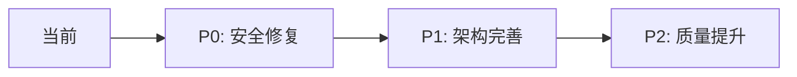

# GameLink Client 代码审查报告

> **审查日期**: 2025-01-13
> **审查团队**: Super Dev Team
> **项目状态**: 基础架构已搭建，正在开发中

---

## 📊 审查概览

| 维度 | 评分 | 状态 |
|:-----|:-----|:-----|
| **总体评分** | 75/100 | B+ |
| **安全性** | 45/100 | 🔴 需紧急修复 |
| **架构设计** | 80/100 | ✅ 良好 |
| **性能** | 70/100 | ⚠️ 需优化 |
| **类型安全** | 85/100 | ✅ 优秀 |
| **可维护性** | 70/100 | ⚠️ 需改进 |
| **测试覆盖** | 0/100 | 🔴 缺失 |

---

## 🚨 关键安全问题

### 1. Token 存储漏洞 (Critical)

**文件**: `src/stores/modules/auth-store.ts:151`

```typescript
// ❌ 当前实现
partialize: (state) => ({
    token: state.token,        // XSS 可窃取
    refreshToken: state.refreshToken,
})
```

**风险**: 恶意脚本可通过 XSS 窃取存储在 localStorage 的 token

**修复方案**:
```typescript
// ✅ 推荐方案
// 1. Token 只存内存，不持久化
partialize: (state) => ({
    // 不包含 token
    user: state.user,
    role: state.role,
})

// 2. 使用 httpOnly Cookie (后端配合)
```

### 2. WebSocket Token 泄露 (Critical)

**文件**: `src/lib/websocket.ts:30`

```typescript
// ❌ 当前实现
const wsUrl = `${this.url}?token=${token}`;
// Token 会出现在浏览器历史、访问日志、代理服务器
```

**修复方案**:
```typescript
// ✅ 使用 WebSocket 子协议
this.socket = new WebSocket(wsUrl, ['bearer-' + token]);

// 或连接后发送认证消息
this.socket.onopen = () => {
    this.socket.send(JSON.stringify({ type: 'auth', token }));
};
```

### 3. 缺少 Token 刷新机制 (High)

**文件**: `src/stores/modules/auth-store.ts:109`

```typescript
// ❌ 空实现
refresh: async () => {
    // TODO: Implement refresh token logic
}
```

**修复方案**:
```typescript
refresh: async () => {
    const { refreshToken } = get();
    if (!refreshToken) {
        await get().logout();
        return;
    }

    try {
        const data = await http.post('/auth/refresh', { refreshToken });
        set({ token: data.token });
    } catch (err) {
        await get().logout();
    }
}
```

### 4. 缺少 CSRF 保护 (High)

**文件**: `src/lib/http.ts`

**修复方案**:
```typescript
constructor() {
    this.instance = axios.create({
        baseURL: '/api/v1',
        withCredentials: true,  // 添加
        xsrfCookieName: 'csrf_token',
        xsrfHeaderName: 'X-CSRF-Token',
    });
}
```

---

## 🏗️ 架构设计审查

### Stores 状态矩阵

| Store | 完整度 | 问题 |
|:------|:-------|:-----|
| `auth-store.ts` | 80% | 缺少 refresh 实现、缺少权限检查方法 |
| `theme-store.ts` | ✅ 100% | 无问题 |
| `player-store.ts` | 70% | 缺少缓存策略、筛选触发多次请求 |
| `order-store.ts` | 60% | 缺少实时同步、草稿未持久化 |
| `chat-store.ts` | 50% | Mock 数据混入生产代码 |

### 缺失的 Stores (7个)

```
需要创建:
├── wallet-store.ts       # 钱包管理
├── vip-store.ts          # VIP 会员
├── coupon-store.ts       # 优惠券中心
├── notification-store.ts # 通知管理
├── favorite-store.ts     # 我的收藏
├── settings-store.ts     # 设置管理
└── pwa-store.ts          # PWA 状态
```

---

## 🎨 设计规范符合度

### DesktopLayout 对比设计规范

| 设计规范 | 当前实现 | 状态 |
|:---------|:---------|:-----|
| Server Sidebar (72px) | 缺失 | ❌ 未实现 |
| Channel Sidebar (240px) | ✅ 240px | ✅ 符合 |
| User Panel (底部固定) | ✅ 已实现 | ✅ 符合 |
| 三栏布局 | ❌ 两栏 | ⚠️ 部分 |
| 主题切换 (Day/Night) | ✅ 已实现 | ✅ 符合 |

**参考文档**: `.kiro/CLIENT_WEB_DESIGN_SYSTEM.md`

---

## 🚀 性能优化建议

### 1. 状态订阅优化

```typescript
// ❌ 问题: 订阅整个 store
function PlayerList() {
    const { players, filters, pagination, loading } = usePlayerStore();
}

// ✅ 修复: 只订阅需要的状态
function PlayerList() {
    const players = usePlayerStore(state => state.players);
    const loading = usePlayerStore(state => state.loading);
}
```

### 2. 添加防抖

```typescript
// player-store.ts
import { debounce } from 'lodash-es';

setFilters: debounce((newFilters) => {
    set((state) => ({
        filters: { ...state.filters, ...newFilters },
        pagination: { ...state.pagination, page: 1 },
    }));
    get().fetchPlayers(true);
}, 300),
```

---

## ✅ 做得好的地方

1. ✅ **TypeScript 严格模式**: 类型定义完整规范
2. ✅ **组件懒加载**: `React.lazy()` 使用正确
3. ✅ **路由守卫**: `ProtectedRoute` 实现清晰
4. ✅ **主题系统**: day/night 主题切换完整
5. ✅ **UI 组件**: shadcn/ui 集成良好

---

## 📋 修复优先级

### P0 - 紧急 (安全漏洞)

- [ ] 迁移 Token 存储方式
- [ ] 修复 WebSocket 认证
- [ ] 添加 CSRF 保护
- [ ] 实现 Token 刷新机制

### P1 - 重要 (架构完善)

- [ ] 创建 7 个缺失的 Stores
- [ ] 添加 Server Sidebar (72px)
- [ ] 集成 React Query 管理服务端状态
- [ ] 移除 chat-store 中的 Mock 数据

### P2 - 改进 (质量提升)

- [ ] 添加单元测试 (Vitest)
- [ ] 添加 E2E 测试 (Playwright)
- [ ] 添加错误边界 (Error Boundary)
- [ ] 完善 JSDoc 文档注释

---

## 🎯 下一步行动



---

**审查人员**: Super Dev Team
**下次审查**: 完成 P0 修复后
