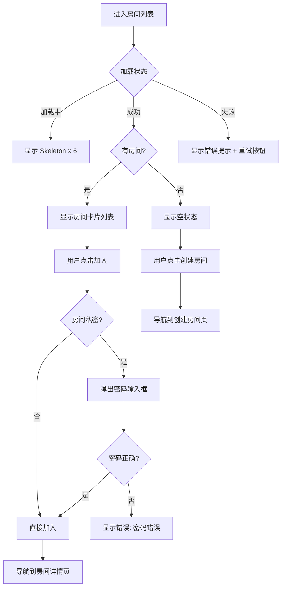
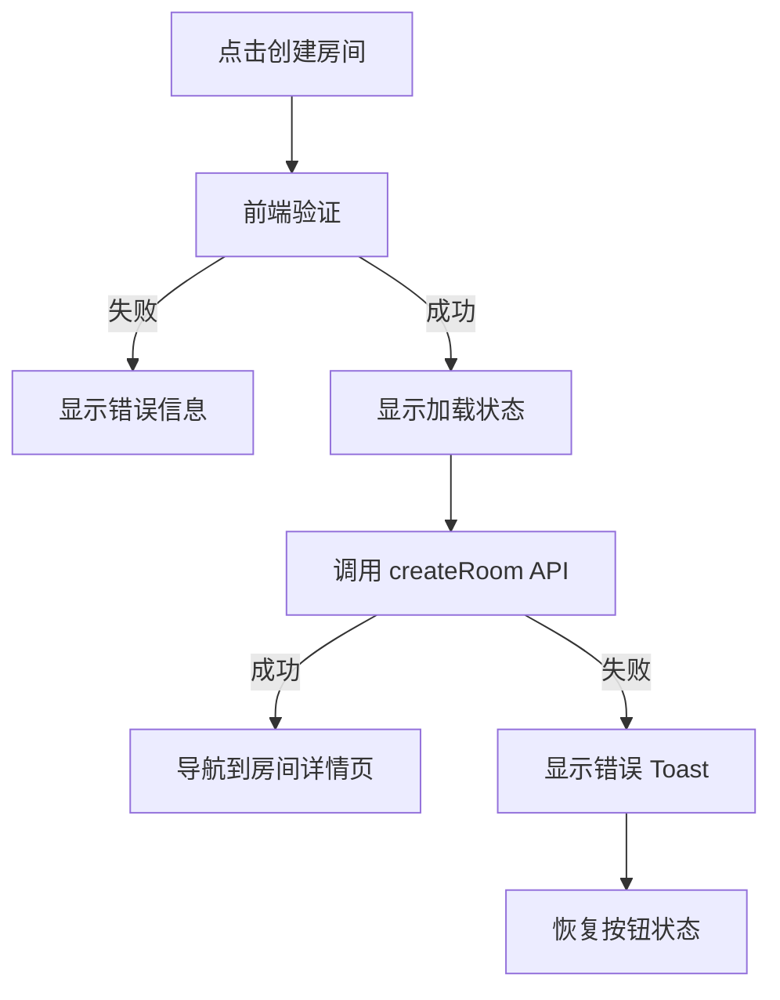

# GameLink Room & LFG 页面 UI/UX 规格文档

> **专家团队**: UI Designer (视觉层级) + UX Designer (认知负荷)
> **版本**: 1.0
> **日期**: 2026-01-15

---

## 一、设计系统 Tokens

### 1.1 状态颜色语义

| Token | 值 | 用途 |
|-------|-----|------|
| `status-waiting` | `hsl(45, 93%, 47%)` / Amber | 等待中房间/请求 |
| `status-ready` | `hsl(142, 76%, 36%)` / Green | 准备就绪 |
| `status-in-game` | `hsl(221, 83%, 53%)` / Blue | 游戏进行中 |
| `status-finished` | `hsl(215, 16%, 47%)` / Gray | 已结束 |
| `status-expired` | `hsl(0, 84%, 60%)` / Red | 已过期 |

### 1.2 角色徽章

| 角色 | 图标 | 颜色 |
|------|------|------|
| Host/Owner | Crown | `primary-500` |
| Admin | Shield | `secondary-500` |
| Member | User | `muted-foreground` |

### 1.3 间距系统 (8pt Grid)

```
spacing-xs: 4px   (紧凑元素间距)
spacing-sm: 8px   (组件内部间距)
spacing-md: 16px  (组件间距)
spacing-lg: 24px  (区块间距)
spacing-xl: 32px  (页面区块间距)
```

---

## 二、RoomListPage (房间列表页)

### 2.1 页面结构

```
┌─────────────────────────────────────────────────────────┐
│  PageHeader: "游戏房间" + "加入或创建游戏房间"           │
├─────────────────────────────────────────────────────────┤
│  ┌─────────────────┐ ┌──────────────┐ ┌──────────────┐  │
│  │ 🔍 搜索房间...   │ │ 状态筛选 ▼  │ │ + 创建房间  │  │
│  └─────────────────┘ └──────────────┘ └──────────────┘  │
├─────────────────────────────────────────────────────────┤
│                                                         │
│  ┌─────────────────────────────────────────────────┐   │
│  │ RoomCard #1                                      │   │
│  │ ┌────┐ 王者荣耀五排                    [等待中] │   │
│  │ │游戏│ 房主: 小明                               │   │
│  │ │图标│ 👥 3/5  🔒 私密  🎤 语音                 │   │
│  │ └────┘                          [加入房间]      │   │
│  └─────────────────────────────────────────────────┘   │
│                                                         │
│  ┌─────────────────────────────────────────────────┐   │
│  │ RoomCard #2                                      │   │
│  │ ...                                              │   │
│  └─────────────────────────────────────────────────┘   │
│                                                         │
│  [空状态: 暂无房间 - 创建一个房间或等待他人创建]        │
│                                                         │
└─────────────────────────────────────────────────────────┘
```

### 2.2 组件规格

#### 2.2.1 搜索栏 (SearchInput)

| 属性 | 值 |
|------|-----|
| 宽度 | `flex-1` (响应式) |
| 高度 | `40px` |
| 图标 | `Search` (左侧, 16px, muted) |
| Placeholder | "搜索房间..." |
| 防抖 | `300ms` |

#### 2.2.2 状态筛选器 (StatusFilter)

| 选项 | 值 | 图标 |
|------|-----|------|
| 全部 | `all` | - |
| 等待中 | `waiting` | `Clock` |
| 准备就绪 | `ready` | `CheckCircle` |
| 游戏中 | `in_game` | `Gamepad2` |

#### 2.2.3 创建房间按钮

| 属性 | 值 |
|------|-----|
| 变体 | `default` (primary) |
| 图标 | `Plus` (左侧) |
| 文本 | "创建房间" |
| 点击 | 导航到 `/rooms/create` |

### 2.3 RoomCard 组件详细规格

```
┌──────────────────────────────────────────────────────┐
│ ┌──────┐                                             │
│ │ 游戏 │  房间名称 (最多显示20字符...)    [状态徽章] │
│ │ 封面 │  房主: {hostNickname}                       │
│ │ 48x48│                                             │
│ └──────┘  ┌─────┐ ┌─────┐ ┌─────┐                   │
│           │👥3/5│ │🔒私密│ │🎤语音│     [加入房间]   │
│           └─────┘ └─────┘ └─────┘                   │
└──────────────────────────────────────────────────────┘
```

#### 数据显示

| 字段 | 来源 | 格式 |
|------|------|------|
| 游戏封面 | `gameCoverUrl` 或 占位图 | 48x48, rounded-md |
| 房间名称 | `name` | 截断 20 字符 + ellipsis |
| 状态徽章 | `roomStatus` | Badge 组件 + 状态颜色 |
| 房主 | `hostNickname` | "房主: {name}" |
| 人数 | `currentMembers/maxMembers` | "👥 {current}/{max}" |
| 私密标识 | `isPrivate` | 仅当 true 时显示 🔒 |
| 语音标识 | `voiceEnabled` | 仅当 true 时显示 🎤 |

#### 按钮逻辑

| 条件 | 按钮文本 | 动作 |
|------|----------|------|
| 未满员 & 非私密 | "加入" | `joinRoom(roomId)` |
| 未满员 & 私密 | "加入" | 弹出密码输入框 |
| 已满员 | "已满" (disabled) | - |
| 已在房间内 | "进入" | 导航到 `/rooms/{id}` |

### 2.4 交互流程



### 2.5 状态矩阵

| 状态 | UI 表现 |
|------|---------|
| **加载中** | 6 个 Skeleton 卡片, 脉冲动画 |
| **空数据** | 居中图标 (Users) + "暂无房间" + 描述 + 创建按钮 |
| **有数据** | 房间卡片网格 (响应式: 1/2/3 列) |
| **错误** | Toast 错误提示 + 重试按钮 |
| **搜索无结果** | "未找到匹配的房间" + 清除筛选按钮 |

---

## 三、RoomDetailPage (房间详情页)

### 3.1 页面结构

```
┌─────────────────────────────────────────────────────────┐
│  ← 返回    房间名称                                     │
├─────────────────────────────────────────────────────────┤
│                                                         │
│  ┌─────────────────────────────────────────────────┐   │
│  │ 房间信息卡片                                     │   │
│  │ ┌────┐                                          │   │
│  │ │游戏│ 王者荣耀五排              [游戏中]       │   │
│  │ │封面│ 房主: 小明                               │   │
│  │ └────┘ 👥 4/5 人  |  🎮 王者荣耀                │   │
│  │                                                  │   │
│  │ 描述: 来一起上分，要求钻石以上段位               │   │
│  └─────────────────────────────────────────────────┘   │
│                                                         │
│  ┌─────────────────────────────────────────────────┐   │
│  │ 成员列表 (4/5)                                   │   │
│  │ ┌────────────────────────────────────────────┐  │   │
│  │ │ 👑 小明 (房主)                    ✓ 已准备 │  │   │
│  │ │ 👤 小红                           ✓ 已准备 │  │   │
│  │ │ 👤 小刚                           ○ 未准备 │  │   │
│  │ │ 👤 小李                           ✓ 已准备 │  │   │
│  │ └────────────────────────────────────────────┘  │   │
│  └─────────────────────────────────────────────────┘   │
│                                                         │
│  ┌─────────────────────────────────────────────────┐   │
│  │ 语音面板 (如果启用)                              │   │
│  │ [加入语音]  [🎤 静音]  [🔇 关闭声音]  [⚙️]      │   │
│  │                                                  │   │
│  │ 语音成员:                                        │   │
│  │ 🟢 小明 (说话中)  🔇 小红  🎤 小刚              │   │
│  └─────────────────────────────────────────────────┘   │
│                                                         │
│  ┌─────────────────────────────────────────────────┐   │
│  │ 操作按钮区                                       │   │
│  │                                                  │   │
│  │ [准备/取消准备]  [离开房间]                      │   │
│  │                                                  │   │
│  │ --- 房主专属 ---                                 │   │
│  │ [开始游戏]  [结束游戏]  [关闭房间]               │   │
│  └─────────────────────────────────────────────────┘   │
│                                                         │
└─────────────────────────────────────────────────────────┘
```

### 3.2 房间信息卡片

| 字段 | 来源 | 显示格式 |
|------|------|----------|
| 游戏封面 | `gameCoverUrl` | 64x64, rounded-lg |
| 房间名称 | `name` | text-xl, font-semibold |
| 状态徽章 | `roomStatus` | Badge + 状态颜色 |
| 房主 | `hostNickname` | "房主: {name}" |
| 人数 | `currentMembers/maxMembers` | "👥 {current}/{max} 人" |
| 游戏名称 | `gameName` | "🎮 {gameName}" |
| 描述 | `description` | text-muted-foreground, 可选 |

### 3.3 成员列表组件 (RoomMemberList)

#### 成员项数据

| 字段 | 来源 | 显示 |
|------|------|------|
| 头像 | `avatarUrl` | 40x40, rounded-full |
| 昵称 | `nickname` | font-medium |
| 角色图标 | `role` | owner=Crown, admin=Shield, member=无 |
| 准备状态 | `isReady` | ✓ 绿色 / ○ 灰色 |
| 踢出按钮 | - | 仅房主可见, 不能踢自己 |

### 3.4 操作按钮逻辑

#### 普通成员按钮

| 按钮 | 条件 | 动作 | 变体 |
|------|------|------|------|
| 准备 | `!isReady && status=waiting` | `toggleReady()` | default |
| 取消准备 | `isReady && status=waiting` | `toggleReady()` | outline |
| 离开房间 | 任何时候 | `leaveRoom()` + 确认弹窗 | destructive |

#### 房主专属按钮

| 按钮 | 条件 | 动作 | 变体 |
|------|------|------|------|
| 开始游戏 | `status=waiting && 所有人已准备` | `startGame()` | default |
| 开始游戏 | `status=waiting && 有人未准备` | disabled | secondary |
| 结束游戏 | `status=in_game` | `finishGame()` | default |
| 关闭房间 | 任何时候 | `closeRoom()` + 确认弹窗 | destructive |

### 3.5 语音面板 (VoicePanel)

#### 语音控制按钮

| 按钮 | 状态 | 图标 | 动作 |
|------|------|------|------|
| 加入语音 | `!isInVoice` | `Headphones` | `joinVoice()` |
| 离开语音 | `isInVoice` | `PhoneOff` | `leaveVoice()` |
| 静音 | `!isMuted` | `Mic` | `toggleMute()` |
| 取消静音 | `isMuted` | `MicOff` (红色) | `toggleMute()` |
| 关闭声音 | `!isDeafened` | `Volume2` | `toggleDeafen()` |
| 开启声音 | `isDeafened` | `VolumeX` (红色) | `toggleDeafen()` |
| 设置 | - | `Settings` | 打开设备选择下拉 |

#### 语音成员显示

| 状态 | 视觉表现 |
|------|----------|
| 正在说话 | 头像边框绿色脉冲动画 |
| 已静音 | 头像右下角 MicOff 图标 |
| 已关闭声音 | 头像右下角 VolumeX 图标 |
| 正常 | 无特殊标识 |

### 3.6 实时更新 (WebSocket)

| 事件 | 动作 |
|------|------|
| `room_member_joined` | 刷新成员列表, Toast 提示 |
| `room_member_left` | 刷新成员列表, Toast 提示 |
| `room_member_ready` | 更新成员准备状态 |
| `room_started` | 更新房间状态为 in_game |
| `room_closed` | 显示提示, 导航回列表 |
| `voice_member_joined` | 更新语音成员列表 |
| `voice_member_left` | 更新语音成员列表 |

---

## 四、CreateRoomPage (创建房间页)

### 4.1 页面结构

```
┌─────────────────────────────────────────────────────────┐
│  ← 返回    创建房间                                     │
├─────────────────────────────────────────────────────────┤
│                                                         │
│  ┌─────────────────────────────────────────────────┐   │
│  │ 表单卡片                                         │   │
│  │                                                  │   │
│  │ 房间名称 *                                       │   │
│  │ ┌────────────────────────────────────────────┐  │   │
│  │ │ 输入房间名称...                            │  │   │
│  │ └────────────────────────────────────────────┘  │   │
│  │                                                  │   │
│  │ 房间类型                                         │   │
│  │ ┌────────────────────────────────────────────┐  │   │
│  │ │ 组队 ▼                                     │  │   │
│  │ └────────────────────────────────────────────┘  │   │
│  │                                                  │   │
│  │ 游戏 *                                           │   │
│  │ ┌────────────────────────────────────────────┐  │   │
│  │ │ 选择游戏...                                │  │   │
│  │ └────────────────────────────────────────────┘  │   │
│  │                                                  │   │
│  │ 最大人数                                         │   │
│  │ ┌────────────────────────────────────────────┐  │   │
│  │ │ 5 人 ▼                                     │  │   │
│  │ └────────────────────────────────────────────┘  │   │
│  │                                                  │   │
│  │ 描述                                             │   │
│  │ ┌────────────────────────────────────────────┐  │   │
│  │ │ 描述你的房间（可选）...                    │  │   │
│  │ └────────────────────────────────────────────┘  │   │
│  │                                                  │   │
│  │ ┌────────────────────────────────────────────┐  │   │
│  │ │ 🔒 私密房间                          [开关]│  │   │
│  │ │    只有知道密码的玩家才能加入              │  │   │
│  │ └────────────────────────────────────────────┘  │   │
│  │                                                  │   │
│  │ (如果私密) 密码 *                                │   │
│  │ ┌────────────────────────────────────────────┐  │   │
│  │ │ ••••••                                     │  │   │
│  │ └────────────────────────────────────────────┘  │   │
│  │                                                  │   │
│  │ ┌────────────────────────────────────────────┐  │   │
│  │ │ 🎤 语音聊天                          [开关]│  │   │
│  │ │    启用语音通讯                            │  │   │
│  │ └────────────────────────────────────────────┘  │   │
│  │                                                  │   │
│  │ ┌──────────────┐  ┌──────────────┐              │   │
│  │ │    取消      │  │   创建房间   │              │   │
│  │ └──────────────┘  └──────────────┘              │   │
│  └─────────────────────────────────────────────────┘   │
│                                                         │
└─────────────────────────────────────────────────────────┘
```

### 4.2 表单字段规格

| 字段 | 类型 | 必填 | 验证规则 | 默认值 |
|------|------|------|----------|--------|
| name | Input | ✓ | 1-64 字符 | - |
| groupType | Select | ✓ | team/lfg/custom | team |
| gameId | Select/Input | ✓ | 有效游戏ID | - |
| maxMembers | Select | - | 2-20 | 5 |
| description | Textarea | - | 0-256 字符 | - |
| isPrivate | Switch | - | boolean | false |
| password | Input | 条件* | 1-32 字符 | - |
| voiceEnabled | Switch | - | boolean | false |

*条件必填: 当 `isPrivate=true` 时必填

### 4.3 房间类型选项

| 值 | 显示文本 | 描述 |
|-----|----------|------|
| team | 组队 | 普通组队房间 |
| lfg | 快速匹配 | LFG 匹配创建的房间 |
| custom | 自定义 | 自定义房间 |

### 4.4 最大人数选项

```
[2, 3, 4, 5, 6, 8, 10, 15, 20]
```

### 4.5 表单验证

```typescript
const validate = () => {
    const errors: Record<string, string> = {};

    if (!formData.name.trim()) {
        errors.name = t('room.create.errors.nameRequired');
    }

    if (!formData.gameId) {
        errors.gameId = t('room.create.errors.gameRequired');
    }

    if (formData.isPrivate && !formData.password.trim()) {
        errors.password = t('room.create.errors.passwordRequired');
    }

    return errors;
};
```

### 4.6 提交流程



---

## 五、LFGPage (快速匹配页)

### 5.1 页面结构

```
┌─────────────────────────────────────────────────────────┐
│  PageHeader: "快速匹配" + "寻找玩家或队伍一起游戏"       │
├─────────────────────────────────────────────────────────┤
│                                                         │
│  ┌─────────────────────────────────────────────────┐   │
│  │ 进行中的请求 (如果有)                           │   │
│  │ ┌────────────────────────────────────────────┐  │   │
│  │ │ 🔵 你正在寻找队友                          │  │   │
│  │ │    王者荣耀 - 找队友上分              [取消]│  │   │
│  │ └────────────────────────────────────────────┘  │   │
│  └─────────────────────────────────────────────────┘   │
│                                                         │
│  ┌─────────────────┐ ┌──────────────┐ ┌──────────────┐  │
│  │ 🔍 搜索请求...   │ │ 类型筛选 ▼  │ │ + 发布请求  │  │
│  └─────────────────┘ └──────────────┘ └──────────────┘  │
│                                                         │
│  ┌─────────────────────────────────────────────────┐   │
│  │ Tabs: [浏览] [我的请求]                         │   │
│  └─────────────────────────────────────────────────┘   │
│                                                         │
│  === 浏览 Tab ===                                       │
│  ┌─────────────────────────────────────────────────┐   │
│  │ LFGRequestCard #1                                │   │
│  │ ┌────┐ [找队友] 王者荣耀五排上分                │   │
│  │ │头像│ 小明 · 需要 2 人 · 15分钟后过期          │   │
│  │ └────┘ 最低段位: 钻石                           │   │
│  │        最高价格: ¥50/小时              [接受]   │   │
│  └─────────────────────────────────────────────────┘   │
│                                                         │
│  === 我的请求 Tab ===                                   │
│  ┌─────────────────────────────────────────────────┐   │
│  │ 我发布的请求列表...                              │   │
│  └─────────────────────────────────────────────────┘   │
│                                                         │
└─────────────────────────────────────────────────────────┘
```

### 5.2 活跃请求横幅

| 条件 | 显示 |
|------|------|
| `activeRequest !== null` | 显示横幅 |
| `activeRequest === null` | 隐藏横幅 |

横幅内容:
- 背景: `primary/10` + 边框 `primary/20`
- 标题: "进行中的请求"
- 描述: `activeRequest.title` 或 "未命名请求"
- 按钮: "取消" → `cancelRequest(activeRequest.id)`

### 5.3 类型筛选器

| 选项 | 值 | 描述 |
|------|-----|------|
| 全部类型 | `all` | 显示所有请求 |
| 找队友 | `find_player` | 用户在找玩家加入 |
| 找队伍 | `find_team` | 用户在找队伍加入 |

### 5.4 LFGRequestCard 组件规格

```
┌────────────────────────────────────────────────────────┐
│ ┌──────┐  [类型徽章] 请求标题                          │
│ │ 用户 │  {userNickname} · 需要 {requiredPlayers} 人   │
│ │ 头像 │  · {timeRemaining} 后过期                     │
│ │ 40x40│                                               │
│ └──────┘  最低段位: {minRank}                          │
│           最高价格: ¥{maxPrice}/小时                   │
│                                                        │
│           {description}                                │
│                                        [接受] / [取消] │
└────────────────────────────────────────────────────────┘
```

#### 数据显示

| 字段 | 来源 | 格式 |
|------|------|------|
| 用户头像 | `userAvatarUrl` | 40x40, rounded-full |
| 类型徽章 | `requestType` | find_player=蓝色, find_team=绿色 |
| 标题 | `title` | 截断 30 字符, 或 "未命名请求" |
| 用户名 | `userNickname` | - |
| 需要人数 | `requiredPlayers` | "需要 {n} 人" |
| 剩余时间 | `expiresAt` | 计算剩余时间, 如 "15分钟" |
| 最低段位 | `minRank` | 可选, 仅当有值时显示 |
| 最高价格 | `maxPriceCents` | 可选, 转换为元显示 |
| 描述 | `description` | 可选, 截断 100 字符 |

#### 按钮逻辑

| 条件 | 按钮 | 动作 |
|------|------|------|
| 不是自己的请求 | "接受" | `acceptRequest(id)` → 导航到房间 |
| 是自己的请求 | "取消" | `cancelRequest(id)` |
| 正在接受中 | "接受中..." (disabled) | - |
| 已过期 | "已过期" (disabled) | - |

### 5.5 Tabs 内容

#### 浏览 Tab
- 数据源: `fetchPendingRequests()`
- 过滤: 排除自己的请求, 排除已过期
- 排序: 按创建时间倒序

#### 我的请求 Tab
- 数据源: `fetchMyRequests()`
- 显示: 所有状态的请求
- 状态徽章: pending/matched/expired/canceled

### 5.6 状态矩阵

| 状态 | UI 表现 |
|------|---------|
| **加载中** | Skeleton 卡片 x 3 |
| **空数据 (浏览)** | 居中图标 + "暂无请求" + "成为第一个发布请求的人" |
| **空数据 (我的)** | 居中图标 + "暂无请求" + "发布请求来寻找玩家或队伍" |
| **有数据** | 请求卡片列表 |
| **搜索无结果** | "未找到匹配的请求" |

---

## 六、CreateLFGPage (发布匹配请求页)

### 6.1 页面结构

```
┌─────────────────────────────────────────────────────────┐
│  ← 返回    发布匹配请求                                 │
├─────────────────────────────────────────────────────────┤
│                                                         │
│  ┌─────────────────────────────────────────────────┐   │
│  │ 表单卡片                                         │   │
│  │                                                  │   │
│  │ 请求类型                                         │   │
│  │ ┌────────────────────────────────────────────┐  │   │
│  │ │ 找队友 ▼                                   │  │   │
│  │ └────────────────────────────────────────────┘  │   │
│  │ 💡 你正在寻找玩家加入你的队伍                   │   │
│  │                                                  │   │
│  │ 游戏 *                                           │   │
│  │ ┌────────────────────────────────────────────┐  │   │
│  │ │ 选择游戏...                                │  │   │
│  │ └────────────────────────────────────────────┘  │   │
│  │                                                  │   │
│  │ 标题                                             │   │
│  │ ┌────────────────────────────────────────────┐  │   │
│  │ │ 给你的请求起个标题（可选）...              │  │   │
│  │ └────────────────────────────────────────────┘  │   │
│  │                                                  │   │
│  │ 描述                                             │   │
│  │ ┌────────────────────────────────────────────┐  │   │
│  │ │ 描述你在寻找什么（可选）...                │  │   │
│  │ └────────────────────────────────────────────┘  │   │
│  │                                                  │   │
│  │ 需要人数                                         │   │
│  │ ┌────────────────────────────────────────────┐  │   │
│  │ │ 1 人 ▼                                     │  │   │
│  │ └────────────────────────────────────────────┘  │   │
│  │                                                  │   │
│  │ 最低段位                                         │   │
│  │ ┌────────────────────────────────────────────┐  │   │
│  │ │ 例如：钻石、大师（可选）                   │  │   │
│  │ └────────────────────────────────────────────┘  │   │
│  │                                                  │   │
│  │ 最高价格（元）                                   │   │
│  │ ┌────────────────────────────────────────────┐  │   │
│  │ │ 最高时薪（可选）                           │  │   │
│  │ └────────────────────────────────────────────┘  │   │
│  │ 💡 留空表示不限价格                             │   │
│  │                                                  │   │
│  │ 过期时间                                         │   │
│  │ ┌────────────────────────────────────────────┐  │   │
│  │ │ 30 分钟 ▼                                  │  │   │
│  │ └────────────────────────────────────────────┘  │   │
│  │                                                  │   │
│  │ ┌──────────────┐  ┌──────────────┐              │   │
│  │ │    取消      │  │   发布请求   │              │   │
│  │ └──────────────┘  └──────────────┘              │   │
│  └─────────────────────────────────────────────────┘   │
│                                                         │
└─────────────────────────────────────────────────────────┘
```

### 6.2 表单字段规格

| 字段 | 类型 | 必填 | 验证规则 | 默认值 |
|------|------|------|----------|--------|
| requestType | Select | ✓ | find_player/find_team | find_player |
| gameId | Select/Input | ✓ | 有效游戏ID | - |
| title | Input | - | 0-64 字符 | - |
| description | Textarea | - | 0-256 字符 | - |
| requiredPlayers | Select | - | 1-5 | 1 |
| minRank | Input | - | 0-32 字符 | - |
| maxPriceCents | Input | - | 正整数 (元) | - |
| expireMinutes | Select | - | 15/30/60/120 | 30 |

### 6.3 请求类型选项

| 值 | 显示文本 | 描述提示 |
|-----|----------|----------|
| find_player | 找队友 | "你正在寻找玩家加入你的队伍" |
| find_team | 找队伍 | "你正在寻找队伍加入" |

### 6.4 过期时间选项

| 值 | 显示文本 |
|-----|----------|
| 15 | 15 分钟 |
| 30 | 30 分钟 |
| 60 | 60 分钟 |
| 120 | 120 分钟 |

### 6.5 价格转换

```typescript
// 前端输入: 元
// API 提交: 分 (cents)
const submitData = {
    ...formData,
    maxPriceCents: formData.maxPrice ? Number(formData.maxPrice) * 100 : undefined,
};
```

---

## 七、摩擦测试 (Friction Test)

### 7.1 用户可能放弃的点

| 页面 | 摩擦点 | 解决方案 |
|------|--------|----------|
| RoomListPage | 找不到想要的房间 | 提供清晰的空状态 + 创建房间引导 |
| RoomDetailPage | 不知道如何准备 | 准备按钮突出显示 + 状态提示 |
| CreateRoomPage | 游戏选择困难 | 提供游戏搜索 + 热门游戏推荐 |
| LFGPage | 不理解请求类型 | 类型选择后显示描述提示 |
| CreateLFGPage | 价格填写困惑 | 添加"留空表示不限"提示 |

### 7.2 边缘情况处理

| 场景 | 处理方式 |
|------|----------|
| 网络断开 | 显示离线横幅 + 禁用操作按钮 |
| 房间被关闭 | WebSocket 通知 + 自动导航回列表 |
| 请求已过期 | 禁用接受按钮 + 显示"已过期"状态 |
| 房间已满 | 禁用加入按钮 + 显示"已满"状态 |
| 密码错误 | 显示错误提示 + 保持弹窗打开 |
| 已有活跃请求 | 禁用创建按钮 + 显示活跃请求横幅 |

---

## 八、自我批判 (Self-Critique)

### 8.1 优点
- ✅ 完整的状态矩阵覆盖 (加载/空/错/成功)
- ✅ 清晰的按钮逻辑条件表
- ✅ WebSocket 实时更新事件定义
- ✅ 表单验证规则明确

### 8.2 待改进
- ⚠️ 游戏选择器需要单独设计 (搜索 + 热门推荐)
- ⚠️ 密码输入弹窗需要详细规格
- ⚠️ 语音设备选择下拉需要详细规格
- ⚠️ 分页加载未详细说明

### 8.3 质量评分: 85/100

---

## 九、下一步行动

1. **实现游戏选择器组件** - 支持搜索和热门推荐
2. **实现密码输入弹窗** - AlertDialog + Input
3. **完善 WebSocket 事件处理** - 在 stores 中添加事件监听
4. **添加分页加载** - 无限滚动或分页按钮
5. **添加骨架屏组件** - 各页面的 Skeleton 变体
