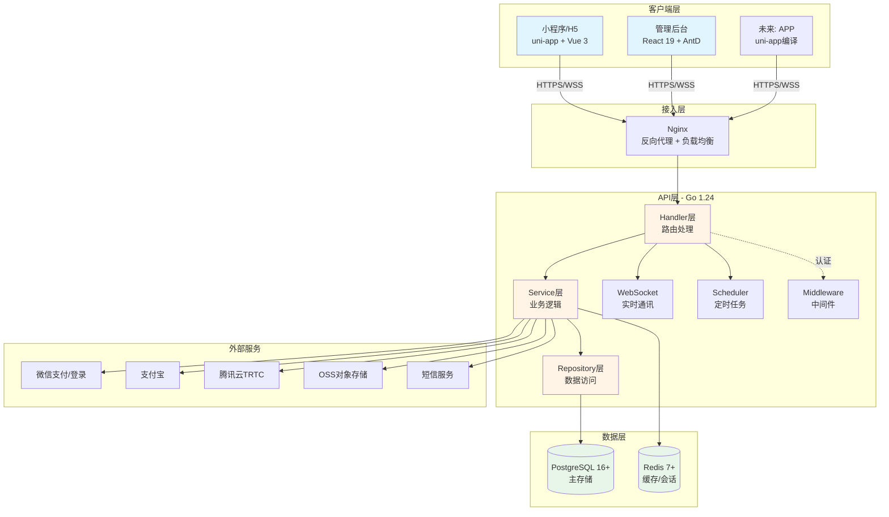
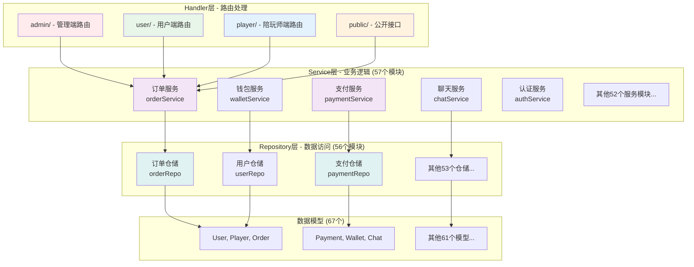
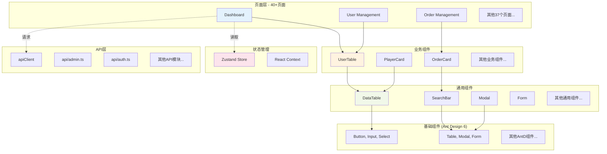
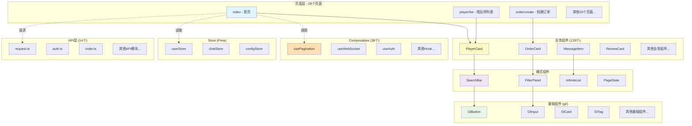
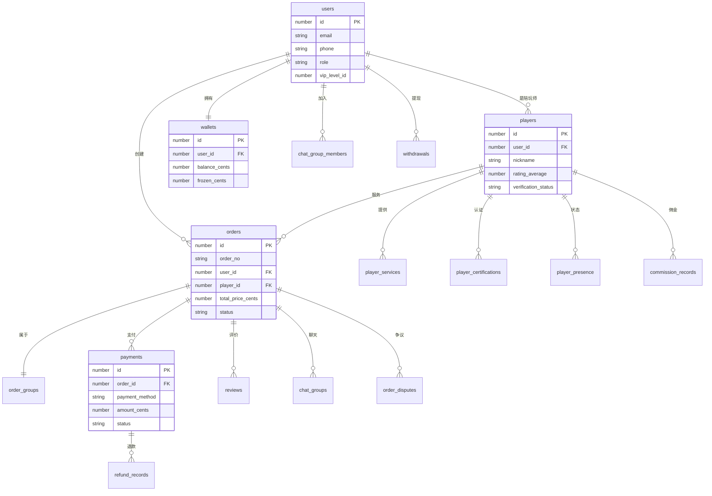
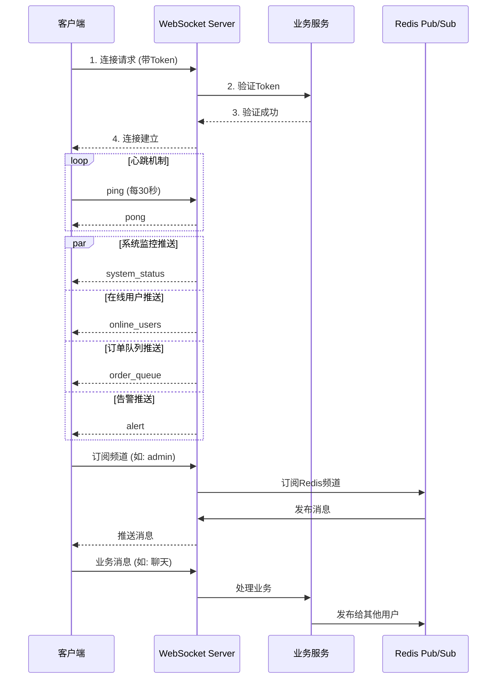

# GameLink 系统架构图

> **版本**: v2.0
> **更新日期**: 2026-02-11
> **项目**: GameLink 游戏陪玩社交平台

---

## 目录

1. [系统整体架构](#1-系统整体架构)
2. [后端分层架构](#2-后端分层架构)
3. [前端组件架构](#3-前端组件架构)
4. [数据库关系图](#4-数据库关系图)
5. [API路由结构](#5-api路由结构)
6. [WebSocket消息流](#6-websocket消息流)
7. [部署架构](#7-部署架构)

---

## 1. 系统整体架构



---

## 2. 后端分层架构



---

## 3. 前端组件架构

### 3.1 管理后台 (React 19)



### 3.2 移动端 (uni-app + Vue 3)



---

## 4. 数据库关系图

### 4.1 核心业务表关系



### 4.2 表分类统计

| 分类 | 表数量 | 代表表 |
|------|--------|--------|
| 用户与陪玩师 | 7 | users, players, wallets, player_certifications |
| 订单与支付 | 6 | orders, payments, refund_records, order_disputes |
| 服务与商品 | 3 | service_items, games, game_ranks |
| 聊天与通讯 | 4 | chat_groups, chat_messages, chat_snapshots |
| 营销与会员 | 6 | vip_levels, coupons, activities, referrals |
| 财务与结算 | 5 | commission_records, settlements, withdraws |
| 内容与审核 | 4 | reviews, feeds, sensitive_words |
| 权限与管理 | 5 | roles, permissions, menus, user_roles |
| 团队与社交 | 4 | teams, team_members, lfg_requests, favorites |

---

## 5. API路由结构

```
/api/v1
├── /auth              # 认证相关
│   ├── POST /register
│   ├── POST /login
│   ├── POST /logout
│   ├── POST /refresh
│   └── GET  /me
│
├── /public            # 公开接口
│   ├── GET  /players
│   ├── GET  /games
│   └── GET  /game-categories
│
├── /user              # 用户端接口
│   ├── GET  /orders
│   ├── POST /orders
│   ├── GET  /wallet
│   ├── POST /recharge
│   └── GET  /chats
│
├── /player            # 陪玩师端接口
│   ├── GET  /orders (可接订单)
│   ├── POST /orders/:id/accept
│   ├── PUT  /orders/:id/complete
│   ├── GET  /services
│   └── POST /services
│
└── /admin             # 管理端接口
    ├── /users         # 用户管理
    ├── /players       # 陪玩师管理
    ├── /orders        # 订单管理
    ├── /games         # 游戏管理
    ├── /roles         # 角色管理
    ├── /permissions   # 权限管理
    ├── /menus         # 菜单管理
    ├── /dashboard     # 仪表盘
    ├── /settlements   # 结算管理
    ├── /commissions   # 佣金管理
    ├── /withdraws     # 提现管理
    └── ...           # 其他管理接口

/ws                   # WebSocket连接
```

---

## 6. WebSocket消息流



### WebSocket消息类型

| 类型 | 方向 | 说明 |
|------|------|------|
| `ping` | 客户端→服务端 | 心跳 |
| `pong` | 服务端→客户端 | 心跳响应 |
| `system_status` | 服务端→客户端 | 系统状态 |
| `online_users` | 服务端→客户端 | 在线用户数 |
| `order_queue` | 服务端→客户端 | 订单队列 |
| `alert` | 服务端→客户端 | 告警消息 |
| `presence_update` | 双向 | 在线状态更新 |
| `room_created` | 服务端→客户端 | 房间创建 |
| `room_member_joined` | 服务端→客户端 | 成员加入 |
| `chat_message` | 双向 | 聊天消息 |

---

## 7. 部署架构

```mermaid
graph TB
    subgraph "用户端"
        U1[用户浏览器<br/>小程序]
    end

    subgraph "CDN"
        CDN[静态资源CDN]
    end

    subgraph "负载均衡"
        LB[Nginx<br/>负载均衡]
    end

    subgraph "应用服务器集群"
        APP1[API服务器 1<br/>Go 1.24]
        APP2[API服务器 2<br/>Go 1.24]
        APP3[API服务器 N<br/>Go 1.24]
    end

    subgraph "数据层"
        DB[(PostgreSQL<br/>主从复制)]
        RDS[(Redis<br/>集群模式)]
    end

    subgraph "监控"
        M1[Prometheus]
        M2[Grafana]
        M3[Alertmanager]
    end

    U1 --> CDN
    U1 --> LB

    LB --> APP1
    LB --> APP2
    LB --> APP3

    APP1 --> DB
    APP2 --> DB
    APP3 --> DB

    APP1 --> RDS
    APP2 --> RDS
    APP3 --> RDS

    APP1 -.->|指标| M1
    APP2 -.->|指标| M1
    APP3 -.->|指标| M1

    M1 --> M2
    M1 --> M3

    style U1 fill:#e1f5ff
    style APP1 fill:#fff4e6
    style APP2 fill:#fff4e6
    style APP3 fill:#fff4e6
    style DB fill:#e8f5e9
    style RDS fill:#e8f5e9
```

---

## 附录：技术栈版本

| 层级 | 技术 | 版本 |
|------|------|------|
| 后端语言 | Go | 1.24.5 |
| Web框架 | Gin | 最新 |
| ORM | GORM | 最新 |
| 数据库 | PostgreSQL | 16+ |
| 缓存 | Redis | 7+ |
| 前端框架 | React | 19 |
| UI组件 | Ant Design | 6 |
| 状态管理 | Zustand | 最新 |
| 移动端框架 | uni-app | 最新 |
| 移动端框架 | Vue | 3.4+ |
| 容器化 | Docker | 最新 |
| CI/CD | GitHub Actions | - |

---

**文档维护**: 产品经理团队
**最后更新**: 2026-02-11
