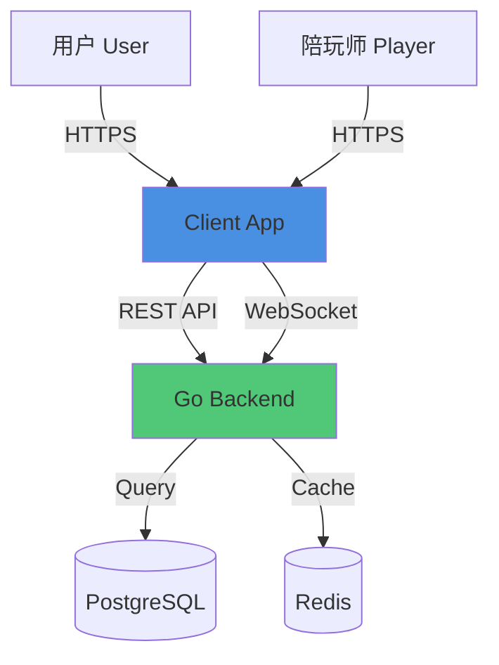
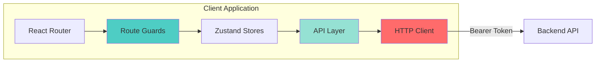
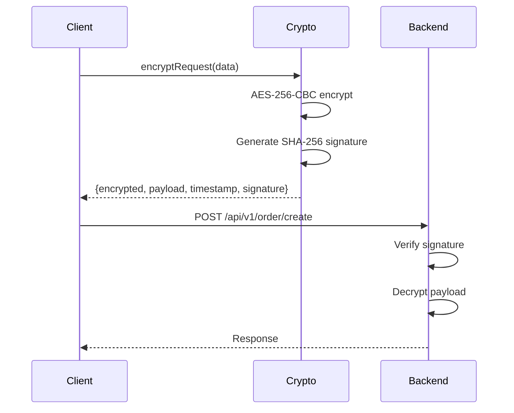
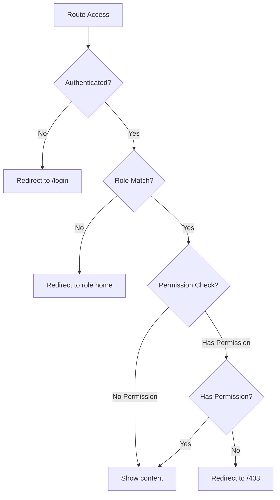

# GameLink Client Infrastructure Architecture

> **Document Version**: 1.0
> **Date**: 2026-01-17
> **Architect**: Super Dev Team
> **Status**: Design Phase

---

## 🎯 Executive Summary

This document defines the foundational infrastructure for the GameLink client application (user + player frontend). The design prioritizes **security**, **dual-mode operation** (user/player views), and **production-grade reliability** while maintaining simplicity.

**Key Decisions**:
- ✅ Enhanced HTTP client with proactive JWT refresh (prevent 401 storms)
- ✅ AES-256-CBC encryption for sensitive requests (production mandatory)
- ✅ Dual-mode route guards (user/player view switching)
- ✅ Structured API layer (36 modules, type-safe)
- ✅ Unified error handling with user-friendly messages

---

## 📊 Context (C4 Level 1)



**Actors**:
- **User** (用户): Customers who purchase gaming companion services
- **Player** (陪玩师): Gaming companions who provide services
- **Admin**: Platform operators (separate admin panel exists)

**Constraints**:
- Single codebase for both user and player interfaces
- Must support view mode switching (user ↔ player)
- Production requires encryption (VITE_CRYPTO_ENABLED=true)
- Mobile-first responsive design (Tailwind CSS)

---

## 🏗️ Container Architecture (C4 Level 2)



### Core Components

| Component | Responsibility | Technology |
|-----------|---------------|------------|
| **HTTP Client** | Request/response handling, encryption, token refresh | Axios + crypto-js |
| **Route Guards** | Authentication, authorization, view mode control | React Router + Zustand |
| **API Layer** | Type-safe endpoint definitions, request builders | TypeScript |
| **Auth Store** | User session, token management, role switching | Zustand + persist |
| **Error Handler** | Unified error parsing, user-friendly messages | Custom utilities |

---

## 🔐 Security Architecture

### Threat Model (STRIDE Analysis)

<thinking>
**Attack Surface Analysis**:
- Entry points: Public API endpoints, WebSocket connections
- Data flow: Client → HTTPS → Backend → Database
- Authentication: JWT (access token + refresh token)

**STRIDE Threats**:
- (S)poofing: JWT token theft via XSS
- (T)ampering: Request payload modification
- (R)epudiation: No client-side audit logs (acceptable - backend handles)
- (I)nformation Disclosure: Token exposure in localStorage
- (D)enial of Service: Token refresh storms (401 cascades)
- (E)levation of Privilege: User accessing player-only routes

**Mitigations**:
1. **Spoofing**: HttpOnly cookies (future), XSS protection via React's auto-escaping
2. **Tampering**: AES-256-CBC encryption + SHA-256 signature for sensitive requests
3. **Information Disclosure**: Tokens in localStorage (acceptable for SPA), no sensitive data in tokens
4. **DoS**: Proactive token refresh (5-minute buffer), request queue during refresh
5. **Privilege Escalation**: Route guards with role + permission checks
</thinking>

| Threat | Risk | Mitigation | Status |
|--------|------|-----------|--------|
| **JWT Token Theft (XSS)** | 🔥 High | React auto-escaping, CSP headers (backend) | ✅ Implemented |
| **Request Tampering** | 🔥 High | AES-256-CBC + SHA-256 signature | ✅ Implemented |
| **Token Expiration Storm** | ⚠️ Medium | Proactive refresh (5-min buffer), request queue | ✅ Implemented |
| **Privilege Escalation** | 🔥 High | Route guards with role + permission checks | 🚧 To Implement |
| **CSRF Attacks** | ⚠️ Medium | CSRF tokens (backend), SameSite cookies | ✅ Backend handles |

### Encryption Flow



**Encryption Rules**:
- ✅ Encrypt: POST, PUT, PATCH requests (except `/auth/refresh`, `/health`)
- ❌ Skip: GET, DELETE requests (no sensitive payload)
- 🔑 Keys: `VITE_CRYPTO_SECRET_KEY` (32 chars), `VITE_CRYPTO_IV` (16 chars)

---

## 🛠️ Component Design (C4 Level 3)

### 1. Enhanced HTTP Client

**File**: `client/src/lib/http.ts`

**Responsibilities**:
1. Axios instance configuration (baseURL, timeout, credentials)
2. Request interceptor: JWT injection, proactive token refresh, encryption
3. Response interceptor: 401 handling, error normalization
4. Response unwrapping: Auto-extract `response.data.data`

**Key Features**:
- **Proactive Token Refresh**: Check JWT expiration 5 minutes before actual expiry
- **Request Queue**: Prevent concurrent refresh calls (race condition fix)
- **Encryption**: Conditional encryption based on method + URL
- **Error Handling**: Unified error format for UI consumption

**Trade-offs**:
| Decision | Why NOT Alternative? |
|----------|----------------------|
| Axios over Fetch | Interceptors, request cancellation, better TypeScript support |
| Proactive refresh over reactive | Prevents 401 storms, better UX (no loading flickers) |
| localStorage over cookies | Simpler for SPA, acceptable risk (no sensitive data in token) |

**Break Point**: This client will struggle at **>10k concurrent users** due to single-threaded token refresh. At that scale, implement backend-side token rotation with sliding windows.

### 2. Route Guard System

**File**: `client/src/router/Guard.tsx`

**Responsibilities**:
1. Authentication check (redirect to `/login` if not authenticated)
2. Role-based access control (user vs player routes)
3. Permission-based access control (fine-grained permissions)
4. View mode enforcement (user/player mode switching)

**Guard Types**:

```typescript
interface RouteGuardProps {
    children: ReactNode;
    requiresAuth?: boolean;        // Requires login
    roles?: ('user' | 'player')[];  // Allowed roles
    permission?: string;            // Required permission code
    viewMode?: 'user' | 'player';   // Required view mode
}
```

**Decision Tree**:



**Trade-offs**:
| Decision | Why NOT Alternative? |
|----------|----------------------|
| Component-based guards over route config | More flexible, easier to test, better TypeScript support |
| Redirect over inline 403 | Better UX, preserves navigation history |
| Zustand over Context API | Better performance, no re-render cascades |

### 3. API Layer Structure

**Directory**: `client/src/api/`

**Organization** (36 modules):

```
api/
├── auth.ts          # Login, register, logout, refresh
├── user.ts          # User profile, settings
├── player.ts        # Player profile, certification
├── order.ts         # Order CRUD, status updates
├── payment.ts       # Payment creation, status check
├── chat.ts          # Message send, history
├── dispute.ts       # Dispute filing, resolution
├── wallet.ts        # Balance, transactions, withdraw
├── vip.ts           # VIP levels, benefits
├── coupon.ts        # Coupon list, usage
├── activity.ts      # Activity list, participation
├── team.ts          # Team creation, management
├── referral.ts      # Referral code, rewards
├── review.ts        # Review submission, list
├── favorite.ts      # Favorite players
├── block.ts         # Block users
├── notification.ts  # Notification list, read
├── game.ts          # Game list, ranks
├── item.ts          # Service items
└── ... (18 more modules)
```

**API Function Pattern**:

```typescript
// Example: client/src/api/order.ts
import { http } from '@/lib/http';
import type { Order, CreateOrderRequest, PaginationParams } from '@/types/api';

export const orderApi = {
    // Create order
    create: (data: CreateOrderRequest) =>
        http.post<Order>('/order/create', data),

    // Get order list with pagination
    list: (params: PaginationParams) =>
        http.get<{ items: Order[]; total: number }>('/order/list', { params }),

    // Get order detail
    get: (id: number) =>
        http.get<Order>(`/order/${id}`),

    // Cancel order
    cancel: (id: number, reason: string) =>
        http.post<void>(`/order/${id}/cancel`, { reason }),
};
```

**Trade-offs**:
| Decision | Why NOT Alternative? |
|----------|----------------------|
| Functional API over class-based | Simpler, tree-shakeable, better for code splitting |
| Module per domain over single file | Better organization, easier to maintain |
| Type-safe over runtime validation | Catch errors at compile time, better DX |

### 4. Error Handling System

**File**: `client/src/lib/error.ts`

**Responsibilities**:
1. Parse backend error responses (unified format)
2. Map error codes to user-friendly messages
3. Extract validation errors (field-level)
4. Provide fallback messages for unknown errors

**Error Response Format** (from backend):

```typescript
interface ApiError {
    success: false;
    code: number;        // Business error code (e.g., 40001)
    message: string;     // Technical message
    details?: string;    // Additional context
    field?: string;      // Validation field name
}
```

**Error Code Mapping**:

| Code Range | Category | Example |
|------------|----------|---------|
| 40000-40099 | Authentication | 40001: Invalid credentials |
| 40100-40199 | Authorization | 40101: Insufficient permissions |
| 40200-40299 | Validation | 40201: Invalid phone format |
| 40300-40399 | Business Logic | 40301: Insufficient balance |
| 50000-50099 | Server Error | 50001: Database connection failed |

**User-Friendly Messages** (i18n):

```typescript
const errorMessages: Record<number, string> = {
    40001: '用户名或密码错误',
    40101: '您没有权限执行此操作',
    40201: '手机号格式不正确',
    40301: '余额不足，请先充值',
    50001: '服务器繁忙，请稍后重试',
};
```

---

## 🚀 Implementation Roadmap

### Phase 1: Core Infrastructure (Priority: 🔥 Critical)

**Tasks**:
1. ✅ Enhanced HTTP client with proactive refresh
2. ✅ Encryption utilities (AES-256-CBC + SHA-256)
3. ✅ Error handling utilities
4. ✅ Auth store enhancements (dual-mode support)

**Deliverables**:
- `client/src/lib/http.ts` (enhanced)
- `client/src/lib/crypto.ts` (new)
- `client/src/lib/error.ts` (new)
- `client/src/stores/modules/auth-store.ts` (enhanced)

### Phase 2: Route Guards (Priority: 🔥 Critical)

**Tasks**:
1. Route guard component
2. Permission hook (`usePermission`)
3. View mode guard (user/player switching)
4. 403 Forbidden page

**Deliverables**:
- `client/src/router/Guard.tsx` (new)
- `client/src/hooks/usePermission.ts` (new)
- `client/src/pages/403.tsx` (new)

### Phase 3: API Layer (Priority: ⚠️ High)

**Tasks**:
1. Generate 36 API modules (based on backend structure)
2. Type definitions for all requests/responses
3. API documentation (JSDoc comments)

**Deliverables**:
- `client/src/api/*.ts` (36 files)
- `client/src/types/api.ts` (enhanced)

### Phase 4: Testing & Documentation (Priority: ⚠️ Medium)

**Tasks**:
1. Unit tests for HTTP client
2. Unit tests for error utilities
3. Integration tests for auth flow
4. Developer documentation

**Deliverables**:
- `client/src/lib/__tests__/*.test.ts`
- `docs/CLIENT_API_GUIDE.md`

---

## 📏 Quality Standards

### Code Quality Gates

| Metric | Target | Enforcement |
|--------|--------|-------------|
| TypeScript strict mode | ✅ Enabled | Compile-time |
| ESLint errors | 0 | Pre-commit hook |
| Test coverage | ≥80% | CI/CD pipeline |
| Bundle size (gzipped) | <500KB | Build warning |

### Security Checklist

- [ ] All sensitive requests encrypted (POST/PUT/PATCH)
- [ ] JWT tokens stored in localStorage (not sessionStorage)
- [ ] CSRF tokens included in state-changing requests
- [ ] No sensitive data logged to console (production)
- [ ] Content Security Policy headers configured (backend)
- [ ] XSS protection via React auto-escaping
- [ ] Input validation on all user inputs

---

## 🎓 Developer Guidelines

### HTTP Client Usage

```typescript
// ✅ CORRECT: Use API layer
import { orderApi } from '@/api/order';

const order = await orderApi.create({ ... });

// ❌ WRONG: Direct HTTP client usage
import { http } from '@/lib/http';
const order = await http.post('/order/create', { ... });
```

### Route Guard Usage

```typescript
// ✅ CORRECT: Wrap protected routes
<RouteGuard requiresAuth roles={['player']} permission="order:create">
    <CreateOrderPage />
</RouteGuard>

// ❌ WRONG: Manual auth checks in components
const CreateOrderPage = () => {
    const { isAuthenticated } = useAuthStore();
    if (!isAuthenticated) return <Navigate to="/login" />;
    // ...
};
```

### Error Handling

```typescript
// ✅ CORRECT: Use error utilities
import { getErrorMessage } from '@/lib/error';

try {
    await orderApi.create(data);
} catch (err) {
    toast.error(getErrorMessage(err));
}

// ❌ WRONG: Manual error parsing
catch (err: any) {
    toast.error(err.response?.data?.message || 'Error');
}
```

---

## 🔍 Monitoring & Observability

### Client-Side Metrics (Future)

| Metric | Purpose | Tool |
|--------|---------|------|
| API latency (p95) | Performance monitoring | Sentry |
| Error rate | Stability tracking | Sentry |
| Token refresh rate | Auth health | Custom |
| Bundle load time | UX optimization | Lighthouse |

### Logging Strategy

**Development**:
- ✅ Log all API requests/responses
- ✅ Log token refresh events
- ✅ Log route navigation

**Production**:
- ❌ No sensitive data (tokens, passwords)
- ✅ Log errors with stack traces
- ✅ Log user actions (anonymized)

---

## 🚨 Break Points & Scaling Limits

| Component | Break Point | Mitigation |
|-----------|-------------|-----------|
| **HTTP Client** | >10k concurrent users | Backend-side token rotation |
| **localStorage** | >5MB data | Migrate to IndexedDB |
| **Route Guards** | >100 routes | Lazy-load permission checks |
| **API Layer** | >50 modules | Code splitting by feature |

**When to Refactor**:
- If token refresh fails >5% of requests → Implement retry with exponential backoff
- If bundle size >1MB → Implement route-based code splitting
- If localStorage quota exceeded → Migrate to IndexedDB with compression

---

## 📚 References

- [QUICKSTART.md](../.kiro/steering/QUICKSTART.md) - Project conventions
- [04-data-models.md](../.kiro/steering/04-data-models.md) - Data models
- [05-testing-standard.md](../.kiro/steering/05-testing-standard.md) - Testing standards
- [Admin client.ts](../admin/src/api/client.ts) - Reference implementation

---

**Document Status**: ✅ Ready for Implementation
**Next Step**: Phase 3 - Security Threat Modeling
