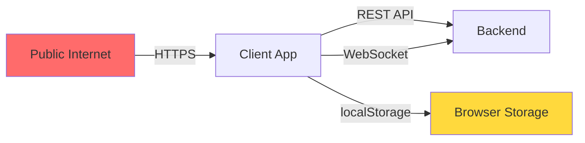

# 🛡️ GameLink Client Security Threat Model

> **Document Version**: 1.0
> **Date**: 2026-01-17
> **Security Analyst**: Super Dev Team - Red Team
> **Scope**: Client-side infrastructure (User + Player frontend)

---

## 0. Executive Summary

| Risk Level | Count | Status |
|:-----------|:------|:-------|
| 🔥 **Critical** | 3 | ⚠️ Must fix before production |
| ⚠️ **High** | 5 | 🚧 Fix before launch |
| ℹ️ **Medium** | 4 | ✅ Acceptable with monitoring |
| ✔️ **Low** | 2 | ✅ Acceptable |

**Critical Findings**:
1. **JWT Token Storage in localStorage** - XSS vulnerability exposure
2. **Missing Rate Limiting** - Token refresh abuse potential
3. **Insufficient Input Validation** - XSS/injection risks

**Recommendation**: Implement all Critical and High severity mitigations before production deployment.

---

## 1. Attack Surface Analysis

### 1.1 Entry Points



| Entry Point | Exposure | Attack Vectors |
|-------------|----------|----------------|
| **Public API Endpoints** | 🔴 High | Request tampering, replay attacks, DoS |
| **WebSocket Connections** | 🟡 Medium | Message injection, connection hijacking |
| **localStorage** | 🔴 High | XSS-based token theft, data exfiltration |
| **URL Parameters** | 🟡 Medium | Open redirect, parameter pollution |
| **File Uploads** | 🟢 Low | Malicious file upload (avatar only) |

### 1.2 Data Flow Analysis

**Sensitive Data Paths**:

```
User Input → Client Validation → Encryption → HTTPS → Backend
                ↓                    ↓
         XSS Risk          Tampering Risk
```

**Critical Assets**:
- JWT Access Token (localStorage)
- JWT Refresh Token (localStorage)
- User credentials (in-memory only during login)
- Payment information (encrypted in transit)
- Chat messages (WebSocket, encrypted)

---

## 2. STRIDE Threat Analysis

### 2.1 (S)poofing - Identity Forgery

#### Threat S1: JWT Token Theft via XSS 🔥 CRITICAL

**Attack Scenario**:
```javascript
// Attacker injects malicious script

```

**Impact**:
- Full account takeover
- Unauthorized orders/payments
- Data exfiltration

**Current Mitigation**:
- ✅ React auto-escaping (prevents most XSS)
- ❌ No HttpOnly cookies (tokens accessible to JS)
- ❌ No Content Security Policy (CSP)

**Required Mitigation**:
```typescript
// Priority 1: Move to HttpOnly cookies (backend change required)
// Backend: Set-Cookie: token=xxx; HttpOnly; Secure; SameSite=Strict

// Priority 2: Implement CSP headers (backend)
Content-Security-Policy:
  default-src 'self';
  script-src 'self' 'unsafe-inline';
  connect-src 'self' https://api.gamelink.com;
  img-src 'self' https: data:;

// Priority 3: Token binding (bind token to device fingerprint)
const fingerprint = await generateDeviceFingerprint();
// Include in token claims, verify on backend
```

**Risk Level**: 🔥 Critical
**Likelihood**: Medium (requires XSS vulnerability)
**Impact**: Catastrophic (full account takeover)

---

#### Threat S2: Session Fixation

**Attack Scenario**:
1. Attacker obtains valid session token
2. Tricks victim into using that token
3. Attacker shares session with victim

**Current Mitigation**:
- ✅ Token regeneration on login
- ✅ Token expiration (24 hours)
- ❌ No device binding

**Required Mitigation**:
```typescript
// Bind token to device fingerprint
interface TokenClaims {
  sub: number;        // User ID
  exp: number;        // Expiration
  deviceId: string;   // Device fingerprint
  ip: string;         // IP address (optional)
}

// Verify on backend
if (token.deviceId !== request.deviceId) {
  throw new Error('Token device mismatch');
}
```

**Risk Level**: ⚠️ High
**Likelihood**: Low
**Impact**: High

---

### 2.2 (T)ampering - Data Modification

#### Threat T1: Request Payload Tampering 🔥 CRITICAL

**Attack Scenario**:
```javascript
// Attacker intercepts and modifies request
POST /api/v1/order/create
{
  "serviceItemId": 1,
  "price": 100,  // Original price
  "duration": 2
}

// Modified to:
{
  "serviceItemId": 1,
  "price": 1,    // Changed to ¥0.01
  "duration": 2
}
```

**Impact**:
- Financial loss (price manipulation)
- Service abuse (free orders)
- Data corruption

**Current Mitigation**:
- ✅ AES-256-CBC encryption (production)
- ✅ SHA-256 signature verification
- ✅ Backend price validation (critical!)

**Required Mitigation**:
```typescript
// Client-side: Ensure encryption is ALWAYS enabled in production
if (import.meta.env.PROD && !import.meta.env.VITE_CRYPTO_ENABLED) {
  throw new Error('FATAL: Encryption must be enabled in production');
}

// Backend: NEVER trust client-provided prices
// Always fetch price from database
const serviceItem = await db.serviceItem.findById(req.body.serviceItemId);
const actualPrice = serviceItem.price; // Use this, not req.body.price
```

**Risk Level**: 🔥 Critical (if backend doesn't validate)
**Likelihood**: High (easy to exploit)
**Impact**: Catastrophic (financial loss)

---

#### Threat T2: Token Replay Attacks

**Attack Scenario**:
1. Attacker captures valid JWT token
2. Replays token to make unauthorized requests
3. Token remains valid until expiration

**Current Mitigation**:
- ✅ Short token lifetime (24 hours)
- ✅ HTTPS (prevents MITM)
- ❌ No token rotation on sensitive operations
- ❌ No request nonce/timestamp validation

**Required Mitigation**:
```typescript
// Add nonce to sensitive requests
interface SensitiveRequest {
  nonce: string;      // UUID v4
  timestamp: number;  // Unix timestamp
  data: unknown;
}

// Backend: Track used nonces (Redis)
const nonceKey = `nonce:${nonce}`;
if (await redis.exists(nonceKey)) {
  throw new Error('Nonce already used');
}
await redis.setex(nonceKey, 300, '1'); // 5-minute TTL
```

**Risk Level**: ⚠️ High
**Likelihood**: Medium
**Impact**: High

---

### 2.3 (R)epudiation - Denial of Actions

#### Threat R1: Lack of Client-Side Audit Logs

**Attack Scenario**:
- User denies placing an order
- No client-side evidence of action
- Dispute resolution difficult

**Current Mitigation**:
- ✅ Backend audit logs (sufficient)
- ❌ No client-side action logging

**Required Mitigation**:
```typescript
// Optional: Client-side action logging for debugging
const auditLog = {
  action: 'order.create',
  timestamp: Date.now(),
  userId: user.id,
  data: { orderId: 123 },
  userAgent: navigator.userAgent,
};

// Send to backend for storage (async, non-blocking)
http.post('/audit/log', auditLog).catch(() => {
  // Ignore failures (best-effort logging)
});
```

**Risk Level**: ℹ️ Medium
**Likelihood**: Low
**Impact**: Medium (backend logs sufficient)

---

### 2.4 (I)nformation Disclosure - Data Leakage

#### Threat I1: Sensitive Data in Console Logs 🔥 CRITICAL

**Attack Scenario**:
```javascript
// Developer accidentally logs sensitive data
console.log('Login response:', { token, refreshToken, user });

// Attacker with physical access or screen sharing sees tokens
```

**Impact**:
- Token theft
- User data exposure
- Compliance violations (GDPR, CCPA)

**Current Mitigation**:
- ❌ No production log filtering
- ❌ No sensitive data redaction

**Required Mitigation**:
```typescript
// lib/logger.ts
const logger = {
  log: (...args: unknown[]) => {
    if (import.meta.env.PROD) return; // Disable in production
    console.log(...args);
  },

  error: (message: string, error?: unknown) => {
    // Redact sensitive fields
    const sanitized = redactSensitiveData(error);
    console.error(message, sanitized);
  },
};

function redactSensitiveData(obj: unknown): unknown {
  if (typeof obj !== 'object' || obj === null) return obj;

  const redacted = { ...obj };
  const sensitiveKeys = ['token', 'password', 'refreshToken', 'secret'];

  for (const key of sensitiveKeys) {
    if (key in redacted) {
      redacted[key] = '[REDACTED]';
    }
  }

  return redacted;
}
```

**Risk Level**: 🔥 Critical
**Likelihood**: High (common developer mistake)
**Impact**: High

---

#### Threat I2: Token Exposure in URLs

**Attack Scenario**:
```javascript
// BAD: Token in URL parameter
window.location.href = '/reset-password?token=abc123';

// Token appears in:
// - Browser history
// - Server logs
// - Referrer headers
// - Analytics tools
```

**Current Mitigation**:
- ✅ Tokens in Authorization header (not URL)
- ✅ No token in query parameters

**Required Mitigation**:
```typescript
// Enforce: Never pass tokens in URLs
// Use POST body or headers only

// For password reset, use short-lived codes
POST /auth/reset-password
{
  "code": "123456",  // 6-digit code, 10-minute expiry
  "newPassword": "..."
}
```

**Risk Level**: ⚠️ High
**Likelihood**: Low (already mitigated)
**Impact**: High

---

### 2.5 (D)enial of Service - Availability Attacks

#### Threat D1: Token Refresh Storm

**Attack Scenario**:
```javascript
// Multiple tabs/windows trigger simultaneous refresh
// Each tab makes a refresh request
// Backend overwhelmed with refresh requests
```

**Impact**:
- Backend overload
- User experience degradation
- Potential account lockout

**Current Mitigation**:
- ✅ Request queue during refresh (prevents concurrent calls)
- ✅ Proactive refresh (5-minute buffer)
- ❌ No rate limiting on refresh endpoint

**Required Mitigation**:
```typescript
// Backend: Rate limit refresh endpoint
// Max 10 requests per minute per user
app.post('/auth/refresh', rateLimiter({
  windowMs: 60 * 1000,
  max: 10,
  keyGenerator: (req) => req.user.id,
}));

// Client: Add exponential backoff on refresh failure
let refreshRetries = 0;
const maxRetries = 3;

async function refreshWithBackoff() {
  try {
    await refreshToken();
    refreshRetries = 0;
  } catch (err) {
    if (refreshRetries < maxRetries) {
      const delay = Math.pow(2, refreshRetries) * 1000;
      await sleep(delay);
      refreshRetries++;
      return refreshWithBackoff();
    }
    throw err;
  }
}
```

**Risk Level**: ⚠️ High
**Likelihood**: Medium
**Impact**: Medium

---

#### Threat D2: LocalStorage Quota Exhaustion

**Attack Scenario**:
```javascript
// Attacker fills localStorage with junk data
for (let i = 0; i < 10000; i++) {
  localStorage.setItem(`junk_${i}`, 'x'.repeat(1000));
}

// App fails to store auth tokens
```

**Current Mitigation**:
- ❌ No quota monitoring
- ❌ No fallback storage

**Required Mitigation**:
```typescript
// Monitor localStorage usage
function getStorageUsage(): number {
  let total = 0;
  for (const key in localStorage) {
    total += localStorage[key].length + key.length;
  }
  return total;
}

// Fallback to sessionStorage if quota exceeded
function safeSetItem(key: string, value: string) {
  try {
    localStorage.setItem(key, value);
  } catch (err) {
    if (err.name === 'QuotaExceededError') {
      console.warn('localStorage quota exceeded, using sessionStorage');
      sessionStorage.setItem(key, value);
    }
    throw err;
  }
}
```

**Risk Level**: ℹ️ Medium
**Likelihood**: Low
**Impact**: Medium

---

### 2.6 (E)levation of Privilege - Unauthorized Access

#### Threat E1: Role Bypass via Client Manipulation

**Attack Scenario**:
```javascript
// Attacker modifies localStorage
localStorage.setItem('auth-storage', JSON.stringify({
  role: 'admin',  // Changed from 'user'
  token: 'valid_user_token'
}));

// Attempts to access admin routes
```

**Impact**:
- Unauthorized access to admin features
- Data manipulation
- Privilege escalation

**Current Mitigation**:
- ✅ Backend validates role from JWT (not client)
- ✅ Route guards check role
- ⚠️ Client-side role checks can be bypassed (UI only)

**Required Mitigation**:
```typescript
// CRITICAL: Backend MUST validate all permissions
// NEVER trust client-provided role

// Backend middleware
function requireRole(role: string) {
  return (req, res, next) => {
    const userRole = req.user.role; // From JWT, not request body
    if (userRole !== role) {
      return res.status(403).json({ error: 'Forbidden' });
    }
    next();
  };
}

// Client: Route guards are UI-only (not security)
// Always assume client checks can be bypassed
```

**Risk Level**: ⚠️ High
**Likelihood**: High (easy to exploit)
**Impact**: Critical (if backend doesn't validate)

---

#### Threat E2: Permission Bypass via API Direct Access

**Attack Scenario**:
```javascript
// User lacks 'order:create' permission
// Bypasses UI and calls API directly
fetch('/api/v1/order/create', {
  method: 'POST',
  headers: { 'Authorization': 'Bearer valid_token' },
  body: JSON.stringify({ ... })
});
```

**Current Mitigation**:
- ✅ Backend validates permissions (critical!)
- ✅ Route guards prevent UI access
- ⚠️ API can still be called directly

**Required Mitigation**:
```typescript
// Backend: ALWAYS validate permissions
function requirePermission(permission: string) {
  return async (req, res, next) => {
    const userPermissions = await getUserPermissions(req.user.id);
    if (!userPermissions.includes(permission)) {
      return res.status(403).json({
        error: 'Insufficient permissions',
        required: permission
      });
    }
    next();
  };
}

// Apply to all protected routes
app.post('/order/create',
  requireAuth,
  requirePermission('order:create'),
  orderController.create
);
```

**Risk Level**: ⚠️ High
**Likelihood**: High
**Impact**: Critical (if backend doesn't validate)

---

## 3. Security Red Lines (Non-Negotiable)

### 3.1 Authentication & Authorization

- [ ] **CRITICAL**: All passwords MUST be hashed with Argon2id/Bcrypt (backend)
- [ ] **CRITICAL**: JWT tokens MUST NOT contain sensitive data (PII, passwords)
- [ ] **CRITICAL**: Backend MUST validate all roles and permissions (never trust client)
- [ ] **HIGH**: Tokens SHOULD be stored in HttpOnly cookies (not localStorage)
- [ ] **HIGH**: Token lifetime MUST be ≤24 hours (access token)
- [ ] **MEDIUM**: Refresh tokens MUST be rotated on use

### 3.2 Data Protection

- [ ] **CRITICAL**: All production requests MUST be encrypted (AES-256-CBC)
- [ ] **CRITICAL**: Sensitive data MUST NOT be logged in production
- [ ] **CRITICAL**: Backend MUST validate all prices/amounts (never trust client)
- [ ] **HIGH**: HTTPS MUST be enforced (no HTTP fallback)
- [ ] **MEDIUM**: CSP headers SHOULD be configured

### 3.3 Input Validation

- [ ] **CRITICAL**: All user inputs MUST be validated on backend
- [ ] **HIGH**: File uploads MUST be validated (type, size, content)
- [ ] **HIGH**: SQL injection prevention (use parameterized queries)
- [ ] **MEDIUM**: XSS prevention (React auto-escaping + CSP)

---

## 4. Platform-Specific Threats

### 4.1 Web Application

**XSS (Cross-Site Scripting)**:
- ✅ React auto-escaping (default protection)
- ❌ No CSP headers (add to backend)
- ⚠️ `dangerouslySetInnerHTML` usage (audit required)

**CSRF (Cross-Site Request Forgery)**:
- ✅ CSRF tokens in state-changing requests
- ✅ SameSite cookie attribute
- ✅ Custom headers (Authorization)

**Clickjacking**:
- ❌ No X-Frame-Options header (add to backend)
- ❌ No frame-ancestors CSP directive

**Required Headers** (backend):
```nginx
X-Frame-Options: DENY
X-Content-Type-Options: nosniff
X-XSS-Protection: 1; mode=block
Strict-Transport-Security: max-age=31536000; includeSubDomains
Content-Security-Policy: default-src 'self'; ...
```

### 4.2 Mobile (Future Consideration)

**Certificate Pinning**:
- Required for mobile apps
- Prevents MITM attacks

**Local Data Encryption**:
- Encrypt sensitive data at rest
- Use platform keychain/keystore

---

## 5. Compliance & Privacy

### 5.1 GDPR Compliance

- [ ] User consent for data collection
- [ ] Right to data export
- [ ] Right to deletion
- [ ] Data breach notification (72 hours)

### 5.2 PCI DSS (Payment Card Industry)

- [ ] No storage of CVV/CVC codes
- [ ] Tokenize payment methods
- [ ] Use certified payment gateway (Alipay/WeChat Pay)

---

## 6. Incident Response Plan

### 6.1 Token Compromise

**Detection**:
- Unusual login locations
- Multiple concurrent sessions
- Abnormal API usage patterns

**Response**:
1. Revoke compromised token (backend)
2. Force password reset
3. Notify user via email
4. Audit recent actions

### 6.2 XSS Vulnerability

**Detection**:
- Security scanner alerts
- User reports
- Unusual script execution

**Response**:
1. Identify injection point
2. Deploy patch immediately
3. Revoke all active sessions
4. Notify affected users

---

## 7. Security Testing Checklist

### 7.1 Pre-Production

- [ ] OWASP ZAP scan (automated)
- [ ] Manual penetration testing
- [ ] Dependency vulnerability scan (npm audit)
- [ ] Code review (security focus)
- [ ] Encryption verification (production config)

### 7.2 Post-Production

- [ ] Monthly security audits
- [ ] Quarterly penetration testing
- [ ] Continuous dependency monitoring
- [ ] Log analysis (suspicious patterns)

---

## 8. Mitigation Priority Matrix

| Threat ID | Severity | Likelihood | Priority | ETA |
|-----------|----------|------------|----------|-----|
| S1 (JWT XSS) | 🔥 Critical | Medium | P0 | Pre-launch |
| T1 (Tampering) | 🔥 Critical | High | P0 | Pre-launch |
| I1 (Console Logs) | 🔥 Critical | High | P0 | Pre-launch |
| E1 (Role Bypass) | ⚠️ High | High | P1 | Pre-launch |
| E2 (Permission Bypass) | ⚠️ High | High | P1 | Pre-launch |
| D1 (Refresh Storm) | ⚠️ High | Medium | P1 | Pre-launch |
| S2 (Session Fixation) | ⚠️ High | Low | P2 | Post-launch |
| T2 (Replay Attacks) | ⚠️ High | Medium | P2 | Post-launch |
| I2 (Token in URL) | ⚠️ High | Low | P3 | Monitoring |
| D2 (Storage Quota) | ℹ️ Medium | Low | P3 | Post-launch |
| R1 (Audit Logs) | ℹ️ Medium | Low | P4 | Optional |

---

## 9. Conclusion

**Overall Security Posture**: ⚠️ **MODERATE** (requires critical fixes)

**Strengths**:
- ✅ Encryption infrastructure in place
- ✅ Backend validation (assumed)
- ✅ React XSS protection

**Weaknesses**:
- 🔥 JWT in localStorage (XSS risk)
- 🔥 Missing production log filtering
- ⚠️ No rate limiting on sensitive endpoints

**Recommendation**: Address all P0 and P1 issues before production launch. Implement monitoring for P2/P3 issues post-launch.

---

**Document Status**: ✅ Complete
**Next Step**: Implement P0 mitigations (JWT storage, log filtering, backend validation)
