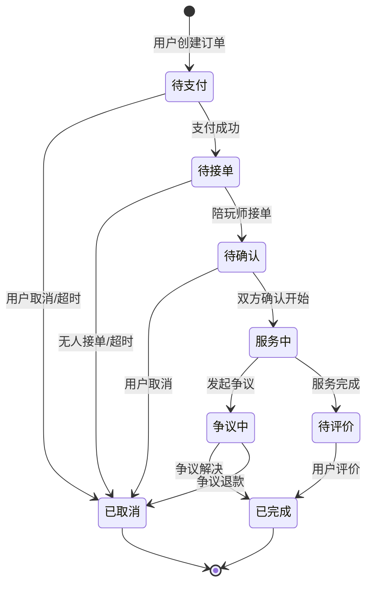

# GameLink 产品需求文档（PRD）- 扩展参考版

> **版本**: v2.1
> **创建日期**: 2026-02-09
> **产品类型**: 游戏陪玩社交平台
> **文档状态**: 参考版（派生文档）

> ⚠️ 主需求事实源请以 `docs/PRD.md` 为准；本文件仅做扩展说明，不单独定义新需求。

---

## 📋 目录

1. [产品概述](#一产品概述)
2. [核心功能模块](#二核心功能模块)
3. [用户角色与权限体系](#三用户角色与权限体系)
4. [主要业务流程](#四主要业务流程)
5. [产品亮点与特色功能](#五产品亮点与特色功能)
6. [竞争优势分析](#六竞争优势分析)
7. [用户故事与优先级](#七用户故事与优先级)
8. [数据模型与架构](#八数据模型与架构)
9. [非功能需求](#九非功能需求)

---

## 一、产品概述

### 1.1 产品定位

**GameLink** 是一款现代化游戏陪玩社交平台，通过技术手段连接有陪玩需求的用户与提供专业陪玩服务的陪玩师，打造从**发现、下单、匹配、服务、评价到结算**的完整商业闭环。

### 1.2 目标市场

| 市场细分 | 描述 | 市场规模特征 |
|---------|------|------------|
| 核心用户 | 18-35岁游戏玩家，追求优质游戏体验 | 亿级用户基数 |
| 陪玩师 | 高水平游戏玩家，希望技能变现 | 百万级潜在供给 |
| 企业客户 | 游戏公会、电竞战队（B端拓展） | 千级机构客户 |

### 1.3 商业模式

```
┌─────────────────────────────────────────────────────┐
│                   收入来源                          │
├─────────────────────────────────────────────────────┤
│ 1. 平台佣金（15%-25%）                              │
│    - 按游戏段位、服务时长阶梯定价                    │
│    - 单价范围：20-60+元/小时                        │
│                                                     │
│ 2. VIP会员订阅                                      │
│    - 等级特权：永久折扣、月度券、专属客服            │
│    - 解锁门槛：累计充值/消费                        │
│                                                     │
│ 3. 增值服务                                        │
│    - 充值赠送活动                                   │
│    - 礼物打赏（平台抽成10%）                        │
│    - 广告位出租（后期）                             │
│                                                     │
│ 4. 数据服务（B端拓展）                              │
│    - 行业报告                                       │
│    - API接口开放                                    │
└─────────────────────────────────────────────────────┘
```

---

## 二、核心功能模块

### 2.1 用户端功能（Web / app）

#### 2.1.1 首页与发现模块

| 功能点 | 功能描述 | 优先级 | 用户价值 |
|-------|---------|--------|---------|
| **首页推荐** | - 轮播Banner展示活动<br>- 热门游戏横滑<br>- 推荐陪玩师卡片流<br>- 实时在线陪玩师标记 | P0 | 快速发现优质陪玩师 |
| **游戏分类** | - 游戏分类列表（MOBA/FPS/战术竞技等）<br>- 游戏搜索<br>- 游戏详情页（含该游戏下陪玩师） | P0 | 按游戏快速筛选 |
| **陪玩师列表** | - 列表展示（头像/昵称/评分/价格/在线状态）<br>- 筛选：游戏/性别/价格区间/段位<br>- 排序：综合评分/价格/接单量/好评率 | P0 | 精准匹配需求 |
| **陪玩师详情** | - 个人信息（头像/昵称/简介/认证标识）<br>- 服务项列表（价格/时长/描述）<br>- 评价列表（评分/内容/图片）<br>- 统计数据（接单数/好评率/服务时长）<br>- 收藏按钮 | P0 | 全面了解陪玩师 |
| **收藏管理** | - 收藏列表<br>- 一键下单 | P1 | 快速复购 |

#### 2.1.2 订单流程模块

| 功能点 | 功能描述 | 优先级 | 关键字段 |
|-------|---------|--------|---------|
| **创建订单** | - 选择服务项（单人/团队）<br>- 选择游戏<br>- 选择时长（按小时）<br>- 选择陪玩师（可选，系统可分配）<br>- 填写需求说明<br>- 选择优惠券<br>- 价格计算与展示 | P0 | 订单类型、游戏ID、时长 |
| **确认订单** | - 订单摘要展示<br>- 陪玩师信息<br>- 服务时间（预约/立即）<br>- 优惠券应用<br>- VIP折扣展示<br>- 最终价格 | P0 | - |
| **支付** | - 支付方式：余额/微信/支付宝/组合支付<br>- 支付密码（余额支付）<br>- 支付结果页（成功/失败/等待） | P0 | 支付方式、金额 |
| **订单列表** | - Tab筛选：全部/待支付/待接单/进行中/已完成/已取消/退款中<br>- 订单卡片：状态/陪玩师/服务/时间/金额<br>- 下拉刷新/上拉加载 | P0 | 订单状态 |
| **订单详情** | - 状态流转进度条<br>- 陪玩师信息卡片<br>- 服务信息<br>- 价格明细（原价/优惠/实付）<br>- 操作按钮（根据状态显示）<br>- 聊天入口 | P0 | 订单ID、状态 |
| **取消订单** | - 取消原因选择<br>- 取消说明 | P0 | 取消原因 |
| **申请退款** | - 退款金额选择<br>- 退款原因<br>- 证据上传（可选） | P0 | 退款金额、原因 |
| **评价** | - 星级评分（1-5星）<br>- 文字评价（200字内）<br>- 标签选择（技术好/声音好听/耐心等）<br>- 图片上传（最多3张）<br>- 匿名选项 | P0 | 评分、内容、标签 |

#### 2.1.3 消息与聊天模块

| 功能点 | 功能描述 | 优先级 | 技术要点 |
|-------|---------|--------|---------|
| **消息列表** | - 私信列表（陪玩师）<br>- 系统通知<br>- 订单房间<br>- 未读红点 | P0 | WebSocket推送 |
| **聊天详情** | - 文字消息<br>- 图片消息<br>- 表情包（后期）<br>- 消息已读/未读状态<br>- 对方输入状态<br>- 在线状态显示 | P0 | WebSocket实时通讯 |
| **订单房间** | - 自动创建（支付成功后）<br>- 双方自动加入<br>- 服务结束后保留（评价前）<br>- 消息保留30天 | P0 | 房间管理 |
| **快捷回复** | - 预设快捷语 | P2 | 提升效率 |
| **客服聊天** | - 快捷问题列表<br>- 聊天对话<br>- 转人工客服 | P1 | 问题解决 |

#### 2.1.4 钱包与支付模块

| 功能点 | 功能描述 | 优先级 | 关键指标 |
|-------|---------|--------|---------|
| **钱包首页** | - 余额展示<br>- 冻结金额<br>- VIP等级与进度<br>- 充值入口<br>- 交易记录入口 | P0 | 余额、冻结金额 |
| **充值** | - 固定金额档位（含赠送）<br>- 自定义金额输入<br>- 支付方式选择<br>- 充值活动提示 | P0 | 充值金额 |
| **交易记录** | - 收入/支出分类筛选<br>- 列表展示（时间/类型/金额/状态）<br>- 详情查看 | P0 | 交易类型 |
| **充值记录** | - 充值历史<br>- 充值状态 | P1 | - |

#### 2.1.5 个人中心模块

| 功能点 | 功能描述 | 优先级 | 备注 |
|-------|---------|--------|-----|
| **个人资料** | - 头像/昵称/性别/生日/简介<br>- 实名认证状态<br>- VIP等级与权益 | P0 | - |
| **编辑资料** | - 修改头像/昵称/简介<br>- 实名认证（身份证上传） | P0 | - |
| **优惠券** | - 可用/已使用/已过期Tab<br>- 优惠券详情<br>- 使用入口 | P0 | - |
| **设置** | - 通知设置<br>- 隐私设置<br>- 主题切换（暗色/亮色）<br>- 清除缓存<br>- 关于我们 | P1 | - |
| **帮助中心** | - FAQ分类<br>- 搜索<br>- 问题详情 | P2 | - |
| **在线客服** | - 快捷问题<br>- 聊天对话 | P2 | - |

#### 2.1.6 增值服务模块

| 功能点 | 功能描述 | 优先级 | 营销价值 |
|-------|---------|--------|---------|
| **活动中心** | - 活动列表<br>- 活动详情<br>- 参与并领取奖励 | P1 | 用户活跃 |
| **推荐有礼** | - 邀请码生成<br>- 推荐关系绑定<br>- 奖励查看 | P1 | 用户增长 |
| **VIP中心** | - 等级说明<br>- 权益展示<br>- 升级进度<br>- 专属客服入口 | P1 | 用户留存 |
| **排行榜** | - 陪玩师排行榜<br>- 我的名次 | P2 | 激励机制 |

---

### 2.2 陪玩师端功能

#### 2.2.1 工作台模块

| 功能点 | 功能描述 | 优先级 | 数据指标 |
|-------|---------|--------|---------|
| **数据看板** | - 今日接单数<br>- 今日收益<br>- 累计服务时长<br>- 好评率<br>- 快捷入口（待接单/进行中/收益） | P0 | 今日数据 |
| **快捷入口** | - 待接订单<br>- 进行中订单<br>- 收益中心<br>- 服务管理 | P0 | - |
| **收益统计** | - 日/周/月收益图表<br>- 收益明细列表<br>- 提现入口 | P0 | 收益数据 |

#### 2.2.2 接单管理模块

| 功能点 | 功能描述 | 优先级 | 关键操作 |
|-------|---------|--------|---------|
| **订单大厅** | - 可接订单列表<br>- 订单详情（用户需求/游戏/时长/价格）<br>- 接单/拒绝操作<br>- 筛选：游戏/价格/时长 | P0 | 接单、拒绝 |
| **我的订单** | - Tab筛选：待接单/进行中/已完成/已取消<br>- 订单卡片<br>- 订单操作（开始服务/完成服务/联系用户） | P0 | 状态管理 |
| **订单详情** | - 用户信息<br>- 订单信息<br>- 服务时间<br>- 聊天入口<br>- 操作按钮 | P0 | - |

#### 2.2.3 服务管理模块

| 功能点 | 功能描述 | 优先级 | 配置项 |
|-------|---------|--------|-------|
| **服务列表** | - 已上架服务<br>- 已下架服务<br>- 添加服务入口 | P0 | - |
| **添加服务** | - 选择游戏<br>- 选择服务类型（单人/团队）<br>- 设置时薪<br>- 填写服务描述<br>- 设置段位要求 | P0 | 服务项配置 |
| **编辑服务** | - 修改价格<br>- 修改描述<br>- 上下架操作 | P0 | - |
| **服务统计** | - 每个服务的接单数/收益/好评率 | P1 | - |

#### 2.2.4 收益与提现模块

| 功能点 | 功能描述 | 优先级 | 关键流程 |
|-------|---------|--------|---------|
| **收益概览** | - 累计收益<br>- 可提现金额<br>- 冻结金额<br>- 提现中金额 | P0 | 收益展示 |
| **收益明细** | - 收益列表（时间/订单/金额/状态）<br>- 筛选：时间/状态 | P0 | - |
| **申请提现** | - 提现金额输入<br>- 提现方式选择（支付宝/银行卡）<br>- 提现账户信息<br>- 提现记录 | P0 | 提现申请 |
| **提现记录** | - 提现历史<br>- 状态：待审核/处理中/已完成/已拒绝 | P0 | - |

#### 2.2.5 认证模块

| 功能点 | 功能描述 | 优先级 | 审核流程 |
|-------|---------|--------|---------|
| **实名认证** | - 身份证正面上传<br>- 身份证反面上传<br>- 手持身份证照<br>- 姓名与身份证号 | P0 | 平台审核 |
| **段位认证** | - 选择游戏<br>- 上传段位截图<br>- 填写游戏ID<br>- 段位信息 | P0 | 平台审核 |
| **认证状态** | - 认证进度展示<br>- 认证结果<br>- 拒绝原因（如有） | P0 | - |

#### 2.2.6 在线状态管理

| 功能点 | 功能描述 | 优先级 | 状态类型 |
|-------|---------|--------|---------|
| **状态切换** | - 在线（可接单）<br>- 离线（不接单）<br>- 忙碌（服务中） | P0 | 在线状态 |
| **接单开关** | - 开启接单<br>- 关闭接单 | P0 | 接单状态 |
| **自动状态** | - 接单后自动切换为忙碌<br>- 完成服务后自动恢复在线 | P0 | 自动化 |

---

### 2.3 管理后台功能

#### 2.3.1 仪表盘模块

| 功能点 | 功能描述 | 优先级 | 核心指标 |
|-------|---------|--------|---------|
| **核心指标** | - GMV（成交总额）<br>- 订单数<br>- 用户数<br>- 陪玩师数<br>- 今日收入<br>- 7日趋势图 | P0 | 业务总览 |
| **实时监控** | - 在线用户数<br>- 实时订单数<br>- 今日新增用户<br>- 陪玩师在线率 | P0 | 实时数据 |
| **快捷入口** | - 待审核认证<br>- 待处理争议<br>- 待审核提现 | P0 | 高效运营 |

#### 2.3.2 用户管理模块

| 功能点 | 功能描述 | 优先级 | 管理能力 |
|-------|---------|--------|---------|
| **用户列表** | - 列表展示（头像/昵称/手机号/注册时间/状态）<br>- 筛选：状态/注册时间/角色<br>- 搜索：昵称/手机号 | P0 | 用户查询 |
| **用户详情** | - 基础信息<br>- 订单统计<br>- 钱包信息<br>- VIP等级<br>- 操作日志 | P0 | 用户画像 |
| **用户操作** | - 启用/禁用<br>- 重置密码<br>- 修改VIP等级<br>- 发放优惠券<br>- 添加标签 | P0 | 用户管理 |
| **用户标签** | - 标签管理<br>- 批量打标签 | P1 | 精细化运营 |
| **用户行为分析** | - 登录记录<br>- 操作记录<br>- 消费行为 | P1 | 数据分析 |

#### 2.3.3 陪玩师管理模块

| 功能点 | 功能描述 | 优先级 | 管理能力 |
|-------|---------|--------|---------|
| **陪玩师列表** | - 列表展示（头像/昵称/评分/接单数/在线状态/认证状态）<br>- 筛选：认证状态/在线状态/游戏<br>- 搜索：昵称 | P0 | 陪玩师查询 |
| **陪玩师详情** | - 基础信息<br>- 认证信息<br>- 服务列表<br>- 收益统计<br>- 评价统计 | P0 | 全面了解 |
| **认证审核** | - 实名认证审核<br>- 段位认证审核<br>- 通过/拒绝操作<br>- 审核备注 | P0 | 准入控制 |
| **状态管理** | - 启用/禁用<br>- 强制下线<br>- 修改评分（管理员权限） | P0 | 异常处理 |
| **排行榜管理** | - 排行榜配置<br>- 佣金设置<br>- 手动调整排名 | P1 | 激励机制 |

#### 2.3.4 订单管理模块

| 功能点 | 功能描述 | 优先级 | 管理能力 |
|-------|---------|--------|---------|
| **订单列表** | - 列表展示（订单号/用户/陪玩师/金额/状态/时间）<br>- 筛选：状态/时间/游戏<br>- 搜索：订单号/用户/陪玩师 | P0 | 订单查询 |
| **订单详情** | - 订单完整信息<br>- 状态流转记录<br>- 支付信息<br>- 聊天记录入口 | P0 | 订单追溯 |
| **订单操作** | - 手动取消订单<br>- 强制完成订单<br>- 修改订单信息<br>- 重新分配陪玩师 | P0 | 异常处理 |
| **争议处理** | - 争议列表<br>- 争议详情<br>- 调解操作<br>- 退款操作 | P0 | 纠纷解决 |

#### 2.3.5 财务管理模块

| 功能点 | 功能描述 | 优先级 | 管理能力 |
|-------|---------|--------|---------|
| **结算管理** | - 陪玩师收益列表<br>- 结算周期配置<br>- 批量结算<br>- 结算记录 | P0 | 收益分配 |
| **佣金配置** | - 佣金比例设置<br>- 按游戏/段位阶梯配置<br>- 特殊陪玩师佣金 | P0 | 抽成管理 |
| **提现管理** | - 提现申请列表<br>- 提现审核（通过/拒绝）<br>- 批量处理<br>- 提现记录 | P0 | 提现审核 |
| **提现路由** | - 提现路由规则配置<br>- 按金额分配收款主体 | P1 | 资金分发 |
| **充值管理** | - 充值记录<br>- 充值活动配置<br>- 赠送规则设置 | P1 | 充值运营 |
| **支付记录** | - 支付流水列表<br>- 退款记录<br>- 对账功能 | P0 | 财务对账 |

#### 2.3.6 内容审核模块

| 功能点 | 功能描述 | 优先级 | 管理能力 |
|-------|---------|--------|---------|
| **聊天监控** | - 实时聊天列表<br>- 敏感词高亮<br>- 房间详情<br>- 禁言操作 | P0 | 实时监控 |
| **敏感词管理** | - 敏感词库<br>- 添加/编辑/删除<br>- 分类管理<br>- 测试功能 | P0 | 内容安全 |
| **内容举报** | - 举报列表<br>- 举报详情<br>- 处理操作<br>- 举报统计 | P0 | 用户举报处理 |
| **评价审核** | - 待审核评价列表<br>- 评价详情<br>- 通过/拒绝/删除操作<br>- 敏感词高亮 | P0 | 评价质量控制 |
| **评价显示设置** | - 评价显示规则<br>- 匿名设置<br>- 过期规则 | P1 | 展示控制 |

#### 2.3.7 营销管理模块

| 功能点 | 功能描述 | 优先级 | 营销价值 |
|-------|---------|--------|---------|
| **活动管理** | - 活动列表<br>- 创建/编辑活动<br>- 活动配置（时间/奖励/限制）<br>- 活动数据统计 | P1 | 活动运营 |
| **优惠券管理** | - 优惠券模板<br>- 创建/编辑模板<br>- 发放优惠券<br>- 使用记录 | P1 | 促销工具 |
| **VIP管理** | - VIP等级配置<br>- 权益设置（折扣/月度券）<br>- 升级规则<br>- VIP用户列表 | P1 | 会员运营 |
| **推荐管理** | - 推荐配置<br>- 推荐码列表<br>- 推荐关系树<br>- 推荐奖励发放 | P1 | 裂变增长 |
| **排行榜佣金** | - 排行榜配置<br>- 佣金规则<br>- 发放记录 | P2 | 激励机制 |

#### 2.3.8 系统管理模块

| 功能点 | 功能描述 | 优先级 | 管理能力 |
|-------|---------|--------|---------|
| **角色权限** | - 角色列表<br>- 权限配置<br>- 菜单关联<br>- RBAC权限系统 | P0 | 权限控制 |
| **菜单管理** | - 菜单树<br>- 动态菜单配置<br>- 图标配置 | P0 | 界面控制 |
| **游戏管理** | - 游戏列表<br>- 游戏/分类CRUD<br>- 上下架管理 | P1 | 基础数据 |
| **服务项管理** | - 服务项列表<br>- 服务项配置<br>- 价格模板 | P1 | 业务配置 |
| **战队管理** | - 战队列表<br>- 战队成员管理<br>- 战队解散 | P2 | 社交功能 |
| **路由规则** | - 订单分配规则<br>- 条件配置<br>- 优先级设置 | P1 | 智能分配 |

#### 2.3.9 监控与分析模块

| 功能点 | 功能描述 | 优先级 | 数据价值 |
|-------|---------|--------|---------|
| **实时监控** | - 系统状态<br>- 在线用户<br>- 订单队列<br>- 告警配置 | P0 | 运维监控 |
| **数据分析** | - 用户增长分析<br>- 留存分析<br>- 支付分析<br>- 转化漏斗 | P1 | 业务洞察 |
| **KPI仪表板** | - KPI目标设置<br>- KPI进度追踪<br>- 绩效排名 | P1 | 绩效管理 |
| **操作日志** | - 管理员操作记录<br>- 日志查询<br>- 日志导出 | P1 | 审计追踪 |

---

## 三、用户角色与权限体系

### 3.1 角色定义

```
┌─────────────────────────────────────────────────────────────┐
│                      角色层次结构                            │
├─────────────────────────────────────────────────────────────┤
│                                                              │
│  Super Admin (超级管理员)                                     │
│  ├── 全部功能权限                                            │
│  ├── RBAC配置                                                │
│  └── 系统配置                                                │
│                                                              │
│  Admin (运营管理员)                                           │
│  ├── 订单管理 / 争议处理                                      │
│  ├── 用户管理 / 内容审核                                      │
│  ├── 数据分析 / 结算管理                                      │
│  └── 受RBAC权限控制                                          │
│                                                              │
│  Service (客服)                                              │
│  ├── 订单查询                                                │
│  ├── 用户咨询                                                │
│  ├── 争议处理                                                │
│  └── 受RBAC权限控制                                          │
│                                                              │
│  Player (陪玩师)                                              │
│  ├── 工作台 / 接单管理                                        │
│  ├── 服务管理 / 收益提现                                      │
│  ├── 实名认证 / 段位认证                                      │
│  └── 在线状态管理                                            │
│                                                              │
│  User (普通用户)                                             │
│  ├── 浏览陪玩师 / 下单                                        │
│  ├── 聊天 / 评价                                             │
│  ├── 钱包 / 充值                                             │
│  └── 收藏 / 帮助中心                                         │
│                                                              │
└─────────────────────────────────────────────────────────────┘
```

### 3.2 权限矩阵

| 功能模块 | Super Admin | Admin | Service | Player | User |
|---------|-------------|-------|---------|---------|------|
| **仪表盘** | ✅ | ✅ | ❌ | ❌ | ❌ |
| **用户管理** | ✅ | ✅ | ✅ | ❌ | ❌ |
| **陪玩师管理** | ✅ | ✅ | ❌ | ❌ | ❌ |
| **订单管理** | ✅ | ✅ | ✅ | 部分 | 部分 |
| **财务管理** | ✅ | ✅ | ❌ | ❌ | ❌ |
| **内容审核** | ✅ | ✅ | ✅ | ❌ | ❌ |
| **营销管理** | ✅ | ✅ | ❌ | ❌ | ❌ |
| **系统管理** | ✅ | 部分 | ❌ | ❌ | ❌ |
| **工作台** | ❌ | ❌ | ❌ | ✅ | ❌ |
| **接单管理** | ❌ | ❌ | ❌ | ✅ | ❌ |
| **服务管理** | ❌ | ❌ | ❌ | ✅ | ❌ |
| **收益提现** | ❌ | ❌ | ❌ | ✅ | ❌ |
| **认证管理** | ❌ | ❌ | ❌ | ✅ | ❌ |
| **浏览下单** | ❌ | ❌ | ❌ | ❌ | ✅ |
| **钱包充值** | ❌ | ❌ | ❌ | ❌ | ✅ |
| **聊天评价** | ❌ | ❌ | ❌ | 部分 | ✅ |
| **个人中心** | ❌ | ❌ | ❌ | ✅ | ✅ |

### 3.3 RBAC权限系统

```
┌─────────────────────────────────────────────────────────────┐
│                    RBAC权限模型                             │
├─────────────────────────────────────────────────────────────┤
│                                                              │
│  User (用户) ←→ UserRole (用户角色关联) ←→ Role (角色)       │
│       ↑                                                      │
│       │                                                      │
│       └── RolePermission (角色权限关联) ←→ Permission (权限) │
│                                                              │
│  Permission Examples:                                        │
│  - user:read        (查看用户)                               │
│  - user:update      (修改用户)                               │
│  - user:delete      (删除用户)                               │
│  - order:create     (创建订单)                               │
│  - order:audit      (审核订单)                               │
│  - player:certify   (认证陪玩师)                             │
│  - content:moderate (内容审核)                               │
│  - finance:settle   (财务结算)                               │
│                                                              │
└─────────────────────────────────────────────────────────────┘
```

---

## 四、主要业务流程

### 4.1 订单全生命周期流程



**详细流程说明：**

| 阶段 | 状态 | 触发条件 | 可操作方 | 可执行操作 |
|-----|------|---------|---------|-----------|
| **创建** | 待支付 | 订单创建成功 | 用户 | 支付、取消 |
| **支付** | 待接单 | 支付成功 | 用户、陪玩师 | 用户取消、陪玩师接单 |
| **接单** | 待确认 | 陪玩师接单 | 用户、陪玩师 | 用户取消、确认开始 |
| **服务** | 服务中 | 双方确认开始 | 用户、陪玩师 | 发起争议、完成服务 |
| **完成** | 待评价 | 服务完成 | 用户 | 评价 |
| **结束** | 已完成 | 用户评价或超时 | - | - |
| **异常** | 已取消/争议中 | 取消或争议 | 客服 | 处理争议 |

### 4.2 陪玩师入驻流程

```
┌─────────────────────────────────────────────────────────────┐
│                   陪玩师入驻流程                              │
├─────────────────────────────────────────────────────────────┤
│                                                              │
│  1. 注册/登录                                                │
│     └── 已有用户账号                                         │
│                                                              │
│  2. 申请成为陪玩师                                           │
│     └── 填写基本信息（昵称/简介/擅长游戏）                    │
│                                                              │
│  3. 实名认证                                                 │
│     ├── 上传身份证正反面                                     │
│     ├── 上传手持身份证照                                     │
│     └── 平台审核（1-3工作日）                                 │
│                                                              │
│  4. 段位认证（可选）                                         │
│     ├── 选择游戏                                             │
│     ├── 上传段位截图                                         │
│     └── 平台审核（1-3工作日）                                 │
│                                                              │
│  5. 审核通过                                                 │
│     └── 开通陪玩师权限                                       │
│                                                              │
│  6. 上架服务                                                 │
│     ├── 选择游戏                                             │
│     ├── 选择服务类型（单人/团队）                            │
│     ├── 设置时薪                                             │
│     └── 填写服务描述                                         │
│                                                              │
│  7. 开始接单                                                 │
│     └── 切换在线状态                                         │
│                                                              │
└─────────────────────────────────────────────────────────────┘
```

### 4.3 支付流程

```
┌─────────────────────────────────────────────────────────────┐
│                      支付流程                                │
├─────────────────────────────────────────────────────────────┤
│                                                              │
│  1. 选择支付方式                                             │
│     ├── 余额支付                                             │
│     ├── 微信支付                                             │
│     ├── 支付宝支付                                           │
│     └── 组合支付（余额+第三方）                              │
│                                                              │
│  2. 创建支付订单                                             │
│     ├── 生成支付订单号                                       │
│     ├── 计算优惠（VIP折扣+优惠券）                           │
│     └── 调用支付接口                                         │
│                                                              │
│  3. 发起支付                                                 │
│     ├── 余额支付：验证支付密码                               │
│     ├── 第三方支付：跳转支付页面                             │
│     └── 组合支付：先扣余额，再支付差额                       │
│                                                              │
│  4. 支付回调                                                 │
│     ├── 接收支付结果                                         │
│     ├── 验签                                                 │
│     └── 更新订单状态                                         │
│                                                              │
│  5. 订单确认                                                 │
│     ├── 扣除用户余额（如使用余额）                           │
│     ├── 冻结陪玩师收入                                       │
│     └── 创建订单房间                                         │
│                                                              │
│  6. 分账                                                     │
│     ├── 平台佣金（15%-25%）                                  │
│     └── 陪玩师收入（75%-85%）                                │
│                                                              │
└─────────────────────────────────────────────────────────────┘
```

### 4.4 争议处理流程

```
┌─────────────────────────────────────────────────────────────┐
│                    争议处理流程                              │
├─────────────────────────────────────────────────────────────┤
│                                                              │
│  1. 发起争议                                                 │
│     ├── 用户或陪玩师发起                                     │
│     ├── 选择争议类型                                         │
│     ├── 填写争议原因                                         │
│     └── 上传证据截图（最多5张）                              │
│                                                              │
│  2. 保存聊天快照                                             │
│     └── 自动保存订单聊天记录                                 │
│                                                              │
│  3. 分配客服                                                 │
│     ├── 原客服（订单所属客服）                               │
│     └── 独立客服（保证公正）                                 │
│                                                              │
│  4. SLA追踪                                                 │
│     └── 30分钟响应时限                                       │
│                                                              │
│  5. 调解处理                                                 │
│     ├── 客服介入调解                                         │
│     ├── 查看聊天快照                                         │
│     ├── 联系双方了解情况                                     │
│     └── 做出处理决定                                         │
│                                                              │
│  6. 处理结果                                                 │
│     ├── 全额退款                                             │
│     ├── 部分退款                                             │
│     ├── 驳回（维持原判）                                     │
│     └── 重新指派陪玩师                                       │
│                                                              │
│  7. 执行结果                                                 │
│     ├── 退款操作                                             │
│     ├── 订单状态更新                                         │
│     └── 通知双方                                             │
│                                                              │
└─────────────────────────────────────────────────────────────┘
```

### 4.5 聊天流程

```
┌─────────────────────────────────────────────────────────────┐
│                      聊天流程                                │
├─────────────────────────────────────────────────────────────┤
│                                                              │
│  1. 创建房间                                                 │
│     ├── 支付成功后自动创建订单房间                           │
│     ├── 房间类型：order                                      │
│     └── 关联订单ID                                          │
│                                                              │
│  2. 用户加入                                                 │
│     ├── 用户自动加入                                         │
│     └── 陪玩师接单后自动加入                                 │
│                                                              │
│  3. 实时通讯                                                 │
│     ├── WebSocket连接                                        │
│     ├── 文字/图片消息                                        │
│     ├── 消息已读/未读状态                                    │
│     └── 对方输入状态                                         │
│                                                              │
│  4. 内容安全                                                 │
│     ├── 敏感词过滤                                           │
│     ├── 消息审核（待审核状态）                               │
│     └── 违规消息处理                                         │
│                                                              │
│  5. 消息存储                                                 │
│     ├── 消息持久化到数据库                                   │
│     └── 消息保留30天                                         │
│                                                              │
│  6. 房间关闭                                                 │
│     ├── 服务完成且评价后自动归档                             │
│     └── 消息保留可查看                                       │
│                                                              │
└─────────────────────────────────────────────────────────────┘
```

---

## 五、产品亮点与特色功能

### 5.1 完整的订单生命周期管理

| 亮点 | 描述 | 用户价值 |
|-----|------|---------|
| **订单拆分** | 支持按小时拆分订单，灵活适应不同时长需求 | 灵活消费 |
| **转单功能** | 支持订单转单，应对陪玩师临时无法服务的情况 | 服务保障 |
| **多人服务** | 支持团队护航，一次下单多个陪玩师 | 团队游戏体验 |
| **状态可视化** | 清晰的状态流转进度，实时掌握订单进度 | 透明可控 |

### 5.2 双方保障机制

| 保障机制 | 描述 | 覆盖场景 |
|---------|------|---------|
| **争议处理系统** | 聊天快照、独立客服、SLA追踪 | 服务质量纠纷 |
| **敏感词过滤** | 自动过滤敏感词，保障聊天安全 | 内容安全 |
| **评价审核** | 评价审核机制，防止恶意评价 | 信誉保护 |
| **7天售后期** | 完成后7天内可发起争议 | 售后保障 |
| **资金冻结** | 陪玩师收入冻结，完成后解冻 | 资金安全 |

### 5.3 丰富的营销工具

| 工具 | 功能描述 | 运营价值 |
|-----|---------|---------|
| **VIP会员体系** | 等级权益、永久折扣、月度券 | 用户留存 |
| **优惠券系统** | 满减券、折扣券、多场景发放 | 促销转化 |
| **推荐邀请** | 二级分销、多种奖励类型 | 用户增长 |
| **排行榜激励** | 陪玩师排名、佣金奖励 | 供给侧激励 |
| **活动中心** | 限时活动、任务奖励 | 用户活跃 |

### 5.4 强大的管理后台

| 功能 | 描述 | 管理价值 |
|-----|------|---------|
| **RBAC权限系统** | 灵活的角色权限配置 | 权限控制 |
| **实时监控** | 在线用户、订单状态、系统告警 | 运维监控 |
| **批量操作** | 批量审核、批量结算、批量提现 | 运营效率 |
| **数据分析** | 用户分析、留存分析、转化漏斗 | 数据驱动 |
| **路由规则** | 灵活的订单分配规则配置 | 智能分配 |

### 5.5 现代化技术架构

| 特性 | 描述 | 技术价值 |
|-----|------|---------|
| **前后端分离** | 独立部署、灵活扩展 | 架构先进 |
| **WebSocket** | 实时通讯、低延迟 | 用户体验 |
| **覆盖索引优化** | PostgreSQL覆盖索引、高性能查询 | 性能优化 |
| **完整测试覆盖** | 单元测试、集成测试 | 质量保障 |

---

## 六、竞争优势分析

### 6.1 vs 传统陪玩平台

| 维度 | GameLink | 传统平台 | 优势 |
|-----|----------|---------|------|
| **技术架构** | 现代化微服务架构、WebSocket实时通讯 | 传统单体架构、轮询刷新 | 用户体验更好 |
| **支付安全** | 资金冻结、争议保障、7天售后期 | 先付款后服务，无保障 | 用户信任 |
| **内容安全** | 敏感词过滤、消息审核、举报机制 | 缺乏内容监管 | 平台更健康 |
| **运营工具** | VIP、优惠券、活动、推荐等完整营销工具 | 功能单一 | 运营效率高 |
| **数据能力** | 完整的数据分析、用户画像、智能推荐 | 缺乏数据分析 | 精细化运营 |
| **管理后台** | RBAC权限、实时监控、批量操作 | 权限混乱、操作繁琐 | 管理高效 |

### 6.2 vs 社交平台陪玩功能

| 维度 | GameLink | 社交平台陪玩 | 优势 |
|-----|----------|-------------|------|
| **专业性** | 垂直领域、专注陪玩 | 娱乐化、非主业 | 服务更专业 |
| **认证体系** | 实名认证+段位认证 | 无认证或简单认证 | 陪玩师质量高 |
| **订单保障** | 完整的订单流程、争议处理 | 私下交易、无保障 | 交易安全 |
| **收益体系** | 收益统计、提现管理、佣金透明 | 私下转账、无保障 | 陪玩师权益保障 |
| **平台监管** | 平台监管、敏感词过滤、举报机制 | 监管缺失 | 环境健康 |

### 6.3 核心竞争力总结

```
┌─────────────────────────────────────────────────────────────┐
│                    核心竞争力                                │
├─────────────────────────────────────────────────────────────┤
│                                                              │
│  1. 技术优势                                                 │
│     - 现代化技术架构                                         │
│     - WebSocket实时通讯                                      │
│     - 高性能数据库优化                                       │
│     - 完整的测试覆盖                                         │
│                                                              │
│  2. 产品优势                                                 │
│     - 完整的订单闭环                                         │
│     - 双方保障机制                                           │
│     - 丰富的营销工具                                         │
│     - 强大的管理后台                                         │
│                                                              │
│  3. 运营优势                                                 │
│     - 精细化用户运营                                         │
│     - 数据驱动决策                                           │
│     - 完善的争议处理                                         │
│     - 灵活的权限管理                                         │
│                                                              │
│  4. 生态优势                                                 │
│     - 陪玩师认证体系                                         │
│     - VIP会员体系                                            │
│     - 推荐裂变机制                                           │
│     - 多方共赢的商业模式                                     │
│                                                              │
└─────────────────────────────────────────────────────────────┘
```

---

## 七、用户故事与优先级

### 7.1 用户故事（按优先级排序）

#### P0 - 必须有（MVP核心功能）

| ID | 用户故事 | 验收标准 |
|----|---------|---------|
| US001 | 作为用户，我希望能浏览陪玩师列表，以便找到合适的陪玩师 | 列表展示头像、昵称、评分、价格、在线状态 |
| US002 | 作为用户，我希望查看陪玩师详情，以便了解其服务 | 显示个人信息、服务项、评价列表、统计数据 |
| US003 | 作为用户，我希望创建订单，以便购买陪玩服务 | 支持选择服务、时长、优惠券，价格计算正确 |
| US004 | 作为用户，我希望支付订单，以便完成购买 | 支持余额、微信、支付宝支付 |
| US005 | 作为陪玩师，我希望查看可接订单，以便接单赚钱 | 列表展示订单信息，支持接单操作 |
| US006 | 作为陪玩师，我希望管理我的服务，以便控制接单 | 支持上架/下架、编辑价格 |
| US007 | 作为用户，我希望与陪玩师聊天，以便沟通需求 | 订单房间自动创建，支持实时消息 |
| US008 | 作为用户，我希望对服务进行评价，以便反馈质量 | 支持星级评分、文字评价 |
| US009 | 作为管理员，我希望管理订单，以便处理异常 | 支持查询、取消、强制完成订单 |
| US010 | 作为管理员，我希望审核认证，以便控制准入 | 支持实名、段位认证审核 |

#### P1 - 应该有（重要功能）

| ID | 用户故事 | 验收标准 |
|----|---------|---------|
| US011 | 作为用户，我希望使用优惠券，以便获得优惠 | 支持选择优惠券、折扣计算正确 |
| US012 | 作为用户，我希望充值余额，以便快捷支付 | 支持固定金额、自定义金额充值 |
| US013 | 作为陪玩师，我希望查看收益，以便了解收入 | 显示收益概览、收益明细、提现入口 |
| US014 | 作为陪玩师，我希望申请提现，以便提现收入 | 支持填写提现信息、查看提现记录 |
| US015 | 作为用户，我希望查看我的订单，以便追踪状态 | 支持按状态筛选、下拉刷新 |
| US016 | 作为用户，我希望收藏陪玩师，以便快速复购 | 支持收藏、查看收藏列表 |
| US017 | 作为管理员，我希望处理争议，以便解决纠纷 | 支持查看争议、调解、退款操作 |
| US018 | 作为管理员，我希望管理用户，以便维护平台 | 支持查询、禁用、发放优惠券 |
| US019 | 作为管理员，我希望进行结算，以便分配收益 | 支持批量结算、结算记录 |
| US020 | 作为管理员，我希望审核内容，以便保障安全 | 支持聊天监控、敏感词管理 |

#### P2 - 可以有（增强功能）

| ID | 用户故事 | 验收标准 |
|----|---------|---------|
| US021 | 作为用户，我希望参与活动，以便获得奖励 | 支持活动列表、参与、领取奖励 |
| US022 | 作为用户，我希望邀请好友，以便获得奖励 | 支持生成邀请码、查看推荐关系 |
| US023 | 作为用户，我希望查看VIP权益，以便了解特权 | 显示VIP等级、权益、升级进度 |
| US024 | 作为陪玩师，我希望设置排班，以便管理时间 | 支持按周设置可接单时间段 |
| US025 | 作为管理员，我希望配置路由规则，以便智能分配 | 支持添加规则、设置优先级 |
| US026 | 作为管理员，我希望查看数据分析，以便决策 | 支持用户增长、留存、转化分析 |
| US027 | 作为用户，我希望查看排行榜，以便了解排名 | 支持陪玩师排行榜、我的名次 |

### 7.2 功能优先级矩阵

```
┌─────────────────────────────────────────────────────────────┐
│                    优先级矩阵（价值 vs 成本）                │
├─────────────────────────────────────────────────────────────┤
│                                                              │
│  高价值 │  P0核心    │  P1重要     │                          │
│         │  订单流程  │  优惠券     │                          │
│         │  支付系统  │  充值系统   │                          │
│         │  聊天功能  │  收益提现   │                          │
│         │  评价系统  │  争议处理   │                          │
│         ├────────────┼─────────────┤                          │
│  低价值 │  P2增强    │  暂不实现   │                          │
│         │  排行榜    │             │                          │
│         │  活动中心  │             │                          │
│         │  推荐邀请  │             │                          │
│         └────────────┴─────────────┘                          │
│         低成本        高成本                                  │
│                                                              │
└─────────────────────────────────────────────────────────────┘
```

### 7.3 迭代规划建议

| 迭代 | 周期 | 核心目标 | 主要功能 |
|-----|------|---------|---------|
| **V1.0 MVP** | 8周 | 上线核心功能 | 用户注册、陪玩师浏览、下单支付、接单服务、聊天评价、基础管理 |
| **V1.1** | 4周 | 完善交易闭环 | 充值系统、优惠券、收益提现、结算管理 |
| **V1.2** | 4周 | 增强运营能力 | 争议处理、内容审核、VIP体系、用户标签 |
| **V1.3** | 4周 | 营销增长 | 活动中心、推荐邀请、排行榜、数据分析 |
| **V2.0** | 8周 | 功能增强 | 排班系统、路由规则、战队系统、语音服务 |

---

## 八、数据模型与架构

### 8.1 核心数据模型

```
┌─────────────────────────────────────────────────────────────┐
│                     核心数据实体                             │
├─────────────────────────────────────────────────────────────┤
│                                                              │
│  User (用户)                                                 │
│  ├── ID, 手机号/邮箱, 昵称, 头像                             │
│  ├── 角色 (user/player/admin), 状态                          │
│  ├── VIP等级, 累计消费, 累计充值                             │
│  └── 关联: Wallet(钱包), Orders(订单), Reviews(评价)         │
│                                                              │
│  Player (陪玩师)                                             │
│  ├── ID, UserID, 昵称, 简介                                  │
│  ├── 评分, 接单数, 认证状态                                   │
│  ├── 在线状态, 接单开关                                      │
│  └── 关联: User(用户), Services(服务)                        │
│                                                              │
│  Order (订单)                                                │
│  ├── ID, 订单号, UserID, PlayerID                            │
│  ├── 服务项ID, 游戏ID, 数量, 单价, 总价                       │
│  ├── 状态, 标题, 描述                                        │
│  ├── 佣金, 陪玩师收入                                        │
│  └── 关联: User(用户), Player(陪玩师), Payment(支付)         │
│                                                              │
│  Payment (支付)                                              │
│  ├── ID, OrderID, UserID, 支付方式                           │
│  ├── 金额, 状态, 第三方交易号                                │
│  ├── 钱包支付金额, 第三方支付金额                            │
│  └── 关联: Order(订单), Refund(退款)                         │
│                                                              │
│  Review (评价)                                               │
│  ├── ID, OrderID, UserID, PlayerID                           │
│  ├── 评分(1-5), 内容, 标签, 图片                             │
│  ├── 审核状态, 公开/匿名                                     │
│  └── 关联: Order(订单), User(用户), Player(陪玩师)           │
│                                                              │
│  ChatGroup (聊天房间)                                        │
│  ├── ID, 名称, 类型(order/private/team)                      │
│  ├── 关联订单ID, 创建者ID, 最大成员数                         │
│  ├── 语音房间ID, 语音配置                                    │
│  └── 关联: Members(成员), Messages(消息)                     │
│                                                              │
│  ChatMessage (聊天消息)                                      │
│  ├── ID, 房间ID, 发送者ID, 内容                              │
│  ├── 消息类型(text/image/voice)                              │
│  ├── 审核状态                                                │
│  └── 关联: ChatGroup(房间), User(发送者)                     │
│                                                              │
│  Coupon (优惠券)                                             │
│  ├── ID, 模板ID, UserID, 状态                                │
│  ├── 类型, 门槛, 满减金额/折扣率                             │
│  ├── 领取时间, 过期时间, 使用时间                             │
│  └── 关联: Template(模板), Order(使用订单)                   │
│                                                              │
│  Wallet (钱包)                                               │
│  ├── ID, UserID, 余额, 冻结金额                              │
│  └── 关联: User(用户)                                        │
│                                                              │
│  Withdraw (提现)                                             │
│  ├── ID, UserID, 金额, 状态                                  │
│  ├── 提现方式, 账户信息                                      │
│  └── 关联: User(用户)                                        │
│                                                              │
│  OrderDispute (争议)                                         │
│  ├── ID, OrderID, 发起人ID, 发起人类型                        │
│  ├── 争议类型, 原因, 证据                                    │
│  ├── 状态, 处理决定, 处理人                                  │
│  └── 关联: Order(订单), ChatSnapshot(聊天快照)               │
│                                                              │
│  Activity (活动)                                             │
│  ├── ID, 名称, 类型, 状态                                    │
│  ├── 开始时间, 结束时间                                      │
│  ├── 参与限制, 统计数据                                      │
│  └── 关联: Rewards(奖励)                                     │
│                                                              │
│  VipLevel (VIP等级)                                          │
│  ├── ID, 标识, 名称, 升级所需经验                            │
│  ├── 永久折扣, 月度券模板ID                                  │
│  ├── 图标, 颜色, 权益描述                                    │
│  └── 关联: Users(用户)                                       │
│                                                              │
│  Referral (推荐)                                             │
│  ├── ID, 推荐人ID, 被推荐人ID, 类型                          │
│  ├── 状态, 层级, 奖励类型, 奖励金额                           │
│  └── 关联: Referrer(推荐人), Referee(被推荐人)               │
│                                                              │
└─────────────────────────────────────────────────────────────┘
```

### 8.2 系统架构

```
┌─────────────────────────────────────────────────────────────┐
│                      系统架构图                              │
├─────────────────────────────────────────────────────────────┤
│                                                              │
│  ┌────────────────────────────────────────────────────┐     │
│  │                   客户端层                          │     │
│  │  ┌──────────┐  ┌──────────┐  ┌──────────────────┐  │     │
│  │  │ 用户端Web │  │  H5/PWA  │  │ 管理后台(React)  │  │     │
│  │  │ (React)  │  │ (React)  │  │  Ant Design 6    │  │     │
│  │  │ TypeScript│  │ TypeScript│  │  TypeScript 5.9  │  │     │
│  │  └────┬─────┘  └────┬─────┘  └────────┬─────────┘  │     │
│  │       │              │                 │            │     │
│  │       └──────────────┴─────────────────┘            │     │
│  │                      │ HTTPS / WSS                  │     │
│  └──────────────────────┼─────────────────────────────┘     │
│                         │                                    │
│  ┌──────────────────────┼─────────────────────────────┐     │
│  │              Nginx 反向代理 + 负载均衡               │     │
│  └──────────────────────┼─────────────────────────────┘     │
│                         │                                    │
│  ┌──────────────────────┼─────────────────────────────┐     │
│  │                    API 层                           │     │
│  │  ┌───────────────────┴───────────────────────┐     │     │
│  │  │        Go 1.24 + Gin + GORM                │     │     │
│  │  │  ┌──────────┐ ┌──────────┐ ┌──────────┐   │     │     │
│  │  │  │ Handler  │→│ Service  │→│Repository│   │     │     │
│  │  │  │ (路由)   │ │ (业务)   │ │ (数据)   │   │     │     │
│  │  │  └──────────┘ └──────────┘ └──────────┘   │     │     │
│  │  │  ┌──────────┐ ┌──────────┐ ┌──────────┐   │     │     │
│  │  │  │WebSocket │ │ Scheduler│ │Middleware│   │     │     │
│  │  │  │ (实时)   │ │ (定时)   │ │ (安全)   │   │     │     │
│  │  │  └──────────┘ └──────────┘ └──────────┘   │     │     │
│  │  └───────────────────────────────────────────┘     │     │
│  └─────────────────────────────────────────────────────┘     │
│                         │                                    │
│  ┌──────────────────────┼─────────────────────────────┐     │
│  │                    数据层                           │     │
│  │  ┌──────────────┐    ┌──────────────┐              │     │
│  │  │ PostgreSQL 16│    │   Redis 7    │              │     │
│  │  │  (主存储)    │    │ (缓存/会话)  │              │     │
│  │  └──────────────┘    └──────────────┘              │     │
│  └─────────────────────────────────────────────────────┘     │
│                         │                                    │
│  ┌──────────────────────┼─────────────────────────────┐     │
│  │                   外部服务                           │     │
│  │  ┌──────────┐  ┌──────────┐  ┌──────────────────┐  │     │
│  │  │微信支付   │  │支付宝    │  │ 腾讯云TRTC       │  │     │
│  │  │API        │  │支付API   │  │  (语音服务)      │  │     │
│  │  └──────────┘  └──────────┘  └──────────────────┘  │     │
│  └─────────────────────────────────────────────────────┘     │
│                                                              │
└─────────────────────────────────────────────────────────────┘
```

---

## 九、非功能需求

### 9.1 性能要求

| 指标 | 目标值 | 测量方法 |
|-----|-------|---------|
| **API响应时间** | P95 < 200ms | APM监控 |
| **WebSocket延迟** | < 100ms | 消息时间戳对比 |
| **并发WebSocket连接** | 1000+ | 压力测试 |
| **分页列表加载** | < 500ms | 性能测试 |
| **支付成功率** | > 99% | 支付统计 |
| **系统可用性** | > 99.9% | 监控统计 |

### 9.2 安全要求

| 安全措施 | 描述 | 优先级 |
|---------|------|--------|
| **JWT认证** | Token认证 + 自动刷新 | P0 |
| **请求签名** | HMAC-SHA256签名验证 | P0 |
| **请求加密** | AES-256-CBC请求体加密（生产环境） | P0 |
| **CSRF防护** | CSRF Token验证（管理后台） | P0 |
| **速率限制** | 全局 + 按接口限流 | P0 |
| **敏感词过滤** | 聊天内容、评价内容过滤 | P0 |
| **SQL注入防护** | 参数化查询 | P0 |
| **XSS防护** | 输入输出转义 | P0 |
| **文件上传安全** | 类型验证、大小限制、病毒扫描 | P1 |

### 9.3 可用性要求

| 要求 | 描述 | 优先级 |
|-----|------|--------|
| **主题切换** | 支持暗色/亮色主题 | P1 |
| **响应式布局** | 移动端 + PC端适配 | P0 |
| **离线提示** | 网络断开提示与自动重连 | P1 |
| **错误处理** | 全局Toast、错误边界、空状态 | P0 |
| **加载状态** | Skeleton加载、按钮Loading | P0 |
| **输入验证** | 实时验证与友好提示 | P0 |

### 9.4 兼容性要求

| 平台 | 支持版本 | 优先级 |
|-----|---------|--------|
| **Web（移动端）** | iOS 12+, Android 8+ | P0 |
| **Web（PC端）** | Chrome 80+, Safari 13+ | P1 |
| **App（后续）** | 待定 | P2 |
| **管理后台** | Chrome 80+, Safari 13+, Edge 80+ | P0 |

### 9.5 可维护性要求

| 要求 | 描述 | 优先级 |
|-----|------|--------|
| **代码规范** | 统一的代码风格与命名规范 | P0 |
| **单元测试** | 核心业务逻辑测试覆盖率 > 70% | P0 |
| **集成测试** | API接口集成测试 | P0 |
| **文档** | API文档（Swagger）、代码注释 | P0 |
| **日志** | 完整的日志记录与追踪 | P0 |
| **监控告警** | 系统监控、业务监控、异常告警 | P0 |

---

## 十、附录

### 10.1 术语表

| 术语 | 定义 |
|-----|------|
| **陪玩师** | 提供游戏陪玩服务的专业服务者 |
| **用户** | 购买陪玩服务的游戏玩家 |
| **订单** | 用户购买陪玩服务的交易记录 |
| **服务项** | 陪玩师提供的具体服务（单人/团队/游戏） |
| **护航** | 陪玩师陪同用户进行游戏的服务 |
| **礼物** | 用户给陪玩师的虚拟礼物打赏 |
| **争议** | 用户或陪玩师对订单服务产生的纠纷 |
| **佣金** | 平台从每笔订单中收取的服务费 |
| **结算** | 将陪玩师收入发放给陪玩师的过程 |
| **VIP** | 付费会员体系，提供专属权益 |

### 10.2 参考文档

| 文档 | 路径 |
|-----|------|
| 项目README | /README.md |
| 项目进度 | /docs/PROGRESS.md |
| 用户端实现 | /app/src |
| API文档 | /swagger/index.html（运行后端后访问） |

### 10.3 版本历史

| 版本 | 日期 | 变更内容 | 作者 |
|-----|------|---------|------|
| v2.1 | 2026-02-26 | 调整为派生参考文档，主需求迁移到 PRD SSOT | Product-Manager |
| v2.0 | 2026-02-09 | 完整版PRD，包含功能清单、用户故事、优先级 | Product-Manager |
| v1.0 | 2026-02-06 | 初始版本 | - |

---

**文档结束**

> 本文档由产品经理基于技术架构分析编写，涵盖了GameLink平台的完整功能清单、用户故事、业务流程和竞争优势。如有疑问或需要进一步细化，请联系产品团队。
