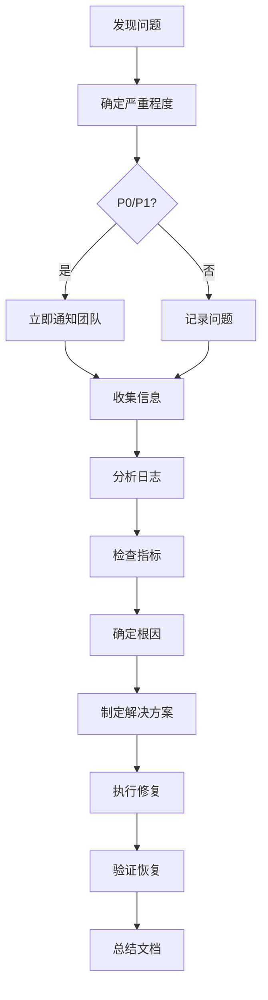

# GameLink 故障排查手册

**文档版本：** 1.0.0
**创建日期：** 2026-02-09
**维护人：** DevOps-Engineer

---

## 目录

1. [故障分类](#故障分类)
2. [诊断流程](#诊断流程)
3. [常见故障](#常见故障)
4. [快速恢复](#快速恢复)
5. [根因分析](#根因分析)

---

## 故障分类

### 按严重程度分类

| 等级 | 描述 | 影响范围 | 响应时间 | 示例 |
|------|------|---------|---------|------|
| **P0** | 严重故障 | 所有用户 | 5 分钟 | 服务完全不可用 |
| **P1** | 重要故障 | 部分用户 | 30 分钟 | 功能异常，性能下降 |
| **P2** | 一般问题 | 少数用户 | 2 小时 | 边缘功能问题 |
| **P3** | 轻微问题 | 个别用户 | 1 天 | 非关键功能问题 |

### 按故障类型分类

#### 服务层故障

- 应用服务崩溃/重启
- API 响应超时
- 错误率上升
- 性能下降

#### 数据层故障

- 数据库连接失败
- 数据库响应缓慢
- 数据库死锁
- 数据损坏

#### 基础设施故障

- 服务器宕机
- 网络中断
- 磁盘空间不足
- 内存溢出

#### 依赖服务故障

- Redis 缓存失效
- 第三方 API 故障
- 对象存储故障
- 消息队列故障

---

## 诊断流程

### 标准诊断流程



### 快速诊断命令

#### 1. 检查服务状态

```bash
# 检查所有容器状态
docker-compose -f docker-compose.prod.yml ps

# 检查容器健康状态
docker inspect gamelink-backend | grep Health

# 检查服务进程
docker top gamelink-backend
```

#### 2. 查看日志

```bash
# 查看最近日志
docker logs --tail 100 gamelink-backend

# 查看带时间的日志
docker logs --tail 100 --timestamps gamelink-backend

# 实时查看日志
docker logs -f gamelink-backend

# 使用日志收集工具
bash scripts/collect-logs.sh production backend analyze
```

#### 3. 检查资源使用

```bash
# 检查容器资源
docker stats --no-stream

# 检查系统资源
df -h
free -h
top

# 使用监控工具
bash scripts/monitor-app.sh production
```

#### 4. 测试服务连通性

```bash
# 测试后端 API
curl http://localhost:8080/api/v1/healthz

# 测试数据库
docker exec gamelink-postgres pg_isready -U gamelink

# 测试 Redis
docker exec gamelink-redis redis-cli ping
```

---

## 常见故障

### 故障 1：服务无法启动

**症状：**
```
docker-compose up -d
# 容器立即退出，状态为 Exit 1
```

**诊断：**

```bash
# 1. 查看容器日志
docker logs gamelink-backend

# 2. 检查配置文件
cat .env.production

# 3. 检查端口占用
netstat -ano | findstr "8080"

# 4. 检查依赖服务
docker ps | grep postgres
docker ps | grep redis
```

**可能原因：**

| 原因 | 解决方案 |
|------|---------|
| 环境变量错误 | 检查 `.env.production` 配置 |
| 端口被占用 | 结束占用进程或修改端口 |
| 依赖服务未启动 | 先启动数据库和缓存 |
| 镜像构建失败 | 重新构建镜像 |
| 配置文件缺失 | 检查配置文件路径 |

### 故障 2：API 响应缓慢

**症状：**
- API 响应时间 > 1000ms
- 用户反馈系统卡顿

**诊断：**

```bash
# 1. 检查应用性能
curl -w "@curl-format.txt" http://localhost:8080/api/v1/healthz

# 2. 检查数据库查询
docker exec gamelink-postgres psql \
  -U gamelink -d gamelink \
  -c "SELECT query, mean_exec_time FROM pg_stat_statements ORDER BY mean_exec_time DESC LIMIT 10;"

# 3. 检查缓存命中率
docker exec gamelink-redis redis-cli INFO stats

# 4. 检查资源使用
docker stats --no-stream | grep gamelink-backend
```

**可能原因：**

| 原因 | 解决方案 |
|------|---------|
| 数据库慢查询 | 优化查询，添加索引 |
| 缓存未命中 | 预热缓存，调整策略 |
| 连接池耗尽 | 增加连接池大小 |
| 资源不足 | 扩展资源或优化代码 |
| 锁等待 | 检查数据库锁，优化事务 |

### 故障 3：数据库连接失败

**症状：**
```
Error: connect ECONNREFUSED 127.0.0.1:5432
或
Error: password authentication failed
```

**诊断：**

```bash
# 1. 检查数据库状态
docker ps | grep postgres
docker exec gamelink-postgres pg_isready -U gamelink

# 2. 测试连接
docker exec -it gamelink-postgres psql -U gamelink -d gamelink

# 3. 检查连接数
docker exec gamelink-postgres psql \
  -U gamelink -d gamelink \
  -c "SELECT count(*) FROM pg_stat_activity;"

# 4. 检查数据库日志
docker logs gamelink-postgres | tail -n 50
```

**可能原因：**

| 原因 | 解决方案 |
|------|---------|
| 数据库未启动 | 启动数据库服务 |
| 连接数过多 | 增加最大连接数或释放连接 |
| 密码错误 | 检查环境变量配置 |
| 网络问题 | 检查网络配置 |
| 数据库崩溃 | 检查数据库日志，重启服务 |

### 故障 4：内存溢出（OOM）

**症状：**
- 容器被杀死
- 日志显示 "Out of memory"

**诊断：**

```bash
# 1. 检查内存限制
docker inspect gamelink-backend | grep Memory

# 2. 检查内存使用
docker stats --no-stream

# 3. 查看系统日志
dmesg | grep -i "killed process"

# 4. 分析内存泄漏
docker logs gamelink-backend | grep -i "memory\|leak"
```

**可能原因：**

| 原因 | 解决方案 |
|------|---------|
| 内存泄漏 | 排查代码，重启服务 |
| 连接未释放 | 检查连接池配置 |
| 缓存过大 | 限制缓存大小 |
| 内存限制过低 | 增加内存限制 |
| 日志过多 | 调整日志级别 |

### 故障 5：磁盘空间不足

**症状：**
```
Error: ENOSPC: no space left on device
```

**诊断：**

```bash
# 1. 检查磁盘使用
df -h

# 2. 查找大文件
find /var/log -type f -size +100M -exec ls -lh {} \;

# 3. 检查 Docker 占用
docker system df

# 4. 检查日志大小
du -sh /var/log/*
```

**解决方案：**

```bash
# 清理 Docker 未使用资源
docker system prune -a

# 清理应用日志
bash scripts/collect-logs.sh production all clean

# 清理 Docker 卷
docker volume prune

# 清理旧的备份文件
find ./backups -name "*.sql.gz" -mtime +7 -delete
```

### 故障 6：WebSocket 连接失败

**症状：**
- 前端无法建立 WebSocket 连接
- 连接频繁断开

**诊断：**

```bash
# 1. 测试 WebSocket 端点
curl -i -N \
  -H "Connection: Upgrade" \
  -H "Upgrade: websocket" \
  http://localhost:8080/api/v1/ws

# 2. 检查 Nginx 配置
cat /etc/nginx/nginx.conf | grep -A 10 "Upgrade"

# 3. 查看后端日志
docker logs gamelink-backend | grep -i "websocket\|ws"

# 4. 检查网络代理
curl -v http://localhost:8080/api/v1/healthz
```

**可能原因：**

| 原因 | 解决方案 |
|------|---------|
| Nginx 未配置 WebSocket 升级 | 添加 WebSocket 代理配置 |
| 超时时间过短 | 增加代理超时时间 |
| 负载均衡不支持 | 使用支持的负载均衡器 |
| 防火墙阻止 | 检查防火墙规则 |

---

## 快速恢复

### 恢复策略

#### 策略 1：服务重启

**适用场景：**
- 应用异常
- 资源泄漏
- 临时故障

**操作：**

```bash
# 重启单个服务
docker-compose -f docker-compose.prod.yml restart backend

# 重启所有服务
docker-compose -f docker-compose.prod.yml restart

# 强制重建
docker-compose -f docker-compose.prod.yml up -d --force-recreate
```

#### 策略 2：回滚到上一版本

**适用场景：**
- 新版本有严重 bug
- 性能严重下降
- 数据库迁移失败

**操作：**

```bash
# 使用回滚脚本
bash scripts/rollback.sh production
```

#### 策略 3：数据库恢复

**适用场景：**
- 数据损坏
- 错误数据修改
- 数据库崩溃

**操作：**

```bash
# 恢复数据库备份
bash scripts/restore-database.sh production \
  ./backups/postgres/production/gamelink_<timestamp>.sql.gz
```

#### 策略 4：降级服务

**适用场景：**
- 依赖服务故障
- 负载过高
- 部分功能故障

**操作：**

1. **关闭非关键功能**
   - 暂停推荐系统
   - 暂停数据分析
   - 降低日志级别

2. **启用限流**
   - API 限流
   - 队列限流
   - 连接限制

3. **启用缓存**
   - 增加缓存时间
   - 使用静态数据

---

## 根因分析

### 分析方法

#### 1. 时间线分析

重建故障发生的时间线：

1. **故障前**
   - 系统状态
   - 最近变更
   - 负载情况

2. **故障发生**
   - 首次发现时间
   - 第一个症状
   - 影响范围

3. **故障期间**
   - 症状变化
   - 采取的措施
   - 系统响应

4. **故障恢复**
   - 恢复时间
   - 恢复方法
   - 验证结果

#### 2. 变更分析

检查最近的变更：

```bash
# 最近的代码变更
git log --oneline -20

# 最近的部署记录
cat ./logs/deployment_*.log

# 配置变更
git diff HEAD~1 .env.production
```

#### 3. 日志分析

分析关键日志：

```bash
# 应用错误日志
docker logs gamelink-backend 2>&1 | grep ERROR

# 数据库日志
docker logs gamelink-postgres 2>&1 | grep ERROR

# Nginx 访问日志
tail -n 1000 /var/log/nginx/access.log | grep "5xx"
```

### 常见根因

| 根因类别 | 具体原因 | 预防措施 |
|---------|---------|---------|
| **代码缺陷** | Bug、逻辑错误 | 代码审查、测试 |
| **配置错误** | 环境变量错误 | 配置验证、自动化测试 |
| **资源不足** | CPU、内存、磁盘 | 监控告警、容量规划 |
| **依赖故障** | 第三方服务故障 | 降级策略、熔断机制 |
| **人为错误** | 误操作 | 权限控制、操作审计 |
| **安全攻击** | DDoS、注入攻击 | 安全防护、WAF |

---

## 事后处理

### 1. 总结报告

创建故障总结报告：

```markdown
# 故障总结报告

## 故障概述
- 时间：2026-02-09 10:00-10:30
- 等级：P1
- 影响范围：所有用户无法登录

## 故障时间线
- 10:00 - 发现问题
- 10:05 - 确认故障
- 10:10 - 开始排查
- 10:20 - 确定根因
- 10:25 - 执行修复
- 10:30 - 恢复正常

## 根本原因
- 代码缺陷：登录逻辑错误

## 解决方案
- 回滚到稳定版本
- 修复代码并测试

## 预防措施
- 增加单元测试
- 改进代码审查流程
```

### 2. 改进措施

制定改进计划：

- [ ] 修复根本问题
- [ ] 更新监控告警
- [ ] 完善应急预案
- [ ] 团队培训
- [ ] 文档更新

### 3. 知识分享

团队分享：

- 故障复盘会议
- 更新故障案例库
- 更新 SOP 文档

---

## 相关文档

- **监控告警指南：** `docs/MONITORING_ALERT_GUIDE.md`
- **部署运行手册：** `docs/DEPLOYMENT_RUNBOOK.md`
- **应用监控脚本：** `scripts/monitor-app.sh`
- **日志收集脚本：** `scripts/collect-logs.sh`

---

**更新历史：**

| 日期 | 版本 | 更新内容 | 更新人 |
|------|------|---------|--------|
| 2026-02-09 | 1.0.0 | 初始版本 | DevOps-Engineer |
