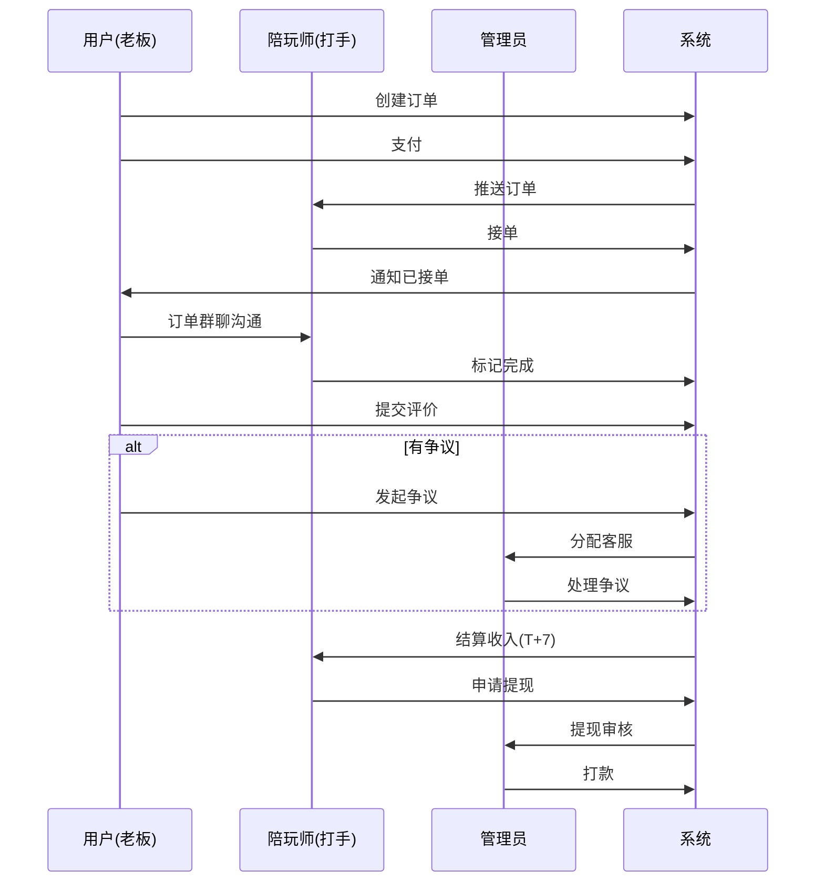

# GameLink 用户旅程地图

> **文档版本**: v1.0
> **创建日期**: 2025-01-05
> **用途**: 描述三类用户（用户/陪玩师/管理员）在平台上的完整旅程

---

## 目录

1. [用户端旅程 (老板)](#1-用户端旅程-老板)
2. [陪玩师端旅程 (打手)](#2-陪玩师端旅程-打手)
3. [管理后台旅程 (管理员)](#3-管理后台旅程-管理员)
4. [跨角色交互旅程](#4-跨角色交互旅程)
5. [关键触点与痛点分析](#5-关键触点与痛点分析)

---

## 1. 用户端旅程 (老板)

### 1.1 完整旅程概览

```
发现 → 注册 → 浏览 → 下单 → 支付 → 服务中 → 评价 → 复购
```

### 1.2 阶段详细分析

#### 阶段 1: 发现与注册 (Discovery)

| 触点 | 用户行为 | 系统响应 | 痛点 | 机会 |
|------|---------|---------|------|------|
| 应用商店/推广链接 | 下载App/打开网页 | 展示首页和热门陪玩师 | 不确定平台可信度 | 展示真实评价和订单数 |
| 注册页面 | 输入手机号+验证码 | 发送短信验证码 | 验证码延迟 | 提供微信一键登录 |
| 完善信息 | 设置昵称/头像 | 引导选择偏好游戏 | 跳过引导导致后续推荐不准 | 强制选择偏好游戏 |

**API调用**:
- `POST /api/v1/auth/register` - 注册
- `POST /api/v1/auth/login` - 登录
- `GET /api/v1/user/games` - 获取游戏列表

---

#### 阶段 2: 浏览与选择 (Browse & Select)

| 触点 | 用户行为 | 系统响应 | 痛点 | 机会 |
|------|---------|---------|------|------|
| 首页陪玩师列表 | 滑动浏览 | 显示在线陪玩师卡片 | 信息过载，难以选择 | 提供智能推荐 |
| 搜索框 | 输入关键词/游戏 | 搜索结果 | 搜索结果不准确 | 添加筛选条件(段位/价格) |
| 陪玩师详情页 | 查看资料/评价/战绩 | 展示完整信息 | 段位截图可能造假 | 实名认证标识 |
| 排行榜 | 查看人气/订单/好评榜 | 排序展示陪玩师 | 不了解榜单机制 | 榜单说明文字 |

**API调用**:
- `GET /api/v1/user/players` - 陪玩师列表
- `GET /api/v1/user/players/search` - 搜索
- `GET /api/v1/user/players/:id` - 陪玩师详情
- `GET /api/v1/user/rankings` - 排行榜
- `GET /api/v1/user/reviews?player_id=X` - 评价列表

---

#### 阶段 3: 下单与支付 (Order & Pay)

| 触点 | 用户行为 | 系统响应 | 痛点 | 机会 |
|------|---------|---------|------|------|
| 选择服务项目 | 选择游戏/段位/时长 | 显示价格 | 价格固定无法议价 | 强调透明定价优势 |
| 填写订单信息 | 选择时间/备注 | 创建订单 | 时间格式不清晰 | 提供时间选择器 |
| 支付页面 | 选择支付方式 | 调起支付 | 支付失败无提示 | 多渠道支付+组合支付 |
| 支付成功 | 返回订单详情 | 订单状态confirmed | 支付后无反馈 | 发送通知和震动 |

**API调用**:
- `POST /api/v1/user/orders` - 创建订单
- `GET /api/v1/user/service-items` - 服务项目列表
- `GET /api/v1/user/coupons` - 可用优惠券
- `POST /api/v1/user/payments` - 发起支付
- `GET /api/v1/user/orders/:id` - 订单详情

---

#### 阶段 4: 服务进行中 (In Service)

| 触点 | 用户行为 | 系统响应 | 痛点 | 机会 |
|------|---------|---------|------|------|
| 等待接单 | 查看订单状态 | 显示pending | 等待时间焦虑 | 显示预计等待时间 |
| 陪玩师接单 | 收到通知 | 订单状态confirmed | 无法与陪玩师提前沟通 | 订单群聊自动创建 |
| 订单群聊 | 发送消息/语音 | WebSocket实时推送 | 消息延迟 | 显示消息已读/送达 |
| 陪玩师标记完成 | 无需操作 | 订单状态completed | 不知何时结束 | 服务进度提醒 |
| 发起争议 | 点击投诉按钮 | 创建争议工单 | 流程复杂 | 一键投诉入口 |

**API调用**:
- `GET /api/v1/user/orders/:id` - 查询订单状态
- `GET /api/v1/user/chats/order/:orderId` - 订单群聊
- `POST /api/v1/user/chats/:roomId/messages` - 发送消息
- `POST /api/v1/user/disputes` - 发起争议
- `POST /api/v1/user/orders/:id/cancel` - 取消订单

---

#### 阶段 5: 评价与复购 (Review & Retention)

| 触点 | 用户行为 | 系统响应 | 痛点 | 机会 |
|------|---------|---------|------|------|
| 评价弹窗 | 点击评价 | 显示评价表单 | 评价流程繁琐 | 一键好评 |
| 分维度评价 | 打分(态度/技术/沟通) | 提交评价 | 不清楚评分标准 | 显示评分说明 |
| 查看优惠券 | 点击我的优惠券 | 显示可用券 | 优惠券过期未提醒 | 临期提醒 |
| 再次下单 | 重复下单流程 | 快捷下单入口 | 需要重新选择 | 常用陪玩师快捷入口 |

**API调用**:
- `POST /api/v1/user/reviews` - 提交评价
- `POST /api/v1/user/reviews/quick` - 一键好评
- `GET /api/v1/user/coupons` - 我的优惠券
- `GET /api/v1/user/wallet` - 钱包余额

---

### 1.3 关键指标

| 指标 | 定义 | 目标值 |
|------|------|--------|
| 注册转化率 | 访问→注册 | >30% |
| 首单转化率 | 注册→首单 | >50% |
| 下单支付率 | 创建订单→支付成功 | >85% |
| 复购率 | 7天内再次下单 | >40% |
| NPS评分 | 净推荐值 | >50 |

---

## 2. 陪玩师端旅程 (打手)

### 2.1 完整旅程概览

```
入驻申请 → 实名认证 → 段位认证 → 审核通过 → 接单服务 → 收益提现
```

### 2.2 阶段详细分析

#### 阶段 1: 入驻申请 (Onboarding)

| 触点 | 用户行为 | 系统响应 | 痛点 | 机会 |
|------|---------|---------|------|------|
| 成为陪玩师入口 | 点击"成为陪玩师" | 跳转入驻申请页 | 找不到入口 | 首页显眼入口 |
| 填写基本信息 | 姓名/身份证/联系方式 | 提交信息 | 不安全担忧 | 强调隐私保护 |
| 上传身份证照片 | 拍照/相册选择 | 图片上传 | 拍照光线不好 | 提供拍摄指南 |
| 提交审核 | 点击提交 | 显示审核中 | 审核时间未知 | 显示预计审核时间 |

**API调用**:
- `POST /api/v1/player/certifications` - 入驻申请
- `POST /api/v1/player/certifications/identity` - 实名认证
- `GET /api/v1/player/certifications/me` - 查询审核状态

---

#### 阶段 2: 段位认证 (Rank Verification)

| 触点 | 用户行为 | 系统响应 | 痛点 | 机会 |
|------|---------|---------|------|------|
| 添加游戏 | 选择擅长游戏 | 显示该游戏段位列表 | 游戏版本更新不及时 | 定期更新段位 |
| 上传段位截图 | 上传图片 | 识别段位 | 截图不合格 | 实时段位验证接口 |
| 等待审核 | 等待管理员审核 | 状态变更通知 | 审核不通过无原因 | 拒绝原因说明 |
| 审核通过 | 收到通知 | 可以开始接单 | 不知如何开始接单 | 新手引导流程 |

**API调用**:
- `GET /api/v1/admin/game-ranks` - 段位列表
- `POST /api/v1/player/certifications/rank` - 段位认证
- `GET /api/v1/player/rank-records` - 认证记录

---

#### 阶段 3: 接单服务 (Service Delivery)

| 触点 | 用户行为 | 系统响应 | 痛点 | 机会 |
|------|---------|---------|------|------|
| 接单开关 | 开启接单 | 状态更新 | 开启后无订单 | 推送新订单提醒 |
| 查看待接订单 | 刷新订单池 | 显示pending订单 | 抢单速度慢 | 订单推送机制 |
| 抢单操作 | 点击接单 | 订单状态变更 | 抢单失败 | 订单锁机制 |
| 订单群聊 | 与老板沟通 | WebSocket消息 | 老板不回复 | 自动催单提醒 |
| 标记服务完成 | 点击完成 | 订单状态completed | 老板不满意 | 完成前确认弹窗 |

**API调用**:
- `POST /api/v1/player/status/toggle-accepting` - 切换接单状态
- `GET /api/v1/player/orders/pending` - 待接订单池
- `POST /api/v1/player/orders/:id/accept` - 接单
- `GET /api/v1/player/orders` | 我的订单
- `POST /api/v1/player/orders/:id/complete` - 完成订单

---

#### 阶段 4: 收益管理 (Earnings Management)

| 触点 | 用户行为 | 系统响应 | 痛点 | 机会 |
|------|---------|---------|------|------|
| 查看收益 | 进入收益页面 | 显示总收益/可提现 | 收益明细不清晰 | 收益趋势图表 |
| 提现申请 | 输入提现金额 | 显示到账时间 | 提现失败 | 提现前置检查 |
| 绑定收款方式 | 添加支付宝/银行卡 | 验证收款账号 | 验证流程繁琐 | OCR识别卡号 |
| 等待打款 | 等待审核打款 | 状态变更通知 | 打款延迟 | 显示打款进度 |

**API调用**:
- `GET /api/v1/player/earnings/stats` - 收益统计
- `GET /api/v1/player/wallet` - 钱包详情
- `POST /api/v1/player/withdrawals` - 申请提现
- `GET /api/v1/player/withdrawals` - 提现记录

---

### 2.3 关键指标

| 指标 | 定义 | 目标值 |
|------|------|--------|
| 入驻转化率 | 开始入驻→审核通过 | >60% |
| 段位认证通过率 | 提交认证→审核通过 | >80% |
| 日接单量 | 每日接单数量 | >5单/天 |
| 订单完成率 | 接单→完成 | >95% |
| 好评率 | 5星评价占比 | >90% |

---

## 3. 管理后台旅程 (管理员)

### 3.1 完整旅程概览

```
登录 → 仪表盘查看 → 具体业务操作 → 审核处理 → 数据分析
```

### 3.2 阶段详细分析

#### 阶段 1: 日常运营 (Daily Operations)

| 触点 | 用户行为 | 系统响应 | 痛点 | 机会 |
|------|---------|---------|------|------|
| 仪表盘 | 查看核心指标 | 显示实时数据 | 数据不够实时 | WebSocket实时更新 |
| 订单管理 | 处理异常订单 | 显示订单列表 | 筛选条件有限 | 高级筛选器 |
| 用户管理 | 封禁/解封用户 | 状态变更 | 无操作历史 | 操作日志记录 |
| 争议处理 | 查看争议详情 | 显示聊天快照 | 判断依据不足 | AI辅助判断 |

**API调用**:
- `GET /api/v1/admin/dashboard/overview` - 数据概览
- `GET /api/v1/admin/dashboard/trends` - 趋势数据
- `GET /api/v1/admin/orders` - 订单列表
- `PUT /api/v1/admin/users/:id/status` - 用户状态管理
- `GET /api/v1/admin/disputes/:id` - 争议详情
- `PUT /api/v1/admin/disputes/:id` - 处理争议

---

#### 阶段 2: 审核工作 (Review Work)

| 触点 | 用户行为 | 系统响应 | 痛点 | 机会 |
|------|---------|---------|------|------|
| 入驻审核 | 查看申请资料 | 显示身份证/段位截图 | 资料真实性难辨 | 身份信息交叉验证 |
| 实名审核 | 核对身份证信息 | 一键通过/拒绝 | 重复录入信息 | 自动识别OCR |
| 段位审核 | 验证段位截图 | 对比游戏数据 | 无法验证真实性 | 接入游戏API验证 |
| 提现审核 | 审核提现申请 | 显示提现信息 | 风险判断无依据 | 风险评分系统 |

**API调用**:
- `GET /api/v1/admin/player-certifications` - 入驻申请列表
- `POST /api/v1/admin/player-certifications/:id/approve` - 审核入驻
- `GET /api/v1/admin/player-rank-records` - 段位认证列表
- `POST /api/v1/admin/player-rank-records/:id/approve` - 审核段位
- `GET /api/v1/admin/withdrawals` - 提现申请列表
- `POST /api/v1/admin/withdrawals/:id/approve` - 审核提现

---

#### 阶段 3: 财务管理 (Financial Management)

| 触点 | 用户行为 | 系统响应 | 痛点 | 机会 |
|------|---------|---------|------|------|
| 佣金配置 | 设置抽成规则 | 保存规则 | 规则复杂难懂 | 规则预览功能 |
| 结算管理 | 配置结算公司 | 添加/编辑公司 | 税务计算复杂 | 自动计算税务 |
| 财务报表 | 导出财务数据 | 下载Excel | 数据格式不标准 | 自定义报表模板 |
| 对账功能 | 平台对账 | 显示差异 | 对账繁琐 | 自动对账 |

**API调用**:
- `GET /api/v1/admin/commission-rules` - 佣金规则列表
- `POST /api/v1/admin/commission-rules` - 创建规则
- `GET /api/v1/admin/settlement-companies` - 结算公司列表
- `GET /api/v1/admin/reports/finance` - 财务报表

---

#### 阶段 4: 内容管理 (Content Management)

| 触点 | 用户行为 | 系统响应 | 痛点 | 机会 |
|------|---------|---------|------|------|
| 游戏管理 | 添加/编辑游戏 | 保存游戏信息 | 游戏图标处理麻烦 | 自动生成图标 |
| 段位管理 | 配置游戏段位 | 保存段位列表 | 段位更新频繁 | 批量导入功能 |
| 敏感词管理 | 添加敏感词 | 保存到过滤列表 | 敏感词遗漏 | AI智能识别 |
| 服务项目配置 | 设置价格/时长 | 保存配置 | 定价策略复杂 | 智能定价建议 |

**API调用**:
- `GET /api/v1/admin/games` - 游戏列表
- `POST /api/v1/admin/games` - 创建游戏
- `GET /api/v1/admin/game-ranks` - 段位列表
- `POST /api/v1/admin/game-ranks` - 添加段位
- `GET /api/v1/admin/sensitive-words` - 敏感词列表
- `GET /api/v1/admin/service-items` - 服务项目列表

---

### 3.3 关键指标

| 指标 | 定义 | 目标值 |
|------|------|--------|
| 审核响应时间 | 收到申请→开始审核 | <30分钟 |
| 争议处理SLA | 争议创建→处理完成 | <30分钟 |
| 提现审核时间 | 收到申请→打款 | <24小时 |
| 运营效率 | 每人每日处理订单数 | >100单 |

---

## 4. 跨角色交互旅程

### 4.1 订单完整生命周期



---

### 4.2 关键交互节点

| 节点 | 涉及角色 | 触发条件 | 关键动作 | 失败处理 |
|------|---------|---------|---------|---------|
| 订单创建 | 用户 | 选择服务+支付 | 扣款+创建订单 | 支付失败回滚 |
| 订单分配 | 系统/陪玩师 | 订单confirmed | 进入抢单池 | 超时自动取消 |
| 争议处理 | 用户/客服 | 订单完成7天内 | 双客服审核 | 超时自动退款 |
| 收益结算 | 系统 | 订单完成T+7 | 解冻余额 | 有争议则冻结 |
| 提现打款 | 陪玩师/客服 | 申请提现 | 审核打款 | 驳回并说明原因 |

---

## 5. 关键触点与痛点分析

### 5.1 用户端Top 5痛点

| 排名 | 痛点 | 影响范围 | 严重程度 | 改进建议 |
|------|------|---------|---------|---------|
| 1 | 等待接单时间过长 | 所有用户 | 🔴 高 | 智能匹配+超时取消 |
| 2 | 陪玩师服务态度差 | 40%用户 | 🔴 高 | 好评筛选+黑名单 |
| 3 | 支付失败无明确提示 | 10%用户 | 🟡 中 | 优化错误提示 |
| 4 | 无法提前与陪玩师沟通 | 新用户 | 🟡 中 | 接单后群聊自动创建 |
| 5 | 争议处理流程复杂 | 5%用户 | 🟢 低 | 一键投诉入口 |

---

### 5.2 陪玩师端Top 5痛点

| 排名 | 痛点 | 影响范围 | 严重程度 | 改进建议 |
|------|------|---------|---------|---------|
| 1 | 订单量不稳定 | 所有陪玩师 | 🔴 高 | 排名激励机制 |
| 2 | 段位认证审核慢 | 新陪玩师 | 🔴 高 | 自动化验证 |
| 3 | 恶意老板投诉 | 20%陪玩师 | 🔴 高 | 申诉机制+评价分析 |
| 4 | 提现周期长 | 所有陪玩师 | 🟡 中 | 优化审核流程 |
| 5 | 收益明细不清晰 | 30%陪玩师 | 🟡 中 | 收益报表优化 |

---

### 5.3 管理后台Top 5痛点

| 排名 | 痛点 | 影响范围 | 严重程度 | 改进建议 |
|------|------|---------|---------|---------|
| 1 | 审核工作量巨大 | 所有审核员 | 🔴 高 | AI辅助审核 |
| 2 | 争议判断依据不足 | 客服 | 🔴 高 | 聊天记录分析 |
| 3 | 数据报表导出慢 | 财务/运营 | 🟡 中 | 异步导出+缓存 |
| 4 | 缺乏风险预警 | 管理 | 🔴 高 | 异常监控告警 |
| 5 | 批量操作功能弱 | 运营 | 🟢 低 | 添加批量操作 |

---

### 5.4 改进优先级矩阵

| 优先级 | 改进项 | 预期收益 | 实施难度 | ROI |
|--------|--------|---------|---------|-----|
| **P0** | 智能订单匹配 | ⭐⭐⭐⭐⭐ | 🟡 中 | 高 |
| **P0** | 段位自动验证 | ⭐⭐⭐⭐ | 🟢 低 | 高 |
| **P0** | 争议AI辅助判断 | ⭐⭐⭐⭐⭐ | 🔴 高 | 中 |
| **P1** | 排名激励机制 | ⭐⭐⭐⭐ | 🟡 中 | 中 |
| **P1** | 风险监控告警 | ⭐⭐⭐⭐ | 🟡 中 | 中 |
| **P2** | 批量操作功能 | ⭐⭐⭐ | 🟢 低 | 中 |
| **P2** | 收益报表优化 | ⭐⭐ | 🟢 低 | 低 |

---

## 6. 附录

### 6.1 用户旅程地图模板

```
阶段: [阶段名称]
  ├─ 触点: [用户接触点]
  ├─ 行为: [用户做什么]
  ├─ 情绪: [用户感受] 😊/😐/😞
  ├─ 痛点: [遇到的问题]
  └─ 机会: [改进空间]
```

### 6.2 相关文档

| 文档 | 路径 |
|------|------|
| 产品需求文档 | `docs/PRD.md` |
| API映射表 | `docs/API_PRD_MAPPING.md` |
| 数据模型 | `.kiro/steering/04-data-models.md` |
| 项目进度 | `PROGRESS.md` |

---

*文档维护：GameLink 产品团队*
*最后更新：2025-01-05*
