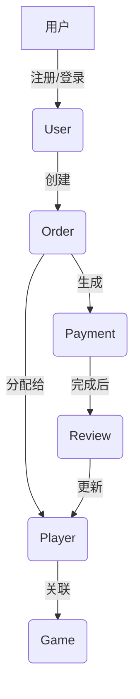

# GameLink 后端接口模型文档

## 📋 概述

GameLink 后端采用 Go + Gin + GORM 架构，提供了完整的陪玩平台 API 服务。本文档详细整理了所有数据模型和 API 接口定义。

## 🏗️ 数据模型架构

### 基础模型 (Base)

```go
type Base struct {
    ID        uint64         `json:"id" gorm:"primaryKey"`
    CreatedAt time.Time      `json:"created_at"`
    UpdatedAt time.Time      `json:"updated_at"`
    DeletedAt gorm.DeletedAt `json:"deleted_at,omitempty" gorm:"index"`
}
```

### 枚举类型定义

```typescript
// 用户角色
enum Role {
  USER = "user"
  PLAYER = "player"
  ADMIN = "admin"
}

// 用户状态
enum UserStatus {
  ACTIVE = "active"
  SUSPENDED = "suspended"
  BANNED = "banned"
}

// 订单状态
enum OrderStatus {
  PENDING = "pending"
  CONFIRMED = "confirmed"
  IN_PROGRESS = "in_progress"
  COMPLETED = "completed"
  CANCELED = "canceled"
  REFUNDED = "refunded"
}

// 验证状态
enum VerificationStatus {
  PENDING = "pending"
  VERIFIED = "verified"
  REJECTED = "rejected"
}

// 货币类型
enum Currency {
  CNY = "CNY"
  USD = "USD"
}
```

## 📊 核心业务模型

### 1. 用户模型 (User)

```typescript
interface User {
  id: number;
  phone?: string;
  email?: string;
  name: string;
  avatar_url?: string;
  role: Role;
  status: UserStatus;
  last_login_at?: string;
  created_at: string;
  updated_at: string;
}
```

### 2. 游戏模型 (Game)

```typescript
interface Game {
  id: number;
  key: string;
  name: string;
  category: string;
  icon_url?: string;
  description?: string;
  created_at: string;
  updated_at: string;
}
```

### 3. 陪玩师模型 (Player)

```typescript
interface Player {
  id: number;
  user_id: number;
  nickname?: string;
  bio?: string;
  rating_average: number;
  rating_count: number;
  hourly_rate_cents: number;
  main_game_id?: number;
  verification_status: VerificationStatus;
  created_at: string;
  updated_at: string;
}
```

### 4. 订单模型 (Order)

```typescript
interface Order {
  id: number;
  user_id: number;
  player_id?: number;
  game_id: number;
  title: string;
  description?: string;
  status: OrderStatus;
  price_cents: number;
  currency?: Currency;
  scheduled_start?: string;
  scheduled_end?: string;
  cancel_reason?: string;
  created_at: string;
  updated_at: string;
}
```

### 5. 支付模型 (Payment)

```typescript
interface Payment {
  id: number;
  order_id: number;
  amount_cents: number;
  currency?: Currency;
  method: string;
  status: string;
  provider_tx_id?: string;
  created_at: string;
  updated_at: string;
}
```

### 6. 评价模型 (Review)

```typescript
interface Review {
  id: number;
  order_id: number;
  reviewer_id: number;
  player_id: number;
  rating: number;
  comment?: string;
  created_at: string;
  updated_at: string;
}
```

## 🔌 API 接口清单

### 认证模块 (/api/v1/auth)

| 方法 | 路径                   | 描述     |
| ---- | ---------------------- | -------- |
| POST | `/api/v1/auth/login`   | 用户登录 |
| POST | `/api/v1/auth/refresh` | 刷新令牌 |
| POST | `/api/v1/auth/logout`  | 用户登出 |

### 用户管理 (/api/v1/admin/users)

| 方法   | 路径                              | 描述                 |
| ------ | --------------------------------- | -------------------- |
| GET    | `/api/v1/admin/users`             | 获取用户列表         |
| POST   | `/api/v1/admin/users`             | 创建用户             |
| GET    | `/api/v1/admin/users/:id`         | 获取用户详情         |
| PUT    | `/api/v1/admin/users/:id`         | 更新用户信息         |
| DELETE | `/api/v1/admin/users/:id`         | 删除用户             |
| PUT    | `/api/v1/admin/users/:id/status`  | 更新用户状态         |
| PUT    | `/api/v1/admin/users/:id/role`    | 更新用户角色         |
| GET    | `/api/v1/admin/users/:id/orders`  | 获取用户订单         |
| POST   | `/api/v1/admin/users/with-player` | 创建用户及陪玩师信息 |
| GET    | `/api/v1/admin/users/:id/logs`    | 获取用户操作日志     |

### 游戏管理 (/api/v1/admin/games)

| 方法   | 路径                           | 描述             |
| ------ | ------------------------------ | ---------------- |
| GET    | `/api/v1/admin/games`          | 获取游戏列表     |
| POST   | `/api/v1/admin/games`          | 创建游戏         |
| GET    | `/api/v1/admin/games/:id`      | 获取游戏详情     |
| PUT    | `/api/v1/admin/games/:id`      | 更新游戏信息     |
| DELETE | `/api/v1/admin/games/:id`      | 删除游戏         |
| GET    | `/api/v1/admin/games/:id/logs` | 获取游戏操作日志 |

### 陪玩师管理 (/api/v1/admin/players)

| 方法   | 路径                                     | 描述               |
| ------ | ---------------------------------------- | ------------------ |
| GET    | `/api/v1/admin/players`                  | 获取陪玩师列表     |
| POST   | `/api/v1/admin/players`                  | 创建陪玩师         |
| GET    | `/api/v1/admin/players/:id`              | 获取陪玩师详情     |
| PUT    | `/api/v1/admin/players/:id`              | 更新陪玩师信息     |
| DELETE | `/api/v1/admin/players/:id`              | 删除陪玩师         |
| PUT    | `/api/v1/admin/players/:id/verification` | 更新验证状态       |
| PUT    | `/api/v1/admin/players/:id/games`        | 更新陪玩师游戏     |
| PUT    | `/api/v1/admin/players/:id/skill-tags`   | 更新技能标签       |
| GET    | `/api/v1/admin/players/:id/logs`         | 获取陪玩师操作日志 |

### 订单管理 (/api/v1/admin/orders)

| 方法   | 路径                              | 描述             |
| ------ | --------------------------------- | ---------------- |
| GET    | `/api/v1/admin/orders`            | 获取订单列表     |
| POST   | `/api/v1/admin/orders`            | 创建订单         |
| GET    | `/api/v1/admin/orders/:id`        | 获取订单详情     |
| PUT    | `/api/v1/admin/orders/:id`        | 更新订单         |
| DELETE | `/api/v1/admin/orders/:id`        | 删除订单         |
| POST   | `/api/v1/admin/orders/:id/review` | 订单评价         |
| POST   | `/api/v1/admin/orders/:id/cancel` | 取消订单         |
| POST   | `/api/v1/admin/orders/:id/assign` | 分配订单         |
| GET    | `/api/v1/admin/orders/:id/logs`   | 获取订单操作日志 |

### 支付管理 (/api/v1/admin/payments)

| 方法   | 路径                                 | 描述             |
| ------ | ------------------------------------ | ---------------- |
| GET    | `/api/v1/admin/payments`             | 获取支付列表     |
| POST   | `/api/v1/admin/payments`             | 创建支付         |
| GET    | `/api/v1/admin/payments/:id`         | 获取支付详情     |
| PUT    | `/api/v1/admin/payments/:id`         | 更新支付         |
| DELETE | `/api/v1/admin/payments/:id`         | 删除支付         |
| POST   | `/api/v1/admin/payments/:id/refund`  | 申请退款         |
| POST   | `/api/v1/admin/payments/:id/capture` | 确认收款         |
| GET    | `/api/v1/admin/payments/:id/logs`    | 获取支付操作日志 |

### 评价管理 (/api/v1/admin/reviews)

| 方法   | 路径                                | 描述             |
| ------ | ----------------------------------- | ---------------- |
| GET    | `/api/v1/admin/reviews`             | 获取评价列表     |
| POST   | `/api/v1/admin/reviews`             | 创建评价         |
| GET    | `/api/v1/admin/reviews/:id`         | 获取评价详情     |
| PUT    | `/api/v1/admin/reviews/:id`         | 更新评价         |
| DELETE | `/api/v1/admin/reviews/:id`         | 删除评价         |
| GET    | `/api/v1/admin/players/:id/reviews` | 获取陪玩师评价   |
| GET    | `/api/v1/admin/reviews/:id/logs`    | 获取评价操作日志 |

### 统计数据 (/api/v1/admin/stats)

| 方法 | 路径                                | 描述       |
| ---- | ----------------------------------- | ---------- |
| GET  | `/api/v1/admin/stats/dashboard`     | 仪表板数据 |
| GET  | `/api/v1/admin/stats/revenue-trend` | 收入趋势   |
| GET  | `/api/v1/admin/stats/user-growth`   | 用户增长   |
| GET  | `/api/v1/admin/stats/orders`        | 订单统计   |
| GET  | `/api/v1/admin/stats/top-players`   | 热门陪玩师 |

## 📄 响应格式规范

### 成功响应格式

```typescript
interface SuccessResponse<T> {
  success: true;
  data: T;
  message?: string;
}
```

### 列表响应格式

```typescript
interface ListResponse<T> {
  success: true;
  data: T[];
  pagination: {
    page: number;
    page_size: number;
    total: number;
    total_pages: number;
    has_next: boolean;
    has_prev: boolean;
  };
}
```

### 错误响应格式

```typescript
interface ErrorResponse {
  success: false;
  code: number;
  message: string;
  details?: any;
}
```

## 🔐 认证授权

### JWT 认证

所有管理端 API 需要在请求头中包含 JWT Token：

```
Authorization: Bearer <token>
```

### 角色权限

- **user**: 普通用户，可以下单、评价
- **player**: 陪玩师，可以接单、管理个人信息
- **admin**: 管理员，可以访问所有管理端 API

## 📝 请求/请求体示例

### 登录请求

```typescript
interface LoginRequest {
  username: string;
  password: string;
}
```

### 创建用户请求

```typescript
interface CreateUserRequest {
  phone?: string;
  email?: string;
  name: string;
  password: string;
  role?: Role;
}
```

### 创建订单请求

```typescript
interface CreateOrderRequest {
  user_id: number;
  game_id: number;
  title: string;
  description?: string;
  price_cents: number;
  currency?: Currency;
  scheduled_start?: string;
  scheduled_end?: string;
}
```

## 🔄 数据流转关系



## 📊 统计说明

统计模块提供以下关键指标：

- **用户增长**: 新增用户趋势、活跃用户统计
- **订单统计**: 订单量、成交额、平均单价
- **收入分析**: 收入趋势、退款率、支付方式分布
- **陪玩师排行**: 评分排行、收入排行、接单量排行

## 🛡️ 安全特性

- **JWT 认证**: 无状态认证机制
- **角色权限**: 基于角色的访问控制 (RBAC)
- **API 限流**: 防止接口滥用
- **软删除**: 数据安全删除机制
- **外键约束**: 保证数据完整性

## 📈 性能优化

- **数据库索引**: 关键字段建立索引
- **分页查询**: 避免大量数据查询
- **缓存机制**: Redis 缓存热点数据
- **连接池**: 数据库连接池管理

---

**文档版本**: v1.0
**更新时间**: 2025-01-28
**API版本**: v0.3.0
**基础路径**: `/api/v1`
