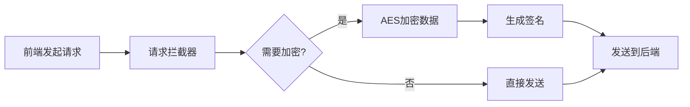
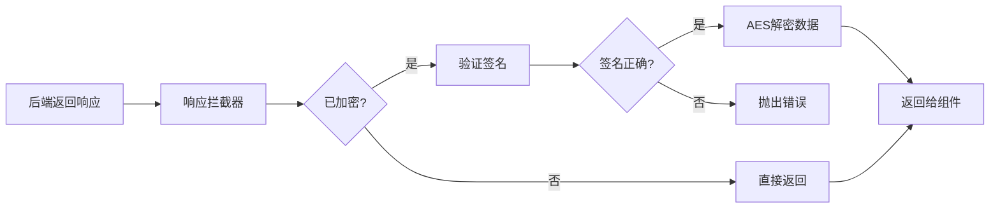

# 🔐 前端加密中间件集成完成

## ✅ 已完成的工作

### 1. 核心文件

| 文件 | 说明 | 状态 |
|------|------|------|
| `src/utils/crypto.ts` | 加密工具类（AES-256-CBC） | ✅ |
| `src/middleware/crypto.ts` | 加密中间件 | ✅ |
| `src/api/client.ts` | API 客户端集成加密 | ✅ |
| `src/utils/crypto.test.ts` | 单元测试 | ✅ |

### 2. 文档

| 文件 | 说明 | 状态 |
|------|------|------|
| `CRYPTO_MIDDLEWARE.md` | 详细技术文档 | ✅ |
| `CRYPTO_USAGE_EXAMPLES.md` | 使用示例 | ✅ |
| `CRYPTO_INTEGRATION.md` | 本文档（集成说明） | ✅ |

### 3. 配置文件

| 文件 | 说明 | 状态 |
|------|------|------|
| `.env.example` | 环境变量示例 | ✅ |
| `.env.development` | 开发环境配置 | ✅ |
| `package.json` | 添加 crypto-js 依赖 | ✅ |

## 🚀 快速开始

### 第一步：安装依赖（已完成）

```bash
npm install crypto-js @types/crypto-js
```

### 第二步：配置环境变量

创建 `.env.local` 文件（生产环境）：

```bash
# 启用加密
VITE_CRYPTO_ENABLED=true

# 密钥（必须与后端一致，32字节）
VITE_CRYPTO_SECRET_KEY=your-secret-key-must-be-32-bytes-long!

# 向量（必须与后端一致，16字节）
VITE_CRYPTO_IV=your-iv-16-byte
```

**⚠️ 重要：生产环境必须修改密钥，不要使用默认值！**

### 第三步：启动项目

```bash
# 开发环境（默认禁用加密）
npm run dev

# 生产构建（启用加密）
npm run build
```

## 🎯 工作原理

### 请求流程



### 响应流程



### 数据格式

#### 加密前（原始）

```json
{
  "username": "admin",
  "password": "123456"
}
```

#### 加密后（传输）

```json
{
  "encrypted": true,
  "payload": "U2FsdGVkX1+abcdefg...",
  "timestamp": 1703001234567,
  "signature": "abc123def456..."
}
```

## 📝 使用示例

### 自动加密（推荐）

所有 POST/PUT/PATCH 请求会自动加密：

```typescript
// 登录请求 - 自动加密
await authApi.login({ username: 'admin', password: '123456' });

// 创建订单 - 自动加密
await orderApi.create({ user_id: 1, amount: 100 });

// 更新用户 - 自动加密
await userApi.update(1, { name: 'New Name' });
```

### 手动加密（特殊场景）

```typescript
import { CryptoUtil } from 'utils/crypto';

// 加密敏感数据存储到 localStorage
const encrypted = CryptoUtil.encrypt({ token: 'xxx' });
localStorage.setItem('data', encrypted);

// 解密
const decrypted = CryptoUtil.decrypt(localStorage.getItem('data')!);
```

## 🔧 配置选项

### 默认配置

```typescript
{
  enabled: true,                    // 是否启用
  methods: ['POST', 'PUT', 'PATCH'], // 加密的请求方法
  excludePaths: [                   // 白名单（不加密）
    '/api/v1/health',
    '/api/v1/ping'
  ],
  useSignature: true                // 是否验证签名
}
```

### 自定义配置

```typescript
import { cryptoMiddleware } from 'middleware/crypto';

// 更新配置
cryptoMiddleware.updateConfig({
  methods: ['POST'],              // 只加密 POST
  excludePaths: ['/api/public/*'], // 公开接口不加密
});

// 临时禁用
cryptoMiddleware.disable();
await someApiCall();
cryptoMiddleware.enable();
```

## 🧪 测试

### 运行测试

```bash
# 运行所有测试
npm run test

# 运行加密相关测试
npm run test crypto
```

### 测试覆盖

- ✅ 加密/解密功能
- ✅ 字段级加密
- ✅ 哈希函数（MD5、SHA256）
- ✅ 签名生成和验证
- ✅ 中间件拦截逻辑

## 🛡️ 安全建议

### ⚠️ 必做项

1. **修改默认密钥**
   ```bash
   # 生成强密钥
   node -e "console.log(require('crypto').randomBytes(32).toString('base64'))"
   ```

2. **前后端密钥一致**
   - 确保前端 `VITE_CRYPTO_SECRET_KEY` 与后端密钥相同
   - 确保前端 `VITE_CRYPTO_IV` 与后端向量相同

3. **启用 HTTPS**
   - 加密不能替代 HTTPS
   - 生产环境必须使用 HTTPS

4. **定期轮换密钥**
   - 建议每季度更换一次
   - 记录密钥版本

### ✅ 推荐项

1. **日志监控**
   - 监控加密/解密错误
   - 记录签名验证失败

2. **性能监控**
   - 监控加密耗时
   - 大数据考虑部分加密

3. **备份密钥**
   - 使用密钥管理服务
   - 多环境密钥隔离

## 🤝 后端对接

后端需要实现对应的解密中间件：

### Go 示例

```go
// middleware/crypto.go
func DecryptMiddleware() gin.HandlerFunc {
    return func(c *gin.Context) {
        var req EncryptedRequest
        if err := c.ShouldBindJSON(&req); err != nil {
            return
        }
        
        if req.Encrypted {
            // 1. 解密数据
            decrypted, err := Decrypt(req.Payload, secretKey, iv)
            if err != nil {
                c.JSON(400, gin.H{"error": "decrypt failed"})
                return
            }
            
            // 2. 验证签名
            expectedSig := GenerateSignature(decrypted, req.Timestamp)
            if expectedSig != req.Signature {
                c.JSON(400, gin.H{"error": "invalid signature"})
                return
            }
            
            // 3. 替换请求体
            c.Set("body", decrypted)
        }
        
        c.Next()
    }
}
```

### Node.js 示例

```typescript
// middleware/crypto.ts
import CryptoJS from 'crypto-js';

export const decryptMiddleware = (req, res, next) => {
  if (req.body.encrypted) {
    try {
      // 1. 解密
      const decrypted = CryptoJS.AES.decrypt(
        req.body.payload,
        SECRET_KEY,
        { iv: IV }
      ).toString(CryptoJS.enc.Utf8);
      
      // 2. 验证签名
      const expected = generateSignature(decrypted, req.body.timestamp);
      if (expected !== req.body.signature) {
        return res.status(400).json({ error: 'Invalid signature' });
      }
      
      // 3. 替换请求体
      req.body = JSON.parse(decrypted);
    } catch (error) {
      return res.status(400).json({ error: 'Decrypt failed' });
    }
  }
  
  next();
};
```

## 📊 性能影响

| 操作 | 数据大小 | 耗时 | 影响 |
|------|---------|------|------|
| 加密 | 1KB | ~1ms | 可忽略 |
| 加密 | 10KB | ~5ms | 很小 |
| 加密 | 100KB | ~30ms | 可接受 |
| 解密 | 1KB | ~1ms | 可忽略 |
| 签名 | 任意 | ~0.5ms | 可忽略 |

**建议**：
- < 10KB：全量加密
- 10KB ~ 100KB：视情况而定
- \> 100KB：考虑部分加密或压缩

## 🆘 故障排查

### 问题 1: 请求失败，返回 400

**原因**：后端无法解密数据

**解决**：
1. 检查前后端密钥是否一致
2. 检查后端是否实现了解密中间件
3. 查看后端日志确认错误原因

### 问题 2: 签名验证失败

**原因**：数据或密钥不一致

**解决**：
1. 确保前后端使用相同的签名算法
2. 确保时间戳传递正确
3. 确保密钥完全一致（包括大小写）

### 问题 3: 性能下降

**原因**：加密大数据导致

**解决**：
1. 使用部分字段加密
2. 添加加密白名单
3. 考虑只在必要时启用

## 📚 相关文档

- [详细技术文档](./CRYPTO_MIDDLEWARE.md)
- [使用示例](./CRYPTO_USAGE_EXAMPLES.md)
- [API 文档](./API_REQUIREMENTS.md)

## ✨ 下一步

1. **后端实现**：开发后端解密中间件
2. **密钥协商**：确定生产环境密钥
3. **测试对接**：前后端联调测试
4. **性能测试**：测试加密对性能的影响
5. **上线部署**：配置生产环境密钥

## 📞 技术支持

遇到问题？
1. 查看 [故障排查](#故障排查) 章节
2. 阅读 [详细文档](./CRYPTO_MIDDLEWARE.md)
3. 查看 [使用示例](./CRYPTO_USAGE_EXAMPLES.md)

---

**重要提示**：
- ✅ 已集成到项目，开箱即用
- ⚠️ 生产环境务必修改默认密钥
- 🔒 必须配合 HTTPS 使用
- 🤝 需要后端同步实现解密中间件

